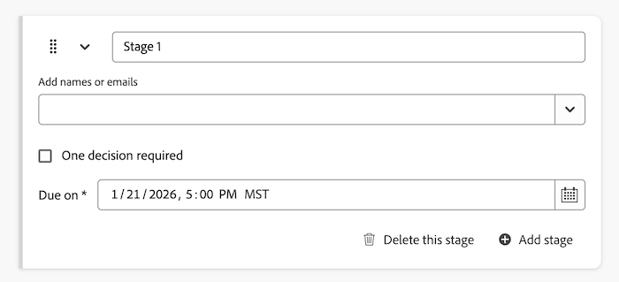

# Guida introduttiva a Workfront AI Reviewer

Il revisore IA è un collaboratore AI, un tipo di agente AI che può essere aggiunto ai tuoi progetti, attività e documenti. I collaboratori IA possono essere configurati nell’area Configurazione e assegnati proprio come gli utenti.

In Workfront, AI Reviewer aiuta ad accelerare la velocità dei contenuti e a migliorare la conformità al brand durante il processo di revisione e approvazione. Puoi aggiungere i revisori AI modelli di approvazione o includerli in singole richieste di revisione e approvazione.

## Requisiti di accesso

Per impostare i revisori AI in Workfront, devi essere un amministratore di sistema.

Qualsiasi utente può aggiungere il revisore IA a una richiesta di revisione e approvazione.

## Requisiti

* L&#39;istanza di Workfront deve avere le approvazioni unificate abilitate.
* La tua organizzazione deve disporre di GenStudio Foundation.
  * Il revisore di intelligenza artificiale in Workfront fornisce le funzionalità disponibili in GenStudio Foundation per i flussi di lavoro di revisione e approvazione delle risorse. Non è necessario accedere direttamente a GenStudio Foundation per completare il lavoro. L’accesso alle funzionalità GenStudio Foundation tramite IA Reviewer rientra nei termini del contratto Workfront.
* Adobe deve disporre di un accordo Adobe Gen AI firmato su file.
Per ulteriori informazioni sulla firma del contratto, consulta [Firmare il contratto di Adobe Gen AI](/help/quicksilver/workfront-basics/ai-assistant/ai-assistant-overview.md#sign-the-adobe-gen-ai-agreement).
* Il revisore IA non è disponibile negli ambienti sandbox.

## Tipi di file supportati {#supported-file-types-ai-reviewer}

>[!CONTEXTUALHELP]
>id="wf_document_approvals_ai_supported_files"
>title="Tipo di file non supportato"
>abstract="Questo revisore IA non supporta il tipo di file selezionato. Carica un tipo di file supportato o rimuovi il revisore IA per inviare la richiesta."

Il revisore IA può esaminare i seguenti tipi di file:

* PNG (.png)
* JPEG (.jpeg, .jpg)
* WEBP (.webp)
* GIF non animato (.gif)
* PDF (.pdf)
* PPT (ppt, pptx)
* DOC (.doc, .docx)

Se carichi un tipo di file non supportato, l’opzione Revisore IA non sarà disponibile durante la creazione di un flusso di lavoro di approvazione.

## Impostare le linee guida per il marchio

Il revisore di IA di Workfront utilizza le linee guida del brand durante la revisione dei contenuti. Gli amministratori di Workfront possono impostare le linee guida per il marchio nell’area Configurazione di Workfront. I brand creati in GenStudio Foundation sono disponibili anche in Workfront.

Per impostare le linee guida per il marchio, gli amministratori di sistema devono:

1. [Concedere l’accesso alle autorizzazioni del brand](/help/quicksilver/administration-and-setup/add-users/configure-and-grant-access/grant-access-brands.md)
1. [Crea e gestisci i brand per il revisore di IA](/help/quicksilver/review-and-approve-work/document-reviews-and-approvals/create-a-brand.md).

## Creare revisori IA

Una volta configurato almeno un brand, gli amministratori di Workfront possono iniziare a creare i revisori di IA nell’area Setup (Configurazione). Puoi creare più revisori AI incentrati su diverse linee guida:

* **Immagine**: questo revisore di IA per l&#39;analisi esaminerà la risorsa in base alle linee guida per il marchio delle immagini impostate in Workfront. [!BADGE Beta]{type=Positive tooltip="Questa funzione è attualmente in versione beta."}
  * Per abilitare questa funzione, gli amministratori di sistema devono firmare il contratto beta.
* **Brand voice**: il revisore IA esaminerà la risorsa in base alle linee guida per la voce del brand impostate in Workfront.

I revisori AI possono quindi essere assegnati a modelli di approvazione e a singole richieste di revisione e approvazione.

Per ulteriori informazioni, vedere [Configurare i collaboratori IA](/help/quicksilver/administration-and-setup/set-up-workfront/configure-system-defaults/configure-ai-collaborators.md).

## Cosa valuta il revisore di IA {#what-ai-reviewer-evaluates}

Il revisore di IA valuta il contenuto in modo diverso a seconda del tipo di linea guida: Immagine o Voce del marchio.

### Immagine

IA Reviewer valuta:

* **Composizione**: punto focale, sfondo, ritaglio, cornice creativa
* **Illuminazione e umore**: uso della luce, della vibrazione, dell&#39;ottimismo
* **Diversità e inclusione**: rappresentanza delle persone (razza, genere, età, abilità)

Il revisore IA non valuta:

* **Utilizzo logo**: posizionamento, spazio vuoto, dimensioni, versione corretta del logo
* **Tavolozza colori**: conformità dei colori del marchio, prevenzione di colori non approvati
* **Tipografia**: famiglia di caratteri, peso, spaziatura, allineamento
* **Stile illustrazione**: coerenza con l&#39;approccio illustrativo del brand
* **Accessibilità**: conformità al contrasto, leggibilità

### Brand Voice

IA Reviewer valuta:

* **Tono di voce**: conversazionale, chiaro, umano, allineato con la personalità del brand
* **Linguaggio/formalità**: evitare parole d&#39;ordine, elitismo o formalità eccessive
* **Messaggistica**: incoraggiamento, onestà, posizionamento responsabile (ad esempio, per argomenti AI)

Il revisore IA non valuta:

* **Legale/conformità**: utilizzo del marchio, clausole di esclusione di responsabilità, regole di localizzazione

Per istruzioni sulla scrittura di linee guida per il brand in linea con le valutazioni del revisore di intelligenza artificiale, consulta [Creare e gestire brand per il revisore di intelligenza artificiale](/help/quicksilver/review-and-approve-work/document-reviews-and-approvals/create-a-brand.md).

## Aggiungere revisori AI per rivedere e approvare le richieste

Gli utenti possono aggiungere i revisori AI modelli di approvazione esistenti o a singole richieste di revisione e approvazione.

### Modelli di approvazione

Se nell&#39;organizzazione vengono spesso aggiunte le stesse persone alle richieste di revisione e approvazione, gli utenti con licenza Standard possono creare modelli di approvazione nell&#39;area Configurazione di Workfront.

Gli utenti possono aggiungere i revisori AI modelli di approvazione per verificare automaticamente la conformità del brand quando un modello viene utilizzato per creare una richiesta.

Una volta creati, i modelli di approvazione possono essere applicati alle risorse nell’area Documenti di un progetto, un’attività o un problema.

Per ulteriori informazioni, vedere [Creare un modello di workflow di approvazione per i documenti](/help/quicksilver/review-and-approve-work/document-reviews-and-approvals/manage-document-approvals/create-approval-template.md).

### Richiesta di revisione e approvazione individuale

Quando gli utenti creano richieste di revisione e approvazione individuali, possono aggiungere un revisore di IA con altri partecipanti oppure possono creare una singola richiesta con solo il revisore di IA per verificare la conformità del brand.

Per ulteriori informazioni, vedere [Creare un flusso di lavoro di approvazione documento](/help/quicksilver/review-and-approve-work/document-reviews-and-approvals/manage-document-approvals/create-a-document-approval.md).

## Visualizzare il punteggio e il feedback del revisore IA

Pochi secondi dopo l’invio della richiesta di revisione e approvazione con un revisore AI, il punteggio e il feedback del revisore AI sono disponibili nel pannello Riepilogo documento, anche se altri partecipanti stanno ancora rivedendo e prendendo decisioni.

Anche i proprietari delle approvazioni ricevono un’e-mail di notifica del completamento di una revisione della risorsa. Nell&#39;e-mail, fai clic su **Vai a revisione** e visualizza il punteggio e il feedback in Workfront.

Il revisore di IA non è progettato per essere un decision-maker nel flusso di lavoro di revisione e approvazione. Fornisce solo un punteggio e consigli per allineare la risorsa ai requisiti del brand specificati.

Se la risorsa non soddisfa le linee guida del brand, il creativo può caricare una nuova versione e il proprietario dell’approvazione può creare una seconda richiesta di revisione e approvazione con il revisore AI.

Per ulteriori informazioni sulla visualizzazione di punteggi e feedback, consulta [Visualizzare il punteggio e il feedback del revisore di IA](/help/quicksilver/review-and-approve-work/document-reviews-and-approvals/view-ai-reviewer-feedback.md).

