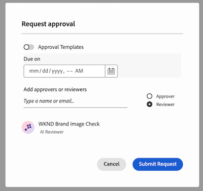

# Guida introduttiva a Workfront AI Reviewer

>[!NOTE]
>
>Questa funzione è attualmente in versione beta.

Con Workfront AI Reviewer, puoi velocizzare la velocità dei contenuti e ottimizzare la conformità del brand nel flusso di lavoro di revisione e approvazione. Puoi aggiungere i revisori AI modelli di approvazione o alle singole richieste di revisione e approvazione in Workfront.

## Requisiti di accesso

Per impostare i revisori AI in Workfront, devi essere un amministratore di sistema.

Qualsiasi utente può aggiungere il revisore IA a una richiesta di revisione e approvazione.

## Prerequisiti

* La tua organizzazione deve aver eseguito la migrazione ad Adobe IMS (Identity Management System).
* L&#39;istanza di Workfront deve avere le approvazioni unificate abilitate.
* La tua organizzazione deve disporre di GenStudio Foundation.
* Adobe deve disporre di un accordo Adobe Gen AI firmato su file.
Per ulteriori informazioni sulla firma del contratto, consulta [Firmare il contratto di Adobe Gen AI](/help/quicksilver/workfront-basics/ai-assistant/ai-assistant-overview.md#sign-the-adobe-gen-ai-agreement).

## Partecipa alla versione beta

Per partecipare alla versione beta, vai a **Configurazione** > **Revisione e approvazione** > **Revisori AI** e fai clic su **Accetta termini**.

## Tipi di file supportati {#supported-file-types-ai-reviewer}

>[!CONTEXTUALHELP]
>id="wf_document_approvals_ai_supported_files"
>title="Tipo di file non supportato"
>abstract="Questo revisore IA non supporta il tipo di file selezionato.Per inviare la richiesta, carica un tipo di file supportato oppure rimuovi il revisore IA."

Il revisore IA può esaminare i seguenti tipi di file:

* PNG (.png)
* JPEG (.jpeg, .jpg)
* WEBP (.webp)
* GIF non animato (.gif)

Se carichi un tipo di file non supportato, l’opzione Revisore IA non viene visualizzata durante la creazione di un’approvazione.

## Impostare le linee guida per il marchio

Durante la revisione dei contenuti, Workfront AI Reviewer utilizza le linee guida per il brand definite in Genstudio Foundation. Attualmente, è possibile impostare solo le linee guida del brand per le immagini. Per ulteriori informazioni, vedere [Introduzione ad Adobe GenStudio for Performance Marketing](https://experienceleague.adobe.com/it/docs/genstudio-for-performance-marketing/user-guide/get-started).

## Crea revisori AI

Una volta configurato almeno un marchio in GenStudio Foundation, gli amministratori di Workfront possono iniziare a creare i revisori di IA nell’area Configurazione. Tali revisori AI possono quindi essere assegnati a modelli di approvazione e singole richieste di revisione e approvazione. Al momento, i revisori di IA possono solo rivedere rispetto alle linee guida per il brand delle immagini.

Per ulteriori informazioni, consulta [Creare i revisori AI](/help/quicksilver/review-and-approve-work/document-reviews-and-approvals/set-up-ai-reviewer.md).

## Aggiungere revisori AI per rivedere e approvare le richieste

Gli utenti possono aggiungere i revisori AI a un modello di approvazione esistente o a singole richieste di revisione e approvazione.

### Modelli di approvazione

Se nell&#39;organizzazione vengono spesso aggiunte le stesse persone alle richieste di revisione e approvazione, gli utenti con licenza Standard possono creare modelli di approvazione nell&#39;area Configurazione di Workfront.

Gli utenti possono aggiungere i revisori AI modelli di approvazione per verificare automaticamente la conformità del brand quando un modello viene utilizzato per creare una richiesta.

Una volta creati, i modelli di approvazione possono essere applicati alle risorse nell’area Documenti di un progetto, un’attività o un problema.

Per ulteriori informazioni, consulta [Creare un modello di approvazione per risorse e documenti](/help/quicksilver/review-and-approve-work/document-reviews-and-approvals/manage-document-approvals/create-approval-template.md).

### Richiesta di revisione e approvazione individuale

Quando gli utenti creano richieste di revisione e approvazione individuali, possono aggiungere un revisore di IA con altri partecipanti oppure possono creare una singola richiesta con solo il revisore di IA per verificare la conformità del brand.

Per ulteriori informazioni, vedere [Creare una richiesta di revisione o approvazione del documento](/help/quicksilver/review-and-approve-work/document-reviews-and-approvals/manage-document-approvals/create-a-document-approval.md).

## Visualizzare il punteggio e il feedback del revisore AI

Pochi secondi dopo l’invio della richiesta di revisione e approvazione con un revisore AI, il punteggio e il feedback del revisore AI sono disponibili nel pannello Riepilogo documento, anche se altri partecipanti stanno ancora rivedendo e prendendo decisioni.

Anche i proprietari delle approvazioni ricevono un’e-mail di notifica del completamento di una revisione della risorsa. Nell&#39;e-mail, fai clic su **Vai a revisione** e visualizza il punteggio e il feedback in Workfront.

Il revisore di IA non è progettato per essere un decision-maker nel flusso di lavoro di revisione e approvazione. Fornisce solo un punteggio e consigli per allineare la risorsa ai requisiti del brand specificati.

Se l’immagine soddisfa a lungo le linee guida del marchio, il creativo può caricare una nuova versione e il proprietario dell’approvazione può creare una seconda richiesta di revisione e approvazione con il revisore AI, che consente di passare da una versione all’altra e confrontare il feedback.

Per ulteriori informazioni sulla visualizzazione di punteggi e feedback, consulta [Visualizzare il punteggio e il feedback del revisore di IA](/help/quicksilver/review-and-approve-work/document-reviews-and-approvals/view-ai-reviewer-feedback.md).

## Procedura dettagliata video

>[!VIDEO](https://video.tv.adobe.com/v/3470847/)