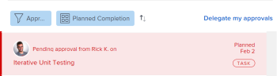

# Richiamare le approvazioni inviate

È possibile richiamare i seguenti oggetti inviati per l&#39;approvazione:

* Progetti
* Tasks
* Problemi
* Schede orario
* Documenti
* Richieste di accesso

## Requisiti di accesso

+++ Espandi per visualizzare i requisiti di accesso per la funzionalità descritta in questo articolo.

<table style="table-layout:auto"> 
 <col> 
 <col> 
 <tbody> 
  <tr> 
   <td role="rowheader">Pacchetto Adobe Workfront</td> 
   <td> 
Qualsiasi
 </td> 
  </tr> 
  <tr> 
   <td role="rowheader">Licenza di Adobe Workfront</td> 
   <td>
   
Contribuisci o versione successiva

   
Richiedente o successiva

   </td> 
  </tr> 
  <tr> 
   <td role="rowheader">Configurazioni del livello di accesso</td> 
   <td> 
Accesso di visualizzazione o superiore a progetti, attività, problemi, schede orario, documenti
</td> 
  </tr> 
  <tr> 
   <td role="rowheader">Autorizzazioni sugli oggetti</td> 
   <td> 
Accesso di visualizzazione o accesso successivo all’oggetto associato all’approvazione 
</td> 
  </tr> 
 </tbody> 
</table>

Per informazioni, consulta [Requisiti di accesso nella documentazione di Workfront](/help/quicksilver/administration-and-setup/add-users/access-levels-and-object-permissions/access-level-requirements-in-documentation.md).

+++

## Progetti

Quando si richiama l&#39;approvazione di un progetto, il progetto torna allo stato precedente all&#39;avvio del processo di approvazione.

Se si ricorda un&#39;approvazione associata allo stato iniziale del progetto, il processo di approvazione viene ignorato e il progetto rimane nello stato iniziale.

>[!NOTE]
>
>È possibile associare il primo stato di un progetto o di un&#39;attività a un processo di approvazione utilizzando un modello. Per ulteriori informazioni sull&#39;aggiunta di approvazioni a un modello, vedere [Modifica modelli di progetto](../../manage-work/projects/create-and-manage-templates/edit-templates.md).

Per richiamare l&#39;approvazione di un progetto inviata:

1. Fai clic sull&#39;icona **Home**  nell&#39;angolo superiore sinistro di Adobe Workfront.

   >[!NOTE]
   >
   >L’amministratore di Workfront potrebbe apportare le seguenti modifiche all’icona Home nel tuo ambiente:
   >
   >* Sostituiscilo con un’immagine personalizzata per illustrare la tua organizzazione. In questo caso, l’icona avrà un aspetto diverso da quello mostrato in questo articolo.
   >* Sostituisci la pagina collegata con un’altra pagina. In questo caso, fai clic sull&#39;icona **Main Menu**  nell&#39;angolo superiore destro della pagina, quindi fai clic su **Home**.

1. Nell&#39;area **Elenco lavori**, passa al raggruppamento **Approvazioni inviate**.

1. Fare clic su un&#39;approvazione **Progetto** nell&#39;elenco di lavoro.

   Il progetto verrà aperto a destra di Work List (Elenco di lavoro).

   

1. Fai clic su **Richiama** nell&#39;angolo superiore destro del pannello di destra.

## Attività

Quando si richiama l&#39;approvazione di un&#39;attività, l&#39;attività torna allo stato precedente all&#39;avvio del processo di approvazione.

Se si ricorda un&#39;approvazione associata allo stato iniziale dell&#39;attività, il processo di approvazione viene ignorato e l&#39;attività rimane nello stato iniziale.

>[!NOTE]
>
>È possibile associare il primo stato di un progetto o di un&#39;attività a un processo di approvazione utilizzando un modello. Per ulteriori informazioni sull&#39;aggiunta di approvazioni a un modello, vedere [Modifica modelli di progetto](../../manage-work/projects/create-and-manage-templates/edit-templates.md).

Per richiamare l&#39;approvazione di un&#39;attività inviata:

1. Fai clic sull&#39;icona **Home**  nell&#39;angolo superiore sinistro di Adobe Workfront.

   >[!NOTE]
   >
   >L’amministratore di Workfront potrebbe apportare le seguenti modifiche all’icona Home nel tuo ambiente:
   >
   >* Sostituiscilo con un’immagine personalizzata per illustrare la tua organizzazione. In questo caso, l’icona avrà un aspetto diverso da quello mostrato in questo articolo.
   >* Sostituisci la pagina collegata con un’altra pagina. In questo caso, fai clic sull&#39;icona **Main Menu**  nell&#39;angolo superiore destro della pagina, quindi fai clic su **Home**.

1. Nell&#39;area **Elenco lavori**, passa al raggruppamento **Approvazioni inviate**.

1. Fai clic su un&#39;approvazione **Attività** nell&#39;Elenco lavori.

   L’attività verrà aperta a destra di Work List (Elenco di lavoro).

   

1. Fai clic su **Richiama** nell&#39;angolo superiore destro del pannello di destra.

## Problemi

Quando si richiama l&#39;approvazione di un problema, il problema torna allo stato precedente all&#39;avvio del processo di approvazione.

Se si ricorda un&#39;approvazione associata allo stato iniziale del problema, il processo di approvazione viene ignorato e il problema rimane nello stato iniziale.

>[!NOTE]
>
>È possibile associare il primo stato di un problema a un processo di approvazione utilizzando un modello. Per ulteriori informazioni sulla creazione di una coda richieste, vedere [Creare una coda richieste](../../manage-work/requests/create-and-manage-request-queues/create-request-queue.md).

1. Fai clic sull&#39;icona **Home**  nell&#39;angolo superiore sinistro di Adobe Workfront.

   >[!NOTE]
   >
   >L’amministratore di Workfront potrebbe apportare le seguenti modifiche all’icona Home nel tuo ambiente:
   >
   >* Sostituiscilo con un’immagine personalizzata per illustrare la tua organizzazione. In questo caso, l’icona avrà un aspetto diverso da quello mostrato in questo articolo.
   >* Sostituisci la pagina collegata con un’altra pagina. In questo caso, fai clic sull&#39;icona **Main Menu**  nell&#39;angolo superiore destro della pagina, quindi fai clic su **Home**.

1. Nell&#39;area **Elenco lavori**, passa al raggruppamento **Approvazioni inviate**.

1. Fai clic su un **problema** di approvazione in Work List (Elenco di lavoro).

   Questo apre il problema a destra di Work List (Elenco di lavoro).

   

1. Fai clic su **Richiama** nell&#39;angolo superiore destro del pannello di destra.

## Schede orario

Quando si richiama un&#39;approvazione della scheda orario, questa torna allo stato precedente all&#39;invio per l&#39;approvazione.

1. Fai clic sull&#39;icona **Home**  nell&#39;angolo superiore sinistro di Adobe Workfront.

   >[!NOTE]
   >
   >L’amministratore di Workfront potrebbe apportare le seguenti modifiche all’icona Home nel tuo ambiente:
   >
   >* Sostituiscilo con un’immagine personalizzata per illustrare la tua organizzazione. In questo caso, l’icona avrà un aspetto diverso da quello mostrato in questo articolo.
   >* Sostituisci la pagina collegata con un’altra pagina. In questo caso, fai clic sull&#39;icona **Main Menu**  nell&#39;angolo superiore destro della pagina, quindi fai clic su **Home**.

1. Nell&#39;area **Elenco lavori**, passa al raggruppamento **Approvazioni inviate**.

1. Fare clic su un&#39;approvazione **Scheda orario** in Elenco lavori.

   Verrà aperta la scheda orario a destra di Elenco lavori.

   

1. Fai clic su **Richiama** nell&#39;angolo superiore destro del pannello di destra.

## Documenti

Per richiamare l&#39;approvazione di un documento, è necessario rimuovere manualmente uno o tutti gli utenti dall&#39;approvazione.

1. Fai clic sull&#39;icona **Home**  nell&#39;angolo superiore sinistro di Adobe Workfront.

   >[!NOTE]
   >
   >L’amministratore di Workfront potrebbe apportare le seguenti modifiche all’icona Home nel tuo ambiente:
   >
   >* Sostituiscilo con un’immagine personalizzata per illustrare la tua organizzazione. In questo caso, l’icona avrà un aspetto diverso da quello mostrato in questo articolo.
   >* Sostituisci la pagina collegata con un’altra pagina. In questo caso, fai clic sull&#39;icona **Main Menu**  nell&#39;angolo superiore destro della pagina, quindi fai clic su **Home**.

1. Nell&#39;area **Elenco lavori**, passa al raggruppamento **Approvazioni inviate**.

1. Fare clic su un&#39;approvazione **Documento** nell&#39;Elenco lavori.

   Verrà aperto il documento a destra di Elenco lavori.

   

1. Fai clic su **Gestisci approvazioni** nell&#39;angolo superiore destro del pannello di destra. Verrà visualizzata la casella Gestisci approvazioni.
1. Fai clic sull&#39;icona **Rimuovi** in linea con il nome di un utente nella casella Gestisci approvazioni. Rimuovere tutti gli utenti per richiamare completamente l&#39;approvazione del documento.

   

## Richieste di accesso

1. Fai clic sull&#39;icona **Home**  nell&#39;angolo superiore sinistro di Adobe Workfront.

   >[!NOTE]
   >
   >L’amministratore di Workfront potrebbe apportare le seguenti modifiche all’icona Home nel tuo ambiente:
   >
   >* Sostituiscilo con un’immagine personalizzata per illustrare la tua organizzazione. In questo caso, l’icona avrà un aspetto diverso da quello mostrato in questo articolo.
   >* Sostituisci la pagina collegata con un’altra pagina. In questo caso, fai clic sull&#39;icona **Main Menu**  nell&#39;angolo superiore destro della pagina, quindi fai clic su **Home**.

1. Nell&#39;area **Elenco lavori**, passa al raggruppamento **Approvazioni inviate**.

1. Fare clic su una **richiesta di accesso** approvazione nell&#39;elenco di lavoro.

   Verrà aperta la richiesta di accesso a destra di Elenco lavori.

   

1. Fai clic su **Richiama** nell&#39;angolo superiore destro del pannello di destra.
