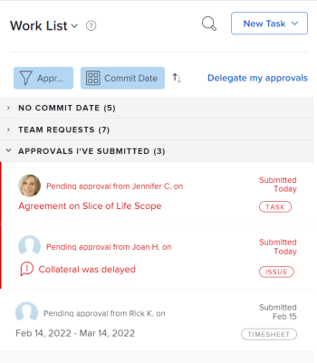

# Visualizza approvazioni

I processi di approvazione offrono la flessibilità necessaria per creare approvazioni di più passaggi per progetti, attività e problemi. Gli amministratori di Adobe Workfront definiscono i processi di approvazione per garantire la coerenza dell’intero sistema.

Per informazioni sulla creazione dei processi di approvazione, consulta [Creazione di un processo di approvazione per gli elementi di lavoro](../../administration-and-setup/customize-workfront/configure-approval-milestone-processes/create-approval-processes.md).

Per informazioni sull&#39;associazione delle approvazioni con il lavoro in Workfront, vedi [Associa un processo di approvazione nuovo o esistente al lavoro](../../review-and-approve-work/manage-approvals/associate-approval-with-work.md).

## Requisiti di accesso

Per eseguire i passaggi descritti in questo articolo, è necessario disporre dei seguenti diritti di accesso:

<table style="table-layout:auto"> 
 <col> 
 <col> 
 <tbody> 
  <tr> 
   <td role="rowheader">piano Adobe Workfront*</td> 
   <td> 
Qualsiasi
 </td> 
  </tr> 
  <tr> 
   <td role="rowheader">Licenza Adobe Workfront*</td> 
   <td> 
Revisione o superiore
 </td> 
  </tr> 
  <tr> 
   <td role="rowheader">Configurazioni a livello di accesso*</td> 
   <td> 
Visualizzazione o accesso superiore agli oggetti associati alle approvazioni
 
Nota: Se non disponi ancora dell’accesso, chiedi all’amministratore Workfront se ha impostato ulteriori restrizioni nel livello di accesso. Per informazioni su come un amministratore Workfront può modificare il livello di accesso, consulta <a href="../../administration-and-setup/add-users/configure-and-grant-access/create-modify-access-levels.md" class="MCXref xref">Creare o modificare livelli di accesso personalizzati</a>.
 </td> 
  </tr> 
  <tr> 
   <td role="rowheader">Autorizzazioni oggetto</td> 
   <td> 
Visualizza o autorizzazioni superiori per gli oggetti associati alle approvazioni
 
Per informazioni sulla richiesta di accesso aggiuntivo, vedi <a href="../../workfront-basics/grant-and-request-access-to-objects/request-access.md" class="MCXref xref">Richiedere l’accesso agli oggetti </a>.
 </td> 
  </tr> 
 </tbody> 
</table>

&#42;Per informazioni sul piano, il tipo di licenza o l&#39;accesso, contattare l&#39;amministratore Workfront.

## Individuare le approvazioni in Adobe Workfront

Puoi visualizzare o gestire le approvazioni da diverse aree di Workfront. Per informazioni su come gestire le approvazioni in varie aree, consulta [Approvazione del lavoro](../../review-and-approve-work/manage-approvals/approving-work.md).

Puoi visualizzare o gestire le approvazioni dalle aree seguenti:

* Nell&#39;area Home

   * Tutti i progetti, le attività, i problemi, le schede attività, i documenti e l&#39;accesso in attesa dell&#39;approvazione vengono visualizzati nell&#39;area Home quando si seleziona di visualizzare Tutti o Approvazioni.
   * Anche le approvazioni inviate dall&#39;utente vengono visualizzate nell&#39;area Home, nella sezione Approvazioni inviate dell&#39;Elenco di lavoro. Per ulteriori informazioni, consulta la sezione [Revisione del lavoro inviato per l&#39;approvazione nell&#39;area Home](#review-work-you-submit-for-approval-in-the-home-area) in questo articolo.
   * Le approvazioni vengono rimosse dall&#39;area Home quando il progetto, l&#39;attività o il problema associato sono contrassegnati come Risolti, Bloccati, Chiusi o Annullati.

   Per informazioni sull&#39;utilizzo di Home, vedi [Introduzione a Home](../../workfront-basics/using-home/using-the-home-area/get-started-with-home.md).

* Nell’intestazione di un progetto, un’attività, un problema, un documento o una bozza
* Nella sezione Approvazioni di un progetto, un&#39;attività o un problema
* In un rapporto

   >[!NOTE]
   >
   >Non è possibile prendere una decisione su un&#39;approvazione da un rapporto.

   È possibile creare un progetto, un&#39;attività, un problema o un rapporto di approvazione del documento contenente informazioni di approvazione.

   Per informazioni sulla creazione di rapporti, consulta [Creare un rapporto personalizzato](../../reports-and-dashboards/reports/creating-and-managing-reports/create-custom-report.md).

## Revisione del lavoro inviato per l&#39;approvazione nell&#39;area Home {#review-work-you-submit-for-approval-in-the-home-area}

1. Fai clic sul pulsante **Pagina principale** icona  nell’angolo in alto a sinistra di Adobe Workfront.

   >[!NOTE]
   >
   >L’amministratore di Workfront potrebbe apportare le seguenti modifiche all’icona Home nell’ambiente:
   >
   >* Sostituiscilo con un&#39;immagine personalizzata per illustrare la tua organizzazione. In questo caso, l’icona avrà un aspetto diverso da quello mostrato in questo articolo.
   >* Sostituisci la pagina collegata con una pagina diversa. In questo caso, fai clic sul pulsante **Menu principale**  nell’angolo superiore destro della pagina, quindi fai clic su **Pagina principale**.

1. Seleziona **Elenco lavori**, quindi fai clic su **Filtro** menu a discesa e seleziona **Approvazioni**.
1. Espandi la **Approvazioni inviate** e trovare le approvazioni inviate.

   

## Visualizzazione dello stato di approvazione di un oggetto

È possibile visualizzare lo stato di approvazione di un oggetto nelle sezioni seguenti dell&#39;oggetto:

<table style="table-layout:auto"> 
 <col> 
 <col> 
 <tbody> 
  <tr> 
   <td role="rowheader">Aggiornamenti </td> 
   <td> 
Visualizza tutti gli stati di approvazione quando si verificano. Gli stati di approvazione vengono visualizzati in linea con gli altri stati visualizzati nella <strong>Aggiornamenti</strong> sezione .
 </td> 
  </tr> 
  <tr> 
   <td role="rowheader">Approvazioni</td> 
   <td> 
Visualizza informazioni più dettagliate sul processo di approvazione, ad esempio per ogni fase del processo di approvazione e se gli approvatori hanno concesso l’omologazione.
 </td> 
  </tr> 
 </tbody> 
</table>

* [Utilizza l’area Aggiornamenti per visualizzare lo stato di approvazione](#use-the-updates-area-to-view-an-approval-status)
* [Utilizzare l&#39;area Approvazioni per visualizzare lo stato di un&#39;approvazione](#use-the-approvals-area-to-view-an-approval-status)

### Utilizza l’area Aggiornamenti per visualizzare lo stato di approvazione {#use-the-updates-area-to-view-an-approval-status}

Quando si avvia un&#39;approvazione su un progetto, un&#39;attività o un problema, viene visualizzato uno stato nel **Aggiornamenti** scheda dell&#39;oggetto, che indica lo stato di approvazione. Viene visualizzato un nuovo stato ogni volta che l&#39;oggetto passa attraverso il processo di approvazione. Ciò include i seguenti eventi:

* Viene avviato un processo di approvazione su un oggetto. Il processo di approvazione viene avviato quando lo stato viene modificato.
* L&#39;oggetto viene rifiutato
* L&#39;oggetto è approvato 

>[!TIP]
>
>Se un&#39;approvazione viene applicata a un&#39;attività, gli aggiornamenti di approvazione vengono visualizzati nella scheda Aggiornamenti dell&#39;attività, non nella scheda Aggiornamenti del progetto in cui si trova l&#39;attività.

### Utilizzare l&#39;area Approvazioni per visualizzare lo stato di un&#39;approvazione {#use-the-approvals-area-to-view-an-approval-status}

È possibile ottenere la visibilità nel punto in cui un&#39;attività o un problema su cui si sta lavorando attualmente è nel processo di approvazione. Puoi vedere le seguenti informazioni:

* Fase del processo di approvazione
* Quali approvatori l&#39;hanno già approvata?
* Quali approvatori non l&#39;hanno ancora approvato?

Per visualizzare lo stato corrente in cui un&#39;attività o un problema si trova nel processo di approvazione:

1. Passa al progetto, all&#39;attività o al problema a cui è associata l&#39;approvazione.
1. Nel pannello a sinistra, fai clic su **Approvazioni**. Potrebbe essere necessario fare prima clic su **Mostra altro**.

   La scheda Approvazioni visualizza le informazioni complete su tutti i percorsi e le fasi di approvazione precedenti. Puoi vedere esattamente chi ha preso una decisione sull&#39;approvazione o se l&#39;approvazione è impostata per un team, un ruolo o un utente.

   

   Per informazioni sulla creazione di un processo di approvazione, vedere [Creazione di un processo di approvazione per gli elementi di lavoro](../../administration-and-setup/customize-workfront/configure-approval-milestone-processes/create-approval-processes.md).
