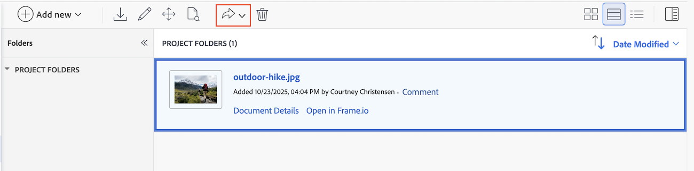

# Utilizzare Adobe Experience Manager con l&#39;integrazione Frame.io

È possibile utilizzare [!DNL Experience Manager Assets]&#x200B;&#x200B; per gestire e archiviare le risorse digitali che hanno superato il ciclo di revisione e approvazione. Questa integrazione consente di sfruttare le funzionalità di Adobe Experience Manager, Frame.io e Workfront per semplificare la gestione dei contenuti e i processi di collaborazione.

## Configurare l’integrazione di Experience Manager Assets

È possibile collegare il proprio lavoro al contenuto in [!DNL Experience Manager Assets]&#x200B;:

* Invio di risorse e metadati da [!DNL Adobe Workfront] a [!DNL Experience Manager Assets]&#x200B;
* Facilitare i casi di utilizzo del controllo delle versioni
* Tracciare i metadati per le risorse
* Sincronizza metadati progetto tra [!DNL Workfront] e [!DNL Experience Manager Assets]

>[!NOTE]
>
>È inoltre possibile connettere più archivi [!DNL Experience Manager Assets] a un ambiente [!UICONTROL Workfront] o più ambienti [!DNL Workfront] a un archivio [!DNL Experience Manager Assets] tra gli ID organizzazione. Segui le istruzioni di configurazione in questo articolo per ogni integrazione da configurare.

## Requisiti di accesso

+++ Espandi per visualizzare i requisiti di accesso per la funzionalità descritta in questo articolo.

<table>
  <tr>
   <td>Pacchetto Adobe Workfront
   </td>
   <td> 
PRIME o ULTIMATE

    
Flusso di lavoro Ultimate

   </td>
  </tr>
    <tr>
   <td>Licenze di Adobe Workfront
   </td>
   <td>
  
Per configurare l’integrazione:

   
Standard

   
Piano

Per inviare documenti a Experience Manager Assets:

   
Collaboratore o versione successiva

   
Richiedi o superiore

   </td>
  </tr>
  </tr>
    <tr>
   <td>Licenze Adobe Experience Manager
   </td>
   <td>Standard
   </td>
  </tr>
  <tr>
   <td>Prodotti aggiuntivi
   </td>
   <td>Devi avere [!DNL Experience Manager Assets as a Cloud Service] e devi essere aggiunto al prodotto come utente.
   </td>
  </tr>
   <tr>
   <td>Configurazioni del livello di accesso
   </td>
   <td>Devi essere un amministratore [!DNL Workfront].
   </td>
  </tr>
</table>

Per ulteriori dettagli sulle informazioni contenute in questa tabella, vedere [Requisiti di accesso nella documentazione di Workfront](/help/quicksilver/administration-and-setup/add-users/access-levels-and-object-permissions/access-level-requirements-in-documentation.md).

+++

## Prerequisiti

Prima di iniziare,

* [!DNL Workfront] e [!DNL Adobe Experience Manager Assets] devono essere associati a un ID organizzazione in [!DNL Adobe Admin Console]. Per ulteriori informazioni, vedere [Differenze di amministrazione basate su Platform ([!DNL Adobe Workfront]/[!DNL Adobe Business Platform])](/help/quicksilver/administration-and-setup/get-started-wf-administration/actions-in-admin-console.md).
* L&#39;istanza Workfront deve utilizzare Adobe Enterprise Storage.

## Impostare le informazioni sull’integrazione

{{step-1-to-setup}}

1. Seleziona **[!UICONTROL Documenti]** nel pannello a sinistra, quindi seleziona **[!UICONTROL [!DNL Experience Manager]Integrazione]**.
1. Selezionare **[!UICONTROL Aggiungi integrazione [!DNL Experience Manager]]**.
1. Nel campo **[!UICONTROL Nome]**, immetti il nome che desideri che gli utenti visualizzino quando interagiscono con questa integrazione in Workfront e Experience Manager Assets.
1. Nel campo **[!UICONTROL URL di navigazione]**, il sistema popola automaticamente l&#39;URL di navigazione. Questo URL di sola lettura viene utilizzato per collegarsi all&#39;istanza [!DNL Experience Manager] della tua organizzazione dal [!UICONTROL Main Menu] per un accesso rapido.
1. Scegliere un repository dal menu a discesa del repository **[!UICONTROL [!DNL Experience Manager]Assets]**. Il sistema popola automaticamente tutti gli archivi [!DNL Experience Manager] associati all&#39;ID organizzazione a cui è assegnato il profilo utente.
   

1. Fai clic su **[!UICONTROL Salva]** o passa alla sezione [Configura metadati (facoltativo)](#set-up-metadata-optional) in questo articolo.

   >[!IMPORTANT]
   >
   >A causa della complessità dell’integrazione, non è possibile modificare l’archivio dopo il salvataggio della configurazione iniziale.

## Configurazione metadati (facoltativo)

È possibile mappare i dati dell&#39;oggetto [!DNL Workfront] ai campi degli elementi multimediali delle risorse in [!DNL Experience Manager] Assets.

>[!NOTE]
>
>È possibile mappare i metadati solo in una direzione: da [!DNL Workfront] a [!DNL Experience Manager]. Impossibile trasferire i metadati per i documenti collegati a [!DNL Workfront] da [!DNL Experience Manager] a [!DNL Workfront].

### Configurare i campi di metadati

Prima di iniziare la mappatura dei campi di metadati, è necessario configurare i campi di metadati sia in Workfront che in Experience Manager Assets.

Per configurare i campi metadati:

1. Configura uno schema metadati in [!DNL Experience Manager Assets] come spiegato in [Configura la mappatura dei metadati delle risorse tra Adobe [!DNL Workfront] e [!DNL Experience Manager Assets]](https://experienceleague.adobe.com/en/docs/experience-manager-cloud-service/content/assets/integrations/configure-asset-metadata-mapping).

1. Configurare i campi modulo personalizzati in Workfront. [!DNL Workfront] contiene molti campi personalizzati incorporati che è possibile utilizzare. Tuttavia, puoi anche creare campi personalizzati come descritto in [Creare un modulo personalizzato](/help/quicksilver/administration-and-setup/customize-workfront/create-manage-custom-forms/form-designer/design-a-form/design-a-form.md).

+++ **Espandi per visualizzare ulteriori informazioni sui campi Workfront e Experience Manager Assets supportati** 

**Tag Experience Manager Assets**

Puoi mappare qualsiasi campo supportato da Workfront a un tag in Experience Manager Assets. A questo scopo, è necessario assicurarsi che i valori dei tag in Experience Manager Assets corrispondano a Workfront.

* I valori dei campi Tag e Workfront devono corrispondere esattamente in ortografia e formato.
* I valori dei campi di Workfront mappati sui tag di experience Manager assets devono essere tutti in minuscolo, anche se il tag in Experience Manager Assets sembra avere lettere maiuscole.
* I valori dei campi di Workfront non devono includere spazi.
* Il valore del campo in Workfront deve includere anche la struttura di cartelle del tag Experience Manager Assets.
* Per mappare più campi di testo a riga singola ai tag, immetti un elenco separato da virgole dei valori tag nel lato Workfront della mappatura metadati e `xcm:keywords` nel lato Experience Manager Assets. Ogni valore di campo viene mappato su un tag separato. È possibile utilizzare un campo calcolato per combinare più campi Workfront in un unico campo di testo separato da virgole.
* È possibile mappare i valori dai campi elenco a discesa, pulsante di scelta o casella di controllo immettendo un elenco separato da virgole dei valori disponibili in tale campo.

>[!INFO]
>
>**Esempio**: per far corrispondere il tag visualizzato nella struttura di cartelle, il valore del campo in Workfront sarà `landscapes:trees/spruce`. Osserva le lettere minuscole nel valore del campo Workfront.
>
>Se si desidera che il tag sia l&#39;elemento più a sinistra nella struttura dei tag, è necessario che sia seguito da due punti. In questo esempio, per eseguire il mapping al tag landscapes, il valore del campo in Workfront sarà `landscapes:`.
>
>

Dopo aver creato i tag in Experience Manager Assets, vengono visualizzati nel menu a discesa Tag della sezione Metadati. Per collegare un campo a un tag, selezionare `xcm:keywords` nel menu a discesa del campo Experience Manager Assets nell&#39;area di mappatura dei metadati.

Per ulteriori informazioni sui tag in Experience Manager Assets, tra cui come creare e gestire i tag, vedere [Amministrazione dei tag](https://experienceleague.adobe.com/en/docs/experience-manager-64/administering/contentmanagement/tags).

**Campi schema metadati personalizzati Experience Manager Assets**

Puoi mappare i campi Workfront incorporati e personalizzati ai campi schema metadati personalizzati in Experience Manager Assets.

I campi di metadati personalizzati creati in Experience Manager Assets sono organizzati in una sezione specifica nell’area di configurazione dei metadati.

<!-- 
link to documentation about creating schema - waiting on response from Anuj about best article to link to
-->

**Campi Workfront**

Puoi mappare su Experience Manager Assets i campi Workfront incorporati e personalizzati. I seguenti valori dei campi devono corrispondere tra Workfront e Experience Manager Assets sia in maiuscolo che in minuscolo:

* Campi a discesa
* Campi a selezione multipla

>[!TIP]
>
> Per verificare se i valori dei campi corrispondono esattamente, vai a
>
> * Configurazione > Forms personalizzato in Workfront o il campo nell’oggetto
> * Assets > schemi metadati in Experience Manager Assets

+++

### Mappare i metadati per le risorse

I metadati vengono mappati quando una risorsa viene inviata per la prima volta da [!DNL Workfront]. I documenti con i campi predefiniti o personalizzati vengono mappati automaticamente ai campi specificati la prima volta che una risorsa viene inviata a [!DNL Experience Manager Assets].

Per mappare i metadati delle risorse:

<!--
1. Select **[!UICONTROL Assets]** above the metadata table.
-->
1. Nella colonna **[!UICONTROL [!DNL Workfront]campo]** scegliere un campo Workfront predefinito o personalizzato.

   >[!NOTE]
   >
   >È possibile mappare un singolo campo [!DNL Workfront] a più campi [!UICONTROL Experience Manager Assets]. Impossibile mappare più campi [!DNL Workfront] a un singolo campo [!DNL Experience Manager Assets].
   ><!--To map a Workfront field to an Experience Manager Assets tag, see -->

1. Nel campo [!DNL Experience Manager Assets], eseguire la ricerca nelle categorie precompilate o immettere almeno due lettere nel campo di ricerca per accedere ad altre categorie.
1. Ripetere i passaggi 2 e 3 in base alle esigenze.
   
1. Fai clic su [!UICONTROL **Salva**] o passa alla sezione [Sincronizzazione metadati oggetto](#object-metadata-sync) in questo articolo.

### Sincronizzazione metadati oggetto

I campi [!DNL Experience Manager] mappati ai campi portfolio, programma, progetto, attività, problema e documento di [!DNL Workfront] vengono aggiornati automaticamente quando vengono modificati in [!DNL Workfront].

Quando questa opzione è abilitata, qualsiasi risorsa inviata ad Adobe Experience Manager mostra una visualizzazione in tempo reale dei metadati Adobe Experience Manager del documento nella pagina Dettagli documento in Workfront.

1. Abilita il campo **[!UICONTROL Sincronizza metadati oggetto]**, quindi fai clic su **Salva**.

>[!IMPORTANT]
>
>Gli utenti devono disporre dell&#39;accesso in scrittura in [!DNL Experience Manager] per le risorse che vivono nell&#39;oggetto affinché i metadati possano essere sincronizzati al momento dell&#39;aggiornamento.

## Inviare un documento a Experience Manager Assets o Assets Essentials

Puoi inviare documenti da Workfront a Experience Manager Assets o Assets Essentials. I documenti caricati e inviati da Workfront ad Assets Essentials vengono comunque conteggiati nell’archiviazione complessiva dei documenti.

Assets inviato ad Experience Manager tramite questa integrazione ha un limite di dimensioni di **5o TB**.

<!--In the Preview environment, Assets sent to Experience Manager through this integration have a size limit of **30 GB**.-->

I campi metadati vengono mappati per la prima volta quando invii una risorsa da Workfront a Experience Manager Assets o Assets Essentials. Vengono inviati anche tutti i metadati configurati per la mappatura degli oggetti principali. Per ulteriori informazioni sulla configurazione del mapping dei metadati, vedere [Configurare l&#39;integrazione Experience Manager Assets as a Cloud Service](/help/quicksilver/administration-and-setup/configure-integrations/configure-aacs-integration.md) o [Configurare l&#39;integrazione Experience Manager Assets Essentials](/help/quicksilver/documents/adobe-workfront-for-experience-manager-assets-essentials/setup-asset-essentials.md).

>[!INFO]
>
>**Esempio** La prima volta che invii una risorsa collegata a un progetto, i metadati vengono mappati su Experience Manager Assets o Assets Essentials, nonché su eventuali metadati mappati da oggetti principali, ad esempio un portfolio e un programma.

### Invia un documento da Workfront

Quando un utente invia un documento da Workfront a Experience Manager Assets o Assets Essentials, i metadati mappati vengono trasferiti lungo il documento. Dopo l’invio del documento, le modifiche apportate ai metadati del documento in Workfront non vengono applicate in Assets o Assets Essentials. Se viene modificato un campo mappato in Workfront, devi inviare una nuova versione del documento con i metadati aggiornati ad Assets o Assets Essentials.

Per inviare un documento:

1. Vai all&#39;area **Documenti** in Workfront e seleziona il documento che desideri inviare.
1. Fai clic su **Invia a**, quindi scegli l&#39;integrazione Experience Manager configurata dall&#39;amministratore.

   >[!NOTE]
   >
   >L’amministratore di Workfront può scegliere qualsiasi nome per questa integrazione, pertanto potrebbe non menzionare specificamente Assets o Assets Essentials.

   

1. Scegli dove vuoi spostare la risorsa, quindi fai clic su **Seleziona cartella**.
1. Quando trovi la destinazione desiderata, fai clic su **Salva**.

### Invia una nuova versione

È possibile aggiungere una nuova versione a un documento caricato in precedenza in Workfront. Per ulteriori informazioni, vedere [Caricare una nuova versione di un documento](/help/quicksilver/documents/managing-documents/upload-new-document-version.md). Una volta caricata la versione più recente, puoi inviarla ad Assets Essentials. Se un campo mappato in Workfront è stato modificato, la nuova versione aggiorna i metadati in Assets Essentials quando invia.

>[!IMPORTANT]
>
>Prima di caricare una nuova versione in Workfront, è consigliabile rinominare il file. Se carichi una nuova versione con lo stesso nome di file di una versione precedente, è possibile scaricare da Workfront solo la versione più recente. Tutte le versioni possono essere scaricate da Experience Manager Assets o Assets Essentials indipendentemente dal nome del file. <!--Is this still a thing with ESM?-->

Per inviare la versione più recente:

1. Vai all&#39;area **Documenti** in Workfront e individua il documento.
1. Seleziona **Invia a**, quindi scegli l&#39;integrazione Experience Manager configurata dall&#39;amministratore.

   >[!NOTE]
   >
   >L’amministratore di Workfront può scegliere qualsiasi nome per questa integrazione, pertanto potrebbe non menzionare specificamente Assets o Assets Essentials.

   

1. Fai clic su **Salva**. La nuova versione viene salvata nella stessa posizione della versione precedente.
