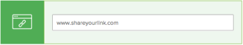

# Creare una bozza interattiva per un sito web o altro contenuto web

Puoi generare una nuova bozza interattiva o una nuova versione di una bozza interattiva esistente per il contenuto web. Può trattarsi di un sito web o di altri tipi di contenuti interattivi, ad esempio annunci con video o audio in streaming, animazioni HTML e banner interattivi.

In una bozza interattiva, i revisori possono navigare e interagire come di consueto con il sito web o altri contenuti web.

>[!IMPORTANT]
>
>Assicurati che il sito web o il contenuto interattivo sia accessibile alle persone che lo visiteranno. Possono accedervi nel processo di verifica solo se possono anche accedervi su Internet.

## Requisiti di accesso

Per eseguire i passaggi descritti in questo articolo, è necessario disporre dei seguenti diritti di accesso:

<table style="table-layout:auto"> 
 <col> 
 <col> 
 <tbody> 
  <tr> 
   <td role="rowheader">Piano Adobe Workfront*</td> 
   <td> 
Piano corrente: Pro o superiore
 
oppure
 
Piano legacy: Premium
 
Per ulteriori informazioni sulla verifica dell'accesso con i diversi piani, vedere <a href="/help/quicksilver/administration-and-setup/manage-workfront/configure-proofing/access-to-proofing-functionality.md" class="MCXref xref">Accesso alla funzionalità di verifica in Workfront</a>.
 </td> 
  </tr> 
  <tr> 
   <td role="rowheader">Licenza Adobe Workfront*</td> 
   <td> 
Piano corrente: Lavoro o Piano
 
Piano legacy: qualsiasi (per l’utente deve essere abilitata la verifica)
 </td> 
  </tr> 
  <tr> 
   <td role="rowheader">Profilo autorizzazione bozza </td> 
   <td>Manager o superiore</td> 
  </tr> 
  <tr> 
   <td role="rowheader">Configurazioni del livello di accesso*</td> 
   <td> 
Modifica accesso ai documenti
 
Nota: se non disponi ancora dell’accesso, chiedi all’amministratore di Workfront se ha impostato restrizioni aggiuntive nel tuo livello di accesso. Per informazioni su come un amministratore di Workfront può modificare il tuo livello di accesso, consulta <a href="../../../administration-and-setup/add-users/configure-and-grant-access/create-modify-access-levels.md" class="MCXref xref">Creare o modificare livelli di accesso personalizzati</a>.
 </td> 
  </tr> 
 </tbody> 
</table>

&#42;Per conoscere il piano, la mansione o il profilo di autorizzazione della bozza disponibile, contattare l&#39;amministratore Workfront o Workfront Proof.

## Creare una bozza interattiva per un sito web o altro contenuto web

1. Vai al progetto, all’attività o al problema in cui desideri creare una nuova bozza del sito web o una nuova versione di una bozza esistente.
1. Clic **Documenti** nel pannello a sinistra.
1. (Condizionale) Se stai creando una nuova bozza, fai clic su **Aggiungi nuovo**, quindi fai clic su **Bozza** nel menu visualizzato.

1. (Condizionale) Sul **Nuova bozza** viene visualizzata la pagina, se stai creando una nuova versione di una bozza esistente:

   1. Passa il puntatore del mouse sulla bozza URL per la quale desideri creare una nuova versione, quindi selezionala facendo clic su, nell’area blu chiara che la circonda.

      

   1. In **Aggiungi nuovo** a discesa, fai clic su **Versione** > **Bozza**.

1. In **Aggiungi file** , digitare l&#39;URL del sito Web che si desidera verificare, quindi premere **Invio**.  È possibile ripetere questa procedura per aggiungere più siti Web da sottoporre a verifica.

   

   >[!NOTE]
   >
   > L&#39;URL deve contenere meno di 1.000 caratteri.

1. Fai clic sull’URL aggiunto.

   

1. (Facoltativo) Se desideri modificare il nome della bozza dall’URL del sito web, digita un **Nome bozza**.
1. Seleziona **Interattiva**, quindi fai clic su **Fine**.

   >[!NOTE]
   >
   >Se stai aggiungendo una nuova versione a una bozza URL esistente, tutte le opzioni configurate sulla bozza originale o sulla versione precedente vengono mantenute in questa versione.

1. Clic **Crea bozza** per creare una bozza semplice senza alcun processo di revisione.\
   oppure\
   Continua con la configurazione di una bozza avanzata:

   * [Creare una bozza avanzata con un flusso di lavoro di base](../../../review-and-approve-work/proofing/creating-proofs-within-workfront/configure-basic-proof-workflow.md)
   * [Creare una bozza avanzata con un flusso di lavoro automatizzato](../../../review-and-approve-work/proofing/creating-proofs-within-workfront/create-automated-proof-workflow.md)
