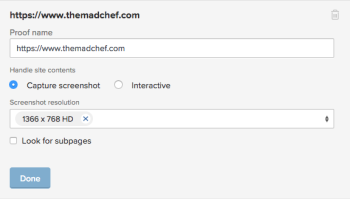

# Creare una bozza statica per un sito web o altro contenuto web

Puoi generare una nuova bozza statica o una nuova versione di una bozza statica esistente per il contenuto web. Il contenuto web può includere annunci con video in streaming, animazioni HTML o banner interattivi, ma verrà tagliato in più schermate per consentire una verifica statica.

Quando crei bozze statiche per un sito web o per altri contenuti web, considera quanto segue:

## Requisiti di accesso

Per eseguire i passaggi descritti in questo articolo, è necessario disporre dei seguenti diritti di accesso:

<table style="table-layout:auto"> 
 <col> 
 <col> 
 <tbody> 
  <tr> 
   <td role="rowheader">Piano Adobe Workfront*</td> 
   <td> 
Piano corrente: Pro o superiore
 
oppure
 
Piano legacy: Seleziona o Premium
 
Per ulteriori informazioni sulla verifica dell'accesso con i diversi piani, vedere <a href="/help/quicksilver/administration-and-setup/manage-workfront/configure-proofing/access-to-proofing-functionality.md" class="MCXref xref">Accesso alla funzionalità di verifica in Workfront</a>.
 </td> 
  </tr> 
  <tr> 
   <td role="rowheader">Licenza Adobe Workfront*</td> 
   <td> 
Piano corrente: Lavoro o Piano
 
Piano legacy: qualsiasi (per l’utente deve essere abilitata la verifica)
 </td> 
  </tr> 
  <tr> 
   <td role="rowheader">Profilo autorizzazione bozza </td> 
   <td>Manager o superiore</td> 
  </tr> 
  <tr> 
   <td role="rowheader">Configurazioni del livello di accesso*</td> 
   <td> 
Modifica accesso ai documenti
 
Nota: se non disponi ancora dell’accesso, chiedi all’amministratore di Workfront se ha impostato restrizioni aggiuntive nel tuo livello di accesso. Per informazioni su come un amministratore di Workfront può modificare il tuo livello di accesso, consulta <a href="../../../administration-and-setup/add-users/configure-and-grant-access/create-modify-access-levels.md" class="MCXref xref">Creare o modificare livelli di accesso personalizzati</a>.
 </td> 
  </tr> 
 </tbody> 
</table>

&#42;Per conoscere il piano, la mansione o il profilo di autorizzazione della bozza disponibile, contattare l&#39;amministratore Workfront o Workfront Proof.

## Creare una bozza statica per un sito web o altro contenuto web

Per creare una bozza statica, il sito web deve essere accessibile al pubblico (non dietro un firewall), oppure il dominio Workfront deve essere incluso nel inserisco nell&#39;elenco Consentiti di dell’organizzazione. Workfront non può acquisire un sito web protetto da password come bozza statica.

>[!TIP]
>
>È consigliabile utilizzare la verifica interattiva anziché la verifica statica per le pagine interne che richiedono autorizzazioni e le pagine protette da password. Per ulteriori informazioni, consulta [Panoramica delle bozze dei contenuti interattivi](../../../review-and-approve-work/proofing/proofing-overview/interactive-content-proofs.md).

1. Vai al progetto, all’attività o al problema in cui desideri creare una nuova bozza del sito web o una nuova versione di una bozza esistente.
1. Clic **Documenti** nel pannello a sinistra .
1. (Condizionale) Se stai creando una nuova bozza, fai clic su **Aggiungi nuovo**, quindi fai clic su **Bozza** nel menu visualizzato.
1. (Condizionale) Se stai creando una nuova versione di una bozza esistente:

   1. Passa il puntatore del mouse sulla bozza URL per la quale desideri creare una nuova versione, quindi selezionala facendo clic sullo sfondo blu chiaro che la circonda.

      

   1. Clic **Aggiungi nuovo** > **Versione** > **Bozza**.

1. Digita l’URL del sito web che desideri verificare in **Aggiungi file** area, quindi premere **Invio**.

   >[!NOTE]
   >
   > L&#39;URL deve contenere meno di 1.000 caratteri.

1. Fai clic sull’URL aggiunto.

   Vengono visualizzate le opzioni per la configurazione della bozza del sito Web.

   

1. (Facoltativo) Se desideri modificare il nome della bozza dall’URL del sito web, digita un **Nome bozza.**
1. Assicurati che **Acquisisci schermata** è selezionato e utilizza una delle opzioni seguenti:

   <table style="table-layout:auto"> 
    <col> 
    <col> 
    <tbody> 
     <tr> 
      <td role="rowheader"><strong>Risoluzione schermata</strong> </td> 
      <td> 
Regola la risoluzione del contenuto quando i revisori visualizzano la bozza, consentendo loro di vedere come appare su dispositivi di dimensioni diverse, come telefoni, tablet e monitor.
 
Se selezioni più risoluzioni, viene creata una bozza separata per ogni risoluzione selezionata.
 
Nota: quando un revisore aggiunge un commento alla bozza, il commento include la risoluzione che indica quando il commento è stato creato, in modo che gli altri revisori sappiano quale risoluzione è associata al commento. 
 </td> 
     </tr> 
     <tr> 
      <td role="rowheader"><strong>Cerca pagine secondarie</strong> </td> 
      <td> 
Acquisisci le pagine secondarie del sito web e le relative pagine principali. Puoi fare clic su Seleziona tutto per includere tutte le pagine, oppure puoi fare clic solo su determinate pagine che desideri includere. I pulsanti più e meno consentono di espandere e chiudere le aree delle pagine secondarie del sito Web.
 </td> 
     </tr> 
    </tbody> 
   </table>

   >[!IMPORTANT]
   >
   >Non è possibile modificare l’impostazione Acquisisci schermata per nessuna versione successiva della bozza creata.

1. Clic **Fine**.

   Se hai selezionato più risoluzioni di screenshot al passaggio 8, l’elenco include una serie di screenshot per ogni risoluzione. Puoi generare queste schermate come bozze separate o combinarle in un’unica bozza (vedi in .). È consigliabile combinarle, soprattutto se si sta creando una bozza statica del sito Web.

   >[!NOTE]
   >
   >Se stai aggiungendo una nuova versione a una bozza URL esistente, tutte le opzioni configurate sulla bozza originale o sulla versione precedente vengono mantenute in questa versione.

1. Clic **Crea bozza** per creare una bozza semplice senza alcun processo di revisione.\
   oppure\
   Continua con la configurazione di una bozza avanzata:

   * [Creare una bozza avanzata con un flusso di lavoro di base](../../../review-and-approve-work/proofing/creating-proofs-within-workfront/configure-basic-proof-workflow.md)
   * [Creare una bozza avanzata con un flusso di lavoro automatizzato](../../../review-and-approve-work/proofing/creating-proofs-within-workfront/create-automated-proof-workflow.md)
