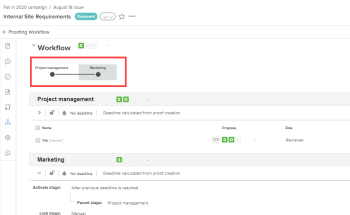

# Creare o modificare un flusso di lavoro automatico per una bozza esistente

I flussi di lavoro automatizzati semplificano la gestione del processo di revisione se il processo è complesso o se invii regolarmente contenuti per la revisione agli stessi gruppi di persone. Quando crei una bozza con un flusso di lavoro automatizzato, questa si sposta da una fase all’altra fino all’approvazione finale. I partecipanti vengono informati quando è il loro turno di rivedere il documento.

Per informazioni sulla creazione di un flusso di lavoro automatico per una nuova bozza, vedere [Creare una bozza avanzata con un flusso di lavoro automatico](../../../review-and-approve-work/proofing/creating-proofs-within-workfront/create-automated-proof-workflow.md).

## Requisiti di accesso

+++ Espandi per visualizzare i requisiti di accesso per la funzionalità in questo articolo.

<table style="table-layout:auto"> 
 <col> 
 <col> 
 <tbody> 
  <tr> 
   <td role="rowheader">Pacchetto Adobe Workfront</td> 
   <td> 
Qualsiasi
</td> 
  </tr> 
  <tr> 
   <td role="rowheader">Licenza Adobe Workfront</td> 
   <td>
   
Standard

   
Lavoro o piano

   </td> 
  </tr> 
  <tr> 
   <td role="rowheader">Profilo autorizzazione bozza </td> 
   <td>Manager o superiore</td> 
  </tr> 
  <tr> 
   <td role="rowheader">Configurazioni del livello di accesso</td> 
   <td> 
Modifica accesso ai documenti
</td> 
  </tr> 
 </tbody> 
</table>

Per informazioni, consulta [Requisiti di accesso nella documentazione di Workfront](/help/quicksilver/administration-and-setup/add-users/access-levels-and-object-permissions/access-level-requirements-in-documentation.md).

+++

## Crea o modifica un flusso di lavoro automatico per una bozza esistente:

1. Passa il puntatore del mouse sul documento nell’area Documenti, quindi fai clic su Flusso di lavoro bozza.

   Oppure

   Se stai esaminando la bozza nel visualizzatore di bozze, fai clic su **Flusso di lavoro**  nel pannello a sinistra, quindi fai clic sull&#39;icona Modifica  per aprire le impostazioni del flusso di lavoro automatico per la bozza.

1. (Condizionale) Se la bozza utilizza attualmente un flusso di lavoro di base (senza fasi), fare clic su **Converti in flusso di lavoro automatico** nella schermata visualizzata.

   >[!NOTE]
   >
   >Non è possibile modificare la prima fase quando si passa da un flusso di lavoro di base a un flusso di lavoro automatico, ma è possibile aggiungere e configurare nuove fasi.

1. Condizionale) Per utilizzare un modello di flusso di lavoro automatico creato e condiviso con te dall&#39;amministratore di Adobe Workfront, fai clic su **Aggiungi modello**, seleziona il modello nella casella visualizzata, quindi fai clic su **Aggiungi modello**.

   Per ulteriori informazioni, vedere [Informazioni sull&#39;utilizzo dei modelli di flussi di lavoro automatizzati](#about-using-automated-workflow-templates) in questo articolo.

1. Aggiungi una fase al flusso di lavoro automatizzato:

   1. Fai clic su **Nuova fase** nell&#39;angolo superiore destro.
   1. Nella casella visualizzata digitare un **Nome** per l&#39;area di visualizzazione.
   1. (Facoltativo) Imposta una scadenza per la fase.
   1. Nella sezione **Attiva fase**, scegliere la modalità di attivazione della fase:

      <table>
      <tbody>
      <tr>
      <td><strong>Alla creazione della bozza</strong></td>
      <td>La fase diventa attiva automaticamente perché la bozza è già stata creata.</td>
      </tr>
      <tr>
      <td><strong>Quando la scadenza della fase precedente viene superata</strong></td>
      <td>Fare clic sulla fase precedente nell'elenco a discesa <strong>Fase padre</strong>.</td>
      </tr>
      <tr>
      <td><strong>In una data e un’ora specifiche</strong></td>
      <td>Fai clic sulla casella <strong>Il</strong> per selezionare la data, quindi fai clic sulla casella a destra per selezionare l'ora.</td>
      </tr>
      <tr>
      <td><strong>Tutte le decisioni vengono approvate o approvate con modifiche nella fase padre</strong></td>
      <td>Fare clic sulla fase padre nell'elenco a discesa <strong>Fase padre</strong>.</td>
      </tr>
      <tr>
      <td><strong>Tutte le decisioni vengono approvate nella fase padre</strong></td>
      <td>Fare clic sulla fase padre nell'elenco a discesa <strong>Fase padre</strong>.</td>
      </tr>
      <tr>
      <td><strong>Tutte le decisioni vengono prese</strong></td>
      <td>Fare clic sulla fase padre nell'elenco a discesa <strong>Fase padre</strong>.</td>
      </tr>
      </tbody>
      </table>

   1. Immettere un nome di contatto o un indirizzo e-mail e configurare le impostazioni per i revisori per la fase.

      Per informazioni sull&#39;aggiunta di revisori, vedere [Informazioni sull&#39;aggiunta di revisori a una fase](#about-adding-reviewers-to-a-stage) in questo articolo.

   1. Per configurare ulteriormente la fase, utilizzate una delle seguenti opzioni:

      <table style="table-layout:auto">
       <col>
       <col>
       <tbody>
        <tr>
         <td role="rowheader"><strong>Opzioni di scadenza</strong> </td>
         <td>
Per impostare una scadenza per la fase, fare clic su un'opzione nell'elenco a discesa <strong>Opzioni scadenza</strong>. Quindi, in <strong>Scadenza</strong>, eseguire una delle operazioni seguenti:

          <ul>
           <li>Se si sceglie <strong>Imposta data specifica</strong>: selezionare la data e l'ora di scadenza desiderate.</li>
           <li>Se si sceglie <strong>Calcola dalla data di attivazione della fase</strong>: selezionare il numero di giorni lavorativi che si desidera aggiungere alla data di attivazione della fase per determinare la scadenza.</li>
          </ul></td>
        </tr>
        <tr>
         <td role="rowheader">Fase di blocco</td>
         <td>Specificare quando è possibile bloccare lo stage. </td>
        </tr>
        <tr>
         <td role="rowheader">Principale responsabile delle decisioni</td>
         <td>
Selezionare il decisore principale sullo stadio (disponibile solo dopo aver aggiunto almeno una persona allo stadio con il ruolo di Approvatore di bozza o superiore). Se si seleziona un decisore principale, l'opzione <strong>È richiesta una sola decisione</strong> è disabilitata in questa fase.
</td>
        </tr>
        <tr>
         <td role="rowheader">È richiesta una sola decisione</td>
         <td>Termina l’intero processo di revisione quando uno dei responsabili decisionali prende una decisione.
Questa opzione non è disponibile se è stato designato un utente nel menu a discesa <strong>Principale responsabile delle decisioni</strong>.
</td>
        </tr>
        <tr>
         <td role="rowheader">Fase privata</td>
         <td>Consente solo alle persone seguenti di visualizzare i commenti e le decisioni prese durante questa fase: Supervisori, amministratori di Adobe Workfront e amministratori di Workfront Proof</td>
        </tr>
        <tr>
         <td role="rowheader">Notifica agli utenti via e-mail</td>
         <td>Avvisa i revisori con una notifica e-mail quando è il momento di lavorare sulla bozza.</td>
        </tr>
       </tbody>
      </table>

   1. Fare clic su **Aggiungi fase**.

1. Ripetere il passaggio precedente in base alle esigenze per aggiungere altre fasi.

   Quando aggiungi fasi al flusso di lavoro automatico, sullo schermo viene visualizzato un diagramma che le rappresenta:

   

1. Dopo aver aggiunto le fasi, fare clic su **Fine**.

## Informazioni sull’utilizzo dei modelli di flussi di lavoro automatizzati {#about-using-automated-workflow-templates}

Quando si utilizza un modello di flusso di lavoro automatizzato, tenere presente quanto segue:

1. Le impostazioni di un modello di flusso di lavoro automatico determinano le operazioni che è possibile eseguire con il flusso di lavoro automatico per una bozza. Ad esempio, se il pulsante Aggiungi un’area di visualizzazione è disabilitato nel modello, non sarà visibile durante l’utilizzo delle impostazioni del flusso di lavoro automatico per la bozza.
1. Quando una persona viene aggiunta a un’area di un modello di flusso di lavoro automatico, ma è anche già presente come revisore sulla bozza, l’applicazione del modello rimuove il revisore dall’area di visualizzazione. Se non si aggiunge un altro revisore all&#39;area di visualizzazione, verrà visualizzato un messaggio che richiede di aggiungerne uno.
1. La possibilità di modificare un modello di flusso di lavoro automatico dipende dalle impostazioni del modello configurate dall&#39;amministratore di Workfront, come descritto in . Se la possibilità di modificare il modello è disabilitata, solo il proprietario del modello può modificarlo.

## Informazioni sull’aggiunta di revisori a una fase {#about-adding-reviewers-to-a-stage}

Quando si aggiungono revisori a una fase, tenere presente quanto segue:

* Dopo aver aggiunto un utente a una fase, puoi configurare le impostazioni per tale utente nella bozza, ad esempio il ruolo della bozza ed eventuali autorizzazioni aggiuntive da assegnare e il tipo di avvisi e-mail che riceverà quando gli utenti adottano commenti e decisioni sulla bozza.
* Puoi trascinare uno o più utenti da una fase all’altra. Puoi trascinare gli utenti direttamente in un&#39;altra fase, oppure puoi trascinare gli utenti in una fase del diagramma **Fasi**. Per selezionare più utenti, premere MAIUSC+Ctrl (su Windows) o MAIUSC+Comando (su Mac).
* È possibile aggiungere un revisore a una bozza una sola volta, il che significa che non è possibile aggiungere la stessa persona a più fasi della bozza.
* I revisori che non vengono aggiunti a una fase privata non possono vedere tale fase sulla bozza o sui commenti fatti in quella fase.
* Per impostazione predefinita, l’aggiunta di un utente a una fase consente a tale utente di accedere alla visualizzazione della bozza dal momento in cui viene creata.

  L’amministratore di Workfront può impedire agli utenti di accedere alla bozza fino a quando il flusso di lavoro non entra nella fase in cui l’utente è stato aggiunto. Per ulteriori informazioni, consulta  in .
