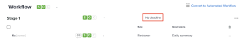

# Impostare una scadenza per una bozza di base esistente

Puoi impostare una singola scadenza per una bozza di base dopo la sua creazione.

## Requisiti di accesso

+++ Espandi per visualizzare i requisiti di accesso per la funzionalità descritta in questo articolo.

<table style="table-layout:auto"> 
 <col> 
 <col> 
 <tbody> 
  <tr> 
   <td role="rowheader">Pacchetto Adobe Workfront</td> 
   <td> 
Qualsiasi
 </td> 
  </tr> 
  <tr> 
   <td role="rowheader">Licenza di Adobe Workfront</td> 
   <td> 
   
Standard

   
Lavoro o piano

    </td> 
  </tr> 
  <tr> 
   <td role="rowheader">Profilo autorizzazione bozza </td> 
   <td>Manager o superiore</td> 
  </tr> 
  <tr> 
   <td role="rowheader">Ruolo bozza</td> 
   <td>Autore o Manager</td> 
  </tr> 
  <tr> 
   <td role="rowheader">Configurazioni del livello di accesso</td> 
   <td> 
Accesso in modifica ai documenti
</td> 
  </tr> 
 </tbody> 
</table>

Per informazioni, consulta [Requisiti di accesso nella documentazione di Workfront](/help/quicksilver/administration-and-setup/add-users/access-levels-and-object-permissions/access-level-requirements-in-documentation.md).

+++

## Impostare una scadenza per una bozza di base esistente

1. Vai al progetto, all&#39;attività o al problema che contiene il documento, quindi seleziona **Documenti**.
1. Trova la bozza necessaria.
1. Fare clic su **Flusso di lavoro di verifica**.
1. Nell&#39;area **Flusso di lavoro**, selezionare **Nessuna scadenza**.

   

1. Scegli una data e specifica un’ora, quindi fai clic in un punto qualsiasi dello schermo.
1. Scegli se desideri avvisare i revisori della nuova scadenza.
