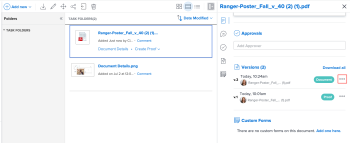

# Scaricare le versioni della bozza

È possibile scaricare una singola versione o tutte le versioni di una bozza.

## Requisiti di accesso

+++ Espandi per visualizzare i requisiti di accesso per la funzionalità descritta in questo articolo.

<table style="table-layout:auto"> 
 <col> 
 <col> 
 <tbody> 
  <tr> 
   <td role="rowheader">Pacchetto Adobe Workfront</td> 
   <td> 
Qualsiasi
 </td> 
  </tr> 
  <tr> 
   <td role="rowheader">Licenza di Adobe Workfront</td> 
   <td> 
   
Standard

   
Lavoro o piano

   </td> 
  </tr> 
  <tr> 
   <td role="rowheader">Profilo autorizzazione bozza </td> 
   <td>Manager o superiore</td> 
  </tr> 
  <tr> 
   <td role="rowheader">Configurazioni del livello di accesso</td> 
   <td> 
Accesso in modifica ai documenti
 </td> 
  </tr> 
 </tbody> 
</table>

Per informazioni, consulta [Requisiti di accesso nella documentazione di Workfront](/help/quicksilver/administration-and-setup/add-users/access-levels-and-object-permissions/access-level-requirements-in-documentation.md).

+++

## Scarica una singola versione di bozza

1. Nell&#39;elenco del documento, fare clic sulla bozza.
1. Nel Riepilogo, in **Versioni**, fai clic su  nel menu Altro a destra della versione, quindi fai clic su **Scarica** nell&#39;elenco a discesa visualizzato.

   

## Scaricare tutte le versioni di una bozza

1. Nell&#39;elenco del documento, fare clic sulla bozza.
1. Fai clic su **Dettagli documento**, quindi seleziona **Tutte le versioni** nel pannello a sinistra.

1. Fai clic su **Scarica tutto** in alto nell&#39;elenco.
