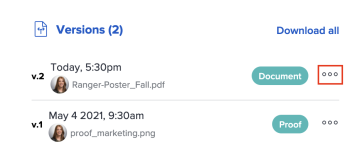

# Visualizzare le versioni della bozza

Puoi visualizzare le versioni precedenti di una bozza.

## Requisiti di accesso

+++ Espandi per visualizzare i requisiti di accesso per la funzionalità descritta in questo articolo.

<table style="table-layout:auto"> 
 <col> 
 <col> 
 <tbody> 
  <tr> 
   <td role="rowheader">Pacchetto Adobe Workfront</td> 
   <td> 
Qualsiasi
 </td> 
  </tr> 
  <tr> 
   <td role="rowheader">Licenza di Adobe Workfront</td> 
   <td> 
   
Standard

   
Lavoro o piano

   </td> 
  </tr> 
  <tr> 
   <td role="rowheader">Profilo autorizzazione bozza </td> 
   <td>Manager o superiore</td> 
  </tr> 
  <tr> 
   <td role="rowheader">Configurazioni del livello di accesso</td> 
   <td> 
Accesso in modifica ai documenti
 </td> 
  </tr> 
 </tbody> 
</table>

Per informazioni, consulta [Requisiti di accesso nella documentazione di Workfront](/help/quicksilver/administration-and-setup/add-users/access-levels-and-object-permissions/access-level-requirements-in-documentation.md).

+++

## Visualizza un elenco di tutte le versioni di una bozza

1. Selezionare la bozza dall&#39;elenco Documento.
1. Nel Riepilogo scorrere fino alla sezione **Tutte le versioni**. Qui puoi visualizzare tutte le versioni della bozza.

   

## Visualizzare in anteprima una versione di bozza precedente

I file che non possono essere visualizzati in anteprima (come XLSX e DOC) vengono scaricati.

1. Selezionare una bozza nell&#39;elenco dei documenti.
1. Nel Riepilogo, scorri verso il basso fino a **Versioni**, fai clic sul menu **Altro**, quindi seleziona **Anteprima**.

   

## Visualizza una versione di bozza precedente

Qualsiasi utente di Workfront con accesso di visualizzazione al documento può visualizzare le versioni precedenti di un documento sottoposto a bozza. Non è necessario che l’utente disponga di una licenza di verifica.

1. Vai al progetto, all&#39;attività o al problema che contiene il documento, quindi seleziona **Documenti**.
1. Trova la bozza necessaria.
1. Nel riepilogo, scorri verso il basso fino a **Versioni**, fai clic sul menu **Altro**, quindi seleziona **Apri bozza**.

   
