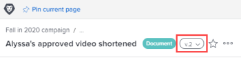

# Visualizzare e gestire i dettagli della versione di prova

Puoi visualizzare e gestire i dettagli della bozza.

## Requisiti di accesso

Per eseguire i passaggi descritti in questo articolo, è necessario disporre dei seguenti diritti di accesso:

<table style="table-layout:auto"> 
 <col> 
 <col> 
 <tbody> 
  <tr> 
   <td role="rowheader">piano Adobe Workfront*</td> 
   <td> 
Piano attuale: Pro o superiore
 
oppure
 
Piano legacy: Seleziona o Premium
 
Per ulteriori informazioni sulla verifica dell’accesso con i diversi piani, consulta <a href="/help/quicksilver/administration-and-setup/manage-workfront/configure-proofing/access-to-proofing-functionality.md" class="MCXref xref">Accesso alle funzionalità di correzione in Workfront</a>.
 </td> 
  </tr> 
  <tr> 
   <td role="rowheader">Licenza Adobe Workfront*</td> 
   <td> 
Piano attuale: Lavoro o piano
 
Piano legacy: Qualsiasi (è necessario che la correzione sia attivata per l’utente)
 </td> 
  </tr> 
  <tr> 
   <td role="rowheader">Profilo autorizzazione bozza </td> 
   <td>Manager o superiore</td> 
  </tr> 
  <tr> 
   <td role="rowheader">Configurazioni a livello di accesso*</td> 
   <td> 
Modifica accesso ai documenti
 
Per informazioni sulla richiesta di accesso aggiuntivo, vedi <a href="../../../../workfront-basics/grant-and-request-access-to-objects/request-access.md" class="MCXref xref">Richiedere l’accesso agli oggetti </a>.
 </td> 
  </tr> 
 </tbody> 
</table>

&#42;Per informazioni sul piano, il ruolo o il profilo delle autorizzazioni di prova, contattare l&#39;amministratore Workfront o Workfront Proof.

## Visualizzare e gestire i dettagli di una versione di prova precedente

1. Nell’elenco dei documenti, passa il cursore del mouse sulla riga contenente la bozza, quindi fai clic su **Dettagli documento**.
1. Nella parte superiore della pagina Dettagli documento fare clic sul menu a discesa accanto al nome, quindi fare clic sul nome della versione che si desidera visualizzare e gestire.

   

   Oltre a visualizzare i dettagli della versione, puoi apportare modifiche alla versione, ad esempio nome, metadati e impostazioni di correzione (se è una bozza del documento).

## Visualizzare i dettagli di correzione per una versione precedente

Gli utenti devono disporre di una licenza di correzione per visualizzare i dettagli della prova di una versione precedente di un documento protetto.

1. Passa al progetto, all&#39;attività o al problema che contiene il documento, quindi seleziona **Documenti**.
1. Trova la prova di cui hai bisogno.
1. In **Versione** nell&#39;area Riepilogo, fai clic sulla versione, quindi fai clic su **Dettagli** nell’elenco a discesa visualizzato.

1. Nella pagina Dettagli documento fare clic su **Flusso di lavoro di correzione** nel pannello a sinistra per effettuare una delle seguenti operazioni:

   * Aggiungi un flusso di lavoro automatizzato. Per ulteriori informazioni, consulta la sezione nell’articolo .
   * Condividi l’URL pubblico della bozza. Per ulteriori informazioni, consulta [Condivisione di un collegamento a una bozza](../../../../review-and-approve-work/proofing/managing-proofs-within-workfront/share-a-proof-in-workfront.md#share) in [Condividere una bozza in Adobe Workfront](../../../../review-and-approve-work/proofing/managing-proofs-within-workfront/share-a-proof-in-workfront.md).
   * Visualizza tutte le attività che si sono verificate sulla bozza.
   * Invia messaggi di promemoria ai revisori sulla bozza.

1. Fai clic su **Fine**.
