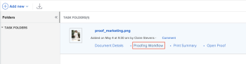
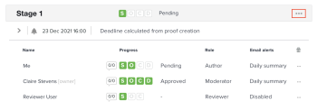

# Inviare messaggi e-mail ai revisori su una bozza

Durante il processo di revisione e approvazione, puoi inviare un messaggio a uno o a tutti i revisori su una bozza. I messaggi sono un modo semplice per ricordare ai revisori di completare la revisione di una bozza o di fornire altre informazioni relative alla bozza.

Puoi scegliere se inviare un messaggio e-mail di promemoria generico o un messaggio personalizzato a uno o tutti gli utenti associati a una determinata fase.

## Requisiti di accesso

Per eseguire i passaggi descritti in questo articolo, è necessario disporre dei seguenti diritti di accesso:

<table style="table-layout:auto"> 
 <col> 
 <col> 
 <tbody> 
  <tr> 
   <td role="rowheader">piano Adobe Workfront*</td> 
   <td> 
Piano attuale: Pro o superiore
 
oppure
 
Piano legacy: Seleziona o Premium
 
Per ulteriori informazioni sulla verifica dell’accesso con i diversi piani, consulta <a href="/help/quicksilver/administration-and-setup/manage-workfront/configure-proofing/access-to-proofing-functionality.md" class="MCXref xref">Accesso alle funzionalità di correzione in Workfront</a>.
 </td> 
  </tr> 
  <tr> 
   <td role="rowheader">Licenza Adobe Workfront*</td> 
   <td> 
Piano attuale: Lavoro o piano
 
Piano legacy: Qualsiasi (è necessario che la correzione sia attivata per l’utente)
 </td> 
  </tr> 
  <tr> 
   <td role="rowheader">Profilo autorizzazione bozza </td> 
   <td>Manager o superiore</td> 
  </tr> 
  <tr> 
   <td role="rowheader">Ruolo di prova</td> 
   <td>Autore o moderatore</td> 
  </tr> 
  <tr> 
   <td role="rowheader">Configurazioni a livello di accesso*</td> 
   <td> 
Modifica accesso ai documenti
 
Nota: Se non disponi ancora dell’accesso, chiedi all’amministratore Workfront se ha impostato ulteriori restrizioni nel livello di accesso. Per informazioni su come un amministratore Workfront può modificare il livello di accesso, consulta <a href="../../../administration-and-setup/add-users/configure-and-grant-access/create-modify-access-levels.md" class="MCXref xref">Creare o modificare livelli di accesso personalizzati</a>.
 </td> 
  </tr> 
 </tbody> 
</table>

&#42;Per informazioni sul piano, il ruolo o il profilo delle autorizzazioni di prova, contattare l&#39;amministratore Workfront o Workfront Proof.

## Inviare messaggi e-mail agli utenti su una bozza

1. Trova il documento per la bozza contenente gli utenti che desideri inviare un messaggio.
1. Passa il puntatore del mouse sul documento, quindi fai clic su **Flusso di lavoro di correzione**.

   

1. Per inviare un messaggio a tutti gli utenti dell’area di visualizzazione, fai clic sul pulsante **Altro** sul palco e scegli **Messaggio tutto**.

   

1. Per inviare un messaggio a un singolo utente, fai clic sul pulsante **Altro** accanto all&#39;utente e scegli **Messaggio**.

   

1. In **Dettagli del messaggio** specificare le seguenti informazioni:

   <table style="table-layout:auto"> 
    <col> 
    <col> 
    <tbody> 
     <tr> 
      <td role="rowheader">Informa le persone tramite e-mail</td> 
      <td>Questa opzione non può essere deselezionata. Tutti gli utenti ricevono il messaggio via e-mail.</td> 
     </tr> 
     <tr> 
      <td role="rowheader">Elimina messaggio personalizzato</td> 
      <td> 
Fai clic su <strong>Elimina messaggio personalizzato</strong> se desideri includere solo il contenuto e-mail predefinito.
 
L’e-mail di promemoria predefinita include le seguenti informazioni:
 
       <ul> 
        <li>Collegamento personale alla bozza Miniatura dell'immagine di prova </li> 
        <li>I seguenti dettagli della prova: Nome della bozza, numero di versione, nome della cartella (se applicabile), elenco dei revisori e relativo avanzamento sulla bozza.</li> 
       </ul> </td> 
     </tr> 
     <tr> 
      <td role="rowheader">Oggetto</td> 
      <td>Digita un oggetto del messaggio.</td> 
     </tr> 
     <tr> 
      <td role="rowheader">Messaggio</td> 
      <td>Digita il contenuto del messaggio.</td> 
     </tr> 
    </tbody> 
   </table>

1. Fai clic su **Invia.**
