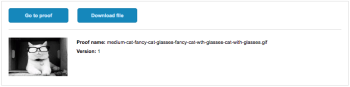

# Condividere una bozza in Adobe Workfront

È possibile condividere un documento revisionato in Adobe Workfront condividendo il documento o aggiungendo utenti alla bozza.

Se condividi la bozza, come spiegato in questo articolo, il destinatario ha lo stesso accesso al documento e alla bozza. Inoltre, puoi richiedere l’approvazione per la bozza al destinatario.

>[!TIP]
>
>Puoi anche condividere una bozza dal visualizzatore di bozze. Per istruzioni, consulta [Condividere una bozza dal visualizzatore di bozze](../../../review-and-approve-work/proofing/reviewing-proofs-within-workfront/review-a-proof/share-a-proof-in-proofing-viewer.md).

## Requisiti di accesso

Per eseguire i passaggi descritti in questo articolo, è necessario disporre dei seguenti diritti di accesso:

<table style="table-layout:auto"> 
 <col> 
 <col> 
 <tbody> 
  <tr> 
   <td role="rowheader">Piano Adobe Workfront*</td> 
   <td> 
Piano corrente: Pro o superiore
 
oppure
 
Piano legacy: Seleziona o Premium
 
Per ulteriori informazioni sulla verifica dell'accesso con i diversi piani, vedere <a href="/help/quicksilver/administration-and-setup/manage-workfront/configure-proofing/access-to-proofing-functionality.md" class="MCXref xref">Accesso alla funzionalità di verifica in Workfront</a>.
 </td> 
  </tr> 
  <tr> 
   <td role="rowheader">Licenza Adobe Workfront*</td> 
   <td> 
Piano corrente: Lavoro o Piano
 
Piano legacy: qualsiasi (per l’utente deve essere abilitata la verifica)
 </td> 
  </tr> 
  <tr> 
   <td role="rowheader">Profilo autorizzazione bozza </td> 
   <td>Manager o superiore</td> 
  </tr> 
  <tr> 
   <td role="rowheader">Ruolo bozza</td> 
   <td>Autore o moderatore</td> 
  </tr> 
  <tr> 
   <td role="rowheader">Configurazioni del livello di accesso*</td> 
   <td> 
Modifica accesso ai documenti
 
Per informazioni sulla richiesta di accesso aggiuntivo, consulta <a href="../../../workfront-basics/grant-and-request-access-to-objects/request-access.md" class="MCXref xref">Richiedi accesso agli oggetti </a>.
 </td> 
  </tr> 
 </tbody> 
</table>

&#42;Per conoscere il piano, la mansione o il profilo di autorizzazione della bozza disponibile, contattare l&#39;amministratore Workfront o Workfront Proof.

## Condividere un collegamento alla bozza

La condivisione di un collegamento di bozza consente agli utenti di Workfront di accedere alla visualizzazione. Gli utenti possono aggiungere un commento alla bozza e iscriversi alle notifiche e-mail per la bozza utilizzando le credenziali di accesso di Workfront. Gli utenti che non dispongono di strumenti di correzione possono aggiungere commenti e iscriversi utilizzando un indirizzo e-mail e un nome visualizzato.

>[!IMPORTANT]
>
>È necessario abilitare l’impostazione Consenti condivisione bozze tramite URL pubblico o codice di incorporamento.

1. Seleziona il documento contenente la bozza da condividere con gli utenti.

   È possibile selezionare un solo documento. Non è possibile condividere il collegamento per più documenti contemporaneamente.

1. Clic **Condividi** > **Collegamento bozza**.
1. In **Collegamento bozza** che viene visualizzata, effettuare una delle seguenti operazioni:

   * Per copiare il collegamento negli Appunti, fare clic su **Copia collegamento**.

     Ora puoi distribuire il collegamento tramite uno strumento di terze parti, ad esempio una chat o un’applicazione e-mail.

   * Per inviare il collegamento tramite e-mail direttamente da Adobe Workfront, effettua le seguenti operazioni:

      1. In **Oppure il collegamento e-mail a** , inizia a digitare e seleziona il nome del destinatario. In alternativa, specifica l’indirizzo e-mail di un utente esterno con cui desideri condividere il messaggio.

         >[!NOTE]
         >
         >Se durante la condivisione di una bozza viene visualizzato un messaggio e-mail di alias, non creare un nuovo utente ospite immettendo l&#39;e-mail originale se esiste un messaggio e-mail di alias corrispondente.

      1. Selezionare una delle opzioni seguenti:

         <table style="table-layout:auto">
          <col>
          <col>
          <tbody>
           <tr>
            <td role="rowheader">Invia collegamento pubblico</td>
            <td>
Include un pulsante nella notifica e-mail che indirizza gli utenti alla bozza nel visualizzatore di bozze in uso e concede l’accesso in visualizzazione.

Se <strong>Iscriviti alla bozza tramite URL pubblico o codice di incorporamento</strong> è disattivato per la bozza, gli utenti possono accedere con le credenziali di accesso di Workfront per aggiungere commenti alla bozza. Se è attivata, chiunque fornisca il proprio indirizzo e-mail e nome (non è richiesta alcuna password) può firmare e aggiungere commenti alla bozza.
</td>
           </tr>
           <tr>
            <td role="rowheader">Invia collegamento per il download</td>
            <td>Include un pulsante nella notifica e-mail che indirizza gli utenti a una pagina di download, in cui sono riportati i dettagli, il nome e la dimensione del file, con il file visualizzato in linea. Per scaricare il file, gli utenti possono fare clic sul collegamento Scarica dalla pagina di download.</td>
           </tr>
           <tr>
            <td role="rowheader">Aggiungi messaggio personalizzato</td>
            <td>Consente di specificare un oggetto e un corpo personalizzati per la notifica e-mail.</td>
           </tr>
          </tbody>
         </table>

      1. Clic **Invia**.

         I destinatari ricevono una notifica e-mail contenente informazioni sulla bozza e sui pulsanti che hai scelto di includere.

         

## Aggiungere utenti a una bozza

Se disponi dei diritti di modifica per la bozza, puoi aggiungere qualsiasi utente di Workfront alla bozza. Se la bozza ha più fasi, aggiungi l’utente a una singola fase

>[!WARNING]
>
>Oltre ai metodi elencati in questo articolo, è possibile aggiungere utenti a una bozza assegnandogli un tag in un commento dalla scheda Aggiornamenti di una bozza esistente. Tuttavia, gli utenti aggiunti a una bozza in questo modo non riceveranno una notifica e-mail a meno che non vengano taggati nuovamente dopo essere stati aggiunti al flusso di lavoro della bozza.
>
>Pertanto, si consiglia di aggiungere gli utenti a una bozza tramite uno dei metodi elencati di seguito e non tramite l’assegnazione di tag in un commento.
>

>[!NOTE]
>
>Se si utilizza un piano Workfront legacy in cui è possibile abilitare e disabilitare la verifica per un utente, tenere presente quanto segue:
>
>* Non è necessario che i destinatari abbiano gli strumenti di correzione abilitati per rivedere la bozza.
>* Quando il flusso di lavoro automatizzato è abilitato e si aggiunge un utente alla bozza per il quale non sono abilitati gli strumenti di correzione in Workfront, viene creata una nuova fase all’interno del flusso di lavoro automatico. L’utente che stai aggiungendo viene aggiunto automaticamente a questa nuova fase quando visualizza la bozza per la prima volta. (Per ulteriori informazioni, consulta [Panoramica del flusso di lavoro automatizzato](../../../review-and-approve-work/proofing/proofing-overview/automated-workflow.md).)
>

### Aggiungere utenti a una bozza esistente dalla scheda Documenti

1. Selezionare il documento contenente la bozza a cui si desidera aggiungere gli utenti.
1. Se la bozza non dispone di un flusso di lavoro automatizzato (fasi), fai clic sul pulsante **Altro** nell&#39;angolo superiore destro della sezione Stage 1, quindi fare clic su **Condividi** nel menu a discesa.

   Oppure

   Se la bozza dispone di un flusso di lavoro automatizzato, fai clic sul pulsante **Altro** nell’angolo superiore destro dello stage in cui desideri aggiungere il revisore, quindi fai clic su **Condividi** nel menu a discesa.

1. In **Condividi questa versione** casella visualizzata, sotto **Condividi**, inizia a digitare il nome o l’indirizzo e-mail di un utente con cui desideri condividere la bozza, quindi fai clic sul nome quando viene visualizzato nell’elenco a discesa.

1. (Facoltativo) Ripeti questo passaggio per aggiungere più utenti alla bozza.
1. (Facoltativo) Imposta una scadenza per i revisori.
1. (Facoltativo) Assicurati che **Notifica agli utenti via e-mail** è selezionato se desideri informare i revisori che li hai aggiunti alla bozza.
1. (Facoltativo) **Aggiungi un messaggio personalizzato** all’e-mail.
1. Dopo aver aggiunto tutti i revisori, fai clic su **Condividi**.

### Aggiungere utenti a una bozza esistente dal visualizzatore di bozze

È possibile aggiungere utenti a una bozza durante la revisione di una bozza in Web Proofing Viewer (Visualizzatore di bozze web) e in Desktop Proofing Viewer (Visualizzatore di bozze desktop).

Per ulteriori informazioni, consulta [Condividere una bozza aggiungendovi utenti](../../../review-and-approve-work/proofing/reviewing-proofs-within-workfront/review-a-proof/share-a-proof-in-proofing-viewer.md#sharing-with-individual-users) nell’articolo [Condividere una bozza dal visualizzatore di bozze](../../../review-and-approve-work/proofing/reviewing-proofs-within-workfront/review-a-proof/share-a-proof-in-proofing-viewer.md)

## Rapporto sulle approvazioni di bozze

È possibile creare un report sulle approvazioni di verifica condivise in Workfront. Questo rapporto fornisce le seguenti informazioni sull’approvazione della bozza nel sistema:

* Documento inviato per l&#39;approvazione
* Nome dell&#39;approvatore
* Versione bozza
* ID bozza
* Data di creazione bozza

Puoi accedere a questa approvazione durante la creazione di un rapporto basato su un oggetto, come descritto in [Creare un rapporto personalizzato](../../../reports-and-dashboards/reports/creating-and-managing-reports/create-custom-report.md).

Per ulteriori informazioni sul report di oggetti Proof Approvals, vedere [Report sugli oggetti](../../../workfront-basics/navigate-workfront/workfront-navigation/understand-objects.md#reporting-on-objects) sezione in [Comprendere gli oggetti in Adobe Workfront](../../../workfront-basics/navigate-workfront/workfront-navigation/understand-objects.md)

## Approvare una bozza condivisa

Quando un utente ti aggiunge a una bozza e concede il ruolo Approvatore o il ruolo Revisore e Approvatore tramite Flusso di lavoro automatico, la richiesta di approvazione viene visualizzata nella scheda Approvazioni nella Home o nell’area Il mio lavoro. Puoi quindi visualizzare la bozza e prendere una decisione di approvazione sulla bozza direttamente da Workfront.

Per informazioni su come prendere decisioni di approvazione dall&#39;area Il mio lavoro, vedi [Approva lavoro dalla sezione Home](../../../review-and-approve-work/manage-approvals/approving-work.md#approving-work-from-the-home-area) o [Approvazione del lavoro](../../../review-and-approve-work/manage-approvals/approving-work.md#approving-work-from-the-my-work-area) in [Approvazione del lavoro](../../../review-and-approve-work/manage-approvals/approving-work.md).
