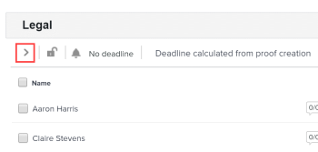

# Visualizzare le fasi del flusso di lavoro automatizzato su una bozza

Puoi monitorare facilmente l’avanzamento di una bozza configurata con un flusso di lavoro automatizzato. Puoi visualizzare, modificare, aggiungere, avviare e bloccare il lavoro già svolto sugli stadi della bozza.

Per informazioni sull&#39;aggiunta di fasi e utenti a una bozza con un flusso di lavoro automatico, vedere [Aggiungere fasi e utenti a un flusso di lavoro automatico in una bozza](../../../review-and-approve-work/proofing/managing-proofs-within-workfront/add-stages-users-to-automated-workflow-proof.md).

## Requisiti di accesso

+++ Espandi per visualizzare i requisiti di accesso per la funzionalità in questo articolo.

Per eseguire i passaggi descritti in questo articolo, è necessario disporre dei seguenti diritti di accesso:

<table style="table-layout:auto"> 
 <col> 
 <col> 
 <tbody> 
  <tr> 
   <td role="rowheader">Piano Adobe Workfront*</td> 
   <td> 
Piano corrente: Pro o superiore
 
oppure
 
Piano legacy: Seleziona o Premium
 
Per ulteriori informazioni sulla verifica dell'accesso con i diversi piani, vedere <a href="/help/quicksilver/administration-and-setup/manage-workfront/configure-proofing/access-to-proofing-functionality.md" class="MCXref xref">Accesso alla funzionalità di verifica in Workfront</a>.
 </td> 
  </tr> 
  <tr> 
   <td role="rowheader">Licenza Adobe Workfront*</td> 
   <td> 
Piano corrente: Lavoro o Piano
 
Piano legacy: qualsiasi (per l’utente deve essere abilitata la verifica)
 </td> 
  </tr> 
  <tr> 
   <td role="rowheader">Profilo autorizzazione bozza </td> 
   <td>Manager o superiore</td> 
  </tr> 
  <tr> 
   <td role="rowheader">Configurazioni del livello di accesso*</td> 
   <td> 
Modifica accesso ai documenti
 
Per informazioni sulla richiesta di accesso aggiuntivo, vedere <a href="../../../workfront-basics/grant-and-request-access-to-objects/request-access.md" class="MCXref xref">Richiedere l'accesso agli oggetti </a>.
 </td> 
  </tr> 
 </tbody> 
</table>

&#42;Per conoscere il piano, la mansione o il profilo di autorizzazione della bozza di cui si dispone, contattare l&#39;amministratore di Workfront o Workfront Proof.

+++

## Visualizzare il diagramma del flusso di lavoro automatico

1. In un elenco di documenti che contiene il documento, posizionare il puntatore del mouse sulla riga contenente il documento, quindi fare clic su **Flusso di lavoro bozze**.

   Il diagramma del flusso di lavoro automatico viene visualizzato immediatamente sotto il titolo del flusso di lavoro.

   Le fasi del diagramma sono contrassegnate come segue:

    fase attiva

    fase inattiva\
     Fase privata

     Fase bloccata

   Le linee tra le fasi rappresentano le dipendenze tra le fasi. Le linee che conducono agli stadi inattivi vengono tratteggiate fino all&#39;attivazione dello stadio.

   È possibile passare il cursore del mouse su una fase del diagramma per visualizzarne l&#39;avanzamento. Se la fase non è attiva e si dispone dei diritti di modifica sulla fase, è possibile fare clic sul pulsante Attiva fase  per avviare la fase. Se lo stage è attivo e si dispone dei diritti di modifica sullo stage, è possibile bloccarlo.  Per ulteriori informazioni sulla barra di avanzamento (S, O, C, D), vedere  [Visualizzare lo stato e l&#39;avanzamento di una bozza in Workfront Proof](../../../workfront-proof/wp-work-proofsfiles/manage-your-work/view-progress-and-status-of-proof.md).

## Visualizzare una fase

1. In un elenco di documenti che contiene il documento, posizionare il puntatore del mouse sulla riga contenente il documento, quindi fare clic su **Flusso di lavoro bozze**.
1. Nel diagramma fare clic sullo stadio che si desidera visualizzare.

   

1. Per espandere i dettagli di uno stadio, fare clic sulla freccia laterale sotto il nome.

   

## Visualizza tutte le fasi

Per visualizzare tutte le fasi di un flusso di lavoro automatico:

1. Fare clic sul pulsante Cambia visualizzazione nella parte superiore della pagina , quindi fare clic su **Visualizza tutte le fasi**.

   Tutte le fasi del flusso di lavoro automatico sono elencate nella sezione, ma i dettagli sono nascosti.

1. Per espandere i dettagli di un&#39;area di visualizzazione, fare clic sulla freccia laterale sotto il nome.

## Visualizza in dettaglio tutte le fasi

Per visualizzare tutte le fasi del flusso di lavoro automatizzato con i relativi dettagli espansi:

1. Fare clic sul pulsante Cambia visualizzazione nella parte superiore della pagina , quindi fare clic su **Visualizza tutti gli stadi in dettaglio**.
1. Per visualizzare i dettagli di un&#39;area di visualizzazione, fare clic sulla freccia in giù sotto il nome.
