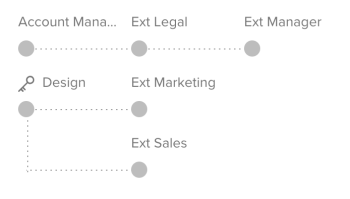

# Panoramica del flusso di lavoro automatizzato

I flussi di lavoro automatizzati consentono di creare una serie di fasi di revisione sequenziali o parallele, stabilire le dipendenze tra queste fasi e limitarne la visibilità a determinati utenti. In presenza di fasi interdipendenti nel processo di revisione, i flussi di lavoro automatizzati spostano automaticamente la bozza attraverso le fasi, notificando i revisori e gli approvatori interessati lungo il percorso. Per informazioni sulla configurazione di un flusso di lavoro automatizzato, consulta [Creare una bozza avanzata con un flusso di lavoro automatizzato](../../../review-and-approve-work/proofing/creating-proofs-within-workfront/create-automated-proof-workflow.md).

**Esempi:**  I flussi di lavoro automatizzati consentono di gestire processi di revisione delle prove complessi come

* Quando gruppi o revisori diversi devono rivedere il contenuto in un ordine particolare
* Quando esistono dipendenze tra le attività degli utenti durante la revisione del contenuto
* Quando il contenuto viene esaminato regolarmente dagli stessi gruppi di persone
* Quando desideri controllare il periodo di tempo in cui i revisori esaminano il contenuto
* Quando desideri mantenere privata un’attività di revisione

## Fasi

Per ogni fase del flusso di lavoro automatizzato, è possibile configurare impostazioni quali una scadenza per lo stadio, un blocco su uno stadio, un set di revisori come responsabili decisionali per lo stadio e un’impostazione della privacy che consente solo ad alcune persone di visualizzare i commenti dei revisori sullo stage.

Gli stadi possono essere attivati manualmente, al momento della creazione della bozza, al raggiungimento di una scadenza, a una data e un&#39;ora specifiche o quando viene presa una decisione sulla fase padre.

Gli stadi possono essere bloccati manualmente, così come quando inizia la fase successiva o quando tutte le decisioni vengono prese sul palco. È inoltre possibile scegliere di non bloccare mai uno stage.

È possibile nominare un responsabile decisionale principale per un palco. La decisione di questa persona rende superflue tutte le altre decisioni per lo stadio.

Allo stesso modo, è possibile scegliere di richiedere solo una decisione per uno stadio. In questo modo, il processo di revisione per l’area di visualizzazione viene contrassegnato come completo dopo che uno dei destinatari ha preso una decisione sull’area di visualizzazione.

È possibile avere tutti i revisori informati del loro invito a rivedere il contenuto all&#39;inizio del processo di revisione, oppure è possibile fare in modo che ogni revisore venga informato solo quando la fase viene attivata.

## Fasi private

Per impostazione predefinita, i commenti lasciati dai revisori in tutte le fasi sono visibili a tutti coloro che stanno rivedendo il contenuto e ricevendo notifiche e-mail e commenti riepiloghi sul processo di revisione.

Se si desidera impedire a determinati gruppi di revisori di visualizzare i commenti di altri revisori, è possibile creare stadi privati.

Le tappe private sono visibili solo ai revisori aggiunti a tali fasi. Sono visibili anche agli utenti che dispongono di diritti di modifica sulla bozza o su tutti gli elementi creati nell’account Adobe Workfront della tua organizzazione (supervisore e versioni successive o utenti con profili personalizzati per i quali è abilitata la modifica delle informazioni di altre persone).

I commenti aggiunti dai partecipanti di un passaggio privato non sono inclusi nelle notifiche e-mail e nei riepiloghi dei commenti di prova richiesti da chiunque non abbia i diritti per visualizzarli.

## Diagramma del flusso di lavoro

Il diagramma di flusso di lavoro è una rappresentazione visiva del processo di revisione della bozza. Durante la creazione o la visualizzazione dei dettagli di una bozza, viene visualizzato l’ordine delle fasi e le dipendenze tra le fasi. Qualsiasi fase privata viene visualizzata con un simbolo di chiave.

Nelle bozze live, le dipendenze degli stage vengono visualizzate con una linea grigia tratteggiata per gli stadi inattivi o una linea nera continua per gli stadi attivi. Le fasi vengono visualizzate in verde se il processo di approvazione è stato completato entro il termine specificato. Le fasi che si avvicinano alle loro scadenze vengono visualizzate in arancione e le fasi successive alla scadenza vengono visualizzate in rosso.

## Modelli di flusso di lavoro automatizzati

Se l’organizzazione utilizza lo stesso processo di revisione per più bozze, l’amministratore Workfront può creare modelli di flusso di lavoro automatizzato per semplificare notevolmente la creazione delle prove. Puoi scegliere un modello di flusso di lavoro automatizzato mentre configuri una bozza per aggiungere alla bozza gli stadi e i revisori di tale modello. Puoi modificare il modello applicato alla bozza in base alle esigenze prima e dopo la creazione della bozza.

L’amministratore di Workfront può creare un numero illimitato di modelli in base alle esigenze della tua azienda.

Per ulteriori informazioni sulla creazione, l’utilizzo e la gestione dei modelli, rivolgiti al tuo amministratore Workfront.
