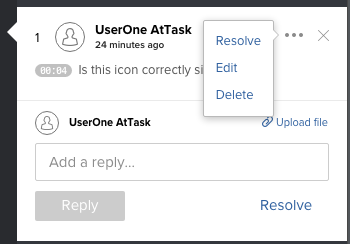

# Eliminare i commenti della bozza

È possibile eliminare un commento o una risposta a un commento se non è già stata ricevuta alcuna risposta. Di solito è meglio risolvere un commento piuttosto che eliminarlo. Per ulteriori informazioni, consulta [Risolvere i commenti sulla bozza](../../../../review-and-approve-work/proofing/reviewing-proofs-within-workfront/comment-on-a-proof/resolve-proof-comments.md).

## Requisiti di accesso

+++ Espandi per visualizzare i requisiti di accesso per la funzionalità descritta in questo articolo.

<table style="table-layout:auto"> 
 <col> 
 <col> 
 <tbody> 
  <tr> 
   <td role="rowheader">Pacchetto Adobe Workfront</td> 
   <td> 
Qualsiasi
 </td> 
  </tr> 
  <tr> 
   <td role="rowheader">Licenza di Adobe Workfront</td> 
   <td> 
   
Chiaro o superiore

   
Revisione o successiva
</td> 
  </tr> 
  <tr> 
   <td role="rowheader">Profilo autorizzazione bozza </td> 
   <td>Supervisore</td> 
  </tr> 
  <tr> 
   <td role="rowheader">Ruolo bozza</td> 
   <td>Moderatore per eliminare qualsiasi commento; revisore per eliminare i propri commenti</td> 
  </tr> 
  <tr> 
   <td role="rowheader">Configurazioni del livello di accesso</td> 
   <td> 
Accesso in modifica ai documenti
</td> 
  </tr> 
 </tbody> 
</table>

Per informazioni, consulta [Requisiti di accesso nella documentazione di Workfront](/help/quicksilver/administration-and-setup/add-users/access-levels-and-object-permissions/access-level-requirements-in-documentation.md).

+++

## Eliminare i commenti della bozza

1. Vai al progetto, all&#39;attività o al problema che contiene il documento, quindi seleziona **Documenti**.
1. Trova la bozza necessaria, quindi fai clic su **Apri bozza**.

1. (Condizionale) Se l&#39;area dei commenti non è aperta, fare clic su **Visualizza commenti** nell&#39;angolo superiore destro.
1. Seleziona il commento o la risposta, quindi fai clic sull&#39;icona **Altro**.

   

1. Fai clic su **Elimina** >**Sì, elimina**. Dopo aver eliminato un commento, il sistema registra una voce nella sezione dell’attività bozza, che indica che il commento è stato eliminato.
