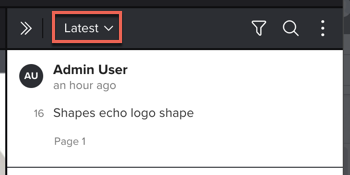

# Cerca, filtra e ordina commenti bozza

Puoi cercare, filtrare e ordinare i commenti della bozza per navigare facilmente nel feedback sul contenuto.

## Requisiti di accesso

+++ Espandi per visualizzare i requisiti di accesso per la funzionalità in questo articolo.

Per eseguire i passaggi descritti in questo articolo, è necessario disporre dei seguenti diritti di accesso:

<table style="table-layout:auto"> 
 <col> 
 <col> 
 <tbody> 
  <tr> 
   <td role="rowheader">Piano Adobe Workfront*</td> 
   <td> 
Piano corrente: Pro o superiore
 
oppure
 
Piano legacy: Seleziona o Premium
 
Per ulteriori informazioni sulla verifica dell'accesso con i diversi piani, vedere <a href="/help/quicksilver/administration-and-setup/manage-workfront/configure-proofing/access-to-proofing-functionality.md" class="MCXref xref">Accesso alla funzionalità di verifica in Workfront</a>.
 </td> 
  </tr> 
  <tr> 
   <td role="rowheader">Licenza Adobe Workfront*</td> 
   <td> 
Piano corrente: Lavoro o Piano
 
Piano legacy: qualsiasi (per l’utente deve essere abilitata la verifica)
 </td> 
  </tr> 
  <tr> 
   <td role="rowheader">Profilo autorizzazione bozza </td> 
   <td>Manager o superiore</td> 
  </tr> 
  <tr> 
   <td role="rowheader">Configurazioni del livello di accesso*</td> 
   <td> 
Modifica accesso ai documenti
 
Per informazioni sulla richiesta di accesso aggiuntivo, vedere <a href="../../../../workfront-basics/grant-and-request-access-to-objects/request-access.md" class="MCXref xref">Richiedere l'accesso agli oggetti </a>.
 </td> 
  </tr> 
 </tbody> 
</table>

&#42;Per conoscere il piano, la mansione o il profilo di autorizzazione della bozza di cui si dispone, contattare l&#39;amministratore di Workfront o Workfront Proof.

+++

## Cerca nell’elenco dei commenti

È possibile cercare nell&#39;elenco dei commenti il testo contenuto nel commento stesso, il numero del commento o l&#39;utente che lo ha creato.

1. Vai al progetto, all&#39;attività o al problema che contiene il documento, quindi seleziona **Documenti**.
1. Trova la bozza necessaria, quindi fai clic su **Apri bozza**.

1. (Condizionale) Se l&#39;area dei commenti non è aperta, fare clic su **Visualizza commenti** nell&#39;angolo superiore destro.
1. Fai clic sull&#39;icona **Cerca** per visualizzare la casella di ricerca.

1. Inizia a digitare uno dei seguenti elementi:

   * Testo da cercare. L&#39;elenco dei commenti viene filtrato durante la digitazione, a partire dal primo carattere immesso.
   * Numero del commento da visualizzare.
   * Utente che ha aggiunto il commento.

1. (Facoltativo) Fai clic sul commento per visualizzare una riga che lo collega all’area correlata della bozza.
1. Al termine della ricerca e per visualizzare tutti i commenti, fare clic sulla X alla fine della casella di ricerca.

## Filtrare l’elenco dei commenti

È possibile filtrare i commenti visualizzati definendo parametri di filtro quali utente, azioni, stato non letto e altro ancora.

1. Apri la bozza in cui desideri filtrare i commenti.
1. (Condizionale) Se l&#39;area dei commenti non è aperta, fare clic su **Visualizza commenti** nell&#39;angolo superiore destro.
1. Nell&#39;area commenti fare clic sull&#39;icona **Filtro**.

   

1. Utilizza le opzioni visualizzate sotto l&#39;icona **Filtro** per filtrare i commenti in base a uno dei seguenti criteri:

   <table style="table-layout:auto"> 
    <col> 
    <col> 
    <tbody> 
     <tr> 
      <td role="rowheader"><strong>Autori</strong> </td> 
      <td>Visualizza solo i commenti e le risposte ai commenti degli utenti specificati. </td> 
     </tr> 
     <tr> 
      <td role="rowheader"><strong>Azioni</strong> </td> 
      <td>Visualizza solo i commenti corrispondenti all'azione selezionata.Nessuna azione. Le azioni devono essere abilitate nel sistema. Per ulteriori informazioni, consulta .<!--
        &nbsp;
       --></td> 
     </tr> 
     <tr> 
      <td role="rowheader"><strong>Opzioni di filtro generali</strong> </td> 
      <td> 
       <ul> 
        <li><strong>Non risolto</strong>: visualizza solo i commenti non ancora risolti. </li> 
        <li><strong>Da leggere</strong>: visualizza solo i commenti che non sono ancora stati letti. </li> 
        <li><strong>Con allegati</strong>: visualizza solo i commenti che contengono un allegato o i commenti che includono una risposta che contiene un allegato.</li> 
        <li><strong>Solo pagina corrente</strong>:visualizza solo i commenti della pagina visualizzata. L'elenco dei commenti viene aggiornato quando si modifica la pagina visibile. Disponibile solo per bozze statiche e interattive.</li> 
       </ul> </td> 
     </tr> 
    </tbody> 
   </table>

1. Fai clic su **Applica** o fai clic sull&#39;icona **Filtra** per visualizzare l&#39;elenco dei commenti con i criteri di filtro applicati. L’icona Filtro viene visualizzata con un punto blu per indicare che è applicato un filtro.

1. Al termine dell&#39;applicazione del filtro e per visualizzare tutti i commenti, fare clic sull&#39;icona **Filtro**, fare clic su **Reimposta**, quindi fare di nuovo clic sull&#39;icona **Filtro**.

## Ordinare l’elenco dei commenti

Quando si ordina l&#39;elenco dei commenti, l&#39;opzione di ordinamento scelta viene memorizzata la volta successiva che si apre una bozza nel visualizzatore di bozze in uso.

1. Apri la bozza in cui desideri ordinare i commenti.
1. Se l&#39;area commenti non è aperta, fare clic su **Visualizza commenti** nell&#39;angolo superiore destro.

1. Fare clic sul menu di ordinamento per aprirlo.
1. 

1. Selezionare una delle opzioni di ordinamento seguenti:

   <table style="table-layout:auto"> 
    <col> 
    <col> 
    <col> 
    <tbody> 
     <tr> 
      <td role="rowheader">Più recente</td> 
      <td>Visualizza i commenti più recenti nella parte superiore dell'elenco.</td> 
      <td>Disponibile per tutte le bozze</td> 
     </tr> 
     <tr> 
      <td role="rowheader">Più vecchio</td> 
      <td>Visualizza i commenti meno recenti nella parte superiore dell'elenco. Questa è l'impostazione predefinita. </td> 
      <td>Disponibile per tutte le bozze</td> 
     </tr> 
     <tr> 
      <td role="rowheader">Creatore A-Z</td> 
      <td>Visualizza i commenti raggruppati in ordine alfabetico in base all'utente che ha creato il commento.</td> 
      <td>Disponibile per tutte le bozze</td> 
     </tr> 
     <tr> 
      <td role="rowheader">Creatore Z-A</td> 
      <td>Visualizza i commenti raggruppati in base all'utente che ha creato il commento, elencati in ordine alfabetico inverso.</td> 
      <td>Disponibile per tutte le bozze</td> 
     </tr> 
     <tr> 
      <td role="rowheader">Pagina (giù, su)</td> 
      <td>Visualizza i commenti in ordine di visualizzazione in relazione al numero di pagina o alla timeline del video. </td> 
      <td>Disponibile solo per le bozze statiche.</td> 
     </tr> 
     <tr> 
      <td role="rowheader">Timestamp (inattivo)</td> 
      <td>Visualizza i commenti in ordine di visualizzazione in relazione alla timeline del video. I commenti aggiunti successivamente nella timeline vengono visualizzati per primi. </td> 
      <td>Disponibile solo per le bozze video.</td> 
     </tr> 
     <tr> 
      <td role="rowheader">Timestamp (attivo)</td> 
      <td>Visualizza i commenti in ordine di visualizzazione in relazione alla timeline del video. I commenti aggiunti in precedenza nella timeline vengono visualizzati per primi. </td> 
      <td>Disponibile solo per le bozze video.</td> 
     </tr> 
     <tr> 
      <td role="rowheader">Dispositivo (su)</td> 
      <td>Visualizza i commenti in ordine in base al dispositivo selezionato al momento del commento. Vengono visualizzati per primi i commenti aggiunti a risoluzioni inferiori.</td> 
      <td>Disponibile solo per le bozze interattive.</td> 
     </tr> 
     <tr> 
      <td role="rowheader">Dispositivo (giù)</td> 
      <td> 
(Disponibile solo per le bozze interattive). Visualizza i commenti in ordine in base alla risoluzione selezionata al momento della creazione. I commenti aggiunti a risoluzioni superiori vengono visualizzati per primi.
 
Per informazioni sulla modifica della risoluzione in una bozza interattiva, vedere <a href="../../../../review-and-approve-work/proofing/reviewing-proofs-within-workfront/review-a-proof/view-interactive-content-as-it-appears-in-device.md" class="MCXref xref">Modificare la risoluzione della bozza interattiva nel visualizzatore di bozze</a>.
 </td> 
      <td>Disponibile solo per le bozze interattive.</td> 
     </tr> 
    </tbody> 
   </table>
