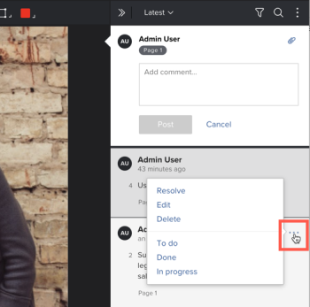

# Utilizzare le azioni sui commenti della bozza

Puoi utilizzare le azioni per tenere traccia di ciò che deve accadere su ogni thread di commenti di una bozza. Un’azione è una parola o una frase come &quot;Fare&quot;, &quot;Fine&quot; o &quot;In corso&quot; che l’amministratore di Adobe Workfront configura nel sistema per la tua organizzazione. I revisori possono aggiungere un’azione a un commento per fornire informazioni su ciò che è stato fatto o ciò che deve ancora essere fatto in risposta al commento.

Per informazioni su come l&#39;amministratore di Workfront abilita e configura le azioni, vedi .

## Requisiti di accesso

+++ Espandi per visualizzare i requisiti di accesso per la funzionalità descritta in questo articolo.

<table style="table-layout:auto"> 
 <col> 
 <col> 
 <tbody> 
  <tr> 
   <td role="rowheader">Pacchetto Adobe Workfront</td> 
   <td> 
Qualsiasi
 </td> 
  </tr> 
  <tr> 
   <td role="rowheader">Licenza di Adobe Workfront</td> 
   <td> 
Qualsiasi
</td> 
  </tr> 
  <tr> 
   <td role="rowheader">Profilo autorizzazione bozza </td> 
   <td>Manager o superiore</td> 
  </tr> 
  <tr> 
   <td role="rowheader">Ruolo bozza</td> 
   <td>Autore o moderatore</td> 
  </tr> 
  <tr> 
   <td role="rowheader">Configurazioni del livello di accesso</td> 
   <td> 
Accesso in modifica ai documenti
 </td> 
  </tr> 
 </tbody> 
</table>

Per informazioni, consulta [Requisiti di accesso nella documentazione di Workfront](/help/quicksilver/administration-and-setup/add-users/access-levels-and-object-permissions/access-level-requirements-in-documentation.md).

+++

## Utilizzare azioni sui commenti

Per applicare un&#39;azione a un commento esistente nel visualizzatore di bozze:

1. Vai al progetto, all&#39;attività o al problema che contiene il documento, quindi seleziona **Documenti**.
1. Trova la bozza necessaria, quindi fai clic su **Apri bozza**.

1. Esegui una delle operazioni seguenti:

   * Fai clic sull’icona del contrassegno nell’angolo inferiore destro del commento, quindi fai clic sull’azione desiderata nel menu a discesa.

     

   * Fai clic sull&#39;icona **Altro** (tre punti orizzontali sul commento), quindi fai clic sull&#39;azione desiderata nella sezione inferiore del menu a discesa visualizzato.

     

1. (Facoltativo) Se cambi idea, puoi effettuare una delle seguenti operazioni:

   * Fai di nuovo clic sull&#39;icona del contrassegno o sull&#39;icona **Altro**, quindi fai clic su **Rimuovi azione**.

   * Ripeti il passaggio 1 per applicare un’azione diversa.

>[!TIP]
>
>Puoi filtrare i commenti in base a una determinata azione. Per ulteriori informazioni, vedere [Cerca, filtra e ordina commenti bozza](../../../../review-and-approve-work/proofing/reviewing-proofs-within-workfront/comment-on-a-proof/search-filter-sort-comments.md).
