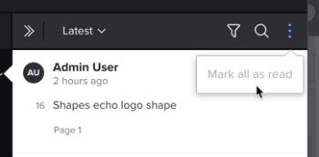

# Visualizza e risponde ai commenti di prova

È possibile visualizzare e rispondere ai commenti di prova fatti da altri revisori.

## Requisiti di accesso

Per eseguire i passaggi descritti in questo articolo, è necessario disporre dei seguenti diritti di accesso:

<table style="table-layout:auto"> 
 <col> 
 <col> 
 <tbody> 
  <tr> 
   <td role="rowheader">piano Adobe Workfront*</td> 
   <td> 
Piano attuale: Pro o superiore
 
oppure
 
Piano legacy: Seleziona o Premium
 
Per ulteriori informazioni sulla verifica dell’accesso con i diversi piani, consulta <a href="/help/quicksilver/administration-and-setup/manage-workfront/configure-proofing/access-to-proofing-functionality.md" class="MCXref xref">Accesso alle funzionalità di correzione in Workfront</a>.
 </td> 
  </tr> 
  <tr> 
   <td role="rowheader">Licenza Adobe Workfront*</td> 
   <td> 
Piano attuale: Lavoro o piano
 
Piano legacy: Qualsiasi (è necessario che la correzione sia attivata per l’utente)
 </td> 
  </tr> 
  <tr> 
   <td role="rowheader">Profilo autorizzazione bozza </td> 
   <td>Manager o superiore</td> 
  </tr> 
  <tr> 
   <td role="rowheader">Configurazioni a livello di accesso*</td> 
   <td> 
Modifica accesso ai documenti
 
Per informazioni sulla richiesta di accesso aggiuntivo, vedi <a href="../../../../workfront-basics/grant-and-request-access-to-objects/request-access.md" class="MCXref xref">Richiedere l’accesso agli oggetti </a>.
 </td> 
  </tr> 
 </tbody> 
</table>

&#42;Per informazioni sul piano, il ruolo o il profilo delle autorizzazioni di prova, contattare l&#39;amministratore Workfront o Workfront Proof.

## Visualizzare i commenti nel visualizzatore di bozze

Ogni commento visualizza le seguenti informazioni:

* Nome dell’utente che ha fatto il commento
* Numero di pagina in cui è stato effettuato il commento (nelle bozze statiche contenenti più di una pagina)
* Il numero o la gamma di riprese in cui è stato effettuato il commento (in bozze video)

   Se il commento che stai visualizzando è stato applicato a una serie di riprese video, puoi fare clic sul pulsante Play per rivedere l&#39;intervallo.

* Testo incluso nel commento
* Eventuali allegati caricati nel commento

Per visualizzare i commenti nel visualizzatore di correzione:

1. Passa al progetto, all&#39;attività o al problema che contiene il documento, quindi seleziona **Documenti**.
1. Trova la bozza di cui hai bisogno, quindi fai clic su **Prova aperta**.

1. (Condizionale) Se l’area commenti non è aperta, fare clic su **Visualizza commenti** nell&#39;angolo in alto a destra.
1. Fai clic su un commento per visualizzare i segni di commento sulla bozza.
1.  Oppure
1.  In una bozza video, posiziona il cursore del mouse sul punto della timeline in cui è stato creato un commento, quindi fai clic sul fumetto numerato visualizzato.
1. 

1. (Facoltativo) Per modificare le dimensioni dell’elenco dei commenti, posiziona il cursore del mouse sul bordo sinistro dell’area dei commenti (non sul commento attualmente aperto) finché il puntatore del mouse non cambia per il ridimensionamento orizzontale, quindi trascina il bordo in cui lo desideri.
1. 

## Visualizzare i commenti della bozza nella scheda Aggiornamenti

In Workfront, è possibile visualizzare i commenti delle prove senza avviare il visualizzatore delle prove.

1. Passa al progetto, all&#39;attività o al problema che contiene il documento, quindi seleziona **Documenti**.
1. Fai clic sulla riga contenente il documento, quindi fai clic sul pulsante **Riepilogo** icona  sul lato destro della pagina.\
   I commenti vengono visualizzati nella sezione Aggiornamenti del riepilogo del documento.

## Contrassegna tutti i commenti come letti

Come revisore di una bozza, è possibile contrassegnare rapidamente tutti i commenti come Leggi.

1. Passa al progetto, all&#39;attività o al problema che contiene il documento, quindi seleziona **Documenti**.
1. Trova la bozza di cui hai bisogno, quindi fai clic su **Prova aperta**.

1. (Condizionale) Se l’area commenti non è aperta, fare clic su **Visualizza commenti** nell&#39;angolo in alto a destra.

1. Sopra l’elenco dei commenti, fai clic sul pulsante **Altro** icona, quindi fai clic su **Contrassegna tutto come letto**.

1. 

## Risposta ai commenti della bozza dal visualizzatore di correzione

1. Passa al progetto, all&#39;attività o al problema che contiene il documento, quindi seleziona **Documenti**.
1. Trova la bozza di cui hai bisogno, quindi fai clic su **Prova aperta**.

1. (Condizionale) Se l’area commenti non è aperta, fare clic su **Visualizza commenti** nell&#39;angolo in alto a destra.
1. Fai clic su un commento per visualizzare i segni di commento sulla bozza.

   >[!TIP]
   >
   >Utilizza la **Commento precedente** e **Commento successivo** sul bordo destro dello schermo per navigare avanti e indietro nei commenti.

1. Digita la risposta nel **Aggiungi una risposta** scatola.
1. (Facoltativo) Per informare un altro revisore della risposta, digitare @ nella casella del commento, quindi digitare il nome o l&#39;indirizzo e-mail dell&#39;utente. Per ulteriori informazioni, consulta [Assegnare tag agli utenti per condividere una bozza](../../../../review-and-approve-work/proofing/reviewing-proofs-within-workfront/comment-on-a-proof/tag-users-to-share-proof.md).
1. (Facoltativo) Per aggiungere un file a un commento, effettua una delle seguenti operazioni:

   * Fare clic sull&#39;icona del clip di carta, quindi individuare e selezionare il file da caricare.
   * Trascinare un file da una posizione del computer e rilasciarlo nell&#39;area dei commenti.

1. Fai clic su **Rispondi**.
