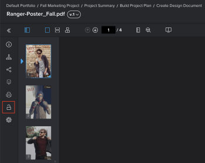

# Bloccare o sbloccare una bozza

È possibile bloccare e sbloccare manualmente una bozza in qualsiasi momento del processo di revisione.

## Requisiti di accesso

Per eseguire i passaggi descritti in questo articolo, è necessario disporre dei seguenti diritti di accesso:

<table style="table-layout:auto"> 
 <col> 
 <col> 
 <tbody> 
  <tr> 
   <td role="rowheader">piano Adobe Workfront*</td> 
   <td> 
Piano attuale: Pro o superiore
 
oppure
 
Piano legacy: Premium
 
Per ulteriori informazioni sulla verifica dell’accesso con i diversi piani, consulta <a href="/help/quicksilver/administration-and-setup/manage-workfront/configure-proofing/access-to-proofing-functionality.md" class="MCXref xref">Accesso alle funzionalità di correzione in Workfront</a>.
 </td> 
  </tr> 
  <tr> 
   <td role="rowheader">Licenza Adobe Workfront*</td> 
   <td> 
Piano attuale: Lavoro o piano
 
Piano legacy: Qualsiasi (è necessario che la correzione sia attivata per l’utente)
 </td> 
  </tr> 
  <tr> 
   <td role="rowheader">Ruolo di prova</td> 
   <td>Proprietario, Autore, Moderatore</td> 
  </tr> 
  <tr> 
   <td role="rowheader">Profilo autorizzazione bozza </td> 
   <td>Supervisore o amministratore</td> 
  </tr> 
 </tbody> 
</table>

&#42;Per informazioni sul piano, il ruolo o il profilo delle autorizzazioni di prova, contattare l&#39;amministratore Workfront o Workfront Proof.

## Bloccare una bozza

È possibile bloccare manualmente una bozza per impedire o consentire ai revisori di commentare. Questo è diverso dal blocco di una fase di prova.

Per bloccare una bozza:

1. Passare all&#39;elenco dei documenti contenente la bozza che si desidera aprire.
1. Passa il puntatore del mouse sul documento, quindi fai clic sul pulsante **Prova aperta** link visualizzato.

   Oppure

   Per aprire una bozza di una versione precedente del documento, fare clic sull&#39;icona Altro  per tale versione nel Riepilogo, quindi fai clic su **Prova aperta**.

   Per informazioni sul Riepilogo, consulta [Panoramica del riepilogo dei documenti](../../../../documents/managing-documents/summary-for-documents.md).

1. Nel pannello a sinistra, fai clic sul pulsante **Blocca** icona .

   

## Sblocca una bozza

Lo sblocco di una bozza è utile quando è necessario che i revisori aggiungano commenti a una versione precedente di una bozza. Una versione precedente viene sempre bloccata finché il proprietario della bozza la sblocca manualmente. Dopo aver aggiunto i commenti alla versione precedente, puoi bloccarla nuovamente. Per informazioni sulla visualizzazione di una versione precedente di una bozza, consulta [Visualizzare le versioni di prova precedenti nel visualizzatore per correzione Web](../../../../workfront-proof/wp-work-proofsfiles/review-proofs-wpv/view-previous-proof-versions.md).

Per sbloccare una bozza:

1. Passa il puntatore del mouse sul documento, quindi fai clic sul pulsante **Prova aperta** link visualizzato.

   Oppure

   Per aprire una bozza di una versione precedente del documento, fare clic sull&#39;icona Altro  per tale versione nel Riepilogo, quindi fai clic su **Prova aperta**.

   Per informazioni sul Riepilogo, consulta [Panoramica del riepilogo dei documenti](../../../../documents/managing-documents/summary-for-documents.md).

1. Nel pannello a sinistra, fai clic sul pulsante **Sblocca** icona , quindi fai clic su **Sì, sblocca**.

   
