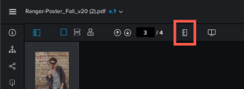

# Misurare un’area all’interno di una bozza

Puoi misurare un’area all’interno di una bozza.

## Requisiti di accesso

Per eseguire i passaggi descritti in questo articolo, è necessario disporre dei seguenti diritti di accesso:

<table style="table-layout:auto"> 
 <col> 
 <col> 
 <tbody> 
  <tr> 
   <td role="rowheader">piano Adobe Workfront*</td> 
   <td> 
Piano attuale: Pro o superiore
 
oppure
 
Piano legacy: Seleziona o Premium
 
Per ulteriori informazioni sulla verifica dell’accesso con i diversi piani, consulta <a href="/help/quicksilver/administration-and-setup/manage-workfront/configure-proofing/access-to-proofing-functionality.md" class="MCXref xref">Accesso alle funzionalità di correzione in Workfront</a>.
 </td> 
  </tr> 
  <tr> 
   <td role="rowheader">Licenza Adobe Workfront*</td> 
   <td> 
Piano attuale: Lavoro o piano
 
Piano legacy: Qualsiasi (è necessario che la correzione sia attivata per l’utente)
 </td> 
  </tr> 
  <tr> 
   <td role="rowheader">Profilo autorizzazione bozza </td> 
   <td>Manager o superiore</td> 
  </tr> 
  <tr> 
   <td role="rowheader">Configurazioni a livello di accesso*</td> 
   <td> 
Modifica accesso ai documenti
 
Per informazioni sulla richiesta di accesso aggiuntivo, vedi <a href="../../../../workfront-basics/grant-and-request-access-to-objects/request-access.md" class="MCXref xref">Richiedere l’accesso agli oggetti </a>.
 </td> 
  </tr> 
 </tbody> 
</table>

&#42;Per informazioni sul piano, il ruolo o il profilo delle autorizzazioni di prova, contattare l&#39;amministratore Workfront o Workfront Proof.

## Misurare un’area all’interno di una bozza

1. Passa al progetto, all&#39;attività o al problema che contiene il documento, quindi seleziona **Documenti**.
1. Trova la bozza di cui hai bisogno, quindi fai clic su **Prova aperta**.

1. Fai clic sul pulsante **Misurare un’area** nella parte superiore del visualizzatore di correzione.

   

1. (Facoltativo) Fai clic su **Colore marcatura misura** per espandere le opzioni colore, fare clic su un colore e **Opacità** è facile da vedere sulla tua prova.\
   

   Il colore predefinito dello strumento di misura è rosso.

   Il visualizzatore di correzione ricorda le selezioni di colore e opacità su tutte le bozze aperte fino a quando non si cancella la cache del browser.

1. (Facoltativo) Seleziona un diverso **Unità di misura.**

   >[!NOTE]
   >
   >Le opzioni Unità di misura sono disponibili solo per le bozze create da un PDF.

1. Trascinare la finestra di misurazione sull&#39;area della bozza da misurare.

   

1. Trascinare gli angoli o i bordi della finestra di misurazione per ridimensionarla.
1. (Facoltativo) Se l&#39;area di misura deve avere una dimensione esatta, digitare **Dimensione della selezione** valori.
1. (Facoltativo) Se è necessario misurare una determinata percentuale all&#39;interno di un&#39;area, selezionare la casella di controllo Calcola percentuale. Viene visualizzata una nuova casella che consente di regolarla\
   
