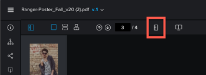
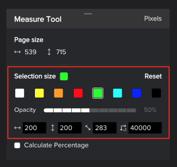
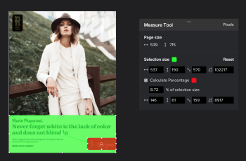

# Misurare un’area all’interno di una bozza

È possibile misurare un’area all’interno di una bozza.

## Requisiti di accesso

+++ Espandi per visualizzare i requisiti di accesso per la funzionalità descritta in questo articolo.

<table style="table-layout:auto"> 
 <col> 
 <col> 
 <tbody> 
  <tr> 
   <td role="rowheader">Pacchetto Adobe Workfront</td> 
   <td> 
Qualsiasi
 </td> 
  </tr> 
  <tr> 
   <td role="rowheader">Licenza di Adobe Workfront</td> 
   <td> 
Qualsiasi
 </td> 
  </tr> 
  <tr> 
   <td role="rowheader">Ruolo bozza </td> 
   <td>Revisore, revisore e approvatore, Autore, Moderatore</td> 
  </tr> 
  <tr> 
   <td role="rowheader">Profilo autorizzazione bozza </td> 
   <td>Manager o superiore</td> 
  </tr> 
  <tr> 
   <td role="rowheader">Configurazioni del livello di accesso</td> 
   <td> 
Accesso in modifica ai documenti
 </td> 
  </tr> 
 </tbody> 
</table>

Per informazioni, consulta [Requisiti di accesso nella documentazione di Workfront](/help/quicksilver/administration-and-setup/add-users/access-levels-and-object-permissions/access-level-requirements-in-documentation.md).

+++

## Misurare un’area all’interno di una bozza

1. Vai al progetto, all&#39;attività o al problema che contiene il documento, quindi seleziona **Documenti**.
1. Trova la bozza necessaria, quindi fai clic su **Apri bozza**.

1. Fai clic sull&#39;icona **Misura un&#39;area** nella parte superiore del visualizzatore di bozze.

   

1. (Facoltativo) Fai clic su **Colore markup di misurazione** per espandere le opzioni di colore, quindi fai clic su un colore e su **Opacità** facilmente visibili nella bozza.\
   

   Il colore predefinito dello strumento di misurazione è il rosso.

   Il visualizzatore di bozze ricorda le selezioni di colore e opacità su tutte le bozze aperte fino a quando non cancelli la cache del browser.

1. (Facoltativo) Seleziona un&#39;altra **unità di misura.**

   >[!NOTE]
   >
   >Le opzioni Unità di misura sono disponibili solo per le bozze create da un PDF.

1. Trascinare la finestra di misurazione sull&#39;area della bozza da misurare.

   

1. Trascinare gli angoli o i bordi della finestra di misurazione per ridimensionarla.
1. (Facoltativo) Se l&#39;area di misurazione deve avere una dimensione esatta, digitare **Dimensione selezione** valori.
1. (Facoltativo) Se è necessario misurare una determinata percentuale all&#39;interno di un&#39;area, selezionare la casella di controllo calcola percentuale. Viene visualizzata una nuova casella che consente di regolarla\
   

1. Fai clic sull&#39;icona **Misura un&#39;area** nella parte superiore del visualizzatore di bozze per chiudere lo strumento al termine.

   
