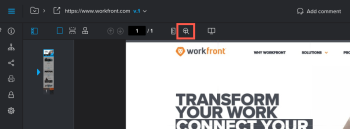

# Cercare contenuto in una bozza

È possibile individuare rapidamente il testo in una bozza creata per i seguenti tipi di documenti:

* PDF
* Office (.doc, .docx, .odt)
* Pagina web statica

>[!NOTE]
>
>Le bozze create prima del 26 aprile 2017 potrebbero non essere ricercabili.

## Requisiti di accesso

+++ Espandi per visualizzare i requisiti di accesso per la funzionalità in questo articolo.

Per eseguire i passaggi descritti in questo articolo, è necessario disporre dei seguenti diritti di accesso:

<table style="table-layout:auto"> 
 <col> 
 <col> 
 <tbody> 
  <tr> 
   <td role="rowheader">Piano Adobe Workfront*</td> 
   <td> 
Piano corrente: Pro o superiore
 
oppure
 
Piano legacy: Seleziona o Premium
 
Per ulteriori informazioni sulla verifica dell'accesso con i diversi piani, vedere <a href="/help/quicksilver/administration-and-setup/manage-workfront/configure-proofing/access-to-proofing-functionality.md" class="MCXref xref">Accesso alla funzionalità di verifica in Workfront</a>.
 </td> 
  </tr> 
  <tr> 
   <td role="rowheader">Licenza Adobe Workfront*</td> 
   <td> 
Piano corrente: revisione
 
Piano legacy: revisione
 </td> 
  </tr> 
  <tr> 
   <td role="rowheader">Profilo autorizzazione bozza </td> 
   <td>Manager o superiore</td> 
  </tr> 
  <tr> 
   <td role="rowheader">Configurazioni del livello di accesso*</td> 
   <td> 
Modifica accesso ai documenti
 
Per informazioni sulla richiesta di accesso aggiuntivo, vedere <a href="../../../../workfront-basics/grant-and-request-access-to-objects/request-access.md" class="MCXref xref">Richiedere l'accesso agli oggetti </a>.
 </td> 
  </tr> 
 </tbody> 
</table>

&#42;Per conoscere il piano, la mansione o il profilo di autorizzazione della bozza di cui si dispone, contattare l&#39;amministratore di Workfront o Workfront Proof.

+++

## Cercare contenuto in una bozza

1. Aprire la bozza che si desidera cercare.
1. Nella barra degli strumenti sopra la bozza, fare clic sull&#39;icona **Cerca documento**.

   

1. Iniziare a digitare il testo che si desidera cercare.

   Lo strumento di ricerca evidenzia il testo nel documento durante la digitazione.

   

1. Termina di digitare il testo da cercare, quindi fai clic sulle frecce **Su** e **Giù** per esaminare i risultati della ricerca all&#39;interno della bozza.
