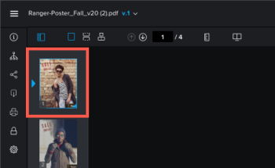

# Visualizzare il contenuto in una bozza

È possibile utilizzare il visualizzatore di bozze per visualizzare i file di markup e visualizzarli in Workfront.

>[!NOTE]
>
>Se l’istanza di Workfront si trova nell’esperienza unificata, il visualizzatore di bozze si apre in una nuova scheda.

## Requisiti di accesso

+++ Espandi per visualizzare i requisiti di accesso per la funzionalità in questo articolo.

<table style="table-layout:auto"> 
 <col> 
 <col> 
 <tbody> 
  <tr> 
   <td role="rowheader">Pacchetto Adobe Workfront</td> 
   <td> 
Qualsiasi
 </td> 
  </tr> 
  <tr> 
   <td role="rowheader">Licenza Adobe Workfront</td> 
   <td> 
Qualsiasi
 </td> 
  </tr> 
  <tr> 
   <td role="rowheader">Ruolo bozza </td> 
   <td>Revisore, revisore e approvatore, Autore, Moderatore</td> 
  </tr> 
  <tr> 
   <td role="rowheader">Profilo autorizzazione bozza </td> 
   <td>Manager o superiore</td> 
  </tr> 
  <tr> 
   <td role="rowheader">Configurazioni del livello di accesso</td> 
   <td> 
Modifica accesso ai documenti
 </td> 
  </tr> 
 </tbody> 
</table>

Per informazioni, consulta [Requisiti di accesso nella documentazione di Workfront](/help/quicksilver/administration-and-setup/add-users/access-levels-and-object-permissions/access-level-requirements-in-documentation.md).

+++

## Modificare la visualizzazione della bozza

È possibile visualizzare una bozza statica contenente più pagine in una singola visualizzazione, in una visualizzazione continua o in una visualizzazione rivista.

1. Vai al progetto, all&#39;attività o al problema che contiene il documento, quindi seleziona **Documenti**.
1. Trova la bozza necessaria, quindi fai clic su **Apri bozza**.

1. Nell&#39;area in alto a sinistra del visualizzatore di bozze, individuare le opzioni di visualizzazione.\
   

1. Fare clic su una delle opzioni seguenti:

   <table style="table-layout:auto"> 
    <col> 
    <col> 
    <tbody> 
     <tr> 
      <td role="rowheader">Vista singola</td> 
      <td>Visualizza una sola pagina alla volta. Fare clic sulla miniatura della pagina che si desidera visualizzare oppure premere i tasti freccia sinistra e destra per spostarsi tra le pagine. </td> 
     </tr> 
     <tr> 
      <td role="rowheader">Vista continua</td> 
      <td>Visualizza tutte le pagine in un'unica visualizzazione in pila. Fare clic sulla miniatura della pagina che si desidera visualizzare oppure premere i tasti freccia sinistra e destra per scorrere verso l'alto o verso il basso tutte le pagine in una visualizzazione continua. </td> 
     </tr> 
     <tr> 
      <td role="rowheader">Vista Rivista</td> 
      <td>Visualizza tutte le pagine in un'unica visualizzazione caricato (affiancate e sovrapposte). Fare clic sulla miniatura della pagina che si desidera visualizzare oppure premere i tasti freccia sinistra e destra per scorrere tra tutte le pagine. </td> 
     </tr> 
    </tbody> 
   </table>

## Usa miniature

Il pannello miniature viene visualizzato sul lato sinistro del visualizzatore di bozze. È possibile utilizzare l’area delle miniature per spostarsi all’interno della bozza. Le miniature sono particolarmente utili quando una bozza contiene più pagine.

* [Nascondi e visualizza il pannello miniature](#hide-and-display-the-thumbnails-panel)
* [Zoom e scorrimento nella visualizzazione delle miniature](#zoom-and-pan-in-the-thumbnail-view)

### Nascondere e visualizzare il pannello miniature {#hide-and-display-the-thumbnails-panel}

Per impostazione predefinita, viene visualizzato il pannello miniature. Puoi nascondere o regolare la dimensione del pannello.

1. Vai al progetto, all&#39;attività o al problema che contiene il documento, quindi seleziona **Documenti**.
1. Trova la bozza necessaria, quindi fai clic su **Apri bozza**.

1. Fai clic sull&#39;icona **Miniatura** nell&#39;angolo superiore sinistro del visualizzatore di bozze.\
   

1. (Facoltativo) Fai di nuovo clic sull&#39;icona delle miniature per visualizzare il pannello delle miniature.

   >[!TIP]
   >
   >Per ridimensionare il pannello, potete passare il mouse sul bordo destro del pannello miniature.

### Zoom e scorrimento nella visualizzazione delle miniature {#zoom-and-pan-in-the-thumbnail-view}

L’area di zoom nel pannello miniature mostra l’area della bozza che stai visualizzando. È possibile regolare lo zoom all’interno dell’area delle miniature oppure effettuare una panoramica dell’area per visualizzare una parte diversa della bozza.

Per eseguire lo zoom e la panoramica nella visualizzazione delle miniature:

1. Vai al progetto, all&#39;attività o al problema che contiene il documento, quindi seleziona **Documenti**.
1. Trova la bozza necessaria, quindi fai clic su **Apri bozza**.

1. Individuate l&#39;area di zoom corrente nel pannello miniature.\
   L&#39;area di zoom viene visualizzata come una cornice blu intorno ai bordi della miniatura.

   

1. Per regolare le dimensioni dell&#39;area di zoom, trascinare l&#39;angolo inferiore destro dell&#39;area di zoom fino a ottenere le dimensioni desiderate.
1. Per spostare l&#39;area di zoom in un&#39;altra parte della bozza, trascinare l&#39;area di zoom fino a coprire la parte della bozza che si desidera visualizzare.

## Ruotare una bozza

È possibile ruotare la bozza all’interno del visualizzatore di bozze. Quando ruoti una bozza che contiene più pagine, tutte le pagine vengono ruotate contemporaneamente.

1. Vai al progetto, all&#39;attività o al problema che contiene il documento, quindi seleziona **Documenti**.
1. Trova la bozza necessaria, quindi fai clic su **Apri bozza**.

1. Fai clic sull&#39;icona **Ruota** nella parte inferiore del visualizzatore di bozze.

   

   La bozza viene ruotata di 90 gradi ogni volta che si fa clic sull&#39;icona **Ruota**.

## Zoom e scorrimento di una bozza

È possibile regolare la percentuale di zoom quando si visualizza la bozza. Quando si visualizza una bozza con una percentuale di zoom superiore, l’opzione Panning consente di utilizzare il cursore per spostarsi su aree diverse della bozza.

1. Vai al progetto, all&#39;attività o al problema che contiene il documento, quindi seleziona **Documenti**.
1. Trova la bozza necessaria, quindi fai clic su **Apri bozza**.

1. Effettua una delle seguenti operazioni per regolare la percentuale di zoom della bozza:

   * Fai clic sull&#39;icona **Zoom**, quindi fai clic sulla bozza per visualizzarla a un livello di zoom superiore o trascina un puntatore sull&#39;area della bozza per visualizzare solo tale area.

     

   * Fare clic sulla percentuale di zoom corrente, fare clic su una nuova percentuale di zoom oppure fare clic su **Adatta alla larghezza**, **Adatta all&#39;altezza** o **Adatta alla pagina**.

     

   * Fai clic sulle icone **Più** o **Meno** per aumentare o diminuire la percentuale di zoom.

     

1. Se hai bisogno di eseguire il panning in una determinata area della bozza video, fai clic sull&#39;icona **Panning**, quindi trascina la bozza come necessario.

   

   >[!TIP]
   >
   >Per passare facilmente dagli strumenti Zoom a quelli Panoramica, tenere premuta la barra spaziatrice quando si utilizza l&#39;icona Zoom per effettuare una panoramica.
