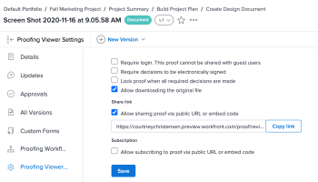

# Disattiva la condivisione della bozza tramite URL pubblico o codice incorporato

Puoi disattivare la possibilità di condividere una bozza con un URL pubblico o un codice di incorporamento in base alla bozza oppure per singoli utenti.

## Disattiva per bozza

Devi essere il proprietario della bozza o il creatore, oppure devi avere il ruolo di bozza Autore o Moderatore.

1. Nel progetto che contiene la bozza, fai clic su **Documenti** nel pannello a sinistra.
1. Passa il puntatore del mouse sulla bozza e seleziona **Dettagli documento**.
1. Nel pannello a sinistra, fai clic su **Impostazioni visualizzatore bozze**, quindi disabilita la casella di controllo **Consenti condivisione bozze tramite URL pubblico o codice di incorporamento**.

   

1. Fai clic su **Salva**.

## Disattiva per utente

Puoi disattivare l’impostazione Bozza pubblica per i singoli utenti nella tua istanza di Workfront. Per apportare questa modifica è necessario disporre di un Profilo di autorizzazione di bozza dell&#39;amministratore.

1. Fai clic sull&#39;icona **Main Menu**  nell&#39;angolo superiore destro di Adobe Workfront, quindi fai clic su **Proofing**.
1. Fai clic su **Impostazioni account** nell&#39;angolo superiore destro.
1. Fai clic sulla scheda **Utenti**, quindi sul nome di un utente.
1. Nella sezione **Impostazioni bozza predefinite**, disabilita la casella di controllo **Condivisione pubblica**.

   
