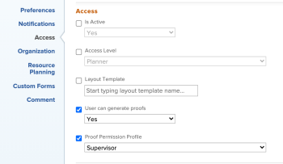

# Modificare il campo Profilo autorizzazione bozza in blocco

## Requisiti di accesso

+++ Espandi per visualizzare i requisiti di accesso per la funzionalità descritta in questo articolo.

<table style="table-layout:auto"> 
 <col> 
 <col> 
 <tbody> 
  <tr> 
   <td role="rowheader">Pacchetto Adobe Workfront</td> 
   <td> 
Qualsiasi
 </td> 
  </tr> 
  <tr> 
   <td role="rowheader">Licenza di Adobe Workfront</td> 
   <td> 
Devi essere un amministratore di Workfront o un amministratore di gruppo.
 </td> 
  </tr> 
  <tr> 
   <td role="rowheader">Profilo autorizzazione bozza </td> 
   <td>Amministratore</td> 
  </tr> 
  <tr> 
   <td role="rowheader">Configurazioni del livello di accesso</td> 
   <td> 
Accesso in modifica ai documenti
</td> 
  </tr> 
 </tbody> 
</table>

Per informazioni, consulta [Requisiti di accesso nella documentazione di Workfront](/help/quicksilver/administration-and-setup/add-users/access-levels-and-object-permissions/access-level-requirements-in-documentation.md).

+++

## Modificare il campo Profilo autorizzazione bozza in blocco

{{step-1-to-users}}

1. Ordina gli utenti per **Livello d&#39;Accesso**. È consigliabile modificare in batch in base al livello di accesso per assicurarsi che venga visualizzato il campo **Profilo di autorizzazione bozza**.

1. Fai clic sulla casella di controllo accanto agli utenti che desideri selezionare all’interno dello stesso livello di accesso. Il campo Profilo autorizzazione bozza è disponibile solo per i livelli di accesso dei lavoratori e versioni successive.
1. Fai clic su **Modifica** in alto nell&#39;elenco.
1. Nella sezione **Access**, individua il menu a discesa **Profilo di autorizzazione bozza** ed effettua la selezione.

   >[!NOTE]
   >
   >A seconda del piano Workfront, potrebbe essere necessario abilitare la casella di controllo **L&#39;utente può generare bozze** per visualizzare il menu **Profilo autorizzazione bozza**.

   

1. Fai clic su **Salva modifiche**.
