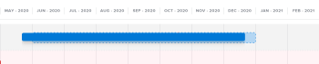

# Creare e modificare iniziative in [!DNL Scenario Planner]

Quando utilizzi [!UICONTROL Adobe Workfront Scenario Planner], puoi creare iniziative in un piano creato o condiviso con te. Creando iniziative puoi mostrare come le unità organizzative più piccole contribuiscono al completamento del piano. Ad esempio, se la tua organizzazione dispone di un piano per i prossimi tre anni per espandersi in un nuovo mercato, puoi creare iniziative all&#39;interno di questo piano affinché ogni reparto stimi la necessità di persone e budget di ogni reparto per realizzare questo piano.

## Requisiti di accesso

Devi disporre dei seguenti elementi:

<table style="table-layout:auto"> 
 <col> 
 <col> 
 <tbody> 
  <tr> 
   <td> 
[!DNL Adobe Workfront] piano*
 </td> 
   <td>[!UICONTROL Business] o superiore</td> 
  </tr> 
  <tr> 
   <td> 
[!DNL Adobe Workfront] licenza* 
 </td> 
   <td> 
[!UICONTROL Review] o versione successiva
 </td> 
  </tr> 
  <tr> 
   <td>Prodotto </td> 
   <td> 
È necessario acquistare una licenza aggiuntiva per [!DNL Adobe Workfront Scenario Planner] per accedere alla funzionalità descritta in questo articolo. 
 
Per informazioni su come ottenere [!DNL Workfront Scenario Planner], vedi <a href="../scenario-planner/access-needed-to-use-sp.md" class="MCXref xref">Accesso necessario per utilizzare [!DNL Scenario Planner]</a>. 
 </td> 
  </tr> 
  <tr data-mc-conditions=""> 
   <td>Configurazioni a livello di accesso* </td> 
   <td> 
Accesso o superiore a [!DNL Scenario Planner]
 
Se non hai ancora accesso, chiedi [!DNL Workfront] amministratore se imposta ulteriori restrizioni nel livello di accesso. Per informazioni su come [!DNL Workfront] l'amministratore può modificare il livello di accesso, vedi <a href="../administration-and-setup/add-users/configure-and-grant-access/create-modify-access-levels.md" class="MCXref xref">Creare o modificare livelli di accesso personalizzati</a>.
 </td> 
  </tr> 
  <tr data-mc-conditions=""> 
   <td> 
Autorizzazioni oggetto 
 </td> 
   <td> 
Autorizzazioni di gestione per un piano
 
Per informazioni sulla richiesta di accesso aggiuntivo a un piano, vedi <a href="../scenario-planner/request-access-to-plan.md" class="MCXref xref">Richiedi l'accesso a un piano nel [!DNL Scenario Planner]</a>.
 </td> 
  </tr> 
 </tbody> 
</table>

*Per sapere quale piano, tipo di licenza o accesso hai, contatta il tuo [!DNL Workfront] amministratore.

## Prerequisiti

È necessario creare un piano o un altro utente deve condividerlo con te prima di poter creare un&#39;iniziativa all&#39;interno di tale piano. Per informazioni sulla creazione dei piani, consulta [Crea e modifica piani in [!DNL Scenario Planner]](../scenario-planner/create-and-edit-plans.md).

Per ulteriori informazioni sulle iniziative, consulta [Panoramica delle iniziative in [!DNL Scenario Planner]](../scenario-planner/initiatives-overview.md).

## Creare iniziative

Puoi creare iniziative nei seguenti modi:

* Da zero.
* Importazione di progetti in un piano

   Per informazioni sull&#39;importazione di progetti come iniziative in un piano, vedi [Importa progetti nei piani [!DNL Scenario Planner]](../scenario-planner/import-projects-to-plans.md).

* Copiando le iniziative esistenti.

   Per informazioni sulle iniziative di copia, vedi [Copia le iniziative nel [!DNL Scenario Planner]](../scenario-planner/copy-initiatives.md).

Per creare iniziative da zero:

1. Fai clic sul pulsante **[!UICONTROL Menu principale]** icona , quindi fai clic su [!UICONTROL Scenari].

1. Fare clic sul nome del piano per il quale si desidera creare un&#39;iniziativa.
1. Fai clic sul pulsante **Icona +** a sinistra di **[!UICONTROL Nuova iniziativa]**

   Oppure

   Fai clic sul pulsante **[!UICONTROL Nuova iniziativa]** menu a discesa e seleziona **[!UICONTROL Nuova iniziativa]** o **[!UICONTROL Importa progetti].**

1. Digita un nome per la tua iniziativa in **[!UICONTROL Iniziativa senza titolo]** quindi premere Invio o fare clic in un altro punto della pagina.

   L’iniziativa viene visualizzata sulla timeline del piano, come una barra blu. Per impostazione predefinita, la durata di un&#39;iniziativa è di un mese e inizia sempre il primo mese del piano.

1. (Facoltativo) Trascinate la barra di separazione tra il pannello di sinistra e la timeline per ridimensionare il pannello di sinistra.

1. (Facoltativo) Trascina la fine della barra delle iniziative per estenderne la durata a più di un mese e rilasciala dove desideri che sia il mese di fine dell’iniziativa.
1. (Facoltativo e condizionale) Se la durata dell’iniziativa è inferiore a quella del piano, trascinare e rilasciare la barra dell’iniziativa in una posizione diversa rispetto al calendario del piano, per spostarla in un altro intervallo di tempo.

   

   >[!IMPORTANT]
   >
   >Puoi selezionare una durata solo in mesi. La durata di un&#39;iniziativa creata da zero non può mai superare la durata del piano.

1. (Facoltativo) Dal **[!UICONTROL Mese]** menu a discesa, selezionare una delle opzioni seguenti per modificare la timeline del piano:

   | Opzione del menu a discesa | Descrizione |
   |---|---|
   | [!UICONTROL Mese] | Visualizza la timeline per mese. Questa è l’opzione predefinita per un piano a un anno. |
   | [!UICONTROL Trimestre] | Visualizza la timeline per trimestre. Questa opzione è disponibile solo quando [!UICONTROL Durata] del piano è di 3 o 5 anni. Questa è l’opzione predefinita per un piano a 3 anni. |
   | [!UICONTROL Anno] | Visualizza la timeline per anno. Questa opzione è disponibile solo quando [!UICONTROL Durata] del piano è di 5 anni. Questa è l’opzione predefinita per un piano quinquennale. |

1. (Facoltativo) Scorri da sinistra a destra per vedere l&#39;intera durata dell&#39;iniziativa.
1. (Facoltativo) Fai clic sul pulsante **[!UICONTROL Oggi]** la riga dell’indicatore per tornare alla data corrente.

   

   >[!TIP]
   >
   >Se il piano è futuro o passato e non include la data corrente, l&#39;indicatore Oggi non viene visualizzato.

1. Fai clic sulla barra di un&#39;iniziativa. Il pannello dei dettagli dell&#39;iniziativa si apre a destra.

   

   Specifica o controlla le seguenti informazioni:

   <table style="table-layout:auto"> 
    <col> 
    <col> 
    <tbody> 
     <tr data-mc-conditions=""> 
      <td role="rowheader">Durata iniziativa</td> 
      <td>La durata dell'iniziativa in mesi. </td> 
     </tr> 
     <tr data-mc-conditions=""> 
      <td role="rowheader">Date di inizio e di fine</td> 
      <td>Le date di inizio e di fine dell'iniziativa.</td> 
     </tr> 
     <tr> 
      <td role="rowheader">Sezione ruoli processo richiesti </td> 
      <td> 
Fai clic sul pulsante <strong>[!UICONTROL Inizia a digitare il ruolo del lavoro]</strong> e selezionare un ruolo dall'elenco o iniziare a digitare il nome di unn attivo ruolo professionale. 
 
A seconda che il piano sia impostato per l'uso di FTE o ore, aggiungi il numero di ruoli di lavoro necessari per questa iniziativa in FTE o ore per ogni mese nell'ambito dell'iniziativa. I primi tre mesi dell’iniziativa vengono visualizzati per impostazione predefinita.
 
L'aggiornamento delle informazioni sul ruolo di lavoro per l'iniziativa aggiorna anche le informazioni sul ruolo di lavoro richiesto per il piano. 
 
Per informazioni sull'impostazione del piano per l'utilizzo di FTE o ore, vedi <a href="../scenario-planner/create-and-edit-plans.md" class="MCXref xref">Crea e modifica piani in [!DNL Scenario Planner]</a>. 

      
<b>IMPORTANTE</b>
  
      
Per tutti i calcoli nel [!DNL Scenario Planner], [!DNL Workfront] utilizza il seguente valore: 1 ETP = 8 ore. 

   
<b>SUGGERIMENTO</b>

   <ul> 
       <li> 
Utilizza il tasto [!UICONTROL Tab] per passare al mese successivo. 
 </li> 
      <li> 
 Tutto attivo i ruoli di lavoro nel sistema vengono elencati quando si fa clic su questo campo. 
 </li> 
       <li> 
I ruoli di lavoro già aggiunti ai ruoli di lavoro disponibili del piano vengono visualizzati per primi. Per informazioni sull'aggiunta di ruoli di lavoro disponibili a un piano, vedere <a href="../scenario-planner/create-and-edit-plans.md" class="MCXref xref">Creare e modificare i piani nel planner dello scenario</a>. 
 </li> 
       <li> 
[!DNL Workfront] ritiene che un equivalente a tempo pieno sia di 160 ore per un mese. 
 
Per tutti i calcoli nel Planner scenario, Workfront utilizza il seguente valore: 1 ETP = 8 ore. 
</li> 
      </ul> 
 
È possibile immettere un numero inferiore a 1 ETP o numeri decimali per FTE o ore. Ad esempio, un ruolo di consulente di 0,5 significherebbe che un consulente dedicherebbe metà del suo ETP (in genere, 4 ore, dove 8 ore è 1 ETP) a lavorare su questa iniziativa. 
  </td> 
     </tr> 
     <tr> 
      <td rowspan="3" role="rowheader">Sezione Costi</td> 
      <td> 
I costi totali dell'iniziativa sono esposti a destra della sezione [!UICONTROL Cost]. [!DNL Workfront] calcola i costi di un'iniziativa utilizzando la seguente formula:
 
<code>[!UICONTROL Initiative Costs] = [!UICONTROL Fixed Costs] + [!UICONTROL People] Costs</code> 
 </td> 
     </tr> 
     <tr> 
      <td> 
In <strong>[!UICONTROL Costi Fissi]</strong> immetti manualmente una stima approssimativa del costo necessario per completare l'iniziativa. Ciò non dovrebbe includere i costi associati ai ruoli di lavoro stimati per l'iniziativa.
 
Inserisci un importo per ogni mese dell’iniziativa spostandoti da un mese all’altro utilizzando il tasto Tab. 
 </td> 
     </tr> 
     <tr> 
      <td> 
       
 
        
A seconda che il piano sia impostato per l’utilizzo di FTE o ore, [!UICONTROL Workfront] utilizza le seguenti formule per calcolare il [!UICONTROL People Cost]:
 
        <ul> 
         <li> 
Quando si utilizzano gli ETP: 
 
<code>[!UICONTROL People Costs] = SUM(Job role hourly rate * Number of months in the Duration * 160 * Number of FTEs)</code>, dove 160 è il numero totale di ore lavorative in un mese. 
 </li> 
         <li> 
Quando si utilizzano le ore: 
 
<code>Monthly People Costs = SUM(Job role hourly rate * Number of hours estimated for an initiative)</code> 
 
Per informazioni sull'impostazione del piano per l'uso di ore o FTE, vedere <a href="../scenario-planner/create-and-edit-plans.md" class="MCXref xref">Creare e modificare i piani nel planner dello scenario</a>.
 </li> 
        </ul> 
        
I costi delle persone vengono calcolati nella valuta di base selezionata nelle preferenze Tassi di cambio. Per informazioni sui tassi di cambio, vedere <a href="../administration-and-setup/manage-workfront/exchange-rates/set-up-exchange-rates.md" class="MCXref xref">Imposta i tassi di cambio</a>.
 
        
L'aggiornamento delle informazioni sui costi per un'iniziativa aggiorna anche l'area [!UICONTROL Cost] per il piano. 
 
       
 </td> 
     </tr> 
     <tr> 
      <td colspan="2" role="rowheader"> 
Dopo aver definito il ruolo di lavoro e i valori di costo richiesti per l'iniziativa e aver modificato la durata dell'iniziativa, potrebbe verificarsi uno dei seguenti scenari:
 
       <ul> 
        <li> 
Se accorciate l'iniziativa, [!DNL Workfront] rimuove la quantità di risorse richieste e i costi associati al tempo rimosso dal piano. I ruoli di lavoro rimangono nel piano, ma non hanno FTE richiesto o ore. Le risorse disponibili per il piano e il bilancio restano invariate. Per aggiornare le informazioni sul piano, vedi <a href="../scenario-planner/create-and-edit-plans.md" class="MCXref xref">Crea e modifica piani in [!DNL Scenario Planner]</a>. 
 </li> 
        <li> 
Se si allunga l'iniziativa, è necessario specificare l'importo dei ruoli e dei costi dei nuovi mesi aggiunti all'iniziativa. 
 </li> 
       </ul> </td> 
     </tr> 
     <tr> 
      <td role="rowheader">[!DNL Net Value] sezione</td> 
      <td>In <strong>[!DNL Net Value]</strong> inserire manualmente un importo della stima approssimativa nella sezione <strong>[!UICONTROL Vantaggio pianificato]</strong> campo . Questo è ciò che lei ritiene possa essere il beneficio di questa iniziativa. </td> 
     </tr> 
    </tbody> 
   </table>

   >[!NOTE]
   >
   >Se hai già definito il numero di ruoli e il budget del piano e il numero di ruoli e i costi dell&#39;iniziativa che stai modificando e di tutte le iniziative sopra indicate e tutti superano gli importi specificati per il piano, [!DNL Workfront] potrebbe risultare che non disponi di risorse sufficienti per completare l&#39;iniziativa. [!DNL Workfront] segna questo come un conflitto quando si cerca di raggiungere questa iniziativa e la visualizza come una barra rossa. Tutte le iniziative che seguono l&#39;iniziativa in conflitto appaiono in rosso. Potrebbe essere necessario adattare alcune delle esigenze delle iniziative a partire da quella con risorse insufficienti. Per informazioni sulla correzione delle iniziative in conflitto, consulta [Risolvere i conflitti di iniziativa in [!DNL Scenario Planner]](../scenario-planner/resolve-conflicts-in-sp.md).

1. (Facoltativo) Passa il puntatore del mouse sul nome di un ruolo di lavoro, quindi fai clic sul pulsante **[!UICONTROL icona cestino]**  per rimuoverlo dall&#39;iniziativa.

1. (Condizionale) Se hai apportato modifiche all’iniziativa, fai clic su **[!UICONTROL Applica]**.

   <!--
   <MadCap:conditionalText data-mc-conditions="QuicksilverOrClassic.Draft mode">
   (NOTE: Add more steps here as you can do more in the Initiative box over time)
   </MadCap:conditionalText>
   -->

1. (Condizionale) Se non hai apportato modifiche, fai clic sul pulsante **X** in alto a destra del pannello dei dettagli dell’iniziativa per chiuderlo.
1. (Facoltativo) Aggiorna la priorità delle tue iniziative.

   Per informazioni sulla priorità delle iniziative, consulta [Aggiornare le priorità dell&#39;iniziativa nel planner dello scenario](../scenario-planner/prioritize-initiatives.md).

   >[!TIP]
   >
   >Le iniziative elencate per prime nell&#39;elenco hanno una priorità più elevata e ottengono risorse prima delle iniziative elencate più in basso nell&#39;elenco.

1. Fai clic su **[!UICONTROL Salva piano]**.

   L&#39;iniziativa è ora inclusa nel tuo piano.

   Per informazioni sull&#39;eliminazione di iniziative da un piano, vedere [Eliminare le iniziative nel [!DNL Scenario Planner]](../scenario-planner/delete-initiatives.md).
