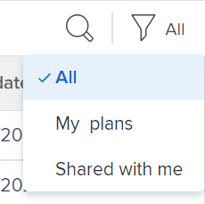
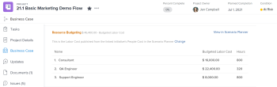
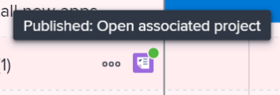

# Aggiornare o creare progetti pubblicando iniziative in [!DNL Scenario Planner]

Pubblicazione di uno scenario da [!DNL Adobe Workfront Scenario Planner] esegue le operazioni seguenti:

* Crea progetti dalle iniziative sullo scenario e li collega tra loro.
* Aggiorna i progetti già collegati alle iniziative sullo scenario con informazioni provenienti dall’iniziativa collegata. I progetti possono anche essere collegati alle iniziative quando vengono importati in un piano. Per informazioni, consulta [Importa progetti nei piani in [!DNL Scenario Planner]](../scenario-planner/import-projects-to-plans.md)

## Requisiti di accesso

Devi avere i seguenti:

<table style="table-layout:auto"> 
 <col> 
 <col> 
 <tbody> 
  <tr> 
   <td> 
[!DNL Adobe Workfront] piano*
 </td> 
   <td>[!UICONTROL Business] o versione successiva</td> 
  </tr> 
  <tr> 
   <td> 
[!DNL Adobe Workfront] licenza*
 </td> 
   <td> 
[!UICONTROL Review] o versione successiva
 </td> 
  </tr> 
  <tr> 
   <td>Prodotto </td> 
   <td> 
È necessario acquistare una licenza aggiuntiva per [!DNL Adobe Workfront Scenario Planner] per accedere alle funzionalità descritte in questo articolo.
 
Per informazioni su come ottenere [!DNL Workfront Scenario Planner], vedi <a href="../scenario-planner/access-needed-to-use-sp.md" class="MCXref xref">Accesso necessario per utilizzare [!DNL Scenario Planner]</a>. 
 </td> 
  </tr> 
  <tr data-mc-conditions=""> 
   <td> 

 
Livello di accesso*
 </td> 
   <td> 
    <ul> 
    <li>Accesso a [!UICONTROL Edit] per [!DNL Scenario Planner] e Progetti</li></ul>

<b>NOTA</b>

Se ancora non disponi dell’accesso, chiedi al tuo [!DNL Workfront] amministratore se impostano restrizioni aggiuntive nel livello di accesso. Per informazioni su come [!DNL Workfront] l&#39;amministratore può modificare il livello di accesso, vedi <a href="../administration-and-setup/add-users/configure-and-grant-access/create-modify-access-levels.md" class="MCXref xref">Creare o modificare livelli di accesso personalizzati</a>.
 </td>
</tr> 
  <tr data-mc-conditions=""> 
   <td> 
Autorizzazioni oggetto
 </td> 
   <td> 
    <ul> 
     <li>Autorizzazioni [!UICONTROL Manage] per il piano </li> 
     <li>Autorizzazioni [!UICONTROL Manage] per i progetti pubblicati</li> 
    </ul> 
Per informazioni sulla richiesta di accesso aggiuntivo ai progetti, consulta <a href="../workfront-basics/grant-and-request-access-to-objects/request-access.md" class="MCXref xref">Richiedi accesso agli oggetti </a>.
 
Per informazioni sulla richiesta di accesso aggiuntivo a un piano, vedere <a href="../scenario-planner/request-access-to-plan.md" class="MCXref xref">Richiedere l’accesso a un piano in [!DNL Scenario Planner]</a>.
 </td> 
  </tr> 
 </tbody> 
</table>

&#42;Per conoscere il piano, il tipo di licenza o l&#39;accesso di cui si dispone, contattare [!DNL Workfront] amministratore.

Per ulteriori informazioni sull&#39;accesso a [!DNL Workfront Scenario Planner], vedi [Accesso necessario per utilizzare [!DNL Scenario Planner]](../scenario-planner/access-needed-to-use-sp.md).

## Prerequisiti

Prima di iniziare:

* È necessario creare e salvare un piano prima di poter pubblicare le iniziative da esso.
* L’impostazione Consenti agli utenti di creare progetti senza utilizzare un modello deve essere abilitata nell’area Preferenze progetto della Configurazione. Per informazioni, consulta [Configurare le preferenze di progetto a livello di sistema](/help/quicksilver/administration-and-setup/set-up-workfront/configure-system-defaults/set-project-preferences.md).

## Considerazioni sulla pubblicazione di iniziative nei progetti

* È possibile pubblicare un solo scenario da un piano.
* Un’iniziativa può essere collegata a un solo progetto.
* Un progetto può essere collegato a più di un’iniziativa quando le iniziative appartengono a piani diversi.

  >[!TIP]
  >
  >Quando un progetto è presente in più piani e si pubblicano informazioni nel progetto da tutti i piani, la pubblicazione più recente sovrascrive quella esistente [!DNL Scenario Planner] informazioni sul progetto.

* Se sul piano sono state create iniziative importando progetti, la pubblicazione dell’iniziativa aggiorna anche i progetti collegati con informazioni sull’iniziativa.

  >[!TIP]
  >
  >Puoi importare lo stesso progetto in più piani. La pubblicazione potrebbe sovrascrivere le informazioni sull’iniziativa in un progetto collegato a più iniziative.

  Per informazioni sulla creazione di iniziative attraverso l&#39;importazione di progetti, consulta [Importa progetti nei piani in [!DNL Scenario Planner]](../scenario-planner/import-projects-to-plans.md).

* Eventuali modifiche apportate al progetto non vengono trasferite all’iniziativa collegata.

## Pubblica iniziative

>[!IMPORTANT]
>
>Se si apportano modifiche alle iniziative nel piano, inclusa la risoluzione dei conflitti, è necessario ripubblicare l&#39;iniziativa affinché le nuove informazioni siano visibili nel progetto. Queste informazioni vengono visualizzate sui progetti collegati alle iniziative solo quando pubblichi l’iniziativa corrispondente. Per informazioni sulla risoluzione dei conflitti tra iniziative, consulta [Risolvere i conflitti di iniziativa in [!DNL Scenario Planner]](../scenario-planner/resolve-conflicts-in-sp.md)

1. Fai clic su **[!UICONTROL Menu principale]** icona  nell’angolo superiore destro di Workfront, quindi fai clic su **[!UICONTROL Scenari]**
1. (Facoltativo e condizionale) Se si desidera pubblicare da un piano esistente, fare clic sul pulsante **[!UICONTROL Filtro]** icona  nell&#39;angolo superiore destro del piano e selezionare una delle opzioni seguenti:

   <table style="table-layout:auto"> 
    <col> 
    <col> 
    <tbody> 
     <tr> 
      <td role="rowheader">[!UICONTROL Tutto]</td> 
      <td>Visualizza tutti i piani di tua proprietà o condivisi con te. Questa è l'impostazione predefinita. </td> 
     </tr> 
     <tr> 
      <td role="rowheader">[!UICONTROL I miei piani]</td> 
      <td>Visualizza i piani creati.</td> 
     </tr> 
     <tr> 
      <td role="rowheader">[!UICONTROL condiviso con me]</td> 
      <td> 
Visualizza i piani non creati ma condivisi con l'utente.
 
Importante: per poter pubblicare i piani condivisi, è necessario disporre delle autorizzazioni [!UICONTROL Manage]. 
 </td> 
     </tr> 
    </tbody> 
   </table>

   

1. (Facoltativo) Fai clic su **[!UICONTROL Ricerca]** icona  e iniziare a digitare il nome di un piano per trovarlo rapidamente nell&#39;elenco.
1. (Condizionale) Per pubblicare da un nuovo piano, crea un piano.

   Per informazioni sulla creazione di piani, vedere [Creare e modificare i piani in [!DNL Scenario Planner]](../scenario-planner/create-and-edit-plans.md) .

1. (Facoltativo) Fare clic sul nome di un piano esistente e creare nuovi scenari per il piano.

   Per informazioni sulla creazione di scenari per un piano, vedere [Creare e confrontare scenari di piano in [!DNL Scenario Planner]](../scenario-planner/create-and-compare-scenarios-for-a-plan.md).

1. (Facoltativo) Aggiorna le iniziative di un piano esistente o nuovo o creane di nuovi.

   Per informazioni sulla creazione di iniziative, consulta [Creare e modificare le iniziative in [!DNL Scenario Planner]](../scenario-planner/create-and-edit-initiatives.md).

1. Clic **[!UICONTROL Salva piano]**.
1. Seleziona lo scenario da pubblicare dal **[!UICONTROL Scenario iniziale]** menu a discesa, quindi fai clic su **[!UICONTROL Vai a Pubblica]**  nell’angolo superiore destro.

   Oppure

   Clic **[!UICONTROL Confronta scenari]**, passa il puntatore sulla scheda dello scenario da cui desideri pubblicare, quindi fai clic su **[!UICONTROL Vai a Pubblica]** .

   Il [!UICONTROL Pubblica iniziative] viene visualizzata una pagina con un elenco di tutte le iniziative dello scenario. Se una delle iniziative è stata pubblicata in precedenza, l’icona del progetto  viene visualizzato dopo il nome e il simbolo **[!UICONTROL Ultima pubblicazione]** La data viene inserita nell&#39;elenco.

   >[!TIP]
   >
   >Le iniziative create importando progetti visualizzano anche l&#39;icona del progetto  a destra del loro nome

   

1. (Facoltativo e condizionale) Se si desidera pubblicare da un piano esistente, fare clic sul pulsante **[!UICONTROL Filtro]** icona  nell&#39;angolo superiore destro del piano e selezionare una delle opzioni seguenti:

   <table style="table-layout:auto"> 
    <col> 
    <col> 
    <tbody> 
     <tr> 
      <td role="rowheader">[!UICONTROL Tutto]</td> 
      <td>Visualizza tutte le iniziative dello scenario selezionato. </td> 
     </tr> 
     <tr> 
      <td role="rowheader">[!UICONTROL pubblicato]</td> 
      <td>Visualizza le iniziative pubblicate in precedenza da te o da un altro utente. </td> 
     </tr> 
     <tr> 
      <td role="rowheader">[!UICONTROL non pubblicato]</td> 
      <td> 
Visualizza le iniziative non pubblicate. 
 </td> 
     </tr> 
    </tbody> 
   </table>

   

1. (Facoltativo) Fai clic su **[!UICONTROL Ricerca]** icona  e inizia a digitare il nome di un’iniziativa per trovarla rapidamente nell’elenco.
1. Seleziona una o più iniziative per pubblicarle e creare o aggiornare i progetti da esse, quindi fai clic su **[!UICONTROL Pubblica iniziative]**.

   Questo crea un nuovo progetto da ciascuna iniziativa selezionata o aggiorna i progetti connessi esistenti, se le iniziative pubblicate erano già collegate a un progetto.

   >[!TIP]
   >
   >I nuovi progetti hanno lo stesso nome delle iniziative pubblicate.

1. (Condizionale) Effettua una delle seguenti operazioni:

   * Se hai pubblicato un&#39;iniziativa, fai clic su **[!UICONTROL Vedi progetto associato]** per aprire il progetto creato o aggiornato dall’iniziativa.
   * Se hai pubblicato più di un’iniziativa, fai clic su **[!UICONTROL Vedi progetti associati]** per aprire un elenco di progetti pubblicati da iniziative. [!DNL Workfront] applica il [!DNL Scenario Planner] Per impostazione predefinita, i progetti si filtrano per visualizzare l’elenco dei progetti. I progetti pubblicati più di recente sono elencati per primi.

     

1. Vai alle seguenti aree per visualizzare le informazioni sull’iniziativa sul progetto:

   * **Il [!UICONTROL Aggiornamenti] sezione**: viene pubblicato un aggiornamento per indicare che il progetto è stato creato o aggiornato dall’iniziativa. L’aggiornamento contiene il nome dell’iniziativa che ha creato o aggiornato il progetto e il nome collegato del piano che contiene l’iniziativa. È possibile fare clic sul nome del piano nell&#39;aggiornamento per aprirlo nel [!DNL Scenario Planner].

     

   * **Il [!UICONTROL Panoramica] area del [!UICONTROL Dettagli progetto] sezione**: un nuovo [!DNL Scenario Planner] viene creata una sezione in quest’area che contiene informazioni dall’iniziativa collegata.

     

     Le seguenti informazioni sull’iniziativa sono pubblicate nel [!DNL Scenario Planner] area del [!UICONTROL Dettagli progetto] sezione:

     <table style="table-layout:auto"> 
      <col> 
      <col> 
      <tbody> 
       <tr> 
        <td role="rowheader">[!UICONTROL Initiative Duration] </td> 
        <td>La durata dell’iniziativa corrispondente quando il progetto è collegato a un’iniziativa. Campo non modificabile. </td> 
       </tr> 
       <tr> 
        <td role="rowheader">[!UICONTROL Data ultima pubblicazione] </td> 
        <td>Data dell’ultima pubblicazione del progetto da un’iniziativa corrispondente. </td> 
       </tr> 
       <tr> 
        <td role="rowheader">[!UICONTROL Initiative Start Date] </td> 
        <td>Il primo giorno del mese di inizio dell’iniziativa, quando il progetto è collegato a un’iniziativa. </td> 
       </tr> 
       <tr> 
        <td role="rowheader">[!UICONTROL Initiative End Date] </td> 
        <td>Ultimo giorno della fine del mese dell’iniziativa, quando il progetto è collegato a un’iniziativa.  </td> 
       </tr> 
       <tr> 
        <td role="rowheader">[!UICONTROL Initiative Job Roles in FTE e Ore] </td> 
        <td> 
Informazioni sulle mansioni associate e sulle loro allocazioni di tempo per l’iniziativa. Ciò include:
 
         <ul> 
          <li>Nome mansione</li> 
          <li>Numero di FTE</li> 
          <li> 
Numero di ore per tutti gli FTE
 
Puoi stimare la quantità di mansioni necessarie per il piano o l’iniziativa utilizzando ore o FTE.
 
Per ulteriori informazioni, consulta <a href="../scenario-planner/create-and-edit-plans.md" class="MCXref xref">Creare e modificare i piani nella Pianificazione scenario</a>. 
 </li> 
         </ul> 
      
<b>SUGGERIMENTO</b>

     Se il numero di mansioni è diverso per ogni mese nell’iniziativa, questo campo mostra la quantità massima di mansioni necessarie per l’iniziativa. Ad esempio, se hai bisogno di 1 Consulente per gennaio e 2 per febbraio, nella colonna vengono visualizzati 2 FTE e l’importo corrispondente di ore per 2 FTE per tutti i mesi.
 </td>
     </tr> 
      </tbody> 
     </table>

     >[!NOTE]
     >
     >Tutti gli utenti con [!UICONTROL Visualizza] l&#39;accesso al progetto può visualizzare [!DNL Scenario Planner] sezione nella sezione [!UICONTROL Panoramica] area. Puoi controllare se questa area viene visualizzata nel [!UICONTROL Dettagli] mediante un modello di layout. Se agli utenti non è associato un modello di layout, questa area viene visualizzata per impostazione predefinita.
     >
     >   
     >   
     >   * Per informazioni sull&#39;aggiunta o la rimozione di aree nel [!UICONTROL Dettagli] utilizzando un modello di layout, vedere [Personalizzare [!UICONTROL Dettagli] visualizzare utilizzando un modello di layout](../administration-and-setup/customize-workfront/use-layout-templates/customize-details-view-layout-template.md).
     >   * Per ulteriori informazioni sulla visualizzazione delle informazioni in [!UICONTROL Panoramica] area del [!UICONTROL Dettagli progetto], vedi [[!UICONTROL Gestisci] informazioni nel progetto [!UICONTROL Panoramica] area](../manage-work/projects/manage-projects/understand-project-overview-area.md).
     >   
     >

   * **Il [!UICONTROL Allocazione mansioni] pannello in [!UICONTROL Bilanciatore dei carichi di lavoro] o l’elenco delle attività del progetto**: informazioni sull’allocazione dei ruoli nell’iniziativa vengono popolate in quest’area, oltre che nel progetto.

     Per ulteriori informazioni, consulta [Panoramica sulla riconciliazione delle allocazioni di risorse tra progetti e iniziative](../scenario-planner/overview-reconcile-allocations-between-projects-initiatives.md).

     

     Eventuali modifiche alle date o alle risorse del progetto non influiscono sull’iniziativa corrispondente o su una qualsiasi delle aree del progetto che contengono informazioni sull’iniziativa.

   * **Il [!UICONTROL Budget risorse] area del [!UICONTROL Business Case] del progetto**: nuova opzione per la gestione delle risorse del progetto tramite [!DNL Scenario Planner] le informazioni vengono aggiunte in [!UICONTROL Budget risorse] area del [!UICONTROL Business Case] del progetto.

     Per ulteriori informazioni, consulta [Risorse di budget nel [!UICONTROL Business Case] utilizzando [!DNL Scenario Planner]](../manage-work/projects/define-a-business-case/budget-resources-in-business-case-use-scenario-planner.md).

     

1. (Facoltativo) Rivedi le seguenti informazioni nelle [!DNL Scenario Planner] dopo aver pubblicato uno scenario:

   * Lo scenario pubblicato diventa il primo scenario dopo la pubblicazione delle iniziative da esso derivanti.
   * Non puoi pubblicare da nessun altro scenario dopo aver pubblicato uno scenario almeno una volta.
   * Il [!UICONTROL Vai a Pubblica] L’opzione viene rimossa da tutti gli altri scenari dopo la pubblicazione di almeno un’iniziativa da uno scenario.
   * Accanto alle icone di progetto delle iniziative pubblicate nel piano viene visualizzato un indicatore verde.

     

   * Nella parte superiore dello scenario e sulla scheda dello scenario viene visualizzato un indicatore verde &quot;Pubblicato&quot; e il campo Pubblicato viene popolato sulla scheda dello scenario, indicando il numero di iniziative nello scenario che sono state pubblicate.

     

     >[!TIP]
     >
     >Se tutti i progetti pubblicati dalle iniziative dello scenario vengono eliminati, l’indicazione che lo scenario è stato pubblicato viene rimossa. Per informazioni, consulta [Elimina progetti](../manage-work/projects/manage-projects/delete-projects.md).

1. (Facoltativo) Aggiornare le informazioni sull&#39;iniziativa e ripetere il processo descritto in precedenza per ripubblicare l&#39;iniziativa e aggiornare le informazioni sull&#39;iniziativa sul progetto collegato.

   Per informazioni sulla modifica delle iniziative, consulta [Creare e modificare le iniziative in [!DNL Scenario Planner]](../scenario-planner/create-and-edit-initiatives.md).

