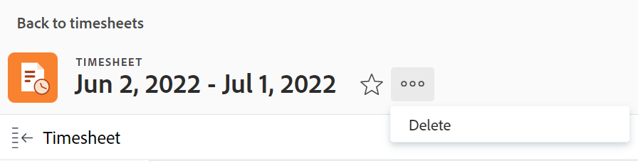

# Eliminare timesheet in Adobe Workfront

Le modifiche apportate a un profilo scheda orario non sono immediatamente valide per le schede orario esistenti, come spiegato in [Creare, modificare e assegnare profili scheda orario](../../timesheets/create-and-manage-timesheets/create-timesheet-profiles.md). Per rendere visibili le modifiche nelle schede orario esistenti, devi eliminare le schede orario generate e generarne di nuove. Questo si applica solo alle schede orario generate associando profili della scheda orario agli utenti.

>[!NOTE]
>
>Le schede orario create manualmente non possono essere ricreate rigenerando le schede orario, a meno che gli utenti non siano stati associati a un profilo di scheda orario da quando la scheda orario è stata creata manualmente. L’eliminazione di una scheda orario creata manualmente può causare la perdita di dati. Per informazioni sulla creazione di una singola scheda orario, vedere [Creare una scheda orario monouso](../../timesheets/create-and-manage-timesheets/create-tmshts.md).

Gli amministratori di Adobe Workfront o di gruppi possono generare schede orario per tutti gli utenti del sistema. Per ulteriori informazioni sulla generazione manuale delle schede orario, consulta:

* [Generare manualmente schede orario](../../timesheets/create-and-manage-timesheets/manually-generate-timesheets.md)
* [Creare e gestire i profili delle schede orario di un gruppo](../../administration-and-setup/manage-groups/work-with-group-objects/create-and-modify-a-groups-timesheet-profiles.md)

>[!IMPORTANT]
>
>* Non puoi recuperare una scheda orario eliminata.
>* È consigliabile non eliminare le schede orario passate perché non vengono generate automaticamente in base ai profili delle schede orario. È possibile eliminare le schede attività correnti e future e generarle manualmente se si desidera che le modifiche apportate ai profili delle schede attività siano immediatamente visibili nelle nuove schede attività.
>* Quando elimini le schede orario, le ore registrate per attività, problemi e progetti non vengono eliminate. Solo le Ore Generali vengono eliminate con la scheda orario. In un editor di testo separato, annota le ore generali associate alla scheda orario. Una volta eliminata la scheda orario, puoi registrarla nella nuova scheda orario.
>

## Requisiti di accesso

+++ Espandi per visualizzare i requisiti di accesso per la funzionalità descritta in questo articolo.

<table style="table-layout:auto">
 <col> 
 <col>
 <tbody> 
  <tr> 
   <td>Pacchetto Adobe Workfront</td> 
   <td>
Qualsiasi
</td> 
  </tr> 
  <tr> 
   <td>Licenza di Adobe Workfront</td> 
   <td>
   
Standard

   
Piano
</td>
  </tr> 
  <tr> 
   <td>Configurazioni del livello di accesso</td> 
   <td>
Accesso amministrativo alle schede orario
 </td> 
  </tr> 
 </tbody> 
</table>

Per informazioni, consulta [Requisiti di accesso nella documentazione di Workfront](/help/quicksilver/administration-and-setup/add-users/access-levels-and-object-permissions/access-level-requirements-in-documentation.md).

+++

## Eliminare le schede orario in un elenco

{{step1-to-timesheets}}

Il filtro **All** è selezionato per impostazione predefinita e visualizza tutte le schede orario per le quali si dispone dell&#39;accesso.

1. (Facoltativo) Per aggiornare il filtro nell’elenco delle schede orario, effettua una delle seguenti operazioni:

   * Seleziona **Le mie approvazioni schede orario** nell&#39;angolo superiore destro della pagina per visualizzare solo le schede orario che hai approvato

     Oppure

     Seleziona **Le mie schede orario** per visualizzare solo le tue schede orario.

     In questo modo all’elenco delle schede orario vengono applicate le approvazioni delle mie schede orario o i filtri delle mie schede orario.

     

   * Fai clic sull&#39;icona Filtro  per applicare un filtro diverso o creane uno nuovo. Per informazioni sulla creazione o l&#39;aggiornamento dei filtri, vedere [Creare o modificare filtri in Adobe Workfront](../../reports-and-dashboards/reports/reporting-elements/create-filters.md).

   >[!NOTE]
   >
   >Le opzioni Approvazioni schede attività personali e Schede attività personali non vengono visualizzate nella parte superiore dell&#39;elenco delle schede attività o nell&#39;elenco dei filtri se l&#39;amministratore di Workfront o un amministratore di gruppo ha rimosso tali filtri dai controlli elenco nell&#39;area Configura o dal modello di layout. Per ulteriori informazioni, vedere [Personalizzare filtri, visualizzazioni e raggruppamenti utilizzando un modello di layout](../../administration-and-setup/customize-workfront/use-layout-templates/customize-fvg-list-controls-layout-template.md).

1. (Facoltativo) Fai clic sull&#39;icona **Visualizza**  o **Raggruppamento**  per applicare una visualizzazione o un raggruppamento diverso o crearne uno nuovo.

   Per informazioni sulla creazione di filtri, viste o raggruppamenti, vedere i seguenti articoli:

   * [Creare o modificare filtri in Adobe Workfront](../../reports-and-dashboards/reports/reporting-elements/create-filters.md)
   * [Creare o modificare le visualizzazioni in Adobe Workfront](../../reports-and-dashboards/reports/reporting-elements/create-edit-views.md)
   * [Creare raggruppamenti in Adobe Workfront](../../reports-and-dashboards/reports/reporting-elements/create-groupings.md)

1. Seleziona una o più schede orario da eliminare e fai clic sull&#39;icona **Elimina**  nella parte superiore dell&#39;elenco delle schede orario.

1. Fai clic su **Elimina**.

   Le schede orario selezionate vengono eliminate e non possono essere recuperate.

   Per generare nuove schede orario, accertati che gli utenti siano associati a un profilo di scheda orario e chiedi all’amministratore di Workfront o a un amministratore di gruppo di generare nuove schede orario.

   Per ulteriori informazioni vedi quanto segue:

   * [Crea, modifica e assegna profili scheda orario](../../timesheets/create-and-manage-timesheets/create-timesheet-profiles.md)
   * [Genera manualmente le schede orario](../../timesheets/create-and-manage-timesheets/manually-generate-timesheets.md)
   * [Creare e gestire i profili delle schede orario di un gruppo](../../administration-and-setup/manage-groups/work-with-group-objects/create-and-modify-a-groups-timesheet-profiles.md)

## Eliminare una scheda orario dalla pagina della scheda orario

{{step1-to-timesheets}}

1. Fai clic sulla scheda orario da eliminare per aprirla.
1. Fai clic sull&#39;icona [!UICONTROL **Altro**]  a destra del nome della scheda orario, quindi fai clic su **Elimina**.

   
1. Fai clic su [!UICONTROL **Elimina**] per confermare.

   La scheda orario viene eliminata e non può essere recuperata.
