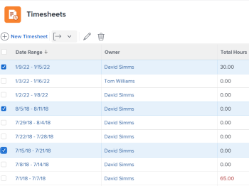

# Esporta un elenco di schede orario

In qualità di responsabile persone o approvatore scheda orario, potrebbe essere necessario scaricare un elenco di schede orario per visualizzare rapidamente le informazioni sulle schede orario delle persone di cui sei responsabile. Per farlo, esporta un elenco di schede orario.

## Requisiti di accesso

Per eseguire i passaggi descritti in questo articolo, è necessario disporre dei seguenti diritti di accesso:

<table style="table-layout:auto"> 
 <col> 
 <col> 
 <tbody> 
  <tr> 
   <td role="rowheader">Piano Adobe Workfront*</td> 
   <td> 
Qualsiasi
 </td> 
  </tr> 
  <tr> 
   <td role="rowheader">Licenza Adobe Workfront*</td> 
   <td> 
Revisione o successiva
 </td> 
  </tr> 
  <tr> 
   <td role="rowheader">Configurazioni del livello di accesso*</td> 
   <td> 
Accesso di visualizzazione o superiore per attività e problemi
 
Se non disponi ancora dell’accesso, chiedi all’amministratore di Workfront se ha impostato restrizioni aggiuntive nel tuo livello di accesso. Per informazioni su come un amministratore di Workfront può modificare il tuo livello di accesso, consulta <a href="../../administration-and-setup/add-users/configure-and-grant-access/create-modify-access-levels.md" class="MCXref xref">Creare o modificare livelli di accesso personalizzati</a>.
 </td> 
  </tr> 
  <tr> 
   <td role="rowheader">Autorizzazioni oggetto</td> 
   <td> 
Visualizza o autorizzazioni superiori per le schede orario
 
Per informazioni sulla richiesta di accesso aggiuntivo, vedere <a href="../../workfront-basics/grant-and-request-access-to-objects/request-access.md" class="MCXref xref">Richiedere l'accesso agli oggetti </a>.
 </td> 
  </tr> 
 </tbody> 
</table>

*Per conoscere il piano o il tipo di licenza di cui si dispone, contattare l&#39;amministratore Workfront.

## Esporta un elenco di schede orario

1. Fai clic sull&#39;icona  del **menu principale** nell&#39;angolo superiore destro di Adobe Workfront.

1. Fai clic su **Schede orario**. Il filtro **All** è selezionato per impostazione predefinita.

   

1. (Facoltativo) Fai clic sull&#39;icona **ricerca** , digita una parola chiave e cerca una scheda orario specifica. Ad esempio, puoi cercare un intervallo di tempo della scheda orario o il nome del proprietario.

1. (Facoltativo) Per aggiornare il filtro nell’elenco delle schede orario, effettua una delle seguenti operazioni:

   * Seleziona **Le mie approvazioni schede orario** nell&#39;angolo superiore destro della pagina per visualizzare solo le schede orario che hai approvato

     Oppure

     Seleziona **Le mie schede orario** per visualizzare solo le tue schede orario.

     In questo modo all’elenco delle schede orario vengono applicate le approvazioni delle mie schede orario o i filtri delle mie schede orario.

     

   * Fare clic sull&#39;icona Filtro  per applicare un filtro diverso o crearne uno nuovo. Per informazioni sulla creazione o l&#39;aggiornamento dei filtri, vedere [Creare o modificare filtri in Adobe Workfront](../../reports-and-dashboards/reports/reporting-elements/create-filters.md).

   >[!NOTE]
   >
   >Le opzioni Approvazioni schede attività personali e Schede attività personali non vengono visualizzate nella parte superiore dell&#39;elenco delle schede attività o nell&#39;elenco dei filtri se l&#39;amministratore di Workfront o un amministratore di gruppo ha rimosso i filtri Approvazioni schede attività personali e Schede attività personali dall&#39;area Controlli elenco nella configurazione o dal modello di layout. Per ulteriori informazioni, consulta i seguenti articoli:
   >
   >   
   >   
   >   * [Personalizzare filtri, visualizzazioni e raggruppamenti utilizzando un modello di layout](../../administration-and-setup/customize-workfront/use-layout-templates/customize-fvg-list-controls-layout-template.md)
   >   
   >

1. (Facoltativo) Fai clic sulle icone **Visualizza**  o **Raggruppamento**  per applicare una visualizzazione o un raggruppamento diverso o per crearne uno nuovo.

   Per informazioni sulla creazione di filtri, viste o raggruppamenti, vedere i seguenti articoli:

   * [Creare o modificare filtri in Adobe Workfront](../../reports-and-dashboards/reports/reporting-elements/create-filters.md)
   * [Creare o modificare le visualizzazioni in Adobe Workfront](../../reports-and-dashboards/reports/reporting-elements/create-edit-views.md)
   * [Creare raggruppamenti in Adobe Workfront](../../reports-and-dashboards/reports/reporting-elements/create-groupings.md)

1. Seleziona le schede orario da esportare, quindi fai clic sull&#39;icona **Esporta** .

   

1. Seleziona il tipo di file in cui desideri esportare l’elenco delle schede orario tra le seguenti opzioni:

   * PDF - Paesaggio
   * Verticale PDF
   * Altre dimensioni PDF
   * Excel
   * Excel (xlsx)
   * Delimitato in tabella

   Un elenco di schede orario viene scaricato nel computer nel formato selezionato e include le seguenti informazioni sulla scheda orario:

   * Intervallo date
   * Nome del proprietario
   * Ore totali
   * Quantità di lavoro straordinario
   * Nomi approvatori
   * Stato
