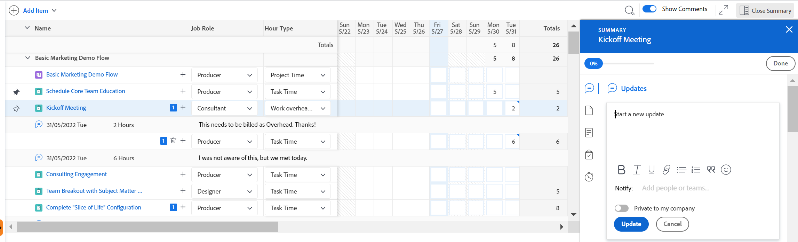

# Registra ore

<!--Audited: 5/2025-->

<!--remove all preview and production references if any-->
<!--update screen shots for the general hour entries and the mixed selection of hours at production, if they fixed the bugs -->

<!--

The highlighted information on this page refers to functionality not yet generally available. It is available only in the Preview environment for all customers. The same features will also be available in the Production environment for all customers after a week from the Preview release.     

For more information, see [Interface modernization](/help/quicksilver/product-announcements/product-releases/interface-modernization/interface-modernization.md). 

-->

È possibile registrare il tempo degli elementi di lavoro in Adobe Workfront per indicare il numero di ore dedicate al loro lavoro. È inoltre possibile registrare il tempo non correlato al lavoro, ad esempio ferie, malattia o riunioni. L&#39;ora registrata viene visualizzata nella scheda orario.

Per ulteriori informazioni sul tipo di ore che è possibile accedere a Workfront, vedere [Gestione dei tipi di ore](../../administration-and-setup/set-up-workfront/configure-timesheets-schedules/hour-types.md).

## Requisiti di accesso

+++ Espandere per visualizzare i requisiti di accesso.

<table style="table-layout:auto"> 
 <col> 
 <col> 
 <tbody> 
  <tr> 
   <td role="rowheader">piano Adobe Workfront</td> 
   <td> 
Qualsiasi
 </td> 
  </tr> 
  <tr> 
   <td role="rowheader">Licenza Adobe Workfront*</td> 
   <td> 
   <ul><li> Chiaro o superiore per registrare le ore per un'attività, un problema o le ore generali su una scheda orario</li>
   <li>Standard per registrare le ore nei progetti</li></ul>

Oppure: 

<ul><li>Revisione o successiva per registrare le ore generali in una scheda orario</li>
   <li>Lavoro o superiore per registrare le ore su un progetto, attività o problema</li></ul> </td> 
  </tr> 
  <tr> 
   <td role="rowheader">Configurazioni del livello di accesso</td> 
   <td> 
Modifica l'accesso al tipo di elemento di lavoro per il quale si registra il tempo 
 
Ad esempio, per registrare il tempo relativo ai problemi è necessario disporre dell’accesso in Modifica ai problemi
 </td> 
  </tr> 
  <tr> 
   <td role="rowheader">Autorizzazioni oggetto</td> 
   <td> 
Autorizzazioni Contribute o superiori per l'elemento di lavoro per il quale si registra il tempo, che includono le autorizzazioni per Registrare le ore
 </td> 
  </tr> 
 </tbody> 
</table>

*Per ulteriori informazioni, consulta [Requisiti di accesso nella documentazione di Workfront](/help/quicksilver/administration-and-setup/add-users/access-levels-and-object-permissions/access-level-requirements-in-documentation.md).

+++

## Considerazioni durante l’accesso a Workfront

* È possibile registrare il tempo per progetti, attività o problemi oppure è possibile registrare il tempo direttamente nella scheda orario.

  Per informazioni sulla creazione delle schede orario, vedere [Creare una scheda orario monouso](../../timesheets/create-and-manage-timesheets/create-tmshts.md).

* Tutti gli orari registrati tramite strumenti diversi dalla scheda orario vengono visualizzati nella scheda orario per il periodo di tempo corrispondente.
* Le attività e i problemi relativi a un progetto non corrente non vengono precompilati in una scheda orario.
* Il tempo registrato nella scheda orario viene applicato immediatamente all’attività, al problema o al progetto.
* Le schede orario includono il tempo totale per tutte le date registrate. I fine settimana sono sempre inclusi, anche quando i calcoli della sequenza temporale sono stati configurati per escluderli (come descritto in [Configurare le preferenze di progetto a livello di sistema](../../administration-and-setup/set-up-workfront/configure-system-defaults/set-project-preferences.md)).
* Il numero massimo di elementi visualizzati in una scheda orario è 45. Se sono presenti più di 45 elementi le cui date corrispondono all’intervallo di tempo della scheda orario, vengono visualizzati solo gli elementi aggiornati più di recente.
* Le ore inserite nei record di fatturazione fatturate sono oscurate e non possono essere modificate nella scheda orario. Per ulteriori informazioni, vedere [Creare record fatturazione](../../manage-work/projects/project-finances/create-billing-records.md).
* Per impostazione predefinita, le attività personali non vengono visualizzate nella scheda orario. Le attività personali vengono visualizzate nella scheda orario solo quando sono registrate. Dopo aver registrato l&#39;ora in un&#39;attività personale, è possibile aggiungere l&#39;attività alla scheda attività e rimarrà nella scheda attività se rimane bloccata. Per ulteriori informazioni, vedere [Creare elementi di lavoro e progetti dall&#39;area Home](../../workfront-basics/using-home/using-the-home-area/create-work-items-in-home.md).

## Registra ore {#log-time-section}

In Workfront è possibile registrare il tempo nelle seguenti aree:

* [Scheda orario](#timesheet)
* [Home](#home)
* [Progetto, attività o problema](#project-task-or-issue)
* [Pannello di Riepilogo](#summary-panel)
* [Bacheche](#boards)
* [App mobile](#mobile-app)

### Scheda orario {#timesheet}

#### Tempo di connessione a una scheda orario {#log-time-on-a-timesheet}

Puoi registrare il tempo ai seguenti elementi nella scheda orario:

* Attività, problemi e progetti precompilati che vengono visualizzati automaticamente, in base al modo in cui l’amministratore di Workfront imposta le preferenze della scheda orario. Per informazioni sulle modalità di precompilazione delle schede orario, vedere [Configurare le preferenze relative alle ore e alla scheda orario](../../administration-and-setup/set-up-workfront/configure-timesheets-schedules/timesheet-and-hour-preferences.md).

  Solo le attività e i problemi assegnati sono precompilati nella scheda orario. Le attività e i problemi assegnati ai tuoi team o alle tue mansioni non compilano automaticamente la scheda orario.

  Facendo clic su Lavoraci per un elemento assegnato ai team, l&#39;elemento verrà assegnato all&#39;utente e verrà visualizzato nella scheda attività.

* Attività, problemi o progetti aggiunti manualmente.
* Attività, problemi o progetti per i quali hai già effettuato l’accesso altrove in Workfront.
* Tempo generale (ferie, formazione, tempo di lavoro).

>[!NOTE]
>
>Gli utenti di revisione assegnati a un profilo Scheda orario possono visualizzare l’area Schede orario e registrare le ore generali. Tuttavia, non possono registrare le ore per le attività o i problemi assegnati che compaiono nella scheda orario.

Per registrare l’ora su una scheda orario:

{{step1-click-main-menu}}

1. Fai clic su [!UICONTROL **Schede orario**]. La scheda orario corrente viene visualizzata per impostazione predefinita.
   

1. (Facoltativo) Fai clic sull&#39;icona **a schermo intero**  per visualizzare la scheda orario in modalità a schermo intero, quindi fai clic sull&#39;icona **a schermo intero**  per tornare alla scheda orario.

   <!-- drafted for the resize columns in timesheet story: 1. (optional) Click on the separator lines between weeks or between the time frame area and the work item area to resize the columns of the timesheet.-->

1. (Facoltativo) Per aggiungere un progetto, un&#39;attività o un problema alla scheda attività, fai clic sul menu a discesa **Aggiungi elemento** nell&#39;angolo superiore sinistro della scheda attività, quindi fai clic su **Aggiungi progetti**, **Aggiungi attività** o **Aggiungi problemi**.

   Viene visualizzato un elenco di progetti, attività o problemi.

   <!--drafted for full screen mode for add projects story - align it with the rest of the steps when you enable this:: 1. (Optional) Click the **full-screen** icon  to display the list of objects in full-screen mode.-->

1. (Facoltativo) Fai clic sull&#39;icona di ricerca  per cercare un elemento specifico utilizzando una parola chiave da aggiungere alla scheda orario.

1. (Facoltativo) Espandere i menu a discesa di filtro, visualizzazione o raggruppamento per applicarne o personalizzarne uno e visualizzare le informazioni sull&#39;elemento desiderate.

1. Seleziona uno o più elementi nell&#39;elenco, quindi fai clic su **Aggiungi**.

   Se sono stati aggiunti meno di 50 elementi alla volta, gli elementi verranno aggiunti alla scheda orario. Le attività e i problemi sono elencati con il nome del progetto.

   >[!NOTE]
   >
   >Quando aggiungi attività o problemi alla scheda orario, viene aggiunto anche il progetto.

1. (Facoltativo) Se aggiungi 50 o più elementi contemporaneamente, viene visualizzato un messaggio di conferma con il numero di elementi aggiunti alla scheda orario.

   Fai clic su **Aggiungi tutti** per aggiungere tutti gli elementi
Oppure
Fai clic su **Annulla** per interrompere l&#39;aggiunta degli elementi selezionati, quindi su **Annulla** per chiudere l&#39;elenco degli elementi.

   Le attività e i problemi sono elencati con il nome del progetto.

   >[!NOTE]
   >
   >Gli elementi aggiunti manualmente alla scheda orario vengono bloccati e rimarranno nella scheda corrente e in quelle future fino a quando non verranno sbloccati manualmente per rimuoverli. Per informazioni sulla rimozione degli elementi dalla scheda orario, continuare con il passaggio 10.

   <!--(ensure this stays accurate)-->

1. (Facoltativo) Fai clic sulle icone **Comprimi**  o **Espandi**  accanto al nome del progetto per visualizzare o nascondere l&#39;elenco delle attività e dei problemi del progetto.

   >[!TIP]
   >
   >   Quando utilizzi una tastiera QWERTY standard e dopo aver fatto clic sul nome di un progetto nella scheda orario, premi i seguenti tasti per comprimere o espandere il progetto:
   >   * Per espandere il progetto e visualizzarne gli elementi di lavoro:
   >     * Maiusc + Alt + Freccia su per computer Windows
   >     * Maiusc + Opzione + Freccia su per computer Mac
   >   * Per comprimere il progetto e nasconderne gli elementi di lavoro:
   >     * Maiusc + Alt + freccia Giù per computer Windows
   >     * Maiusc + Opzione + freccia Giù per computer Mac.

1. (Facoltativo) Per fissare manualmente un elemento da visualizzare automaticamente sulla scheda orario, passa il puntatore del mouse sul nome dell&#39;elemento e fai clic sull&#39;icona **pin** .

   >[!TIP]
   >
   >   Quando si utilizza una tastiera QWERTY standard dopo aver fatto clic su un elemento nella scheda orario, premere il seguente set di tasti per fissare un elemento:
   >   * Opzione + P per computer Windows e Mac.

1. (Facoltativo) Fare clic sull&#39;icona di ricerca  e iniziare a digitare una parola chiave per trovare un progetto, un&#39;attività o un problema nella scheda attività.

1. (Condizionale) Se l&#39;amministratore del Workfront o del gruppo ha abilitato l&#39;impostazione **Assegnare manualmente le mansioni alle ore**, selezionare una mansione dal menu a discesa. Il ruolo specificato quando si è assegnati all&#39;elemento di lavoro viene visualizzato per impostazione predefinita. Se all&#39;utente non è stato assegnato un ruolo sull&#39;oggetto, il Ruolo principale viene visualizzato come predefinito. Per ulteriori informazioni su questa impostazione, vedere l&#39;articolo [Configurare le preferenze relative alle ore e alle schede orario](../../administration-and-setup/set-up-workfront/configure-timesheets-schedules/timesheet-and-hour-preferences.md).

   

1. (Facoltativo) Fai clic sull&#39;icona **+** per aggiungere un&#39;altra riga, quindi seleziona un nuovo tipo di ora dal menu a discesa nella colonna [!UICONTROL Tipo di ora] per registrare l&#39;ora per un tipo di ora diverso.

   

   >[!TIP]
   >
   >   A seconda del sistema operativo o del browser in uso e quando si utilizza una tastiera QWERTY standard, premere i tasti seguenti per aggiungere un&#39;altra riga:
   >   * Ctrl + Opzione + + per computer Windows
   >   * Cmd + Opzione + + per computer Mac

   I tipi di ore sono disponibili a seconda di ciò che è stato definito a livello di sistema, progetto e utente, come descritto in [Definire i tipi di ore e la disponibilità](define-hour-types-and-availability.md).

   Impossibile modificare il tipo di ora dopo la chiusura di una scheda orario.

   >[!TIP]
   >
   >Se in precedenza si registrava l&#39;ora e il tipo di ora selezionato è ora disattivato, l&#39;intera riga per l&#39;ora registrata viene oscurata. Se si seleziona un altro tipo di ora e si aggiorna la pagina, l’opzione del tipo di ora disattivata viene rimossa dall’elenco a discesa, pertanto non è possibile aggiungere ore aggiuntive a tale tipo di ora.
   >
   >Se si desidera mantenere il tipo di ora disattivato associato all&#39;ora registrata in precedenza, è consigliabile aggiungere una nuova riga per l&#39;elemento di lavoro per il quale si desidera registrare ulteriore tempo e selezionare un nuovo tipo di ora.

1. Fai clic sull&#39;icona **elimina**  accanto alla mansione per rimuoverla. Viene rimosso anche qualsiasi orario registrato per il ruolo.

   >[!TIP]
   >
   >   A seconda del sistema operativo o del browser in uso e quando si utilizza una tastiera QWERTY standard, premere i tasti seguenti per eliminare una riga:
   >   * Ctrl + Opzione + - per computer Windows
   >   * Cmd + Opzione + - per computer Mac

1. Specifica per quanto tempo desideri accedere a un dato giorno nella sezione timeline della scheda orario, quindi fai clic all’esterno della casella delle ore per salvare la voce delle ore. Le ore vengono salvate automaticamente. La riga per la quale si registra l&#39;ora è evidenziata in blu chiaro e la casella di immissione ore è evidenziata in blu scuro.

   

   Registra il tempo in ore o giorni. Questa impostazione è configurata dagli utenti con una licenza Pianificazione o dall&#39;amministratore di sistema, come descritto in [Specificare se l&#39;ora è registrata in ore o giorni](../../timesheets/config-timesheet-prefs/config-time-logged-hrs-days.md).

   >[!IMPORTANT]
   >
   >È necessario salvare la scheda orario manualmente se si verifica uno dei seguenti scenari:
   >
   >* Il ruolo associato all&#39;ora registrata in precedenza è stato modificato e l&#39;impostazione **Assegnare manualmente le mansioni alle ore** è stata disabilitata. La registrazione dell’ora per le nuove date la assocerà a un ruolo diverso.
   >   
   >   Se il ruolo è stato modificato e l&#39;impostazione **Assegna manualmente i ruoli alle voci orarie** è abilitata, è possibile registrare l&#39;ora o aggiornare il ruolo e le modifiche vengono salvate automaticamente.
   >
   >* La mansione assegnata a un&#39;attività o a un problema è diversa dalla mansione che il proprietario della scheda orario sta registrando con <!--or assigned to them_ this last  piece came from a Support note but but sure what role it's referring to. Leaving it out for now.-->.
   >
   >La scheda orario salverà nuovamente l’ora automaticamente quando non vi sono più voci in conflitto tra i due ruoli.
   >

1. (Facoltativo) Specifica la quantità di lavoro straordinario nel campo Straordinario dell’intestazione della scheda orario.

   >[!TIP]
   >
   >Non è possibile registrare un numero di ore di straordinario maggiore delle ore totali correnti nella scheda orario. Ad esempio, se hai registrato 7 ore sulla scheda orario finora, non puoi registrare 8 ore di lavoro straordinario.

1. (Facoltativo) Fai clic su **Commento** per aggiungere un commento alla tua immissione di ore.

   

   >[!TIP]
   >
   >   Quando si utilizza una tastiera QWERTY standard dopo aver fatto clic sulla casella di immissione ore, premere i tasti seguenti per aprire la casella dei commenti:
   >   * Maiusc+F2 per entrambi i computer Windows e Mac.

1. Fai clic su **Fine** per salvare il commento.

   >[!TIP]
   >
   >   Quando si utilizza una tastiera QWERTY standard, dall&#39;interno della casella del commento premere i seguenti tasti per salvare il commento:
   >   * Ctrl + Invio per i computer Windows.
   >   * Cmd + Invio per computer Mac.

1. (Facoltativo) Fai clic su **Mostra commenti** nella barra degli strumenti per visualizzare i commenti sulle ore inserite sotto l&#39;elemento di lavoro.

   

   >[!TIP]
   >
   >   Tutte le modifiche apportate alla scheda orario vengono salvate automaticamente.

1. (Facoltativo) Fai clic sulla riga di un&#39;attività o di un problema, quindi fai clic su **Apri riepilogo** nell&#39;angolo superiore destro della scheda orario per aggiungere un aggiornamento o per aggiornare le informazioni sull&#39;attività o sul problema. Il pannello Riepilogo si apre a destra.

   

   L’aggiornamento viene visualizzato nell’area Aggiornamenti dell’elemento di lavoro associato all’ora registrata.

   >[!TIP]
   >
   >Non è possibile aggiungere commenti ai progetti o alle ore General Time.

1. Fai clic su [!UICONTROL **Chiudi riepilogo**] per chiudere il pannello Riepilogo e tornare alla scheda orario.

1. (Facoltativo) Fai clic su [!UICONTROL **Aggiornamenti**] nel pannello a sinistra, quindi aggiungi un aggiornamento alla scheda orario. Per ulteriori informazioni sugli aggiornamenti di Workfront, vedere [Aggiorna lavoro](../../workfront-basics/updating-work-items-and-viewing-updates/update-work.md).

   

1. (Facoltativo) Torna all&#39;area **Scheda orario** per chiudere o inviare la scheda orario.

   * **Chiudi**: chiudi la scheda orario al termine dell&#39;aggiornamento. Questa opzione è disponibile solo quando la scheda orario non è associata a un approvatore.

   * **Invia per approvazione:** Questa opzione è disponibile solo se nella scheda orario è presente un approvatore. Salva le modifiche e invia per l&#39;approvazione. Se non è stata ancora concessa un&#39;approvazione, è possibile aprire la scheda orario dopo averla chiusa facendo clic su **Richiama**. Per ulteriori informazioni, vedere [Inviare una scheda orario per l&#39;approvazione](../../timesheets/create-and-manage-timesheets/submit-timesheet-for-approval.md).

   * **Rifiuta**: questa opzione viene visualizzata quando si è un approvatore della scheda orario e la scheda orario è stata inviata per l&#39;approvazione. Facendo clic su di essa, lo stato della scheda orario viene modificato in Rifiutato e la scheda orario rimane aperta.

   * **Approva**: questa opzione viene visualizzata quando si è un approvatore della scheda orario e la scheda orario è stata inviata per l&#39;approvazione. Facendo clic su di essa, lo stato della scheda orario viene modificato in Approvato e la scheda orario viene chiusa.

   >[!TIP]
   >
   >Le opzioni Rifiuta e Approva vengono visualizzate anche nella scheda attività quando si è un amministratore di sistema e la scheda attività è associata a un approvatore.

1. (Condizionale) Se la scheda attività è stata chiusa o inviata per l&#39;approvazione, fare clic su una delle opzioni seguenti:

   * **Riapri**: questa opzione è disponibile per le schede orario già chiuse e prive di approvatori o già approvate. Riapri la scheda orario per modificare le ore inserite.
   * **Ricorda**: questa opzione è disponibile per le schede orario inviate per l&#39;approvazione ma non ancora approvate o rifiutate. Fai clic su **Richiama** per riaprire la scheda orario e modificare le ore inserite.

#### Rimuovi un elemento dalla scheda orario

È possibile rimuovere una voce di un&#39;ora o un elemento (progetto, attività o problema) da una scheda orario.

Per rimuovere una voce di ora da una scheda orario:

1. Vai alla scheda orario e trova la voce dell&#39;ora che desideri rimuovere.
1. Sostituisci le ore inserite con 0
Oppure
Rimuovere le ore e sostituirle con 0, quindi premere Invio.

   Le ore vengono rimosse e la scheda orario viene salvata automaticamente.

È possibile rimuovere un elemento (progetto, attività o problema) dalla scheda attività sbloccandolo, se non si è ancora registrato tempo per esso e se l&#39;elemento è stato aggiunto manualmente (come descritto nei passaggi 4-8 nella sezione [Registra tempo su una scheda attività](#log-time-on-a-timesheet) in questo articolo). <!--ensure this stays accurate-->

Non puoi rimuovere automaticamente gli elementi inclusi nella scheda orario in base alle preferenze della scheda orario nel tuo sistema Workfront o gruppo configurato per precompilare le schede orario (come descritto in [Configurare le preferenze della scheda orario e delle ore](../../administration-and-setup/set-up-workfront/configure-timesheets-schedules/timesheet-and-hour-preferences.md)). Gli elementi smettono di prepopolare la scheda orario quando le date degli elementi si trovano al di fuori dell’intervallo di tempo della scheda orario.

Per rimuovere un elemento dalla scheda orario aggiunto manualmente:

1. Verificare che non sia stato registrato alcun orario per l&#39;elemento.
1. Fai clic sull&#39;icona **sblocca**  accanto all&#39;elemento per sbloccare l&#39;elemento dalla scheda orario.

   >[!TIP]
   >
   >   Quando si utilizza una tastiera QWERTY standard dopo aver fatto clic su un elemento nella scheda orario, premere i tasti seguenti per sbloccare un elemento:
   > * Opzione + P per computer Windows e Mac.

   L&#39;elemento viene rimosso dalla scheda orario dopo l&#39;aggiornamento della pagina.

### Pagina Home {#home}

Puoi registrare l’ora specifica del progetto nella Home.

Per informazioni generali sull&#39;utilizzo dell&#39;area Home, vedere [Utilizzare l&#39;area Home](../../workfront-basics/using-home/using-the-home-area/use-the-home-area.md).

<!--#### Log time on a work item from the new Home area-->

Puoi registrare il tempo necessario per le attività e i problemi in qualsiasi widget utilizzando il pannello Riepilogo nell’area Home. Per informazioni, vedere la sezione [Summary panel](#summary-panel) in questo articolo.

Inoltre, per registrare il tempo di un elemento nel widget Il mio lavoro:

1. Vai alla **Home**.
1. Aggiungi il widget **Il mio lavoro** alla Home.
1. (Facoltativo) Seleziona un&#39;attività, un problema o una richiesta in un elenco, quindi fai clic su **Lavoraci**.
1. Passa il puntatore del mouse sull&#39;attività o sul problema per cui desideri registrare l&#39;ora, quindi fai clic sull&#39;icona **Registra ora**  a destra delle informazioni sull&#39;attività.

   Viene visualizzata la casella **Log time** (Tempo di registrazione).

   

1. Specifica le seguenti informazioni:

   * **Tipo di Ora**: seleziona un Tipo di Ora dal menu a discesa, se diverso da quello visualizzato per impostazione predefinita.

     A seconda dei tipi di ore configurati nel sistema, le opzioni disponibili possono variare. Per ulteriori informazioni sulla configurazione dei tipi di lavoro, vedere [Definire i tipi di lavoro e la disponibilità](../../timesheets/create-and-manage-timesheets/define-hour-types-and-availability.md).

   * **Ruolo**: (Condizionale) Se l&#39;amministratore del Workfront o del gruppo ha abilitato l&#39;impostazione **Assegna mansioni alle voci orarie manualmente**, seleziona una **Mansione** dal menu a discesa. Il Ruolo specificato quando si è assegnati all&#39;oggetto viene visualizzato per impostazione predefinita. Se all&#39;utente non è stato assegnato un Ruolo nell&#39;oggetto, il Ruolo principale viene visualizzato come impostazione predefinita. Per ulteriori informazioni su questa impostazione, vedere l&#39;articolo [Configurare le preferenze relative alle ore e alle schede orario](../../administration-and-setup/set-up-workfront/configure-timesheets-schedules/timesheet-and-hour-preferences.md).

   * Nel calendario settimanale, inserisci il numero di ore per il progetto, l&#39;attività o il problema.

1. Fare clic su **Tempo di registrazione**.

   L&#39;ora registrata viene visualizzata nella sezione Ore dell&#39;oggetto e nella scheda orario.

   Nel campo **Ore totali** della casella Registra ora vengono visualizzate tutte le ore registrate per il progetto, l&#39;attività o il problema da tutti gli utenti.

<!--#### Log time on a work item from the legacy Home area

1. In the **Work List** area, select the item where you want to log time.
1. In the right panel, click **Log Time**.  
  
     

1. In the **Enter Hours** drop-down menu, select the appropriate hour type.  
   Hour types are available depending on what has been defined at the system, project, and user levels, as described in [Define hour types and availability](../../timesheets/create-and-manage-timesheets/define-hour-types-and-availability.md).
1. (Conditional) If your Workfront or group administrator has enabled the **Assign job roles to hour entries manually** setting, select a job role from the drop-down menu. The role specified when you are assigned to the work item displays by default. If you are not assigned a role on the object, your Primary Role displays as the default. For more information on this setting, see the article [Configure timesheet and hour preferences](../../administration-and-setup/set-up-workfront/configure-timesheets-schedules/timesheet-and-hour-preferences.md).
1. Specify the time you want to log, then click **Log Time**.

   The logged time displays in the object's Hours section, nad in your timesheet. -->

### Progetto, attività o problema {#project-task-or-issue}

Puoi registrare l’ora specifica di un progetto su un progetto, un’attività o un problema nelle sezioni seguenti:

* [Sezione aggiornamenti](#updates-section)
* [Sezione ore](#hours-section)

#### Sezione aggiornamenti{#updates-section}

Per registrare l’ora nella sezione Aggiornamenti di un progetto, un’attività o un problema, è necessario disporre dei seguenti elementi:

* L&#39;accesso e le autorizzazioni corretti, come descritto nella sezione [Requisiti di accesso](#access-requirements) in questo articolo.

* Se desideri registrare l&#39;ora direttamente su un progetto, il tuo amministratore di Workfront deve abilitare l&#39;impostazione Registra ora direttamente sui progetti in [!UICONTROL **Scheda orario e ore**]> [!UICONTROL **Preferenze**] nell&#39;area Sistema.

  Per ulteriori informazioni su come consentire agli utenti di registrare le ore direttamente nei progetti, consulta [Configurare le preferenze di ore e schede orario](../../administration-and-setup/set-up-workfront/configure-timesheets-schedules/timesheet-and-hour-preferences.md).

Per registrare l’ora nella sezione Aggiornamenti di un progetto, un’attività o un problema:

1. Vai a un progetto, attività o problema.
1. Nel pannello a sinistra, seleziona **Aggiornamenti**.
1. Fare clic su **Tempo di registrazione**. <!-- did Anna B change the casing for this button? If yes and if she changed it for the other areas, update screen shot too-->

   Viene visualizzata la finestra di dialogo Registra ora.

   >[!TIP]
   >
   >   Se la preferenza del profilo è impostata sul tempo di registrazione in giorni, viene visualizzata la casella Enter Days (Inserisci giorni).
   >   
   >   Nell&#39;angolo superiore destro della casella Immettere i giorni è indicato il numero di ore incluse in un giorno.

   

1. Specifica le seguenti informazioni:

   * **Tipo di Ora**: seleziona un Tipo di Ora dal menu a discesa, se diverso da quello visualizzato per impostazione predefinita.

     A seconda dei tipi di ore configurati nel sistema, le opzioni disponibili possono variare. Per ulteriori informazioni sulla configurazione dei tipi di lavoro, vedere [Definire i tipi di lavoro e la disponibilità](../../timesheets/create-and-manage-timesheets/define-hour-types-and-availability.md).

   * **Ruolo**: (Condizionale) Se l&#39;amministratore del Workfront o del gruppo ha abilitato l&#39;impostazione **Assegna mansioni alle voci orarie manualmente**, seleziona una **Mansione** dal menu a discesa. Il Ruolo specificato quando si è assegnati all&#39;oggetto viene visualizzato per impostazione predefinita. Se all&#39;utente non è stato assegnato un Ruolo nell&#39;oggetto, il Ruolo principale viene visualizzato come impostazione predefinita. Per ulteriori informazioni su questa impostazione, vedere l&#39;articolo [Configurare le preferenze relative alle ore e alle schede orario](../../administration-and-setup/set-up-workfront/configure-timesheets-schedules/timesheet-and-hour-preferences.md).

   * Nel calendario settimanale, inserisci il numero di ore per il progetto, l&#39;attività o il problema.

1. Fare clic su **Tempo di registrazione**.

   L&#39;ora registrata viene visualizzata nella sezione Ore dell&#39;oggetto e nella scheda orario.

   Nel campo **Ore totali** della casella Registra ora vengono visualizzate tutte le ore registrate per il progetto, l&#39;attività o il problema da tutti gli utenti.

#### Sezione ore{#hours-section}

Per registrare i tempi di progetti, attività e problemi nella sezione Ore è necessario essere un amministratore Workfront,

Oppure

È necessario disporre di tutti i seguenti elementi:

* Una licenza Pianificazione con accesso amministrativo alle schede orario e alle ore. Per ulteriori informazioni sulla concessione dell&#39;accesso amministrativo alle schede orario e alle ore, vedere [Concedere agli utenti l&#39;accesso amministrativo ad alcune aree](../../administration-and-setup/add-users/configure-and-grant-access/grant-users-admin-access-certain-areas.md).
* Autorizzazioni Contribute o superiori per il progetto con accesso a Log Hours (Registra ore). Per ulteriori informazioni sulla concessione delle autorizzazioni per i progetti, vedere [Condividere un progetto in Adobe Workfront](../../workfront-basics/grant-and-request-access-to-objects/share-a-project.md).
* Se desideri registrare l&#39;ora direttamente su un progetto, il tuo amministratore di Workfront deve abilitare l&#39;impostazione Registra tempo direttamente sui progetti nella sezione **Timesheet &amp; Hours > Preferences** dell&#39;area Setup (Configurazione). Per ulteriori informazioni su come consentire agli utenti di registrare le ore direttamente nei progetti, consulta [Configurare le preferenze di ore e schede orario](../../administration-and-setup/set-up-workfront/configure-timesheets-schedules/timesheet-and-hour-preferences.md).

Per registrare il tempo nella sezione Ore di un progetto, attività o problema:

1. Vai a un progetto, attività o problema.
1. Nel pannello a sinistra, fai clic su **Ore**.
1. Fare clic su **Tempo di registrazione**.

   Viene visualizzata la casella **Log Time** (Tempo di registrazione).

   <!--

  
   

   
-->

1. Specifica le seguenti informazioni:

   * **Proprietario:** Per impostazione predefinita, il tuo nome viene visualizzato in questo campo.\
     Se si registrano le ore per un altro utente, specificarne il nome.

   * **Tipo di Ora**: seleziona un Tipo di Ora dal menu a discesa, se diverso da quello visualizzato per impostazione predefinita.

     A seconda dei tipi di ore configurati nel sistema, le opzioni disponibili possono variare.

     Per ulteriori informazioni sulla configurazione dei tipi di lavoro, vedere [Definire i tipi di lavoro e la disponibilità](../../timesheets/create-and-manage-timesheets/define-hour-types-and-availability.md).

   * **Ruolo**: (Condizionale) Se l&#39;amministratore del Workfront o del gruppo ha abilitato l&#39;impostazione **Assegna mansioni alle voci orarie manualmente**, seleziona una **Mansione** dal menu a discesa. Il Ruolo specificato quando si è assegnati all&#39;oggetto viene visualizzato per impostazione predefinita. Se all&#39;utente non è stato assegnato un Ruolo nell&#39;oggetto, il Ruolo principale viene visualizzato come impostazione predefinita. Per ulteriori informazioni su questa impostazione, vedere l&#39;articolo [Configurare le preferenze relative alle ore e alle schede orario](../../administration-and-setup/set-up-workfront/configure-timesheets-schedules/timesheet-and-hour-preferences.md).
   * **Ore**: immetti il numero di ore per il progetto, l&#39;attività o il problema. <!--In the weekly calendar, enter the number of hours for the project, task, or issue.-->
   * **Nota**: aggiungi una nota per spiegare a cosa servono le ore. Questa è stata salvata come **Nota ore** o come **Descrizione ore**.

1. Fare clic su **Tempo di registrazione**.

   L&#39;ora registrata viene visualizzata nella sezione Ore dell&#39;oggetto e nella scheda orario.

   Nel campo **Ore totali** della casella Registra ora vengono visualizzate tutte le ore registrate per il progetto, l&#39;attività o il problema da tutti gli utenti.

### Pannello di Riepilogo

Nel pannello Riepilogo potete registrare il tempo per le attività e i problemi.
Per ulteriori informazioni, vedere [Panoramica di riepilogo](../../workfront-basics/the-new-workfront-experience/summary-overview.md).

### Bacheche {#boards}

È possibile registrare il tempo sulle schede collegate su una scheda Workfront. Questa è la stessa procedura utilizzata per registrare il tempo su un’attività o un problema e le ore registrate sulla scheda vengono salvate sull’attività o sul problema connesso.
Per ulteriori informazioni, vedere [Utilizzare schede collegate nelle bacheche](/help/quicksilver/agile/get-started-with-boards/connected-cards.md).

### App mobile {#mobile-app}

Puoi registrare l’ora dall’app mobile di Workfront.
Per ulteriori informazioni, vedere [Adobe Workfront per Android](/help/quicksilver/workfront-basics/mobile-apps/using-the-workfront-mobile-app/workfront-for-android.md) o [Adobe Workfront per iOS](/help/quicksilver/workfront-basics/mobile-apps/using-the-workfront-mobile-app/workfront-for-ios.md).

## Modificare le ore registrate in elenchi e report

>[!CAUTION]
>
>* Non puoi modificare le ore che appartengono a una scheda orario chiusa. È innanzitutto necessario riaprire la scheda orario e quindi modificare le informazioni sulle ore.
>* Quando si modifica il Tipo di Ora da un tipo che non è considerato come ricavo a un altro tipo che è considerato come ricavo, si verificano anche modifiche ai dati finanziari del progetto. La modifica dei tipi di lavoro da un tipo che conta come ricavi a un tipo che non conta come ricavi aggiorna anche i dati finanziari del progetto.
>
>Per informazioni, vedere [Gestire i tipi di lavoro](/help/quicksilver/administration-and-setup/set-up-workfront/configure-timesheets-schedules/hour-types.md).
>

È possibile modificare le ore registrate nelle seguenti aree:

* Tutte le aree in cui hai aggiunto le ore, incluse le schede orario aperte
* Elenchi di ore e rapporti.

È possibile modificare i seguenti elementi di una voce oraria quando si modifica una voce oraria in un elenco o in un report:

* Numero di ore
* Tipo di ora
* Ruolo associato alla voce delle ore
* Descrizione della voce dell&#39;ora

A seconda del tipo di voci orarie modificate, i campi seguenti sono disponibili per la modifica in un elenco o in un report di ore:

* Quando si modificano le ore specifiche di un progetto:

   * Numero di ore
   * Il Tipo di Ora. Puoi cambiare il Tipo di Ora solo in tipi specifici per il progetto.
   * Assegnazione mansione. È possibile modificare l&#39;assegnazione della mansione solo se è stata abilitata in Configurazione. Per informazioni, consulta [Configurare le preferenze di orario e scheda orario](/help/quicksilver/administration-and-setup/set-up-workfront/configure-timesheets-schedules/timesheet-and-hour-preferences.md)
   * Descrizione della voce di ore.

  

* Quando si modificano le ore generali:

   * Il numero di ore.
   * Il Tipo di Ora. È possibile modificare il Tipo di Ora solo in tipi generali.
   * Descrizione della voce di ore.

>[!TIP]
>
> Non è possibile modificare l&#39;assegnazione del ruolo alle ore, perché le ore generali non possono essere associate ai ruoli.

<!--update the screen shot at production - we should not see the job role field for general hours-->

* Quando si modifica una combinazione di ore generali e di ore specifiche per il progetto, in blocco:

   * Il numero di ore.
   * Descrizione della voce di ore.

>[!TIP]
>
>* Non è possibile modificare il Tipo di Ora, perché i Tipi di Ora generali non possono essere modificati in Tipi di Ora specifici del progetto e i Tipi di Ora specifici del progetto non possono essere modificati in Tipi Generali.
>* Non è possibile modificare l&#39;assegnazione della mansione, perché le ore generiche non possono essere associate ai ruoli.

<!--update the screen shot at production - we should not see the job role and the hour type fields for mixed hour types-->

Per modificare i tipi di ore in un report o un elenco di ore:

1. Passa a un elenco di ore o a un report.
1. Fare clic sulla casella a sinistra di una o più ore per selezionarle.
1. Fai clic sull&#39;icona **Modifica**  nella parte superiore dell&#39;elenco.

   Viene visualizzata la casella **Modifica ore** o **Modifica ore**.
1. Aggiorna uno dei seguenti campi disponibili:

   * Ore. Questo è un campo obbligatorio.
   * Tipo di Ora. Questo è un campo obbligatorio.
   * Ruolo
   * Descrizione

   >[!TIP]
   >
   >   Non tutti i campi sono disponibili, a seconda del tipo di ora associato alle voci orarie selezionate.

1. Fai clic su **Salva modifiche**.

   Le informazioni sulle ore vengono aggiornate.
Se sono state selezionate più ore e si è modificato il campo Ore, la stessa quantità di ore viene allocata a tutte le ore selezionate. Le ore originali vengono sostituite con il nuovo valore per tutte le ore inserite selezionate.

