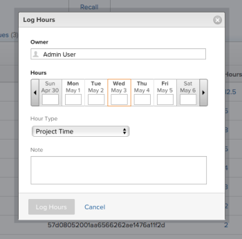

# Tempo di log

{{highlighted-preview}}

È possibile registrare il tempo necessario per gli elementi di lavoro in Adobe Workfront per indicare il numero di ore dedicate al loro lavoro. È inoltre possibile registrare il tempo che non è legato al lavoro, come le vacanze, il tempo di malattia, o il tempo che trascorri nelle riunioni. L&#39;ora di registrazione viene visualizzata nella scheda attività.

Per ulteriori informazioni sul tipo di ore di accesso a Workfront, consulta [Gestione dei tipi di ora](../../administration-and-setup/set-up-workfront/configure-timesheets-schedules/hour-types.md).

## Requisiti di accesso

<!--drafted for P&P - replace the table:

<table style="table-layout:auto"> 
 <col> 
 <col> 
 <tbody> 
  <tr> 
   <td role="rowheader">Adobe Workfront plan*</td> 
   <td> 
Any
 </td> 
  </tr> 
  <tr> 
   <td role="rowheader">Adobe Workfront license*</td> 
   <td> 
Current license: Light or higher

   
Legacy license: Review or higher
 </td> 
  </tr> 
  <tr> 
   <td role="rowheader">Access level configurations*</td> 
   <td> 
Edit access to the type of work item you log time for 
 
For example, you need Edit access to Issues, to log time for issues
 
If you still don't have access, ask your Workfront administrator if they set additional restrictions in your access level. For information on how a Workfront administrator can modify your access level, see <a href="../../administration-and-setup/add-users/configure-and-grant-access/create-modify-access-levels.md" class="MCXref xref">Create or modify custom access levels</a>.
 </td> 
  </tr> 
  <tr> 
   <td role="rowheader">Object permissions</td> 
   <td> 
Contribute or higher permissions on the work item you log time for that includes permissions to Log Hours
 
For information on requesting additional access, see <a href="../../workfront-basics/grant-and-request-access-to-objects/request-access.md" class="MCXref xref">Request access to objects </a>.
 </td> 
  </tr> 
 </tbody> 
</table>
-->

Per eseguire i passaggi descritti in questo articolo e registrare le ore specifiche del progetto, è necessario disporre dei seguenti diritti di accesso:

<table style="table-layout:auto"> 
 <col> 
 <col> 
 <tbody> 
  <tr> 
   <td role="rowheader">piano Adobe Workfront*</td> 
   <td> 
Qualsiasi
 </td> 
  </tr> 
  <tr> 
   <td role="rowheader">Licenza Adobe Workfront*</td> 
   <td> 
Revisione o superiore
 </td> 
  </tr> 
  <tr> 
   <td role="rowheader">Configurazioni a livello di accesso*</td> 
   <td> 
Modifica l'accesso al tipo di elemento di lavoro per il quale si registra il tempo 
 
Ad esempio, è necessario modificare l'accesso a Problemi, per registrare il tempo necessario per i problemi
 
Se non disponi ancora dell’accesso, chiedi all’amministratore Workfront se ha impostato ulteriori restrizioni nel livello di accesso. Per informazioni su come un amministratore Workfront può modificare il livello di accesso, consulta <a href="../../administration-and-setup/add-users/configure-and-grant-access/create-modify-access-levels.md" class="MCXref xref">Creare o modificare livelli di accesso personalizzati</a>.
 </td> 
  </tr> 
  <tr> 
   <td role="rowheader">Autorizzazioni oggetto</td> 
   <td> 
Contribuisci o autorizzazioni superiori per l'elemento di lavoro per il quale si registra il tempo, incluse le autorizzazioni per le ore di log
 
Per informazioni sulla richiesta di accesso aggiuntivo, vedi <a href="../../workfront-basics/grant-and-request-access-to-objects/request-access.md" class="MCXref xref">Richiedere l’accesso agli oggetti </a>.
 </td> 
  </tr> 
 </tbody> 
</table>

*Per sapere quale piano, tipo di licenza o accesso si dispone, contattare l&#39;amministratore Workfront.

## Considerazioni sul tempo di accesso in Workfront

* È possibile registrare il tempo per progetti, attività o problemi oppure è possibile registrare il tempo direttamente nella scheda attività.

   Per informazioni sulla creazione dei fogli presenze, consulta [Creare una scheda attività a uso singolo](../../timesheets/create-and-manage-timesheets/create-tmshts.md).

* Nella scheda attività vengono visualizzati tutti gli strumenti registrati per il periodo di tempo corrispondente, diversi dalla scheda attività.
* Le attività e i problemi relativi a un progetto non corrente non vengono precompilati in una scheda attività.
* L&#39;ora registrata nella scheda attività viene immediatamente applicata all&#39;attività, al problema o al progetto.
* I fogli presenze includono il tempo totale per tutte le date registrate. I fine settimana sono sempre inclusi, anche quando i calcoli della timeline sono stati configurati per escluderli (come descritto in [Configurare le preferenze del progetto a livello di sistema](../../administration-and-setup/set-up-workfront/configure-system-defaults/set-project-preferences.md)).
* Il numero massimo di elementi visualizzati in una scheda attività è 45. Se sono presenti più di 45 elementi le cui date corrispondono all&#39;intervallo di tempo della scheda attività, vengono visualizzati solo gli elementi aggiornati più di recente.
* Le voci orarie incluse nei record di fatturazione fatturati sono disattivate e non possono essere modificate nella scheda attività. Per ulteriori informazioni, consulta [Creazione di record di fatturazione](../../manage-work/projects/project-finances/create-billing-records.md).

## Tempo di log

In Workfront è possibile registrare l’ora nelle seguenti aree:

* [Scheda orario](#timesheet)
* [Home](#home)
* [Progetto, attività o problema](#project-task-or-issue)
* [Pannello di riepilogo](#summary-panel)
* [Bacheche](#boards)
* [App mobile](#mobile-app)

### Scheda orario {#timesheet}

È possibile registrare le ore generali o le ore specifiche del progetto in una scheda attività.

>[!NOTE]
>
>Gli utenti di revisione assegnati a un profilo foglio presenze possono visualizzare la scheda Foglio presenze e registrare le ore generali. Tuttavia, non possono registrare ore su attività o problemi ad esse assegnati che vengono visualizzati nella scheda attività.

1. Fai clic sul pulsante [!UICONTROL **Menu principale**] icona  nell’angolo in alto a destra di Adobe Workfront.

1. Fai clic su [!UICONTROL **Schede temporali**]. La scheda attività corrente viene visualizzata per impostazione predefinita.
   

   La scheda attività è precompilata con gli elementi assegnati durante l&#39;intervallo di tempo della scheda attività. Per informazioni sulla modalità di precompilazione dei fogli preselezione, consulta [Configurare le preferenze relative a schede attività e ora](../../administration-and-setup/set-up-workfront/configure-timesheets-schedules/timesheet-and-hour-preferences.md). Se non viene visualizzato un elemento nella scheda attività, è possibile aggiungerlo.

   >[!NOTE]
   >
   >La scheda attività precompila solo gli elementi assegnati. Non si precompila con gli elementi assegnati ai team o ai ruoli di lavoro.
   >
   >Facendo clic su Lavora su un elemento assegnato ai team, l&#39;elemento verrà assegnato a te e l&#39;elemento verrà visualizzato nella scheda attività.

1. (Facoltativo) Fai clic sul pulsante **a schermo intero** icona  per visualizzare la scheda attività in modalità a schermo intero, fare clic sul pulsante **uscita a schermo intero**  icona per tornare alla scheda attività.

   <!-- drafted for the resize columns in timesheet story: 1. (optional) Click on the separator lines between weeks or between the time frame area and the work item area to resize the columns of the timesheet.-->

1. (Facoltativo) Per aggiungere un progetto, un&#39;attività o un problema alla scheda attività, fare clic sul pulsante **Aggiungi elemento** menu a discesa nell&#39;angolo superiore sinistro della scheda attività, quindi fare clic su **Aggiungi progetti**, **Aggiungi attività** oppure **Aggiungi problemi**.

   Viene visualizzato un elenco di progetti, attività o problemi.

   <!--drafted for full screen mode for add projects story - align it with the rest of the steps when you enable this:: 1. (Optional) Click the **full-screen** icon  to display the list of objects in full-screen mode.-->

1. (Facoltativo) Fai clic sull’icona di ricerca  per cercare un elemento specifico utilizzando una parola chiave da aggiungere alla scheda attività.

1. (Facoltativo) Espandi i menu a discesa filtro, visualizzazione o raggruppamento per applicarne o personalizzare una e visualizzare le informazioni sull’elemento desiderato.

1. Seleziona uno o più elementi nell’elenco, quindi fai clic su **Aggiungi**.

   >[!NOTE]
   >
   >Quando si aggiungono attività o problemi alla scheda attività, viene aggiunto anche il progetto.

1. (Condizionale) Se si aggiungono 50 o più elementi contemporaneamente, viene visualizzato un messaggio di conferma che visualizza il numero di elementi aggiunti alla scheda attività.

   Fai clic su **Aggiungi tutto** per aggiungere tutti gli elementi o fare clic su **Annulla** per interrompere l&#39;aggiunta degli elementi selezionati, quindi **Annulla** per chiudere l’elenco degli elementi.

   Le attività e i problemi sono elencati con il nome del progetto.

   >[!NOTE]
   >
   >Gli elementi che si aggiungono manualmente alla scheda attività vengono bloccati e rimarranno sui fogli presenze correnti e futuri fino a quando non li si sblocca manualmente per rimuoverli. Per informazioni sulla rimozione degli elementi dalla scheda attività, continuare con il passaggio 10.

   <!--(ensure this stays accurate)-->

1. (Facoltativo) Fai clic sul pulsante **Comprimi**  o **Espandi**  accanto al nome del progetto è possibile visualizzare o nascondere l’elenco delle attività e dei problemi del progetto.

   >[!TIP]
   >
   >   Quando si utilizza una tastiera QWERTY standard e dopo aver fatto clic sul nome di un progetto nella scheda attività, premere il seguente set di tasti per comprimere o espandere il progetto:
   >   * Per espandere il progetto e visualizzare i relativi elementi di lavoro:
      >     * Maiusc + Alt + freccia su per computer Windows
      >     * Maiusc + Opzione + freccia su per computer Mac
   >   * Per comprimere il progetto e nascondere i relativi elementi di lavoro:
      >     * Maiusc + Alt + freccia giù per computer Windows
      >     * Maiusc + Opzione + freccia giù per i computer Mac.

1. (Facoltativo) Per fissare manualmente un elemento visualizzato automaticamente nella scheda attività, posizionare il puntatore del mouse sul nome dell&#39;elemento, quindi fare clic sul pulsante **perno** icona .

   >[!TIP]
   >
   >   Quando si utilizza una tastiera QWERTY standard dopo aver fatto clic su un elemento nella scheda attività, premere il seguente set di tasti per fissare un elemento:
   >   * Opzione + P per i computer Windows e Mac.

1. (Facoltativo) Fai clic sull’icona di ricerca  e iniziare a digitare una parola chiave per trovare un progetto, un&#39;attività o un problema nella scheda attività.

1. (Facoltativo) È possibile rimuovere un elemento (progetto, attività o problema) dalla scheda attività se l&#39;elemento è stato aggiunto manualmente (come descritto nei passaggi 3-6) e se non è stato ancora registrato del tempo a fronte di esso, sbloccarlo. <!--ensure this stays accurate-->

   Non è possibile rimuovere automaticamente gli elementi inclusi nella scheda attività in base alle preferenze della scheda attività nel sistema o nel gruppo Workfront configurato per precompilare le schede attività (come descritto in [Configurare le preferenze relative a schede attività e ora](../../administration-and-setup/set-up-workfront/configure-timesheets-schedules/timesheet-and-hour-preferences.md).

   Per rimuovere un elemento dalla scheda attività aggiunta manualmente:

   1. Assicurati che non venga registrato alcun tempo rispetto all&#39;elemento.
   1. Fai clic sul pulsante **sbloccare** icona  accanto all&#39;elemento per sbloccare l&#39;elemento dalla scheda attività.

   >[!TIP]
   >
   >   Quando si utilizza una tastiera QWERTY standard dopo aver fatto clic su un elemento nella scheda attività, premere il seguente set di tasti per sbloccare un elemento:
   >   * Opzione + P per i computer Windows e Mac.

   L&#39;elemento viene rimosso dalla scheda attività dopo l&#39;aggiornamento della pagina.

1. (Condizionale) Se l’amministratore di Workfront o di gruppo ha abilitato la funzione **Assegnare manualmente i ruoli del processo alle voci dell&#39;ora** selezionare un ruolo di processo dal menu a discesa. Per impostazione predefinita viene visualizzato il ruolo specificato quando si è assegnati all&#39;elemento di lavoro. Se non ti viene assegnato un ruolo sull’oggetto, il ruolo principale viene visualizzato come impostazione predefinita. Per ulteriori informazioni su questa impostazione, consulta l’articolo [Configurare le preferenze relative a schede attività e ora](../../administration-and-setup/set-up-workfront/configure-timesheets-schedules/timesheet-and-hour-preferences.md).

   

1. (Facoltativo) Fai clic sul pulsante **+** per aggiungere un’altra riga, quindi seleziona un nuovo tipo di ora dal menu a discesa nel [!UICONTROL Tipo ora] per registrare l’ora per un tipo di ora diverso.

   

   >[!TIP]
   >
   >   A seconda del sistema operativo o del browser in uso e quando si utilizza una tastiera QWERTY standard, premere il seguente set di tasti per aggiungere un’altra riga:
   >   * Ctrl + Opzione + + per computer Windows
   >   * Comando + Opzione + + per computer Mac

   I tipi di ora sono disponibili a seconda di ciò che è stato definito a livello di sistema, progetto e utente, come descritto in [Definire i tipi di ora e la disponibilità per i fogli presenze](define-hour-types-and-availability.md).

   Impossibile modificare il tipo di ora dopo la chiusura di una scheda attività.

   >[!TIP]
   >
   >Se l’ora precedentemente registrata e il tipo di ora selezionato è disattivato, l’intera riga per l’ora registrata è oscurata. Quando si seleziona un altro tipo di ora e si aggiorna la pagina, l’opzione relativa al tipo di ora disattivata viene rimossa dall’elenco a discesa e non è quindi possibile aggiungere ulteriori ore a tale tipo di ora.
   >
   >È consigliabile aggiungere una nuova riga per l&#39;elemento di lavoro per il quale si desidera registrare un tempo aggiuntivo e selezionare un nuovo tipo di ora, se si desidera mantenere il tipo di ora disattivato associato all&#39;ora registrata passata.

1. Fai clic sul pulsante **delete** icona   accanto al ruolo di processo per rimuoverlo. Viene rimosso anche qualsiasi momento registrato per il ruolo.

   >[!TIP]
   >
   >   A seconda del sistema operativo o del browser in uso e quando si utilizza una tastiera QWERTY standard, premere il seguente set di tasti per eliminare una riga:
   >   * Ctrl + Opzione + - per computer Windows
   >   * Comando + Opzione + - per computer Mac

1. Specificare la quantità di tempo che si desidera utilizzare per l&#39;accesso a un dato giorno nella sezione della timeline della scheda attività, quindi fare clic all&#39;esterno della casella dell&#39;ora per salvare la voce dell&#39;ora. Le ore vengono salvate automaticamente. La riga per la quale si registra il tempo è evidenziata in blu chiaro e la casella di immissione ora è evidenziata in blu scuro.

   

   Si registra il tempo in ore o giorni. Questa impostazione è configurata dagli utenti con una licenza Plan o dall&#39;amministratore di sistema, come descritto in [Configura se l&#39;ora è registrata in ore o giorni](../../timesheets/config-timesheet-prefs/config-time-logged-hrs-days.md).

   >[!IMPORTANT]
   >
   >Se un ruolo di lavoro per il quale hai effettuato l&#39;accesso è cambiato e **Assegnare manualmente i ruoli del processo alle voci dell&#39;ora** è stata disabilitata. È necessario salvare manualmente le voci relative al tempo. La scheda attività salverà nuovamente il tempo automaticamente solo quando non vi è più tempo registrato per il ruolo di lavoro modificato.
   >
   >Se il ruolo è cambiato e il **Assegnare manualmente i ruoli del processo alle voci dell&#39;ora** è abilitata, puoi registrare l’ora o aggiornare il ruolo e le modifiche vengono salvate automaticamente.

1. (Facoltativo) Specificare la quantità di lavoro straordinario nel campo Lavoro straordinario nell&#39;intestazione della scheda attività.

   >[!TIP]
   >
   >Non è possibile registrare un numero maggiore di ore di lavoro straordinario rispetto alle ore totali correnti nella scheda attività. Ad esempio, se finora sono state registrate 7 ore nella scheda attività, non è possibile registrare 8 ore di lavoro straordinario.

1. (Facoltativo) Fai clic su **Commento** per aggiungere un commento per la voce relativa all’ora.

   

   >[!TIP]
   >
   >   Quando si utilizza una tastiera QWERTY standard dopo aver fatto clic sulla casella di immissione ora, premere il seguente set di tasti per aprire la casella di commento:
   >   * Maiusc + F2 per computer Windows e Mac.

1. Fai clic su **Fine** per salvare il commento.

   >[!TIP]
   >
   >   Quando si utilizza una tastiera QWERTY standard, dall&#39;interno della casella dei commenti, premere il seguente set di tasti per salvare il commento:
   >   * Ctrl + Invio per computer Windows.
   >   * Comando + Invio per computer Mac.

1. (Facoltativo) Fai clic su **Mostra commenti** nella barra degli strumenti per visualizzare i commenti relativi all&#39;ora sotto l&#39;elemento di lavoro.

   

   >[!TIP]
   >
   >   Tutte le modifiche apportate alla scheda attività vengono salvate automaticamente.

1. (Facoltativo) Fai clic sulla riga di un’attività o di un problema, quindi fai clic su **Apri riepilogo** nell&#39;angolo in alto a destra della scheda attività per aggiungere un aggiornamento o per aggiornare informazioni sull&#39;attività o sul problema. Il pannello Riepilogo si apre a destra.

   

   L’aggiornamento viene visualizzato nell’area Aggiornamenti dell’elemento di lavoro associato all’ora di registrazione.

   >[!TIP]
   >
   >Non è possibile commentare i progetti o le voci relative all’ora solare generale.

1. Fai clic su [!UICONTROL **Chiudi riepilogo**] per chiudere il pannello Riepilogo e tornare alla scheda attività.

1. (Facoltativo) Fai clic su [!UICONTROL **Aggiornamenti**] nel pannello a sinistra, quindi aggiungere un aggiornamento alla scheda attività. Per ulteriori informazioni sugli aggiornamenti di Workfront, vedi [Aggiorna lavoro](../../workfront-basics/updating-work-items-and-viewing-updates/update-work.md).

   

   * **Chiudi**: Chiudere la scheda attività al termine dell&#39;aggiornamento. Questa opzione è disponibile solo quando la scheda attività non è associata a un approvatore.

   * **Invia per approvazione:** Questa opzione è disponibile solo se nella scheda attività è presente un approvatore. Salva le modifiche e invia per l’approvazione. È possibile aprire la scheda attività dopo averlo chiuso facendo clic su **Richiama**, se non è ancora stata rilasciata un&#39;omologazione. Per ulteriori informazioni, consulta [Invia una scheda attività per l&#39;approvazione](../../timesheets/create-and-manage-timesheets/submit-timesheet-for-approval.md).

   * **Rifiuta**: Questa opzione viene visualizzata quando si è un approvatore della scheda attività e la scheda attività è stata inviata all&#39;utente per l&#39;approvazione. Facendo clic su di esso lo stato della scheda attività viene modificato in Rifiutato e la scheda attività rimane aperta.

   * **Approva**: Questa opzione viene visualizzata quando si è un approvatore della scheda attività e la scheda attività è stata inviata all&#39;utente per l&#39;approvazione. Facendo clic su di esso, lo stato della scheda attività viene modificato in Approvato e la scheda attività viene chiusa.
   >[!TIP]
   >
   >Le opzioni Rifiuta e Approva vengono visualizzate anche nella scheda attività quando si è un amministratore di sistema e la scheda attività è associata a un approvatore.

1. (Condizionale) Se la scheda attività è stata chiusa o inviata per l&#39;approvazione, fare clic su una delle opzioni seguenti:

   * **Riapertura**: Questa opzione è disponibile per i fogli presenze già chiusi e privi di approvatori o fogli presenze già approvati. Riaprire la scheda attività per modificare le voci orarie.
   * **Richiama**: Questa opzione è disponibile per i fogli presenze che sono stati inviati per l’approvazione ma che non sono ancora stati approvati o rifiutati. Fai clic su **Richiama** per riaprire la scheda attività e modificare le voci orarie.

### Home {#home}

È possibile registrare l’ora specifica del progetto nella home page.

Per informazioni generali sull&#39;utilizzo dell&#39;area Home, vedere [Utilizzare l&#39;area Home](../../workfront-basics/using-home/using-the-home-area/use-the-home-area.md).

Per registrare il tempo su un elemento di lavoro dall&#39;area Home:

1. In **Elenco lavori** selezionare l&#39;elemento in cui si desidera registrare il tempo.
1. Nel pannello di destra, fai clic su **Tempo di log**.

   

1. In **Orario** dal menu a discesa, seleziona il tipo di ora appropriato.\
   I tipi di ora sono disponibili a seconda di ciò che è stato definito a livello di sistema, progetto e utente, come descritto in [Definire i tipi di ora e la disponibilità per i fogli presenze](../../timesheets/create-and-manage-timesheets/define-hour-types-and-availability.md).
1. (Condizionale) Se l’amministratore di Workfront o di gruppo ha abilitato la funzione **Assegnare manualmente i ruoli del processo alle voci dell&#39;ora** selezionare un ruolo di processo dal menu a discesa. Per impostazione predefinita viene visualizzato il ruolo specificato quando si è assegnati all&#39;elemento di lavoro. Se non ti viene assegnato un ruolo sull’oggetto, il ruolo principale viene visualizzato come impostazione predefinita. Per ulteriori informazioni su questa impostazione, consulta l’articolo [Configurare le preferenze relative a schede attività e ora](../../administration-and-setup/set-up-workfront/configure-timesheets-schedules/timesheet-and-hour-preferences.md).
1. Specifica l&#39;ora di registrazione, quindi fai clic su **Tempo di log**.

### Progetto, attività o problema {#project-task-or-issue}

È possibile registrare l&#39;ora specifica di un progetto, un&#39;attività o un problema.

#### Autorizzazioni necessarie per il tempo di registrazione

Per accedere alle ore di un progetto, un&#39;attività o un problema, è necessario disporre di autorizzazioni specifiche. È possibile registrare l&#39;ora in due posizioni in un progetto, un&#39;attività o un problema:

* [Scheda Aggiornamenti](#updates-tab)
* [Scheda Ore](#hours-tab)

##### Scheda Aggiornamenti{#updates-tab}

Prima di poter accedere alle ore nella scheda Aggiornamenti di un progetto, un’attività o un problema, è necessario quanto segue:

* È necessario disporre di una licenza Work o Plan.
* È necessario disporre almeno delle autorizzazioni di Contribute per il progetto, l&#39;attività o il problema di accesso alle ore di log.\
   Per ulteriori informazioni sulla concessione delle autorizzazioni per i progetti, consulta [Condivisione di un progetto in Adobe Workfront](../../workfront-basics/grant-and-request-access-to-objects/share-a-project.md).

* Per accedere direttamente a un progetto, l’amministratore di Workfront deve attivare l’ora di log direttamente nell’impostazione dei progetti in [!UICONTROL **Scheda attività e ore** ]> [!UICONTROL **Preferenze**].\
   Per ulteriori informazioni su come consentire agli utenti di accedere alle ore direttamente ai progetti, consulta [Configurare le preferenze relative a schede attività e ora](../../administration-and-setup/set-up-workfront/configure-timesheets-schedules/timesheet-and-hour-preferences.md).

##### Scheda Ore{#hours-tab}

Prima di poter accedere alle ore nella scheda Ore di un progetto, un&#39;attività o un problema, è necessario quanto segue:

* È necessario essere l&#39;amministratore di sistema.

Oppure devi avere tutti i seguenti elementi:

* È necessario disporre di una licenza di piano con accesso amministrativo ai fogli presenze e alle ore. Per ulteriori informazioni sulla concessione dell&#39;accesso amministrativo ai fogli presenze e alle ore, consulta [Consentire agli utenti l&#39;accesso amministrativo a determinate aree](../../administration-and-setup/add-users/configure-and-grant-access/grant-users-admin-access-certain-areas.md).
* È necessario disporre di almeno le autorizzazioni di Contribute per il progetto con accesso a Log Hours. Per ulteriori informazioni sulla concessione delle autorizzazioni per i progetti, consulta [Condivisione di un progetto in Adobe Workfront](../../workfront-basics/grant-and-request-access-to-objects/share-a-project.md).
* Se si desidera registrare l’ora direttamente a un progetto, l’amministratore di Workfront deve abilitare l’ora di log direttamente nell’impostazione dei progetti in Scheda attività e ore > Preferenze. Per ulteriori informazioni su come consentire agli utenti di accedere alle ore direttamente ai progetti, consulta [Configurare le preferenze relative a schede attività e ora](../../administration-and-setup/set-up-workfront/configure-timesheets-schedules/timesheet-and-hour-preferences.md).

Per eseguire l&#39;accesso a un progetto, un&#39;attività o un problema:

1. Passa a un progetto, un&#39;attività o un problema.
1. Nel pannello a sinistra, seleziona **Ore**.
1. Fai clic su **Tempo di log**.

   Viene visualizzata la finestra di dialogo Orari di log.

1. Specifica le seguenti informazioni:

   * **Proprietario:** Per impostazione predefinita, il nome viene visualizzato in questo campo.\
      Se registri le ore per un altro utente, specificane il nome.

   * **Ore**: Immettere il numero di ore per il progetto, l&#39;attività o il problema.
   * **Tipo ora**: Seleziona un Tipo ora dal menu a discesa, se diverso da quello visualizzato per impostazione predefinita.

      A seconda dei tipi di ora configurati nel sistema, le opzioni qui potrebbero variare. Per ulteriori informazioni sulla configurazione dei tipi di ora, consulta [Definire i tipi di ora e la disponibilità per i fogli presenze](../../timesheets/create-and-manage-timesheets/define-hour-types-and-availability.md).

   * **Ruolo**: (Condizionale) Se l’amministratore di Workfront o di gruppo ha abilitato la funzione **Assegnare manualmente i ruoli del processo alle voci dell&#39;ora** seleziona una **Ruolo** dal menu a discesa. Per impostazione predefinita viene visualizzato il Ruolo specificato al momento dell’assegnazione all’oggetto. Se non ti viene assegnato un Ruolo sull’oggetto, il Ruolo principale viene visualizzato come impostazione predefinita. Per ulteriori informazioni su questa impostazione, consulta l’articolo [Configurare le preferenze relative a schede attività e ora](../../administration-and-setup/set-up-workfront/configure-timesheets-schedules/timesheet-and-hour-preferences.md).

      

1. Fai clic su **Orario di log**.

### Pannello di riepilogo

Puoi registrare il tempo necessario per attività e problemi nel pannello Riepilogo .
Per ulteriori informazioni, consulta [Panoramica di riepilogo](../../workfront-basics/the-new-workfront-experience/summary-overview.md).

### Bacheche {#boards}

>[!NOTE]
>
>Questa funzione è disponibile solo tramite la funzionalità opt-in per le schede Workfront.

Potete registrare il tempo sulle schede collegate su una bacheca Workfront. Questo è lo stesso processo del tempo di registrazione su un&#39;attività o un problema e le ore registrate sulla scheda vengono salvate sull&#39;attività o sul problema connessi.
Per ulteriori informazioni, consulta [Utilizzare schede collegate sulle bacheche](/help/quicksilver/agile/get-started-with-boards/connected-cards.md).

### App mobile {#mobile-app}

Puoi registrare l’ora dall’app mobile Workfront.
Per ulteriori informazioni, consulta [Adobe Workfront per Android](/help/quicksilver/workfront-basics/mobile-apps/using-the-workfront-mobile-app/workfront-for-android.md) o [Adobe Workfront per iOS](/help/quicksilver/workfront-basics/mobile-apps/using-the-workfront-mobile-app/workfront-for-ios.md)
