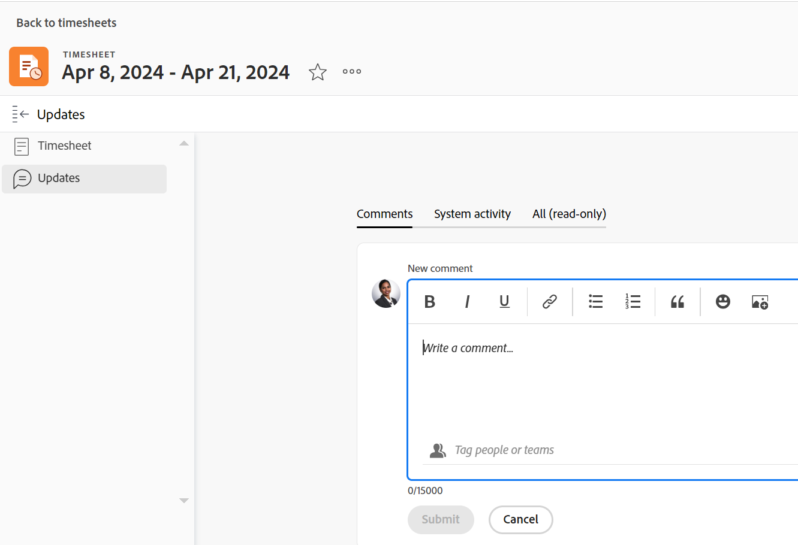

# Registra ore

<!--remove all preview and production references from this article with 23.3 release-->

<!--
The highlighted information on this page refers to functionality not yet generally available. It is available only in the Preview environment for all customers. After the monthly releases to Production, the same features are also available in the Production environment for customers who enabled fast releases.   
For information about fast releases, see [Enable or disable fast releases for your organization](../../administration-and-setup/set-up-workfront/configure-system-defaults/enable-fast-release-process.md). 

For information about the current release schedule, see [Fourth Quarter 2023 release overview](../../product-announcements/product-releases/23-q4-release-activity/23-q4-release-overview.md) 
-->

È possibile registrare il tempo degli elementi di lavoro in Adobe Workfront per indicare il numero di ore dedicate al loro lavoro. È inoltre possibile registrare il tempo non correlato al lavoro, ad esempio ferie, malattia o riunioni. L&#39;ora registrata viene visualizzata nella scheda orario.

Per ulteriori informazioni sul tipo di ore per accedere a Workfront, consulta [Gestire i tipi di lavoro](../../administration-and-setup/set-up-workfront/configure-timesheets-schedules/hour-types.md).

## Requisiti di accesso

<!--drafted for P&P - replace the table:

<table style="table-layout:auto"> 
 <col> 
 <col> 
 <tbody> 
  <tr> 
   <td role="rowheader">Adobe Workfront plan*</td> 
   <td> 
Any
 </td> 
  </tr> 
  <tr> 
   <td role="rowheader">Adobe Workfront license*</td> 
   <td> 
Current license: Light or higher

   
Legacy license: 
   <ul><li>Review or higher to log General Hours in a timesheet</li>
   <li>Work or higher to log hours on a project, task, or issue</li></ul> </td> 
  </tr> 
  <tr> 
   <td role="rowheader">Access level configurations*</td> 
   <td> 
Edit access to the type of work item you log time for 
 
For example, you need Edit access to Issues, to log time for issues
 
If you still don't have access, ask your Workfront administrator if they set additional restrictions in your access level. For information on how a Workfront administrator can modify your access level, see <a href="../../administration-and-setup/add-users/configure-and-grant-access/create-modify-access-levels.md" class="MCXref xref">Create or modify custom access levels</a>.
 </td> 
  </tr> 
  <tr> 
   <td role="rowheader">Object permissions</td> 
   <td> 
Contribute or higher permissions on the work item you log time for that includes permissions to Log Hours
 
For information on requesting additional access, see <a href="../../workfront-basics/grant-and-request-access-to-objects/request-access.md" class="MCXref xref">Request access to objects </a>.
 </td> 
  </tr> 
 </tbody> 
</table>
-->

Per eseguire i passaggi descritti in questo articolo e registrare le ore specifiche del progetto, è necessario disporre dei seguenti diritti di accesso:

<table style="table-layout:auto"> 
 <col> 
 <col> 
 <tbody> 
  <tr> 
   <td role="rowheader">Piano Adobe Workfront*</td> 
   <td> 
Qualsiasi
 </td> 
  </tr> 
  <tr> 
   <td role="rowheader">Licenza Adobe Workfront*</td> 
   <td> <ul><li>Revisione o successiva per registrare le ore generali in una scheda orario</li>
   <li> Lavoro o superiore per registrare le ore su un progetto, attività o problema</li></ul>
   </td> 
  </tr> 
  <tr> 
   <td role="rowheader">Configurazioni del livello di accesso*</td> 
   <td> 
Modifica l'accesso al tipo di elemento di lavoro per il quale si registra il tempo 
 
Ad esempio, per registrare il tempo relativo ai problemi è necessario disporre dell’accesso in Modifica ai problemi
 
Se non disponi ancora dell’accesso, chiedi all’amministratore di Workfront se ha impostato restrizioni aggiuntive nel tuo livello di accesso. Per informazioni su come un amministratore di Workfront può modificare il tuo livello di accesso, consulta <a href="../../administration-and-setup/add-users/configure-and-grant-access/create-modify-access-levels.md" class="MCXref xref">Creare o modificare livelli di accesso personalizzati</a>.
 </td> 
  </tr> 
  <tr> 
   <td role="rowheader">Autorizzazioni oggetto</td> 
   <td> 
Autorizzazioni di Contribute o di livello superiore per l'elemento di lavoro per il quale si registra il tempo, che includono le autorizzazioni di Log Hours.
 
Per informazioni sulla richiesta di accesso aggiuntivo, consulta <a href="../../workfront-basics/grant-and-request-access-to-objects/request-access.md" class="MCXref xref">Richiedi accesso agli oggetti </a>.
 </td> 
  </tr> 
 </tbody> 
</table>

*Per informazioni sulla pianificazione, il tipo di licenza o l&#39;accesso disponibili, contattare l&#39;amministratore Workfront.

## Considerazioni durante l’accesso a Workfront

* È possibile registrare il tempo per progetti, attività o problemi oppure è possibile registrare il tempo direttamente nella scheda orario.

  Per informazioni sulla creazione delle schede orario, consulta [Creare una scheda orario monouso](../../timesheets/create-and-manage-timesheets/create-tmshts.md).

* Tutti gli orari registrati tramite strumenti diversi dalla scheda orario vengono visualizzati nella scheda orario per il periodo di tempo corrispondente.
* Le attività e i problemi relativi a un progetto non corrente non vengono precompilati in una scheda orario.
* Il tempo registrato nella scheda orario viene applicato immediatamente all’attività, al problema o al progetto.
* Le schede orario includono il tempo totale per tutte le date registrate. I fine settimana sono sempre inclusi, anche quando i calcoli della sequenza temporale sono stati configurati per escluderli (come descritto in [Configurare le preferenze di progetto a livello di sistema](../../administration-and-setup/set-up-workfront/configure-system-defaults/set-project-preferences.md)).
* Il numero massimo di elementi visualizzati in una scheda orario è 45. Se sono presenti più di 45 elementi le cui date corrispondono all’intervallo di tempo della scheda orario, vengono visualizzati solo gli elementi aggiornati più di recente.
* Le ore inserite nei record di fatturazione fatturate sono oscurate e non possono essere modificate nella scheda orario. Per ulteriori informazioni, consulta [Crea record fatturazione](../../manage-work/projects/project-finances/create-billing-records.md).
* Per impostazione predefinita, le attività personali non vengono visualizzate nella scheda orario. Le attività personali vengono visualizzate nella scheda orario solo quando sono registrate. Dopo aver registrato l&#39;ora in un&#39;attività personale, è possibile aggiungere l&#39;attività alla scheda attività e rimarrà nella scheda attività se rimane bloccata. Per ulteriori informazioni, consulta [Creare elementi di lavoro dall&#39;area Home](../../workfront-basics/using-home/using-the-home-area/create-work-items-in-home.md).

## Registra ore

In Workfront è possibile registrare il tempo nelle seguenti aree:

* [Scheda orario](#timesheet)
* [Home](#home)
* [Progetto, attività o problema](#project-task-or-issue)
* [Pannello Riepilogo](#summary-panel)
* [Bacheche](#boards)
* [App mobile](#mobile-app)

### Scheda orario {#timesheet}

#### Tempo di connessione a una scheda orario {#log-time-on-a-timesheet}

Puoi registrare il tempo ai seguenti elementi nella scheda orario:

* Attività, problemi e progetti precompilati che vengono visualizzati automaticamente, in base al modo in cui l’amministratore di Workfront imposta le preferenze della scheda orario. Per informazioni sul modo in cui le schede orario vengono precompilate, vedi [Configurare le preferenze di orario e scheda orario](../../administration-and-setup/set-up-workfront/configure-timesheets-schedules/timesheet-and-hour-preferences.md).

  Solo le attività e i problemi assegnati sono precompilati nella scheda orario. Le attività e i problemi assegnati ai tuoi team o alle tue mansioni non compilano automaticamente la scheda orario.

  Facendo clic su Lavoraci per un elemento assegnato ai team, l&#39;elemento verrà assegnato all&#39;utente e verrà visualizzato nella scheda attività.
* Attività, problemi o progetti aggiunti manualmente.
* Attività, problemi o progetti per i quali hai già effettuato l’accesso altrove in Workfront.
* Tempo generale (ferie, formazione, tempo di lavoro).

>[!NOTE]
>
>Gli utenti di revisione assegnati a un profilo Scheda orario possono visualizzare l’area Schede orario e registrare le ore generali. Tuttavia, non possono registrare le ore per le attività o i problemi assegnati che compaiono nella scheda orario.

Per registrare l’ora su una scheda orario:

1. Fai clic su [!UICONTROL **Menu principale**] icona  nell&#39;angolo superiore destro o **Menu principale** icona  nell’angolo in alto a sinistra di Workfront, se disponibile.

1. Clic [!UICONTROL **Schede orario**]. La scheda orario corrente viene visualizzata per impostazione predefinita.
   

1. (Facoltativo) Fai clic su **a schermo intero** icona  per visualizzare la scheda orario in modalità a schermo intero, fai clic sul pulsante **exit-full-screen**  per tornare alla scheda orario.

   <!-- drafted for the resize columns in timesheet story: 1. (optional) Click on the separator lines between weeks or between the time frame area and the work item area to resize the columns of the timesheet.-->

1. (Facoltativo) Per aggiungere un progetto, un’attività o un problema alla scheda orario, fai clic sul pulsante **Aggiungi elemento** menu a discesa nell’angolo superiore sinistro della scheda orario, quindi fai clic su **Aggiungi progetti**, **Aggiungi attività**, o **Aggiungi problemi**.

   Viene visualizzato un elenco di progetti, attività o problemi.

   <!--drafted for full screen mode for add projects story - align it with the rest of the steps when you enable this:: 1. (Optional) Click the **full-screen** icon  to display the list of objects in full-screen mode.-->

1. (Facoltativo) Fai clic sull’icona di ricerca  per cercare un elemento specifico utilizzando una parola chiave da aggiungere alla scheda orario.

1. (Facoltativo) Espandere i menu a discesa di filtro, visualizzazione o raggruppamento per applicarne o personalizzarne uno e visualizzare le informazioni sull&#39;elemento desiderate.

1. Seleziona uno o più elementi nell’elenco, quindi fai clic su **Aggiungi**.

   >[!NOTE]
   >
   >Quando aggiungi attività o problemi alla scheda orario, viene aggiunto anche il progetto.

1. (Facoltativo) Se aggiungi 50 o più elementi contemporaneamente, viene visualizzato un messaggio di conferma con il numero di elementi aggiunti alla scheda orario.

   Clic **Aggiungi tutto** per aggiungere tutti gli elementi o fare clic su **Annulla** per interrompere l&#39;aggiunta degli elementi selezionati, **Annulla** per chiudere l&#39;elenco di elementi.

   Le attività e i problemi sono elencati con il nome del progetto.

   >[!NOTE]
   >
   >Gli elementi aggiunti manualmente alla scheda orario vengono bloccati e rimarranno nella scheda corrente e in quelle future fino a quando non verranno sbloccati manualmente per rimuoverli. Per informazioni sulla rimozione degli elementi dalla scheda orario, continuare con il passaggio 10.

   <!--(ensure this stays accurate)-->

1. (Facoltativo) Fai clic su **Comprimi**  o **Espandi**  icone accanto al nome del progetto per visualizzare o nascondere l’elenco delle attività e dei problemi del progetto.

   >[!TIP]
   >
   >   Quando utilizzi una tastiera QWERTY standard e dopo aver fatto clic sul nome di un progetto nella scheda orario, premi i seguenti tasti per comprimere o espandere il progetto:
   >   * Per espandere il progetto e visualizzarne gli elementi di lavoro:
   >     * Maiusc + Alt + Freccia su per computer Windows
   >     * Maiusc + Opzione + Freccia su per computer Mac
   >   * Per comprimere il progetto e nasconderne gli elementi di lavoro:
   >     * Maiusc + Alt + freccia Giù per computer Windows
   >     * Maiusc + Opzione + freccia Giù per computer Mac.

1. (Facoltativo) Per fissare manualmente un elemento che viene visualizzato automaticamente nella scheda orario, passa il puntatore del mouse sul nome dell’elemento, quindi fai clic su **pin** icona .

   >[!TIP]
   >
   >   Quando si utilizza una tastiera QWERTY standard dopo aver fatto clic su un elemento nella scheda orario, premere il seguente set di tasti per fissare un elemento:
   >   * Opzione + P per computer Windows e Mac.

1. (Facoltativo) Fai clic sull’icona di ricerca  e inizia a digitare una parola chiave per trovare un progetto, un’attività o un problema nella scheda orario.

1. (Condizionale) Se l&#39;amministratore del Workfront o del gruppo ha abilitato **Assegnare manualmente i ruoli alle voci orarie** , selezionare una mansione dal menu a discesa. Il ruolo specificato quando si è assegnati all&#39;elemento di lavoro viene visualizzato per impostazione predefinita. Se all&#39;utente non è stato assegnato un ruolo sull&#39;oggetto, il Ruolo principale viene visualizzato come predefinito. Per ulteriori informazioni su questa impostazione, consulta l’articolo [Configurare le preferenze di orario e scheda orario](../../administration-and-setup/set-up-workfront/configure-timesheets-schedules/timesheet-and-hour-preferences.md).

   

1. (Facoltativo) Fai clic su **+** per aggiungere un’altra riga, quindi seleziona un nuovo tipo di ora dal menu a discesa nella [!UICONTROL Tipo di Ora] colonna per registrare l&#39;ora per un tipo di ora diverso.

   

   >[!TIP]
   >
   >   A seconda del sistema operativo o del browser in uso e quando si utilizza una tastiera QWERTY standard, premere i tasti seguenti per aggiungere un&#39;altra riga:
   >   * Ctrl + Opzione + + per computer Windows
   >   * Cmd + Opzione + + per computer Mac

   I tipi di ore sono disponibili a seconda di ciò che è stato definito a livello di sistema, progetto e utente, come descritto in [Definire i tipi di ore e la disponibilità per le schede orario](define-hour-types-and-availability.md).

   Impossibile modificare il tipo di ora dopo la chiusura di una scheda orario.

   >[!TIP]
   >
   >Se in precedenza si registrava l&#39;ora e il tipo di ora selezionato è ora disattivato, l&#39;intera riga per l&#39;ora registrata viene oscurata. Se si seleziona un altro tipo di ora e si aggiorna la pagina, l’opzione del tipo di ora disattivata viene rimossa dall’elenco a discesa, pertanto non è possibile aggiungere ore aggiuntive a tale tipo di ora.
   >
   >Se si desidera mantenere il tipo di ora disattivato associato all&#39;ora registrata in precedenza, è consigliabile aggiungere una nuova riga per l&#39;elemento di lavoro per il quale si desidera registrare ulteriore tempo e selezionare un nuovo tipo di ora.

1. Fai clic su **eliminare** icona   accanto al ruolo per rimuoverlo. Viene rimosso anche qualsiasi orario registrato per il ruolo.

   >[!TIP]
   >
   >   A seconda del sistema operativo o del browser in uso e quando si utilizza una tastiera QWERTY standard, premere i tasti seguenti per eliminare una riga:
   >   * Ctrl + Opzione + - per computer Windows
   >   * Cmd + Opzione + - per computer Mac

1. Specifica per quanto tempo desideri accedere a un dato giorno nella sezione timeline della scheda orario, quindi fai clic all’esterno della casella delle ore per salvare la voce delle ore. Le ore vengono salvate automaticamente. La riga per la quale si registra l&#39;ora è evidenziata in blu chiaro e la casella di immissione ore è evidenziata in blu scuro.

   

   Registra il tempo in ore o giorni. Questa impostazione viene configurata dagli utenti con una licenza Pianificazione o dall&#39;amministratore di sistema, come descritto in [Configurare se il tempo è registrato in ore o giorni](../../timesheets/config-timesheet-prefs/config-time-logged-hrs-days.md).

   >[!IMPORTANT]
   >
   >È necessario salvare la scheda orario manualmente se si verifica uno dei seguenti scenari:
   >
   >* Il ruolo associato all’ora registrata in precedenza è stato modificato e il **Assegnare manualmente i ruoli alle voci orarie** l&#39;impostazione è stata disabilitata. La registrazione dell’ora per le nuove date la assocerà a un ruolo diverso.
   >   
   >   Se il ruolo è stato modificato e il **Assegnare manualmente i ruoli alle voci orarie** se l&#39;impostazione è abilitata, puoi registrare l&#39;ora o aggiornare il ruolo e le modifiche vengono salvate automaticamente.
   >
   >* La mansione assegnata a un’attività o a un problema è diversa dalla mansione con cui il proprietario della scheda orario registra il tempo <!--or assigned to them_ this last  piece came from a Support note but but sure what role it's referring to. Leaving it out for now.-->.
   >
   >La scheda orario salverà nuovamente l’ora automaticamente quando non vi sono più voci in conflitto tra i due ruoli.
   >

1. (Facoltativo) Specifica la quantità di lavoro straordinario nel campo Straordinario dell’intestazione della scheda orario.

   >[!TIP]
   >
   >Non è possibile registrare un numero di ore di straordinario maggiore delle ore totali correnti nella scheda orario. Ad esempio, se hai registrato 7 ore sulla scheda orario finora, non puoi registrare 8 ore di lavoro straordinario.

1. (Facoltativo) Fai clic su **Commento** per aggiungere un commento per la voce oraria.

   

   >[!TIP]
   >
   >   Quando si utilizza una tastiera QWERTY standard dopo aver fatto clic sulla casella di immissione ore, premere i tasti seguenti per aprire la casella dei commenti:
   >   * Maiusc+F2 per entrambi i computer Windows e Mac.

1. Clic **Fine** per salvare il commento.

   >[!TIP]
   >
   >   Quando si utilizza una tastiera QWERTY standard, dall&#39;interno della casella del commento premere i seguenti tasti per salvare il commento:
   >   * Ctrl + Invio per i computer Windows.
   >   * Cmd + Invio per computer Mac.

1. (Facoltativo) Fai clic su **Mostra commenti** nella barra degli strumenti per visualizzare i commenti relativi alle ore sotto l&#39;elemento di lavoro.

   

   >[!TIP]
   >
   >   Tutte le modifiche apportate alla scheda orario vengono salvate automaticamente.

1. (Facoltativo) Fai clic sulla riga di un’attività o di un problema, quindi fai clic su **Apri riepilogo** nell’angolo superiore destro della scheda orario per aggiungere un aggiornamento o aggiornare informazioni sull’attività o sul problema. Il pannello Riepilogo si apre a destra.

   

   L’aggiornamento viene visualizzato nell’area Aggiornamenti dell’elemento di lavoro associato all’ora registrata.

   >[!TIP]
   >
   >Non è possibile aggiungere commenti ai progetti o alle ore General Time.

1. Clic [!UICONTROL **Chiudi riepilogo**] per chiudere il pannello Riepilogo e tornare alla scheda orario.

1. (Facoltativo) Fai clic su [!UICONTROL **Aggiornamenti**] nel pannello a sinistra, aggiungi un aggiornamento alla scheda orario. Per ulteriori informazioni sugli aggiornamenti di Workfront, consulta [Aggiorna lavoro](../../workfront-basics/updating-work-items-and-viewing-updates/update-work.md).

   

   * **Chiudi**: al termine dell’aggiornamento, chiudi la scheda orario. Questa opzione è disponibile solo quando la scheda orario non è associata a un approvatore.

   * **Invia per approvazione:** Questa opzione è disponibile solo se nella scheda orario è presente un approvatore. Salva le modifiche e invia per l&#39;approvazione. Puoi aprire la scheda orario dopo averla chiusa facendo clic su **Richiama**, se non è stata ancora concessa un&#39;approvazione. Per ulteriori informazioni, consulta [Invia una scheda orario per l&#39;approvazione](../../timesheets/create-and-manage-timesheets/submit-timesheet-for-approval.md).

   * **Rifiuta**: questa opzione viene visualizzata quando si è un approvatore della scheda orario e la scheda orario è stata inviata per l’approvazione. Facendo clic su di essa, lo stato della scheda orario viene modificato in Rifiutato e la scheda orario rimane aperta.

   * **Approva**: questa opzione viene visualizzata quando si è un approvatore della scheda orario e la scheda orario è stata inviata per l’approvazione. Facendo clic su di essa, lo stato della scheda orario viene modificato in Approvato e la scheda orario viene chiusa.

   >[!TIP]
   >
   >Le opzioni Rifiuta e Approva vengono visualizzate anche nella scheda attività quando si è un amministratore di sistema e la scheda attività è associata a un approvatore.

1. (Condizionale) Se la scheda attività è stata chiusa o inviata per l&#39;approvazione, fare clic su una delle opzioni seguenti:

   * **Riapri**: questa opzione è disponibile per le schede orario già chiuse e prive di approvatori o già approvate. Riapri la scheda orario per modificare le ore inserite.
   * **Richiama**: questa opzione è disponibile per le schede orario che sono state inviate per l’approvazione ma che non sono ancora state approvate o rifiutate. Clic **Richiama** per riaprire la scheda orario e modificare le ore inserite.

#### Rimuovi un elemento dalla scheda orario

È possibile rimuovere una voce di un&#39;ora o un elemento (progetto, attività o problema) da una scheda orario.

Per rimuovere una voce di ora da una scheda orario:

1. Vai alla scheda orario e trova la voce dell&#39;ora che desideri rimuovere.
1. Sostituire le ore immesse con 0 Oppure Rimuovere le ore e sostituirle con 0, quindi premere Invio.

   Le ore vengono rimosse e la scheda orario viene salvata automaticamente.

È possibile rimuovere un elemento (progetto, attività o problema) dalla scheda attività sbloccandolo, se non si è ancora registrato il tempo per esso e se l&#39;elemento è stato aggiunto manualmente (come descritto nei passaggi 4-8 in [Tempo di connessione a una scheda orario](#log-time-on-a-timesheet) in questo articolo). <!--ensure this stays accurate-->

Non puoi rimuovere automaticamente gli elementi inclusi nella scheda orario in base alle preferenze della scheda orario nel tuo sistema Workfront o gruppo configurato per precompilare le schede orario (come descritto in [Configurare le preferenze di orario e scheda orario](../../administration-and-setup/set-up-workfront/configure-timesheets-schedules/timesheet-and-hour-preferences.md)). Gli elementi smettono di prepopolare la scheda orario quando le date degli elementi si trovano al di fuori dell’intervallo di tempo della scheda orario.

Per rimuovere un elemento dalla scheda orario aggiunto manualmente:

1. Verificare che non sia stato registrato alcun orario per l&#39;elemento.
1. Fai clic su **sblocca** icona  accanto all&#39;elemento per rimuovere l&#39;elemento dalla scheda orario.

   >[!TIP]
   >
   >   Quando si utilizza una tastiera QWERTY standard dopo aver fatto clic su un elemento nella scheda orario, premere i tasti seguenti per sbloccare un elemento:
   > * Opzione + P per computer Windows e Mac.

   L&#39;elemento viene rimosso dalla scheda orario dopo l&#39;aggiornamento della pagina.

### Home {#home}

Puoi registrare l’ora specifica del progetto nella Home.

Per informazioni generali sull&#39;utilizzo dell&#39;area Home, vedere le sezioni seguenti:

* Per informazioni sull&#39;utilizzo dell&#39;area Home legacy, vedere [Utilizzare l’area Home](../../workfront-basics/using-home/using-the-home-area/use-the-home-area.md).
* Per informazioni sull&#39;utilizzo della nuova area Home, vedere [Introduzione alla nuova home in Adobe Workfront](../../workfront-basics/using-home/new-home/get-started-with-new-home.md).

#### Tempo di connessione per un elemento di lavoro dalla nuova area Home

1. Arrivato al **Home** area.
1. Aggiungi uno dei seguenti widget:

   * Le mie attività
   * I miei problemi
   * Il mio lavoro
   * Le mie richieste
1. Seleziona un’attività, un problema o una richiesta in un elenco, quindi fai clic su **Riepilogo**

   Oppure

   Fai clic su **Riepilogo** icona  da un&#39;attività o un problema nel widget Il mio lavoro.

   Il pannello Riepilogo si apre a destra.

   
1. Continuare a registrare nel pannello Riepilogo, come descritto in [Panoramica di riepilogo](../../workfront-basics/the-new-workfront-experience/summary-overview.md).

#### Tempo di connessione di un elemento di lavoro dall’area Home legacy

1. In **Elenco lavori** , selezionare l&#39;elemento in cui si desidera registrare l&#39;ora.
1. Nel pannello di destra, fai clic su **Tempo di connessione**.

   

1. In **Immetti ore** dal menu a discesa, selezionare il tipo di ora appropriato.\
   I tipi di ore sono disponibili a seconda di ciò che è stato definito a livello di sistema, progetto e utente, come descritto in [Definire i tipi di ore e la disponibilità per le schede orario](../../timesheets/create-and-manage-timesheets/define-hour-types-and-availability.md).
1. (Condizionale) Se l&#39;amministratore del Workfront o del gruppo ha abilitato **Assegnare manualmente i ruoli alle voci orarie** , selezionare una mansione dal menu a discesa. Il ruolo specificato quando si è assegnati all&#39;elemento di lavoro viene visualizzato per impostazione predefinita. Se all&#39;utente non è stato assegnato un ruolo sull&#39;oggetto, il Ruolo principale viene visualizzato come predefinito. Per ulteriori informazioni su questa impostazione, consulta l’articolo [Configurare le preferenze di orario e scheda orario](../../administration-and-setup/set-up-workfront/configure-timesheets-schedules/timesheet-and-hour-preferences.md).
1. Specifica l’ora di registrazione, quindi fai clic su **Tempo di connessione**.

### Progetto, attività o problema {#project-task-or-issue}

Puoi registrare l’ora specifica di un progetto su un progetto, un’attività o un problema nelle sezioni seguenti:

* [Sezione aggiornamenti](#updates-section)
* [Sezione ore](#hours-section)

#### Sezione aggiornamenti{#updates-section}

Per registrare l’ora nella sezione Aggiornamenti di un progetto, un’attività o un problema, è necessario disporre dei seguenti elementi:

* Una licenza Lavoro o Piano.
* Autorizzazioni di contribuzione o superiori per il progetto, l’attività o il problema con accesso alle ore di registro.\
  Per ulteriori informazioni sulla concessione delle autorizzazioni per i progetti, consulta [Condividere un progetto in Adobe Workfront](../../workfront-basics/grant-and-request-access-to-objects/share-a-project.md).

* L’amministratore di Workfront deve abilitare l’ora di accesso direttamente ai progetti in [!UICONTROL **Timesheet e ore**]> [!UICONTROL **Preferenze**], se desideri registrare l’ora direttamente in un progetto.

  Per ulteriori informazioni su come consentire agli utenti di registrare le ore direttamente nei progetti, consulta [Configurare le preferenze di orario e scheda orario](../../administration-and-setup/set-up-workfront/configure-timesheets-schedules/timesheet-and-hour-preferences.md).

Per registrare l’ora nella sezione Aggiornamenti di un progetto, un’attività o un problema:

1. Vai a un progetto, attività o problema.
1. Nel pannello a sinistra, seleziona **Aggiornamenti**.
1. Clic **Tempo di connessione**. <!-- did Anna B change the casing for this button? If yes and if she changed it for the other areas, update screen shot too-->

   Viene visualizzata la finestra di dialogo Registra ora.

   >[!TIP]
   >
   >   Se la preferenza del profilo è impostata sul tempo di registrazione in giorni, viene visualizzata la casella Enter Days (Inserisci giorni).
   >   
   >   Nell&#39;angolo superiore destro della casella Immettere i giorni è indicato il numero di ore incluse in un giorno.

   

1. Specifica le seguenti informazioni:

   * **Tipo di Ora**: seleziona un Tipo di ora dal menu a discesa, se diverso da quello visualizzato per impostazione predefinita.

     A seconda dei tipi di ore configurati nel sistema, le opzioni disponibili possono variare. Per ulteriori informazioni sulla configurazione dei tipi di ora, consulta [Definire i tipi di ore e la disponibilità per le schede orario](../../timesheets/create-and-manage-timesheets/define-hour-types-and-availability.md).

   * **Ruolo**: (Condizionale) se l’amministratore del Workfront o del gruppo ha abilitato **Assegnare manualmente i ruoli alle voci orarie** , seleziona un **Ruolo** dal menu a discesa. Il Ruolo specificato quando si è assegnati all&#39;oggetto viene visualizzato per impostazione predefinita. Se all&#39;utente non è stato assegnato un Ruolo nell&#39;oggetto, il Ruolo principale viene visualizzato come impostazione predefinita. Per ulteriori informazioni su questa impostazione, consulta l’articolo [Configurare le preferenze di orario e scheda orario](../../administration-and-setup/set-up-workfront/configure-timesheets-schedules/timesheet-and-hour-preferences.md).

   * **Ore**: immetti il numero di ore per il progetto, l’attività o il problema.

1. Clic **Tempo di connessione**.

#### Sezione ore{#hours-section}

Per registrare i tempi di progetti, attività e problemi nella sezione Ore è necessario essere un amministratore Workfront,

Oppure

È necessario disporre di tutti i seguenti elementi:

* Una licenza Pianificazione con accesso amministrativo alle schede orario e alle ore. Per ulteriori informazioni sulla concessione dell&#39;accesso amministrativo alle schede orario e alle ore, vedi [Concedere agli utenti l&#39;accesso amministrativo a determinate aree](../../administration-and-setup/add-users/configure-and-grant-access/grant-users-admin-access-certain-areas.md).
* Autorizzazioni Contribute o superiori per il progetto con accesso a Log Hours (Registra ore). Per ulteriori informazioni sulla concessione delle autorizzazioni per i progetti, consulta [Condividere un progetto in Adobe Workfront](../../workfront-basics/grant-and-request-access-to-objects/share-a-project.md).
* Se desideri registrare il tempo direttamente su un progetto, l’amministratore di Workfront deve abilitare l’impostazione Log time direct on projects (Tempo di registro direttamente sui progetti) in Timesheet &amp; Hours > Preferences (Schede orario e ore > Preferenze). Per ulteriori informazioni su come consentire agli utenti di registrare le ore direttamente nei progetti, consulta [Configurare le preferenze di orario e scheda orario](../../administration-and-setup/set-up-workfront/configure-timesheets-schedules/timesheet-and-hour-preferences.md).

Per registrare il tempo nella sezione Ore di un progetto, attività o problema:

1. Vai a un progetto, attività o problema.
1. Nel pannello a sinistra, fai clic su **Ore**.
1. Clic **Tempo di connessione**.

   Viene visualizzata la finestra di dialogo Registra ore.

1. Specifica le seguenti informazioni:

   * **Proprietario:** Per impostazione predefinita, il tuo nome viene visualizzato in questo campo.\
     Se si registrano le ore per un altro utente, specificarne il nome.

   * **Tipo di Ora**: seleziona un Tipo di ora dal menu a discesa, se diverso da quello visualizzato per impostazione predefinita.

     A seconda dei tipi di ore configurati nel sistema, le opzioni disponibili possono variare. Per ulteriori informazioni sulla configurazione dei tipi di ora, consulta [Definire i tipi di ore e la disponibilità per le schede orario](../../timesheets/create-and-manage-timesheets/define-hour-types-and-availability.md).

   * **Ruolo**: (Condizionale) se l’amministratore del Workfront o del gruppo ha abilitato **Assegnare manualmente i ruoli alle voci orarie** , seleziona un **Ruolo** dal menu a discesa. Il Ruolo specificato quando si è assegnati all&#39;oggetto viene visualizzato per impostazione predefinita. Se all&#39;utente non è stato assegnato un Ruolo nell&#39;oggetto, il Ruolo principale viene visualizzato come impostazione predefinita. Per ulteriori informazioni su questa impostazione, consulta l’articolo [Configurare le preferenze di orario e scheda orario](../../administration-and-setup/set-up-workfront/configure-timesheets-schedules/timesheet-and-hour-preferences.md).

     
   * **Ore**: immetti il numero di ore per il progetto, l’attività o il problema.

1. Clic **Tempo di connessione**.

### Pannello Riepilogo

Nel pannello Riepilogo potete registrare il tempo per le attività e i problemi.
Per ulteriori informazioni, consulta [Panoramica di riepilogo](../../workfront-basics/the-new-workfront-experience/summary-overview.md).

### Bacheche {#boards}

È possibile registrare il tempo sulle schede collegate su una scheda Workfront. Questa è la stessa procedura utilizzata per registrare il tempo su un’attività o un problema e le ore registrate sulla scheda vengono salvate sull’attività o sul problema connesso.
Per ulteriori informazioni, consulta [Utilizzare le schede collegate sulle bacheche](/help/quicksilver/agile/get-started-with-boards/connected-cards.md).

### App mobile {#mobile-app}

Puoi registrare l’ora dall’app mobile di Workfront.
Per ulteriori informazioni, consulta [Adobe Workfront per Android](/help/quicksilver/workfront-basics/mobile-apps/using-the-workfront-mobile-app/workfront-for-android.md) o [Adobe Workfront per iOS](/help/quicksilver/workfront-basics/mobile-apps/using-the-workfront-mobile-app/workfront-for-ios.md).
