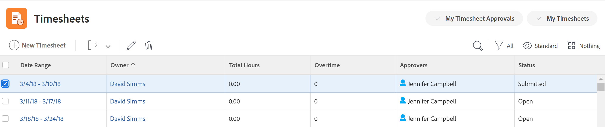

# Visualizzare le ore totali sul timesheet

<!--Audited: 8/2024-->

Puoi visualizzare il numero totale di ore sulla scheda orario. Il numero totale di ore della scheda orario include le ore registrate per progetti, attività, problemi e tutte le ore generali.

Le ore totali riflettono le ore inviate tramite la scheda orario, l’area Aggiornamenti o l’area Ore per progetti, attività o problemi.

## Requisiti di accesso

+++ Espandi per visualizzare i requisiti di accesso per la funzionalità descritta in questo articolo. 

<table style="table-layout:auto"> 
 <col> 
 <col> 
 <tbody> 
  <tr> 
   <td>Pacchetto Adobe Workfront</td> 
   <td> 
Qualsiasi
 </td> 
  </tr> 
  <tr> 
   <td>Licenza di Adobe Workfront</td> 
   <td> 
Chiaro o superiore 

   
Revisione o successiva
 </td> 
  </tr> 
  <tr> 
   <td>Configurazione del livello di accesso</td> 
   <td> 
Visualizzare o accedere ad altre attività e problemi
 </td> 
  </tr> 
  <tr> 
   <td>Autorizzazioni sugli oggetti</td> 
   <td> 
Visualizza o autorizzazioni superiori per attività e problemi
 </td> 
  </tr> 
 </tbody> 
</table>

Per informazioni, consulta [Requisiti di accesso nella documentazione di Workfront](/help/quicksilver/administration-and-setup/add-users/access-levels-and-object-permissions/access-level-requirements-in-documentation.md).

+++

## Visualizzare le ore totali di una scheda orario nell&#39;intestazione della scheda orario

Puoi visualizzare le ore totali di una scheda orario nell’intestazione della scheda.

## Visualizza le ore totali sulla scheda orario in un elenco di schede orario

{{step1-to-timesheets}}

Verrà aperta l&#39;area **Schede orario**.

1. (Facoltativo) Per aggiornare il filtro nell’elenco delle schede orario, effettua una delle seguenti operazioni:

   * Seleziona **Le mie approvazioni schede orario** nell&#39;angolo superiore destro della pagina per visualizzare solo le schede orario che hai approvato

     Oppure

     Seleziona **Le mie schede orario** per visualizzare solo le tue schede orario.

     In questo modo all’elenco delle schede orario vengono applicate le approvazioni delle mie schede orario o i filtri delle mie schede orario.

     

   * Fare clic sull&#39;icona Filtro  per applicare un filtro diverso o crearne uno nuovo. Per informazioni sulla creazione o l&#39;aggiornamento dei filtri, vedere [Creare o modificare filtri in Adobe Workfront](../../reports-and-dashboards/reports/reporting-elements/create-filters.md).

   >[!NOTE]
   >
   >Le opzioni Approvazioni schede attività personali e Schede attività personali non vengono visualizzate nella parte superiore dell&#39;elenco delle schede attività o nell&#39;elenco dei filtri se l&#39;amministratore di Workfront o un amministratore di gruppo ha rimosso i filtri Approvazioni schede attività personali e Schede attività personali dall&#39;area Controlli elenco nella configurazione o dal modello di layout. Per ulteriori informazioni, consulta i seguenti articoli:
   >
   >   
   >   
   >   * [Personalizzare filtri, visualizzazioni e raggruppamenti utilizzando un modello di layout](../../administration-and-setup/customize-workfront/use-layout-templates/customize-fvg-list-controls-layout-template.md)
   >   
   >

1. (Facoltativo) Fai clic sulle icone **Visualizza**  o **Raggruppamento**  per applicare una visualizzazione o un raggruppamento diverso o per crearne uno nuovo.

   Per informazioni sulla creazione di filtri, viste o raggruppamenti, vedere i seguenti articoli:

   * [Creare o modificare filtri in Adobe Workfront](../../reports-and-dashboards/reports/reporting-elements/create-filters.md)
   * [Creare o modificare le visualizzazioni in Adobe Workfront](../../reports-and-dashboards/reports/reporting-elements/create-edit-views.md)
   * [Creare raggruppamenti in Adobe Workfront](../../reports-and-dashboards/reports/reporting-elements/create-groupings.md)

1. Il numero totale di ore per ogni scheda orario viene visualizzato nella colonna **Ore totali**.

   

   >[!TIP]
   >
   >Quando si utilizza la visualizzazione Standard per un elenco di schede orario, la colonna Ore totali viene visualizzata in rosso se il tempo registrato per gli elementi della scheda orario supera il numero di ore nell&#39;intervallo di tempo della scheda orario. Per ulteriori informazioni, vedere il campo &quot;Ore totali&quot; in [Glossario della terminologia di Adobe Workfront](../../workfront-basics/navigate-workfront/workfront-navigation/workfront-terminology-glossary.md).
