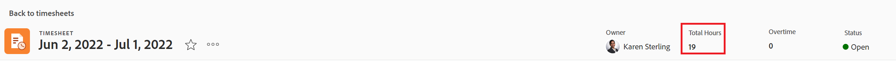

# Visualizza le ore totali nella scheda attività

È possibile visualizzare il numero totale di ore sulla scheda attività. Il numero totale di ore della scheda attività include ore registrate per progetti, attività, problemi e tutte le ore generali.

Le ore totali riflettono le ore inviate tramite la scheda attività, l&#39;area Aggiornamenti o nell&#39;area Ore per progetti, attività o problemi.

## Requisiti di accesso

Per eseguire i passaggi descritti in questo articolo, è necessario disporre dei seguenti diritti di accesso:

<table style="table-layout:auto"> 
 <col> 
 <col> 
 <tbody> 
  <tr> 
   <td role="rowheader">piano Adobe Workfront*</td> 
   <td> 
Qualsiasi
 </td> 
  </tr> 
  <tr> 
   <td role="rowheader">Licenza Adobe Workfront*</td> 
   <td> 
Revisiona 
 </td> 
  </tr> 
  <tr> 
   <td role="rowheader">Configurazioni a livello di accesso*</td> 
   <td> 
Visualizza accesso o superiore a Attività e problemi
 
Se non disponi ancora dell’accesso, chiedi all’amministratore Workfront se ha impostato ulteriori restrizioni nel livello di accesso. Per informazioni su come un amministratore Workfront può modificare il livello di accesso, consulta <a href="../../administration-and-setup/add-users/configure-and-grant-access/create-modify-access-levels.md" class="MCXref xref">Creare o modificare livelli di accesso personalizzati</a>.
 </td> 
  </tr> 
  <tr> 
   <td role="rowheader">Autorizzazioni oggetto</td> 
   <td> 
Visualizza o autorizzazioni superiori per attività e problemi
 
Per informazioni sulla richiesta di accesso aggiuntivo, vedi <a href="../../workfront-basics/grant-and-request-access-to-objects/request-access.md" class="MCXref xref">Richiedere l’accesso agli oggetti </a>.
 </td> 
  </tr> 
 </tbody> 
</table>

*Per sapere quale piano o tipo di licenza hai, contatta il tuo amministratore Workfront.

## Visualizza le ore totali di una scheda attività nell&#39;intestazione della scheda attività

È possibile visualizzare le ore totali di una scheda attività nell&#39;intestazione della scheda attività.

## Visualizza le ore totali nella scheda attività in un elenco di fogli presenze

1. Fai clic sul pulsante **Menu principale** icona  nell’angolo in alto a destra di Adobe Workfront, quindi fai clic su **Schede temporali**. La **Tutto** Il filtro è selezionato per impostazione predefinita e visualizza tutti i fogli presenze a cui hai accesso.

   

1. (Facoltativo) Per aggiornare il filtro nell’elenco dei fogli presenze, effettuare una delle seguenti operazioni:

   * Seleziona **Approvazioni foglio presenze personali** nell’angolo in alto a destra della pagina per visualizzare solo i fogli presenze approvati

      Oppure

      Seleziona **Fogli orari personali** per visualizzare solo i fogli presenze.

      Questo applica le approvazioni della scheda attività personale o i filtri della scheda attività personale all&#39;elenco dei fogli presenze.

      

   * Fai clic sull’icona Filtro  per applicare un filtro diverso o crearne uno nuovo. Per informazioni sulla creazione o l’aggiornamento dei filtri, consulta [Creare o modificare filtri in Adobe Workfront](../../reports-and-dashboards/reports/reporting-elements/create-filters.md).
   >[!NOTE]
   >
   >Le opzioni Approvazioni schede attività personali e Pagine attività personali non vengono visualizzate nella parte superiore dell&#39;elenco delle schede attività o nell&#39;elenco dei filtri se l&#39;amministratore di Workfront o un amministratore di gruppo hanno rimosso le approvazioni della scheda attività personale e i filtri della scheda attività personale dai controlli elenco nell&#39;area Configurazione o dal modello di layout. Per ulteriori informazioni, consulta i seguenti articoli:
   * [Personalizzare filtri, visualizzazioni e gruppi utilizzando un modello di layout](../../administration-and-setup/customize-workfront/use-layout-templates/customize-fvg-list-controls-layout-template.md)

1. (Facoltativo) Fai clic sul pulsante **Visualizza**  o **Raggruppamento**  per applicare una visualizzazione o un raggruppamento diversi o per crearne uno nuovo.

   Per informazioni sulla creazione di filtri, visualizzazioni o raggruppamenti, consulta i seguenti articoli:

   * [Creare o modificare filtri in Adobe Workfront](../../reports-and-dashboards/reports/reporting-elements/create-filters.md)
   * [Creare o modificare visualizzazioni in Adobe Workfront](../../reports-and-dashboards/reports/reporting-elements/create-edit-views.md)
   * [Creare raggruppamenti in Adobe Workfront](../../reports-and-dashboards/reports/reporting-elements/create-groupings.md)

1. Il numero totale di ore per ogni scheda attività viene visualizzato nel **Ore totali** colonna.

   

   >[!TIP]
   Quando si utilizza la visualizzazione Standard per un elenco di fogli presenze, la colonna Ore totali viene visualizzata in rosso se il tempo registrato per gli elementi nella scheda attività supera il numero di ore nell&#39;intervallo di tempo della scheda attività. Per ulteriori informazioni, vedere il campo &quot;Ore totali&quot; in [Glossario della terminologia di Adobe Workfront](../../workfront-basics/navigate-workfront/workfront-navigation/workfront-terminology-glossary.md).
