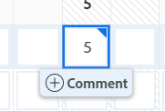
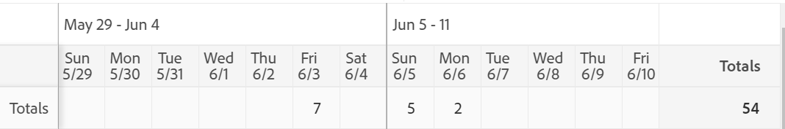

# Comprendere il layout del foglio presenze

Questo articolo descrive il layout dei fogli presenze in Adobe Workfront, consentendoti di comprendere meglio come personalizzare e utilizzare i fogli presenze per registrare l’ora.

La scheda attività e le preferenze orarie controllano l&#39;elemento visualizzato in una scheda attività. Questo articolo fornisce una panoramica di tutte le opzioni disponibili. Per informazioni, consulta [Configurare le preferenze relative a schede attività e ora](../../administration-and-setup/set-up-workfront/configure-timesheets-schedules/timesheet-and-hour-preferences.md).

Per informazioni su come registrare l&#39;ora in un foglio di tempo, vedi [Tempo di log](../../timesheets/create-and-manage-timesheets/log-time.md).

Di seguito sono riportate le aree di una scheda attività:

* [Intestazione scheda attività](#timesheet-header)
* [Pannello a sinistra](#the-left-panel)
* [Elementi di lavoro](#work-items)
* [Barra Strumenti](#toolbar)
* [Piede piè di pagina](#timesheet-footer)
* [Ruolo](#job-role)
* [Tipo di ora](#hour-type)
* [Area Aggiornamenti nel pannello a sinistra](#updates-area-in-the-left-panel)
* [Pannello di riepilogo](#summary-panel)
* [Intervallo di tempo e area di ingresso ore](#time-frame-and-hour-entry-area)
* [Commenti all&#39;ora](#hour-entry-comments)
* [Ore](#hours)
* [Totali](#totals)

## Intestazione scheda attività

L&#39;intestazione della scheda attività include le informazioni seguenti:

* Intervallo di tempo della scheda attività.
* L’area Azioni che include quanto segue:
   * Icona a forma di stella per aggiungere i fogli presenze all’elenco dei Preferiti.
   * Icona Altro con l&#39;opzione Elimina da cui è possibile eliminare la scheda attività.
* Nome del proprietario della scheda attività.
* Numero di ore totali per le ore registrate per gli elementi visualizzati nella scheda attività.
* Il numero di ore straordinarie. Questa è una voce manuale ed è visibile solo quando **Straordinario** è abilitata in una scheda attività. Per ulteriori informazioni, consulta [Modifica delle informazioni della scheda attività](../create-and-manage-timesheets/edit-timesheets.md).

>[!TIP]
>
>Non è possibile registrare un numero maggiore di ore di lavoro straordinario rispetto alle ore totali correnti nella scheda attività. Ad esempio, se finora sono state registrate 7 ore nella scheda attività, non è possibile registrare 8 ore di lavoro straordinario.

* Stato della scheda attività.

## Pannello a sinistra

Puoi accedere alle seguenti sezioni nel pannello a sinistra:

* **Scheda attività**: Visualizza la scheda attività effettiva.
* **Aggiornamenti**: Visualizza commenti e aggiornamenti di sistema per la scheda attività. Per ulteriori informazioni, consulta la sezione [Area Aggiornamenti nel pannello a sinistra](#updates-area-in-the-left-panel) in questo articolo.

## Elementi di lavoro

Gli elementi di lavoro sono i progetti, le attività e i problemi per i quali si desidera registrare il tempo. Facendo clic sulla freccia rivolta verso il basso nella riga di intestazione vengono compressi i progetti e le attività e i problemi elencati sotto. Facendo clic sulla freccia rivolta verso il basso accanto al nome di un progetto, gli elementi di lavoro del progetto vengono compressi.

Le attività, i problemi e i progetti in cui il tempo viene registrato al di fuori della scheda attività o gli elementi pianificati durante l&#39;intervallo temporale della scheda attività vengono visualizzati automaticamente qui.

## Barra Strumenti

La barra degli strumenti include le seguenti opzioni:

* Pulsante Aggiungi elemento da cui è possibile aggiungere progetti, attività o problemi.
* Icona del filtro rapido per cercare attività o problemi nella scheda attività.
* La **Mostra commenti** impostazione che consente di visualizzare o nascondere i commenti sulle ore registrati per le voci relative a progetto, attività o ora di emissione.
* Icona a schermo intero da cui è possibile visualizzare la scheda attività in modalità a schermo intero.
* **Apri riepilogo** o **Chiudi riepilogo**) dal punto in cui è possibile aprire o chiudere il pannello Riepilogo per visualizzare ulteriori informazioni su attività o problemi. Non disponibile per i progetti.

Per ulteriori informazioni, consulta [Tempo di log](../create-and-manage-timesheets/log-time.md).

## Piede piè di pagina

È possibile fare clic sui pulsanti Invia per approvazione, Chiudi, Approva e Rifiuta in questa area per chiudere o rifiutare l&#39;approvazione di una scheda attività.

Questa area contiene inoltre informazioni sull&#39;ultimo salvataggio della scheda attività. Tutte le modifiche apportate alle informazioni nella scheda attività vengono salvate automaticamente.

## Ruolo

È possibile selezionare un ruolo di lavoro diverso da associare alle voci dell&#39;ora. L’amministratore di Workfront deve abilitare manualmente l’impostazione Assegna ruoli di lavoro alle voci orarie. Per impostazione predefinita viene visualizzato il ruolo di lavoro specificato al momento dell&#39;assegnazione all&#39;attività o il problema. Se non ti viene assegnato un ruolo di lavoro sull&#39;attività o sul problema, il ruolo principale viene visualizzato come predefinito. Per ulteriori informazioni, consulta l’articolo [Configurare le preferenze relative a schede attività e ora](../../administration-and-setup/set-up-workfront/configure-timesheets-schedules/timesheet-and-hour-preferences.md).

È possibile registrare più voci ora per lo stesso elemento di lavoro per ruoli diversi. Per ulteriori informazioni, consulta [Tempo di log](../create-and-manage-timesheets/log-time.md).

## Tipo di ora

È possibile selezionare diversi tipi di ora da associare alle voci orarie di ogni elemento. Questo campo viene visualizzato solo quando l’amministratore di Workfront lo abilita per l’ambiente in uso. Per informazioni, consulta l’articolo [Configurare le preferenze relative a schede attività e ora](../../administration-and-setup/set-up-workfront/configure-timesheets-schedules/timesheet-and-hour-preferences.md).

È possibile registrare più voci ora per lo stesso elemento di lavoro per diversi tipi di ora. Per ulteriori informazioni, consulta [Tempo di log](../create-and-manage-timesheets/log-time.md).

## Area Aggiornamenti nel pannello a sinistra

È possibile inserire commenti su una scheda attività per comunicare con gli approvatori della scheda attività o con altri utenti nella sezione Aggiornamenti del pannello a sinistra.

Eventuali commenti sulla scheda attività vengono visualizzati in questa area, nella parte inferiore della scheda attività. Questa area viene visualizzata sotto la scheda attività e sopra il piè di pagina della scheda attività. Per ulteriori informazioni, consulta [Visualizzare e gestire i commenti in una scheda attività](../create-and-manage-timesheets/view-and-manage-comments-timesheets.md).

## Pannello di riepilogo

È possibile commentare l&#39;accesso al pannello Riepilogo per le attività o i problemi visualizzati in una scheda attività. Da qui puoi commentare attività e problemi o aggiornarne le informazioni. Per ulteriori informazioni, consulta [Panoramica di riepilogo](../../workfront-basics/the-new-workfront-experience/summary-overview.md).

I commenti immessi per gli elementi di lavoro nel pannello Sintetico scheda attività vengono visualizzati nell&#39;area Aggiornamenti dell&#39;attività o nel problema. Il pannello Riepilogo non è disponibile per i progetti.

## Intervallo di tempo e area di ingresso ore

L&#39;intervallo di tempo della scheda attività viene visualizzato a destra degli elementi di lavoro.

È possibile creare fogli presenze per una, due o quattro settimane.

L’intervallo di tempo viene visualizzato con incrementi di una settimana. I giorni al di fuori dell&#39;intervallo temporale specificato per la scheda attività sono oscurati. Non è possibile registrare il tempo per i giorni che non rientrano nell&#39;intervallo di tempo della scheda attività.

Per informazioni, consulta [Crea foglio presenze a uso singolo](../create-and-manage-timesheets/create-tmshts.md) o [Creare, modificare e assegnare profili della scheda attività](../create-and-manage-timesheets/create-timesheet-profiles.md).

<!--drafted for the resize columns in timesheets story - make this blurb a TIP when the story is released: 
You can resize the columns that display different weeks, the time frame, or the work item areas by dragging and dropping the vertical lines that separate them.-->

## Commenti all&#39;ora

È possibile aggiungere un commento per ogni voce di ora aggiunta alla scheda attività.

I commenti immessi nella casella di commento per l&#39;immissione dell&#39;ora vengono visualizzati nella scheda attività, sotto ogni elemento di lavoro in cui è stato registrato l&#39;ora in cui il **Mostra commenti** è abilitata nella barra degli strumenti.

## Ore

La scheda attività fornisce campi di input per ogni elemento di lavoro e giorno dell&#39;intervallo della scheda attività per registrare il tempo trascorso a lavorare sull&#39;elemento. Durante la registrazione del tempo, l&#39;elemento che si registra per le evidenziazioni in blu chiaro e la casella dell&#39;ora è evidenziata in blu scuro.

## Totali

Esaminare la somma di tutte le ore inserite nella scheda attività, riepilogate per giorno (nell&#39;intestazione della scheda attività) e per oggetto (nell&#39;ultima colonna).
