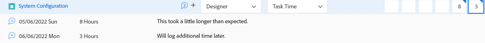

# Panoramica del layout della scheda orario

<!-- Audited: 12/2023 -->

<!--The highlighted information on this page refers to functionality not yet generally available. It is available only in the Preview environment for all customers or in Production for customers who enabled fast releases. 

For information about fast releases, see [Enable or disable fast releases for your organization](/help/quicksilver/administration-and-setup/set-up-workfront/configure-system-defaults/enable-fast-release-process.md).

For information about the current release schedule, see [Second Quarter 2024 release overview](/help/quicksilver/product-announcements/product-releases/24-q2-release-activity/24-q2-release-overview.md).-->

Questo articolo descrive il layout delle schede orario in Adobe Workfront, consentendoti di comprendere meglio come personalizzare e utilizzare le schede orario per registrare l’ora.

Le preferenze delle ore e della scheda orario controllano ciò che viene visualizzato su una scheda orario. Questo articolo fornisce una panoramica di tutte le opzioni disponibili. Per informazioni sulla selezione delle opzioni, vedere [Configurare le preferenze relative alle ore e alle schede orario](../../administration-and-setup/set-up-workfront/configure-timesheets-schedules/timesheet-and-hour-preferences.md).

Per informazioni su come registrare l&#39;ora in una scheda orario, vedere [Registra ora](../../timesheets/create-and-manage-timesheets/log-time.md).

Di seguito sono riportate le aree di una scheda orario:

* [Intestazione scheda orario](#timesheet-header)
* [Pannello a sinistra](#the-left-panel)
* [Elementi di lavoro](#work-items)
* [Barra Strumenti](#toolbar)
* [Piè di pagina scheda orario](#timesheet-footer)
* [Ruolo](#job-role)
* [Tipo di ora](#hour-type)
* [Area Aggiornamenti nel pannello a sinistra](#updates-area-in-the-left-panel)
* [Pannello di Riepilogo](#summary-panel)
* [Intervallo temporale e area di immissione ore](#time-frame-and-hour-entry-area)
* [Commenti immissione ore](#hour-entry-comments)
* [Ore](#hours)
* [Totali](#totals)

## Intestazione scheda orario

L’intestazione della scheda orario include le seguenti informazioni:

* L’intervallo di tempo della scheda orario.
* L&#39;area Azioni che include quanto segue:
   * Un&#39;icona stella per aggiungere le schede orario all&#39;elenco dei preferiti.
   * L’icona Altro con l’opzione Elimina che consente di eliminare la scheda orario.
* Nome del proprietario della scheda orario.
* Il numero di ore totali per le ore registrate per gli elementi visualizzati nella scheda orario.
* Il numero di ore di straordinario. Questa voce è manuale ed è visibile solo quando l&#39;impostazione **Straordinari** è abilitata in una scheda orario. Per ulteriori informazioni, vedere [Modifica informazioni scheda orario](../create-and-manage-timesheets/edit-timesheets.md).

>[!TIP]
>
>Non è possibile registrare un numero di ore di straordinario maggiore delle ore totali correnti nella scheda orario. Ad esempio, se hai registrato 7 ore sulla scheda orario finora, non puoi registrare 8 ore di lavoro straordinario.

* Lo stato della scheda orario.

## Pannello a sinistra

Potete accedere alle seguenti sezioni nel pannello a sinistra:

* **Scheda orario**: visualizza la scheda orario effettiva.
* **Aggiornamenti**: visualizza i commenti e gli aggiornamenti di sistema per la scheda orario. Per ulteriori informazioni, vedere l&#39;area [Aggiornamenti nel pannello sinistro](#updates-area-in-the-left-panel) in questo articolo.

## Elementi di lavoro

Gli elementi di lavoro sono i progetti, le attività e i problemi per i quali si desidera registrare l&#39;ora. Facendo clic sulla freccia rivolta verso il basso nella riga di intestazione, i progetti e le attività e i problemi elencati di seguito vengono compressi. Facendo clic sulla freccia rivolta verso il basso accanto al nome di un progetto, gli elementi di lavoro del progetto vengono compressi.

Le attività, i problemi e i progetti in cui il tempo viene registrato al di fuori della scheda orario o gli elementi pianificati durante l’arco temporale della scheda orario vengono visualizzati qui automaticamente.

## Barra Strumenti

La barra degli strumenti include le seguenti opzioni:

* Pulsante **Aggiungi elemento** che consente di aggiungere progetti, attività o problemi.
* L’icona del filtro rapido per cercare attività o problemi nella scheda orario.
* L&#39;impostazione **Mostra commenti** che consente di visualizzare o nascondere i commenti delle ore registrati per le voci relative alle ore di progetto, attività o problema.
* L’icona a schermo intero per visualizzare la scheda orario in modalità a schermo intero.
* Il pulsante **Apri riepilogo** (o **Chiudi riepilogo**) consente di aprire o chiudere il pannello Riepilogo per visualizzare informazioni aggiuntive su attività o problemi. Questo pulsante non è disponibile per i progetti.

Per ulteriori informazioni, vedere [Tempo di connessione](../create-and-manage-timesheets/log-time.md).

## Piè di pagina scheda orario

Puoi fare clic sui pulsanti **Invia per approvazione**, **Chiudi**, **Approva** e **Rifiuta** in quest&#39;area per chiudere o rifiutare un&#39;approvazione della scheda orario.

Questa area contiene anche informazioni sull’ultimo salvataggio della scheda orario. Tutte le modifiche apportate alle informazioni nella scheda orario vengono salvate automaticamente.

## Ruolo

È possibile selezionare una mansione diversa da associare alle ore inserite. L&#39;amministratore di Workfront deve abilitare l&#39;impostazione **Assegnare manualmente le mansioni alle ore inserite**. La mansione specificata al momento dell’assegnazione dell’attività o il problema viene visualizzato per impostazione predefinita. Se non ti è stata assegnata una mansione per l’attività o il problema, il tuo Ruolo principale viene visualizzato come predefinito. Per ulteriori informazioni, consulta [Configurare le preferenze di orario e scheda orario](../../administration-and-setup/set-up-workfront/configure-timesheets-schedules/timesheet-and-hour-preferences.md).

È possibile registrare più ore per lo stesso elemento di lavoro per ruoli diversi. Per ulteriori informazioni, vedere [Tempo di connessione](../create-and-manage-timesheets/log-time.md).

## Tipo di ora

È possibile selezionare diversi tipi di ore da associare alle ore inserite in ogni elemento. Questo campo viene visualizzato solo quando l’amministratore di Workfront lo abilita per il tuo ambiente. Per informazioni, consulta [Configurare le preferenze di orario e scheda orario](../../administration-and-setup/set-up-workfront/configure-timesheets-schedules/timesheet-and-hour-preferences.md).

È possibile registrare più ore per lo stesso elemento di lavoro per tipi di ore diversi. Per ulteriori informazioni, vedere [Tempo di connessione](../create-and-manage-timesheets/log-time.md).

## Area Aggiornamenti nel pannello a sinistra

È possibile aggiungere commenti a una scheda orario per comunicare con gli approvatori della scheda orario o altri utenti nella sezione Aggiornamenti nel pannello sinistro della scheda orario.

Eventuali commenti aggiunti alla scheda orario vengono visualizzati in quest&#39;area.

## Pannello di Riepilogo

Puoi accedere al pannello Riepilogo per le attività o i problemi visualizzati in una scheda orario. Da qui puoi aggiungere commenti ad attività e problemi, o aggiornarne le informazioni. Per ulteriori informazioni, vedere [Panoramica di riepilogo](../../workfront-basics/the-new-workfront-experience/summary-overview.md).

I commenti immessi per gli elementi di lavoro nel pannello Riepilogo scheda orario vengono visualizzati nell’area Aggiornamenti dell’attività o del problema. Il pannello Riepilogo non è disponibile per i progetti.

## Intervallo temporale e area di immissione ore

L’intervallo di tempo della scheda orario viene visualizzato a destra degli elementi di lavoro.

Puoi creare schede orario per una, due o quattro settimane.

L’intervallo di tempo viene visualizzato con incrementi di una settimana intera. I giorni che non rientrano nell’intervallo di tempo specificato per la scheda orario non sono attivi. Non è possibile registrare il tempo per i giorni che non rientrano nell&#39;intervallo di tempo della scheda orario.

Per informazioni, consulta [Creare una scheda orario monouso](../create-and-manage-timesheets/create-tmshts.md) o [Creare, modificare e assegnare profili della scheda orario](../create-and-manage-timesheets/create-timesheet-profiles.md).

<!--drafted for the resize columns in timesheets story - make this blurb a TIP when the story is released: 
You can resize the columns that display different weeks, the time frame, or the work item areas by dragging and dropping the vertical lines that separate them.-->

## Commenti immissione ore

È possibile aggiungere un commento per ogni voce oraria aggiunta alla scheda orario.

I commenti immessi nella casella dei commenti delle ore vengono visualizzati nella scheda attività, sotto ogni elemento di lavoro in cui è stato registrato l&#39;orario in cui l&#39;impostazione **Mostra commenti** è abilitata nella barra degli strumenti.

## Ore

La scheda orario fornisce campi di input per ogni elemento di lavoro e giorno dell&#39;intervallo della scheda orario per registrare il tempo impiegato per lavorare sull&#39;elemento. Quando si registra l&#39;ora, l&#39;elemento per il quale si registra l&#39;ora viene evidenziato in blu chiaro e la casella ore viene evidenziata in blu scuro.

## Totali

Rivedi la somma di tutte le ore inserite nella scheda orario, riepilogate per giorno (nell’intestazione della scheda orario) e per oggetto (nell’ultima colonna).
