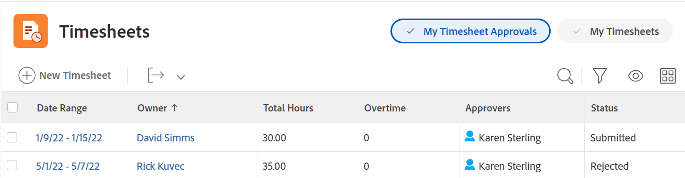

# Panoramica schede orario

Puoi utilizzare le schede orario per tenere traccia del tempo trascorso su lavoro in Adobe Workfront.

In qualità di amministratore di Workfront o di gruppo, puoi creare schede orario e associarle ai tuoi utenti. Per informazioni sulla creazione delle schede orario, consulta [Creare e gestire le schede orario](../create-and-manage-timesheets/create-and-manage-timesheets.md).

Una scheda attività è una tabella di tipo griglia che visualizza gli elementi di lavoro e un&#39;area del calendario. È possibile registrare l&#39;ora per gli elementi e associarla al giorno in cui è stato eseguito il lavoro. Tiene traccia del tempo di lavoro effettivo in Workfront. Nella scheda attività è inoltre disponibile un&#39;area in cui è possibile registrare il tempo per elementi non correlati al lavoro, ad esempio riunioni, corsi di formazione o tempo fuori sede.

Per informazioni sul layout della scheda orario in Adobe Workfront, consulta [Comprendere il layout della scheda orario](../../timesheets/timesheets/timesheet-layout.md).

È possibile registrare il tempo in Workfront in diversi modi, in genere a livello di progetto, attività o problema in cui viene eseguito il lavoro. Nella scheda attività viene visualizzata anche l&#39;ora registrata per attività, problemi e progetti.

È inoltre possibile registrare il tempo per il lavoro non di progetto in Ore generali. L&#39;ora generale può essere registrata solo nella scheda orario.

Per ulteriori informazioni su dove è possibile registrare il tempo in Workfront, consulta [Tempo di connessione](../../timesheets/create-and-manage-timesheets/log-time.md).

>[!TIP]
>
>L’app mobile Workfront ti consente inoltre di pubblicare aggiornamenti, modificare l’ora registrata, immettere commenti e chiudere la scheda orario.

## Requisiti di accesso

Per eseguire i passaggi descritti in questo articolo, è necessario disporre dei seguenti elementi:

<table style="table-layout:auto"> 
 <col> 
 <col> 
 <tbody> 
  <tr> 
   <td role="rowheader">piano Adobe Workfront</td> 
   <td> 
Qualsiasi
 </td> 
  </tr> 
  <tr> 
   <td role="rowheader">Licenza Adobe Workfront</td> 
   <td> 
Piano 
 </td> 
  </tr> 
  <tr> 
   <td role="rowheader">Configurazioni del livello di accesso*</td> 
   <td> 
È necessario disporre dell'accesso amministrativo alle schede orario. 
 
Per ulteriori informazioni, consulta <a href="../../administration-and-setup/add-users/configure-and-grant-access/grant-users-admin-access-certain-areas.md" class="MCXref xref">Concedere agli utenti l'accesso amministrativo a determinate aree</a>.
 
<b>NOTA</b>

Se non disponi ancora dell’accesso, chiedi all’amministratore di Workfront se ha impostato restrizioni aggiuntive nel tuo livello di accesso. Per informazioni su come un amministratore di Workfront può modificare il tuo livello di accesso, consulta <a href="../../administration-and-setup/add-users/configure-and-grant-access/create-modify-access-levels.md" class="MCXref xref">Creare o modificare livelli di accesso personalizzati</a>.
 </td>
</tr> 
 </tbody> 
</table>

&#42;Per conoscere il piano, il tipo di licenza o l&#39;accesso di cui si dispone, contattare l&#39;amministratore Workfront.

## Comprendere il tempo del progetto e il tempo non del progetto

Le schede orario forniscono agli utenti un modo semplice per tenere traccia del tempo sia per il lavoro di progetto che per quello non di progetto:

* **Ora progetto:** Direttamente dall&#39;attività o dal progetto in cui si desidera tenere traccia dell&#39;ora.

  Le ore registrate per attività, problemi e progetti tramite una scheda orario vengono associate ai rispettivi elementi di lavoro per fornire una rappresentazione accurata dello sforzo speso per progetti e attività. Senza l&#39;inserimento dell&#39;ora esatta, i dati potrebbero non essere accurati se destinati a scopi di fatturazione.

  Inoltre, quando una risorsa registra le ore direttamente sulle attività, i problemi e i progetti vengono visualizzati automaticamente quando l’utente accede alla scheda orario. Ciò presuppone che l’intervallo di date della scheda orario si estenda sulle date in cui sono state registrate le ore.

* **Tempo non dedicato al progetto:** Direttamente sulla scheda orario utente. Per ulteriori informazioni su come tenere traccia del tempo in Workfront, consulta   [Tempo di connessione](../../timesheets/create-and-manage-timesheets/log-time.md).

  In una scheda attività, una risorsa può registrare le ore di ferie, di malattia, di transito, di riparazione o manutenzione delle apparecchiature o qualsiasi tipo di ore di lavoro generale che si desidera creare.

## Accedere alle schede orario nell’area Schede orario

Per informazioni su tutte le aree di Workfront in cui è possibile registrare il tempo, consulta [Tempo di connessione](../../timesheets/create-and-manage-timesheets/log-time.md).

Per accedere a una scheda orario:

1. Fai clic su **Menu principale** icona  nell&#39;angolo superiore destro o **Menu principale** icona  nell’angolo in alto a sinistra di Workfront, se disponibile, fai clic su Schede orario.

   Per impostazione predefinita, viene visualizzata l’area Schede orario e vengono visualizzate tutte le schede orario che ti appartengono o per le quali hai accesso alla visualizzazione.

   

1. Fai clic su una delle seguenti opzioni nell’angolo superiore destro per visualizzare un numero limitato di schede orario:

   * **Le mie schede orario** per visualizzare solo le schede orario.

   

   * **Le mie approvazioni schede orario** per visualizzare solo i timesheet che hai approvato.

     

   Viene visualizzato un elenco filtrato di schede orario.

1. (Facoltativo) Aggiorna la visualizzazione, il filtro e il raggruppamento nella parte superiore dell’elenco delle schede orario. Per ulteriori informazioni, consulta [Elementi di reporting: filtri, viste e raggruppamenti](../../reports-and-dashboards/reports/reporting-elements/reporting-elements-overview.md).

1. Fai clic su **Intervallo date** di una scheda orario per aprirla.

   Ogni scheda attività visualizza tutte le attività, i problemi e i progetti per i quali hai effettuato l’accesso. In una scheda attività vengono inoltre visualizzate fino a 45 attività, problemi o progetti assegnati all&#39;utente con date comprese nell&#39;intervallo di tempo della scheda attività, ma per i quali potrebbe non essere stato ancora registrato il tempo.

   Per ulteriori informazioni, consulta [Configurare le preferenze di orario e scheda orario](../../administration-and-setup/set-up-workfront/configure-timesheets-schedules/timesheet-and-hour-preferences.md).

