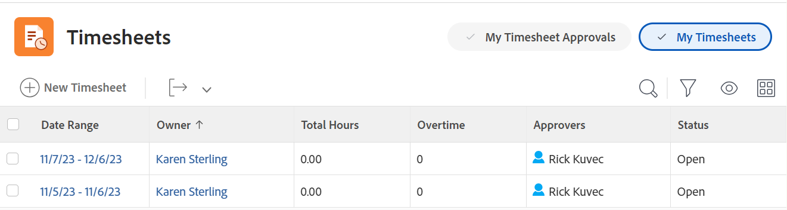
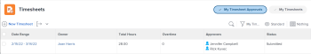

# Panoramica dei timesheet

<!-- Audited: 12/2023 -->

Puoi utilizzare le schede orario per tenere traccia del tempo trascorso sul lavoro, sia all’interno che all’esterno, di Adobe Workfront.

È possibile registrare il tempo del progetto sugli elementi di lavoro, ad esempio progetti, attività e problemi. Le ore registrate per attività, problemi e progetti vengono visualizzate automaticamente nella scheda orario.

È inoltre possibile registrare il tempo non dedicato al progetto per gli elementi non correlati al lavoro, ad esempio riunioni, corsi di formazione o tempo fuori dall&#39;ufficio, direttamente nella scheda orario in Ore generali.

Per informazioni più dettagliate su come registrare l&#39;ora in Workfront, vedi [Registra ora](../../timesheets/create-and-manage-timesheets/log-time.md).

>[!TIP]
>
>Gli amministratori di Workfront o di gruppi possono creare schede orario e associarle agli utenti. Per informazioni sulla creazione delle schede orario, vedere [Creare e gestire le schede orario: indice articolo](../create-and-manage-timesheets/create-and-manage-timesheets.md).

## Comprendere il tempo del progetto e il tempo non del progetto

Le schede orario forniscono agli utenti un modo semplice per tenere traccia del tempo sia per il lavoro di progetto che per quello non di progetto:

* **Ora progetto:** direttamente dall&#39;attività o dal progetto in cui desideri tenere traccia dell&#39;ora.

  Le ore registrate per attività, problemi e progetti tramite una scheda orario vengono associate ai rispettivi elementi di lavoro per fornire una rappresentazione accurata dello sforzo speso per progetti e attività. Senza l&#39;inserimento dell&#39;ora esatta, i dati potrebbero non essere accurati se destinati a scopi di fatturazione.

  Inoltre, quando una risorsa registra le ore direttamente sulle attività, i problemi e i progetti vengono visualizzati automaticamente quando l’utente accede alla scheda orario. Ciò presuppone che l’intervallo di date della scheda orario si estenda sulle date in cui sono state registrate le ore.

* **Ora non progetto:** direttamente sulla scheda orario dell&#39;utente. Per ulteriori informazioni su come tenere traccia dell&#39;ora in Workfront, vedere [Ora di registro](../../timesheets/create-and-manage-timesheets/log-time.md).

  In una scheda orario è possibile registrare le ore di ferie, le ore di malattia, le ore di transito, le ore di riparazione o manutenzione delle apparecchiature o qualsiasi tipo di ore di lavoro generale che si desidera creare.

## Accedere alle schede orario nell’area Schede orario

L’area delle schede orario è disponibile per impostazione predefinita per tutti gli utenti. Gli amministratori di Workfront possono modificare questo nel modello di layout in base alle esigenze. Per ulteriori informazioni, consulta [Personalizzare il menu principale utilizzando un modello layout](/help/quicksilver/administration-and-setup/customize-workfront/use-layout-templates/customize-main-menu.md).

Per accedere a una scheda orario:

{{step1-to-timesheets}}

Per impostazione predefinita, vengono visualizzate tutte le schede orario e le schede orario a cui hai accesso. Per informazioni sul layout della scheda orario in Adobe Workfront, consulta [Panoramica del layout della scheda orario](../../timesheets/timesheets/timesheet-layout.md).

1. Fai clic su una delle seguenti opzioni nell’angolo superiore destro per visualizzare le schede orario:

   * **Le mie schede orario** per visualizzare solo le tue schede orario.

   

   * **Le mie approvazioni schede orario** per visualizzare solo le schede orario che hai approvato.

     

1. (Facoltativo) Aggiorna la visualizzazione, il filtro e il raggruppamento nella parte superiore dell’elenco delle schede orario. Per ulteriori informazioni, vedere [Elementi di reporting: filtri, visualizzazioni e raggruppamenti](../../reports-and-dashboards/reports/reporting-elements/reporting-elements-overview.md).

1. Fai clic sull&#39;**Intervallo date** di una scheda orario per aprirla.

   Ogni scheda attività visualizza tutte le attività, i problemi e i progetti per i quali hai effettuato l’accesso. Una scheda orario visualizza inoltre fino a 45 attività e problemi assegnati all&#39;utente con date comprese nell&#39;intervallo di tempo della scheda orario, ma per i quali potrebbe non essere stato ancora registrato il tempo. I 45 elementi aggiornati più di recente vengono selezionati per la visualizzazione nella scheda orario.

   Per ulteriori informazioni, consulta [Configurare le preferenze di orario e scheda orario](../../administration-and-setup/set-up-workfront/configure-timesheets-schedules/timesheet-and-hour-preferences.md).
