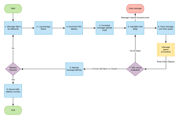

# Tentativi di abbonamento agli eventi

Quando si implementa un sistema di consegna dei messaggi, è necessario risolvere alcuni problemi al fine di garantire stabilità, coerenza ed esperienza utente. Una delle carenze di un sistema di consegna dei messaggi è garantire che i messaggi raggiungano la destinazione con successo e sapere cosa fare quando i messaggi non arrivano.

Alcune integrazioni possono accettare errori di consegna, quindi rilasciare il messaggio e passare al messaggio successivo.  In altre integrazioni, la mancata consegna di un messaggio non può essere ignorata. Ad esempio, un’integrazione finanziaria potrebbe tentare di inviare un messaggio, ma riceve invece un codice di stato HTTP di 404, che indica che il server non è in grado di trovare l’endpoint a cui il messaggio deve essere recapitato. In questi casi, un messaggio mancante potrebbe significare che qualcuno non viene pagato per il proprio tempo o un&#39;organizzazione che supera il budget per le risorse contrattate.

## Strategia Adobe Workfront per i tentativi di iscrizione agli eventi

Poiché i clienti sfruttano la piattaforma Workfront come elemento fondamentale del loro lavoro quotidiano, il framework Workfront Event Subscription fornisce un meccanismo per garantire che la consegna di ogni messaggio venga tentata il più possibile.

I messaggi in uscita attivati dagli eventi che non possono essere consegnati agli endpoint del cliente vengono inviati finché la consegna non riesce per un periodo massimo di 48 ore. Durante questo periodo, i nuovi tentativi si verificano con una frequenza gradualmente ridotta fino al successo della consegna o fino a quando non sono trascorse 48 ore.

I clienti devono assicurarsi che tutti gli endpoint che consumano messaggi in uscita da Workfront Event Subscriptions siano impostati in modo da restituire a Workfront un messaggio di risposta di 200 livelli quando la consegna ha esito positivo.

## Gestione dei messaggi in uscita attivati da eventi non riusciti

Il seguente diagramma di flusso mostra la strategia per il nuovo tentativo delle consegne di messaggi con le sottoscrizioni di eventi Workfront:

Le spiegazioni seguenti corrispondono ai passaggi descritti nel diagramma di flusso:

1. Impossibile recapitare il messaggio.
1. Le informazioni sull’errore di consegna dei messaggi vengono registrate.

   Tutti i tentativi non riusciti di inviare un messaggio vengono registrati in modo che sia possibile eseguire il debug per determinare la causa principale di un errore o di una serie di errori specifici.

1. Gli errori URL sono aumentati.
1. Il conteggio dei tentativi di messaggio viene incrementato.
1. Calcola il ritardo fino a quando non verrà effettuato un nuovo tentativo di consegna del messaggio.
1. Il messaggio viene inserito nella coda dei tentativi del messaggio.

   Come mostrato nel diagramma di flusso precedente, la coda dei messaggi utilizzata per l’elaborazione dei nuovi tentativi di consegna dei messaggi è una coda separata da quella che elabora il tentativo di consegna iniziale per ciascun messaggio. Questo consente al flusso in tempo reale dei messaggi di continuare senza interruzioni a causa del fallimento di qualsiasi sottoinsieme di messaggi.

1. Viene valutato lo stato del circuito URL. Si verifica una delle seguenti situazioni:

   * Se il circuito è aperto e non consente le consegne in questo momento, riavviare il processo al punto 5.
   * Se il circuito è semiaperto, ciò implica che il nostro circuito è attualmente aperto, ma è passato abbastanza tempo per consentire la verifica dell&#39;URL per vedere se il problema di consegna ad esso è stato risolto.
   * Se i limiti dei tentativi di consegna del messaggio sono stati raggiunti (48 ore di nuovo tentativo), il messaggio viene eliminato

1. Se il circuito URL è chiuso e consente le consegne, tenta di inviare il messaggio. Se la consegna non riesce, il messaggio verrà riavviato al passaggio 1

1. Se il circuito URL è chiuso e consente le consegne, tenta di inviare il messaggio. Se la consegna non riesce, il messaggio verrà riavviato al passaggio 1.

   <!--
   <li value="10" data-mc-conditions="QuicksilverOrClassic.Draft mode">Workfront disables Event Subscriptions when both of the following criteria are met:
   <ul>
   <!--
   <li data-mc-conditions="QuicksilverOrClassic.Draft mode">The Event Subscription has failed 1000 delivery attempts consecutively</li>
   <li data-mc-conditions="QuicksilverOrClassic.Draft mode">48 hours have passed since the last successful delivery</li>
   </ul></li>
   -->
