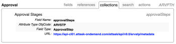

# Utilizzo di API Explorer

Quando utilizzi l’API core di Adobe Workfront, API Explorer è uno strumento di riferimento legacy che cataloga le relazioni tra risorse, parametri e variabili supportati.

## Accedi ad API Explorer:

1. Utilizzare un browser web per accedere ad [API Explorer](https://developer.adobe.com/workfront/api-explorer/)\
   

1. In alto a destra in API Explorer, selezionare la **versione API** di Workfront desiderata; per impostazione predefinita, viene selezionata automaticamente la versione più recente
1. Il campo **Filtro**, può essere utilizzato per filtrare gli oggetti elencati per nome e troncherà l’elenco di oggetti visualizzato di conseguenza:

   

   * **Campi**: campi disponibili nell’oggetto specificato.
   * **Riferimenti**: variabili di riferimento disponibili per l’oggetto specificato. Un riferimento è un alias di una variabile. Una volta inizializzato, un riferimento può essere utilizzato in modo intercambiabile con il nome della variabile. Un riferimento utilizza la memoria inizializzata.
   * **Raccolte**: raccolte disponibili per l’oggetto. Le raccolte sono variabili che rappresentano una relazione di tipo uno a molti tra l’oggetto e la risorsa.
   * **Ricerca**: risorse di ricerca disponibili per l’oggetto. I risultati di una ricerca sono basati sui parametri di query specificati dalla risorsa di ricerca nella richiesta API.
   * **Azioni**: azioni supportate per l’oggetto. Le azioni possono essere procedure semplici o complesse che vengono eseguite su una risorsa o un set di risorse. Una determinata azione può influire anche sulle risorse correlate.

1. Apri una scheda, quindi fai clic sull’ID oggetto per visualizzare le variabili applicabili.\
   \
   A seconda dell’oggetto selezionato, possono essere applicate le seguenti variabili:

   | Variabile | Definizione |
   |---|---|
   | Nome campo | Nome di un campo utilizzato in un’operazione all’interno dell’API Workfront. |
   | Tipo di campo | Tipo di valori che è possibile inserire in un campo specifico di una tabella dati. I possibili valori del tipo di campo includono string, double, int, dateTime. |
   | Tipo enumerato | Il tipo di valori che possono essere utilizzati per identificare un tipo di dati. |
   | Valori possibili | Valori accettabili per l’oggetto. |
   | Tipo di attributo ObjCode | Attributi che possono essere utilizzati per modificare la classe dell’oggetto. |
   | URL | Percorso di ingresso che consente all’app di comunicare con l’API Workfront. |
   | Argomenti | Le variabili dell’oggetto che possono essere trasmesse tra l’applicazione e Workfront. |
   | Tipo di risultato: | Tipi di dati consentiti che possono essere restituiti da un metodo. |
