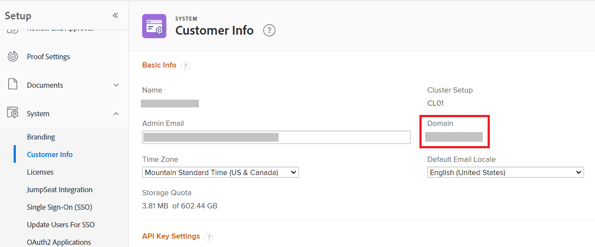

# Formato del dominio per le chiamate API di Adobe Workfront

Quando effettui una chiamata API all&#39;API Workfront, utilizzi il dominio della tua organizzazione nella chiamata.

L’URL creato per la chiamata API dipende dall’URL utilizzato per connettersi a Workfront.

| L’URL di Workfront inizia con: | URL per chiamate API: |
|---|---|
| `experience.adobe.com` | `<yourdomain>.my.workfront.adobe.com` |

## Requisiti di accesso

+++ Espandi per visualizzare i requisiti di accesso per la funzionalità descritta in questo articolo.

<table style="table-layout:auto"> 
 <col> 
 <col> 
 <tbody> 
  <tr> 
   <td role="rowheader">Pacchetto Adobe Workfront</td> 
   <td> 
Qualsiasi 
 </td> 
  </tr> 
  <tr> 
   <td role="rowheader">Licenza di Adobe Workfront</td> 
   <td>
Standard

   
Piano
</td> 
  </tr> 
  <tr> 
   <td role="rowheader">Configurazioni del livello di accesso</td> 
   <td> 
Devi essere un amministratore di Workfront
 </td> 
  </tr> 
 </tbody> 
</table>

Per informazioni, consulta [Requisiti di accesso nella documentazione di Workfront](/help/quicksilver/administration-and-setup/add-users/access-levels-and-object-permissions/access-level-requirements-in-documentation.md).

+++

Per individuare il dominio:

1. Fai clic sull&#39;icona **[!UICONTROL Main Menu]**  nell&#39;angolo superiore destro di Adobe Workfront oppure, se disponibile, fai clic sull&#39;icona **[!UICONTROL Main Menu]**  nell&#39;angolo superiore sinistro, quindi fai clic sull&#39;icona **[!UICONTROL Setup]** .
1. Seleziona **Sistema**, quindi seleziona **Informazioni cliente**.

   Il dominio è elencato a destra della schermata.

   

