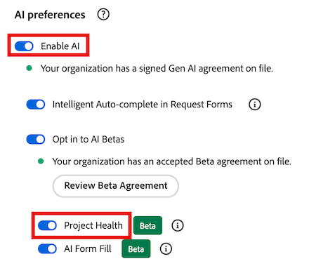

# Panoramica sullo stato del progetto

>[!IMPORTANT]
>
>La funzione Integrità del progetto è attualmente disponibile solo per gli utenti che partecipano alla fase beta.

La funzione Integrità dei progetti di Adobe Workfront utilizza la potenza di AI Assistant per fornire immediatamente una valutazione delle prestazioni dei progetti, delle aree che richiedono la tua attenzione e di come evitare problemi che possono costarti tempo e denaro.

L&#39;Assistente IA può generare una valutazione dello stato del progetto per i seguenti oggetti:

* Un singolo progetto
* Un singolo programma
* Più progetti

Per ulteriori informazioni sull&#39;Assistente di IA, vedere [Panoramica dell&#39;Assistente di IA](/help/quicksilver/workfront-basics/ai-assistant/ai-assistant-overview.md).

+++ Espandi per visualizzare i requisiti di accesso per la funzionalità in questo articolo.

<table style="table-layout:auto"> 
<col> 
</col> 
<col> 
</col> 
<tbody> 
<tr> 
   <td role="rowheader">
Pacchetto Adobe Workfront
</td> 
   <td> 

Seleziona o superiore 
 

Selezione o successiva flusso di lavoro

   </td> 
<tr> 
 <tr> 
   <td role="rowheader">
Licenza Adobe Workfront
</td> 
   <td> 

Standard
 
   </td> 
   </tr> 
  </tr> 
  <tr> 
   <td role="rowheader">
Configurazioni del livello di accesso
</td> 
   <td>
Per gestire le configurazioni dell'integrità del progetto è necessario essere un amministratore di sistema 

   
Modifica l'accesso ai progetti per applicare le configurazioni di integrità del progetto 

     
Visualizza l'accesso ai progetti per visualizzare le configurazioni dell'integrità del progetto 

  </td> 
  </tr>  
    </tr>  
</tbody> 
</table>

Per ulteriori dettagli sulle informazioni contenute in questa tabella, vedere [Requisiti di accesso nella documentazione di Workfront](/help/quicksilver/administration-and-setup/add-users/access-levels-and-object-permissions/access-level-requirements-in-documentation.md).
+++

## Iscriviti alla versione beta di Project Health

Per utilizzare Project Health (Integrità del progetto), l’organizzazione deve avere l’Assistente AI abilitato.

Per abilitare l’Assistente AI e l’integrità del progetto per la tua organizzazione, devono essere applicate tutte le seguenti condizioni:

* La tua organizzazione deve aver eseguito la migrazione ad Adobe IMS (Identity Management System).
* La tua organizzazione deve disporre di un piano Select, Prime o Ultimate Workfront
* L’esperienza unificata di Adobe deve essere abilitata.
* Adobe deve disporre di un accordo Adobe Gen AI firmato su file.
* L’amministratore di Workfront deve abilitare l’Assistente IA per gli utenti dell’organizzazione. L’Assistente AI è abilitato tramite i livelli di accesso.
* Entrambe le opzioni Abilita AI e Integrità progetto devono essere selezionate nella sezione Preferenze AI in Configurazione > Sistema > Preferenze.

  

Per ulteriori informazioni, vedere [Panoramica dell&#39;Assistente AI](/help/quicksilver/workfront-basics/ai-assistant/ai-assistant-overview.md) e [Configurare le preferenze di sistema](/help/quicksilver/administration-and-setup/manage-workfront/security/configure-security-preferences.md).

## Calcolo dell&#39;integrità del progetto

L&#39;Assistente AI consente di valutare rapidamente le condizioni generali di un progetto assegnandogli uno degli stati di integrità disponibili:

* Puntuale
* A Rischio
* In difficoltà

Questo stato viene calcolato utilizzando i componenti del progetto, ad esempio lo stato di avanzamento, il lavoro sottostimato e altro ancora. Per un elenco completo dei componenti utilizzati per misurare l&#39;integrità del progetto, vedere la sezione [Elenco stati del progetto e del programma](#project-and-program-states-list).

A ciascun componente del progetto viene assegnato un punteggio di rischio numerico compreso tra (0-100), che viene quindi calcolato come media per creare lo stato di integrità generale del progetto:

* On Target (75 o superiore): le prestazioni del progetto rientrano nei limiti previsti.
* A rischio (50-74): vengono rilevati problemi emergenti che possono influire sulle prestazioni del progetto.
* In difficoltà (49 o meno): le prestazioni del progetto sono inferiori a soglie accettabili e richiedono un’attenzione immediata.

>[!NOTE]
>
>* L&#39;Assistente IA valuta attualmente solo i dati del progetto selezionato.
>* L&#39;analisi incrociata o storica non è ancora inclusa nel calcolo dello stato del progetto.

### Esempi di calcolo dello stato del progetto per un progetto

Nel primo esempio, vengono valutati 4 componenti del progetto e i relativi punteggi di rischio individuali vengono calcolati come segue:

* 2 In target (punteggio di rischio 90)
* 1 A rischio (punteggio di rischio 45)
* 1 In difficoltà (punteggio di rischio 20)

Quando si esegue la media di questi punteggi, il risultato è 61. Utilizzando i criteri di integrità del progetto elencati sopra, il progetto viene posto nello stato A rischio.

Nell’esempio successivo, una modifica della pianificazione di 1 giorno si è verificata all’inizio della timeline del progetto. In questo scenario, l’Assistente AI valuta sia la tempistica che l’impatto della modifica in relazione alla durata complessiva del progetto:

* Un turno di programmazione di 1 giorno all’inizio di una timeline di progetto di 60 giorni è minore e in genere viene valutato come On Target.
* Un turno di programmazione di 1 giorno in prossimità della data di completamento di un progetto è più dirompente e può essere valutato a rischio o in difficoltà.

Poiché la modifica era minore e si è verificata nelle prime fasi della sequenza temporale del progetto, il progetto viene impostato sullo stato On Target.

Se si verificano più modifiche alla pianificazione nella sequenza temporale di un progetto, queste vengono valutate e quindi calcolate come media prima di essere applicate al calcolo dello stato del progetto.

## Comprendere la differenza tra le condizioni del progetto e l&#39;integrità del progetto

Le condizioni del progetto e lo stato di integrità del progetto sono concetti simili in Workfront e hanno gli stessi nomi predefiniti per descrivere la condizione o lo stato del progetto (Su destinazione, A rischio e In difficoltà), ma hanno scopi diversi.

Le condizioni del progetto forniscono un’istantanea di base sulle prestazioni correnti di un progetto in base solo alle date pianificate, previste e stimate. Può essere impostato manualmente dal proprietario del progetto o automaticamente da Workfront in base alle attività del progetto. In alternativa, Project Health è più completo e valuta fattori aggiuntivi, fornendo una comprensione di alto livello delle prestazioni.

Per ulteriori informazioni sulle condizioni del progetto, consulta [Condizioni personalizzate](/help/quicksilver/administration-and-setup/customize-workfront/create-manage-custom-conditions/custom-conditions.md).

## Elenco degli stati del progetto e del programma

La tabella seguente contiene un raggruppamento degli stati disponibili che l’Assistente IA assegnerà al progetto o al programma durante la generazione di una valutazione dello stato del progetto.

<table>
    <tr>
        <td><b>Stato progetto</b></td>
        <td><b>Definizione</b></td>
        <td><b>Fattori</b></td>
    </tr>
    <tr>
        <td>Puntuale</td>
        <td>Questo viene assegnato quando il livello di rischio medio per i seguenti fattori rientra nella soglia valida.
        </td>
        <td> 
        <ul><li>Scope creep</li>
        <li>Campi mancante</li>
        <li>Modifiche a pianificazione</li>
        <li>Lavoro sottovalutato</li>
        <li>Avanzamento del progetto</li>
        <li>Attività in ritardo</li>
        <li>Budget</li>
        </ul></td>
    </tr>
    <tr>
        <td>A Rischio</td>
        <td>Questo viene assegnato quando il livello di rischio medio per i seguenti fattori scende appena al di sotto della soglia valida.</td>
        <td>
        <ul><li>Scope creep</li>
        <li>Campi mancante</li>
        <li>Modifiche a pianificazione</li>
        <li>Lavoro sottovalutato</li>
        <li>Avanzamento del progetto</li>
        <li>Attività in ritardo</li>
        <li>Budget</li>
        </ul></td>
    </tr>
    <tr>
        <td>In difficoltà</td>
        <td>Questo viene assegnato quando il livello di rischio medio per i seguenti fattori scende al di sotto della soglia valida.</td>
        <td>
        <ul><li>Scope creep</li>
        <li>Campi mancante</li>
        <li>Modifiche a pianificazione</li>
        <li>Lavoro sottovalutato</li>
        <li>Avanzamento del progetto</li>
        <li>Attività in ritardo</li>
        <li>Budget</li>
        </ul></td>
    </tr>
    </tr>
   </table>

## Elenco dei prompt dell&#39;Assistente AI

Di seguito è riportato un elenco di prompt che è possibile utilizzare per richiedere una valutazione IA per generare una valutazione dello stato del progetto per un progetto, un programma o tutti i progetti nel proprio account.

<table>
    <tr>
        <td><b>Posizione</b></td>
        <td><b>Prompt</b></td>
    </tr>
    <tr>
        <td>Pagina dei dettagli di un progetto specifico</td>
        <td><em>Qual è lo stato di salute di questo progetto?</em></td>
    </tr>
    <tr>
        <td>Qualsiasi pagina in Workfront </td>
        <td><em>Qual è lo stato del progetto [PROJECT NAME]?</em></td>
    </tr>
    <tr>
        <td>Qualsiasi pagina in Workfront </td>
        <td><em>Qual è lo stato dei miei progetti?</em></td>
    </tr>
       <tr>
        <td>Pagina dei dettagli di un programma specifico</td>
        <td><em>Qual è lo stato di salute di questo programma?</em></td>
    </tr>
       <tr>
        <td>Qualsiasi pagina in Workfront </td>
        <td><em>Qual è lo stato del programma [NOME PROGRAMMA]?</em></td>
    </tr>
   </table>

## Gestisci configurazioni integrità progetto

Una configurazione dell&#39;integrità di un progetto contiene criteri specifici che determinano la modalità di calcolo dell&#39;integrità del progetto. Dopo aver creato una configurazione, puoi applicarla a un progetto.

>[!NOTE]
>
>Per gestire le configurazioni dell&#39;integrità del progetto è necessario essere amministratore di sistema.

{{step-1-to-setup}}

1. Fai clic su **Preferenze progetto** nel pannello a sinistra, quindi seleziona **Integrità progetto** nel menu a discesa visualizzato.

1. Nell&#39;angolo superiore destro della pagina, seleziona **Nuova configurazione**.

1. (Facoltativo) Nella pagina dei dettagli delle configurazioni, sostituisci *Configurazione senza titolo* con una nuova configurazione **Nome**.

1. Nella sezione **Quali fattori si desidera includere nell&#39;integrità del progetto** deselezionare i fattori che non si desidera includere nella determinazione dei criteri di integrità del progetto:
   * **Scorrimento ambito**: quanto è stato espanso l&#39;ambito del progetto dall&#39;avvio.

   * **Campi obbligatori**: se mancano campi obbligatori (ad esempio, la descrizione del progetto). Questi campi obbligatori determinano la completezza del progetto e sono specificati in **Quali campi si desidera verificare?** sezione di configurazione di seguito.

   * **Modifiche alla pianificazione**: quante modifiche alla pianificazione si sono verificate dall&#39;avvio del progetto.

   * **Stima attività**: la precisione con cui è stato stimato il lavoro dell&#39;attività (ad esempio, nessuna attività scaduta attualmente nel progetto).

   * **Burndown attività**: avanzamento del progetto rispetto alla sequenza temporale.

   * **Attività scadute**: quante attività sono attualmente scadute.

   * **Costo**: se il progetto ha superato il preventivo.

1. In **Quando inizia ufficialmente il progetto?**, seleziona dall&#39;elenco a discesa l&#39;evento che segnala l&#39;inizio del progetto.

1. In **Come si stima l&#39;ambito del lavoro su un progetto?** sezione, selezionare il fattore di progetto che aumenterà con l&#39;aumento dell&#39;ambito del progetto.

1. In **Quali campi si desidera verificare la completezza?** sezione, selezionare uno o più campi che verranno controllati per determinare la completezza del progetto.

   

1. Fai clic su **Salva** nell&#39;angolo superiore destro.

## Applica configurazioni integrità progetto

Dopo che un amministratore ha creato una configurazione di Integrità progetto, gli utenti con accesso in modifica possono applicarla a un progetto.

{{step1-to-projects}}

1. Nella pagina **Progetti**, seleziona un progetto.

1. Fai clic sull&#39;icona **Altro**  a destra del nome del progetto, quindi seleziona **Modifica**. Viene aperto il pannello laterale **Modifica progetto**.

1. Nel pannello a sinistra, seleziona **Impostazioni progetto**.

1. Nel campo **Configurazione integrità progetto**, selezionare la configurazione da applicare al progetto.

   

1. Fai clic su **Salva** nell&#39;angolo inferiore sinistro del pannello.

## Generare una valutazione dello stato del progetto per un progetto o un programma

Se si dispone dell&#39;accesso di visualizzazione per un progetto o un programma, è possibile generare la relativa valutazione dello stato del progetto utilizzando l&#39;assistente di IA.

Se stai generando una valutazione per un progetto, ciò può essere fatto dalla pagina del progetto o facendo riferimento al nome del progetto quando chiedi all&#39;assistente come sta andando il progetto.

Per generare una valutazione per un programma, è possibile utilizzare la pagina dei dettagli del programma.

>[!NOTE]
>
>Per un progetto non è possibile generare una valutazione di integrità finché il progetto non è stato avviato. È possibile configurare l’evento che attiva un progetto a partire dalle impostazioni del progetto.

Per ulteriori informazioni, vedere la sezione seguente in questo articolo: [Gestione configurazioni integrità progetto](#manage-project-health-configurations).

1. Passare al progetto o al programma per il quale si desidera generare una valutazione dello stato del progetto.

1. Nella pagina dei dettagli del progetto/programma, fai clic sull&#39;icona **Assistente AI**  nell&#39;angolo superiore destro della schermata. Viene aperto l’Assistente AI.

1. Digitare quanto segue nel campo **Chiedi informazioni su Workfront**: *Informazioni sullo stato del progetto*

   Oppure

   Digitare quanto segue nel campo **Chiedi informazioni su Workfront**: *Qual è lo stato del programma?*

   >[!NOTE]
   >
   >Se si accede all&#39;Assistente IA da una pagina diversa di Workfront, è possibile digitare *Informazioni sullo stato del progetto [NOME PROGETTO]?* o *Qual è l&#39;integrità del programma [NOME PROGRAMMA]?*  
   >Per un elenco completo dei prompt correnti che è possibile immettere, vedere la sezione seguente in questo articolo: [Elenco dei prompt dell&#39;Assistente AI](#ai-assistant-prompts-list).

1. Fai clic sull&#39;icona **Invia** . La valutazione dello stato del progetto viene generata e visualizzata nel pannello. Nella parte superiore di ogni valutazione dello stato del progetto viene visualizzato un badge che riflette le condizioni correnti del progetto.

   

   Se stai generando una valutazione per un portfolio, verranno elencati più badge che mostrano le condizioni di ciascun progetto nel programma. Per ulteriori informazioni sulle etichette dei badge, vedere la seguente sezione in questo articolo: [Elenco degli stati del progetto e del programma](#project-and-program-states-list).

1. (Facoltativo) Fare clic su uno dei punti di valutazione per espandere i relativi dettagli.

1. (Facoltativo) Nella modalità dettagli espansi, fai clic sul collegamento dell’attività per aprire i dettagli dell’attività.

   

1. Dopo aver esaminato i dettagli di integrità del progetto, fai clic sull&#39;icona **Chiudi**  nell&#39;angolo superiore destro dell&#39;Assistente IA.

## Generare una valutazione dello stato del progetto per più progetti

È possibile generare una valutazione combinata dello stato del progetto per tutti i progetti per i quali si dispone attualmente dell&#39;accesso di visualizzazione (o di livello superiore).

Un progetto verrà incluso nella valutazione combinata dello stato del progetto solo se il progetto è stato avviato. È possibile configurare l’evento che attiva un progetto a partire dalle impostazioni del progetto. Per ulteriori informazioni, vedere la sezione seguente in questo articolo: [Gestione configurazioni integrità progetto](#manage-project-health-configurations).

1. Fai clic sull&#39;icona **Assistente AI**  nell&#39;angolo superiore destro della schermata. Viene aperto l’Assistente AI.

1. Digita quanto segue nel campo **Chiedi informazioni su Workfront**: *Qual è lo stato dei miei progetti?*

   Per un elenco completo dei prompt correnti che è possibile immettere, vedere la sezione seguente in questo articolo: [Elenco dei prompt dell&#39;Assistente AI](#ai-assistant-prompts-list).

1. Fai clic sull&#39;icona **Invia** . La valutazione dello stato del progetto viene generata e visualizzata nel pannello.

   

   Durante la generazione di una valutazione per più progetti, l’Assistente IA raggruppa i risultati in base alle prestazioni correnti dei progetti.

1. (Facoltativo) Fai clic su uno dei badge di condizione di integrità del progetto per espandere l’elenco dei progetti, quindi seleziona un collegamento per un progetto specifico per passare alla pagina dei dettagli del progetto.

1. Dopo aver esaminato i dettagli di integrità dei progetti, fai clic sull&#39;icona **Chiudi**  nell&#39;angolo superiore destro dell&#39;Assistente IA per chiuderlo.

<!--

## Build a Project Health table report in a Canvas Dashboard

>[!IMPORTANT]
>
>The Canvas Dashboards feature is currently only available for users participating in the beta stage. For more information, see [Canvas Dashboards beta information](/help/quicksilver/product-announcements/betas/canvas-dashboards-beta/canvas-dashboards-beta-information.md). 

You can add a table report to a Canvas Dashboard in order to easily visualize your Project Health data in a table format.  

### Prerequisites 

You must create a dashboard before you can build a table report. 

For more, see [Create a Canvas Dashboard](/help/quicksilver/reports-and-dashboards/canvas-dashboards/create-dashboards/create-dashboards.md).

### Build a Project Health table report 

There are many configuration options available for building a Project Health table report. In this section, we'll walk you through the process of creating one that displays the following columns: 

* **Name**: Contains the project name. 
* **Project Health Analysis**: Contains a summary of the Project Health assessment. 
* **Project Health Created At**: Contains the date/time when the Project Health assessment was last generated. 
* **Project Health Label**: Contains the project's label (e.g. On Target, At Risk, or In Trouble).

{{step1-to-dashboards}}

1. In the left panel, click **Canvas Dashboards**. 
1. In the upper-right corner, click **New Dashboard**. 
1. In the **Create dashboard** box, enter the dashboard's **Name** and **Description**. 
1. Click **Create**. 
1. In the **Add report** box, select **Create report**. 
1. On the left side, select **Table**. 
1. In the upper-right corner, click **Create report**. 
1. (Optional) Follow the steps below to configure the **Details**  section: 
    1. Enter a report **Name**. 
    1. Enter a report **Description**. 
1. Follow the steps below to configure the **Build table**  section: 
    1. In the left panel, click the **Table columns** icon. 
    1. Click **Add column**, then select **Project** > **Name**. 
    1. Click **Add column**, then select **Project** > **Project Health** > **Health Analysis**. 
    1. Click **Add column**, then select **Project** > **Project Health** > **Created At**. 
    1. Click **Add column**, then select **Project** > **Project Health** > **Health Label**. 

1. Follow the steps below to configure the **Filter**  section: 
    1. In the left panel, click the **Filter** icon. 
    1. Select **Edit filter**. 
    1. Click **Add condition** and then specify the field you want to filter by and the modifier that defines what kind of condition the field must meet. The column appears in the preview section on the right.
    1. (Optional) Click **Add filter group** to add another set of filtering criteria. The default operator between the sets is AND. Click the operator to change it to OR. 

1. Follow the steps below to configure the **Drilldown Group Settings**  section: 
    1. In the left panel, click the **Group Settings** icon. 
    1. Click the **Add grouping** button and then select the field you want to create as a grouping. The grouping column appears in the preview section on the right. 

1. Click **Save** to create the report.

-->
