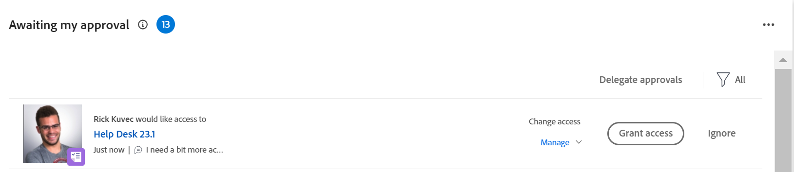

# Concedere l’accesso agli oggetti nell’area Home

Gli utenti possono richiedere l’accesso agli oggetti all’interno di Adobe Workfront. Per ulteriori informazioni sulla richiesta di accesso, consulta  [Richiedi accesso agli oggetti](../../workfront-basics/grant-and-request-access-to-objects/request-access.md).

Se si è il proprietario di un oggetto, è possibile concedere o negare l&#39;accesso agli elementi dall&#39;area Home.

## Requisiti di accesso

<!--drafted for P&P:

<table style="table-layout:auto"> 
 <col> 
 <col> 
 <tbody> 
  <tr> 
   <td role="rowheader">Adobe Workfront plan*</td> 
   <td> 
Any
 </td> 
  </tr> 
  <tr> 
   <td role="rowheader">Adobe Workfront license*</td> 
   <td> 
Current license: Standard
 
   Or
   
Legacy license: Work or higher

   </td> 
  </tr> 
  <tr> 
   <td role="rowheader">Access level configurations*</td> 
   <td> 
View access or higher to projects, tasks, issues, or documents
 
<b>NOTE</b>
   
   If you still don't have access, ask your Workfront administrator if they set additional restrictions in your access level. For information on how a Workfront administrator can modify your access level, see <a href="../../administration-and-setup/add-users/configure-and-grant-access/create-modify-access-levels.md" class="MCXref xref">Create or modify custom access levels</a>.
 </td> 
  </tr> 
  <tr> 
   <td role="rowheader">Object permissions</td> 
   <td> 
View permissions or higher to projects, tasks, issues, or documents
 
For information on requesting additional access, see <a href="../../workfront-basics/grant-and-request-access-to-objects/request-access.md" class="MCXref xref">Request access to objects </a>.
 </td> 
  </tr> 
 </tbody> 
</table>

-->

Per eseguire i passaggi descritti in questo articolo, è necessario disporre dei seguenti diritti di accesso:

<table style="table-layout:auto"> 
 <col> 
 <col> 
 <tbody> 
  <tr> 
   <td role="rowheader">Piano Adobe Workfront*</td> 
   <td> 
Qualsiasi
 </td> 
  </tr> 
  <tr> 
   <td role="rowheader">Licenza Adobe Workfront*</td> 
   <td> 
Lavoro o superiore
 </td> 
  </tr> 
  <tr> 
   <td role="rowheader">Configurazioni del livello di accesso*</td> 
   <td> 
Accesso di visualizzazione o superiore a progetti, attività, problemi o documenti
 
<b>NOTA</b>

Se non disponi ancora dell’accesso, chiedi all’amministratore di Workfront se ha impostato restrizioni aggiuntive nel tuo livello di accesso. Per informazioni su come un amministratore di Workfront può modificare il tuo livello di accesso, consulta <a href="../../administration-and-setup/add-users/configure-and-grant-access/create-modify-access-levels.md" class="MCXref xref">Creare o modificare livelli di accesso personalizzati</a>.
 </td>
</tr> 
  <tr> 
   <td role="rowheader">Autorizzazioni oggetto</td> 
   <td> 
Visualizza autorizzazioni o versioni successive per progetti, attività, problemi o documenti
 
Per informazioni sulla richiesta di accesso aggiuntivo, consulta <a href="../../workfront-basics/grant-and-request-access-to-objects/request-access.md" class="MCXref xref">Richiedi accesso agli oggetti </a>.
 </td> 
  </tr> 
 </tbody> 
</table>

&#42;Per conoscere il piano, il tipo di licenza o l&#39;accesso di cui si dispone, contattare l&#39;amministratore Workfront.

## Concedere l’accesso agli oggetti nell’area Home

1. Fai clic su **Home** icona  nell’angolo in alto a sinistra di Adobe Workfront.

   >[!NOTE]
   >
   >L’amministratore di Workfront potrebbe apportare le seguenti modifiche all’icona Home nel tuo ambiente:
   >
   >* Sostituiscilo con un’immagine personalizzata per illustrare la tua organizzazione. In questo caso, l’icona avrà un aspetto diverso da quello mostrato in questo articolo.
   >* Sostituisci la pagina collegata con un’altra pagina. In questo caso, fai clic su **Menu principale**  nell’angolo superiore destro della pagina, quindi fai clic su **Home**.

1. (Condizionale) Dall’area Home legacy, effettua le seguenti operazioni:

   1. In **Elenco lavori**, seleziona la richiesta di accesso che desideri gestire in **Approvazioni** sezione.

   

   La richiesta viene visualizzata a destra di Elenco lavori.

   1. Nell’angolo in alto a destra, fai clic sul pulsante per concedere l’accesso.\
      A seconda del tipo di accesso richiesto, il nome del pulsante cambia. Ad esempio, se il richiedente richiede l’accesso Visualizzazione, il pulsante indica **Concedi l&#39;accesso in visualizzazione**.\
      

   1. (Facoltativo) Per concedere un livello di accesso diverso da quello richiesto, fai clic sulla freccia accanto al pulsante Concedi accesso e seleziona il nuovo accesso, quindi fai clic su **Concedi &lt; Livello di autorizzazione > Accesso >**.\
      Viene visualizzato un messaggio che conferma che l’accesso è stato concesso.

   1. (Facoltativo) Fai clic su **Ignora** per negare l’accesso.\
      Viene visualizzato un messaggio che conferma che l’accesso è stato ignorato.

1. (Condizionale) Dalla nuova area Home, effettua le seguenti operazioni:

   1. Vai a **In attesa della mia approvazione** e trovare la richiesta di accesso aggiuntivo, quindi fai clic su **Concedi l’accesso**.

      

   1. (Facoltativo) Per concedere un livello di accesso diverso da quello richiesto, fai clic sul menu a discesa a sinistra del pulsante Concedi accesso e seleziona il nuovo accesso, quindi fai clic su **Concedi l’accesso**.

      La richiesta di accesso viene concessa e scompare dall’elenco delle richieste di approvazione.

   1. (Facoltativo) Fai clic su **Ignora** per negare l’accesso. La richiesta di accesso non viene concessa e scompare dall’elenco delle richieste di approvazione.

## Configurare le notifiche e-mail per le richieste

Puoi configurare la ricezione di notifiche e-mail per le richieste di accesso. L’amministratore di Workfront può disattivare questa funzionalità (come descritto in [Configurare le notifiche degli eventi per tutti gli utenti del sistema](../../administration-and-setup/manage-workfront/emails/configure-event-notifications-for-everyone-in-the-system.md)).

1. Fai clic su **Menu principale** icona  nell’angolo superiore destro di Adobe Workfront, quindi fai clic su **Configurazione** .

1. Clic **Preferenze**, o scorri fino alla sezione Preferenze.
1. In **Inviami un&#39;email quando** elenco a discesa, seleziona o deseleziona **Qualcuno mi ha richiesto l&#39;accesso**, a seconda che tu desideri ricevere notifiche e-mail quando un altro utente richiede l’accesso da te o meno.

1. Clic **Salva modifiche**.
