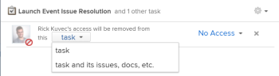

# Rimuovere le autorizzazioni dagli oggetti

È possibile rimuovere le autorizzazioni di altri utenti per gli oggetti a cui si ha accesso a Condividi. La rimozione delle autorizzazioni dagli oggetti è identica per tutti gli oggetti che possono essere condivisi. 

Considerazioni simili a quelle della condivisione di oggetti si applicano alla rimozione delle autorizzazioni dagli oggetti. Per ulteriori informazioni, consulta la sezione . [Considerazioni sulla condivisione di oggetti](../../workfront-basics/grant-and-request-access-to-objects/sharing-permissions-on-objects-overview.md#consider) nell&#39;articolo [Panoramica della condivisione delle autorizzazioni sugli oggetti](../../workfront-basics/grant-and-request-access-to-objects/sharing-permissions-on-objects-overview.md)

## Requisiti di accesso

<!--drafted for P&P:

<table style="table-layout:auto"> 
 <col> 
 <col> 
 <tbody> 
  <tr> 
   <td role="rowheader">Adobe Workfront plan*</td> 
   <td> 
Any 
 </td> 
  </tr> 
  <tr> 
   <td role="rowheader">Workfront license*</td> 
   <td> 
Current license: Contributor or higher

   Or  
   
Legacy license: Request or higher

   
<b>NOTE</b>

   
Some objects require a higher access than Request. 

   
   
For example, for the current license, a Contributor can share issues, but only Standard-license users can share a project.

   
   
For the legacy license, a Requestor can share issues, but only Workers or Planners can share a project.
 
   </td> 
  </tr> 
  <tr> 
   <td role="rowheader">Access level configurations*</td> 
   <td> 
View access or higher to the objects you want to share
 
<b>NOTE</b>
   
   If you still don't have access, ask your Workfront administrator if they set additional restrictions in your access level. For information on how a Workfront administrator can modify your access level, see <a href="../../administration-and-setup/add-users/configure-and-grant-access/create-modify-access-levels.md" class="MCXref xref">Create or modify custom access levels</a>.
 </td> 
  </tr> 
  <tr> 
   <td role="rowheader">Object permissions</td> 
   <td> 
View permissions or higher to the objects you want to share
 
Manage permissions to remove inherited permissions on objects
 
For information on requesting additional access, see <a href="../../workfront-basics/grant-and-request-access-to-objects/request-access.md" class="MCXref xref">Request access to objects </a>.
 </td> 
  </tr> 
 </tbody> 
</table>
-->

Per condividere gli oggetti è necessario disporre dei seguenti elementi:

<table style="table-layout:auto"> 
 <col> 
 <col> 
 <tbody> 
  <tr> 
   <td role="rowheader">piano Adobe Workfront*</td> 
   <td> 
Qualsiasi 
 </td> 
  </tr> 
  <tr> 
   <td role="rowheader">Licenza Workfront*</td> 
   <td> 
Richiesta o superiore

   
<b>NOTA</b>

Alcuni oggetti richiedono un accesso più elevato rispetto alla richiesta. Ad esempio, un richiedente può condividere problemi, ma solo i lavoratori o i pianificatori possono condividere un progetto.

</td> 
  </tr> 
  <tr> 
   <td role="rowheader">Configurazioni a livello di accesso*</td> 
   <td> 
Visualizza l'accesso o una parte superiore agli oggetti che desideri condividere
 
<b>NOTA</b>

Se non disponi ancora dell’accesso, chiedi all’amministratore Workfront se ha impostato ulteriori restrizioni nel livello di accesso. Per informazioni su come un amministratore Workfront può modificare il livello di accesso, consulta <a href="../../administration-and-setup/add-users/configure-and-grant-access/create-modify-access-levels.md" class="MCXref xref">Creare o modificare livelli di accesso personalizzati</a>.
 </td>
</tr> 
  <tr> 
   <td role="rowheader">Autorizzazioni oggetto</td> 
   <td> 
Visualizza autorizzazioni o superiore agli oggetti che desideri condividere
 
Gestire le autorizzazioni per rimuovere le autorizzazioni ereditate dagli oggetti
 
Per informazioni sulla richiesta di accesso aggiuntivo, vedi <a href="../../workfront-basics/grant-and-request-access-to-objects/request-access.md" class="MCXref xref">Richiedere l’accesso agli oggetti </a>.
 </td> 
  </tr> 
 </tbody> 
</table>

&#42;Per informazioni sul piano, il tipo di licenza o l&#39;accesso, contattare l&#39;amministratore Workfront.

## Rimuovere entità dall&#39;elenco di condivisione di un oggetto {#remove-entities-from-the-sharing-list-of-an-object}

È possibile rimuovere entità (utenti, ruoli di lavoro, team, gruppi, aziende) dall’elenco di condivisione di un oggetto. Questo rimuove le relative autorizzazioni per l’oggetto.

1. Passa all&#39;oggetto che desideri condividere.

   Per informazioni sugli oggetti condivisibili, consulta [Panoramica della condivisione delle autorizzazioni sugli oggetti](../../workfront-basics/grant-and-request-access-to-objects/sharing-permissions-on-objects-overview.md).

1. Fai clic sul pulsante **Altro** icona accanto al nome dell’oggetto, quindi fai clic su **Condivisione** o **Condividi.**

   

1. Fai clic sul pulsante **x** accanto al nome di un utente, team, gruppo, azienda, ruolo di processo da rimuovere nella casella di accesso all’oggetto.

   

1. In `<User Name>`L’accesso a Workfront di verrà rimosso dal menu a discesa, seleziona se desideri che il relativo accesso venga rimosso solo dall’oggetto selezionato o da tutti gli oggetti secondari associati ad esso.\
   Esistono i seguenti scenari:

   * Se si rimuove l&#39;entità solo dall&#39;oggetto, l&#39;entità perde le relative autorizzazioni sull&#39;oggetto e le relative autorizzazioni ereditate per gli oggetti secondari. Se in precedenza erano state concesse autorizzazioni per gli elementi figlio singolarmente, quando si seleziona questa opzione gli utenti conservano le stesse autorizzazioni per tutti gli oggetti figlio associati. 
   * Se si rimuove l’entità dall’oggetto e da tutti gli oggetti secondari, l’entità perde le proprie autorizzazioni per l’oggetto e per tutti gli oggetti secondari, anche quando in precedenza gli era stata concessa l’autorizzazione individuale per ciascun oggetto secondario. 

1. Fai clic su **Salva**.

## Rimuovere le autorizzazioni da più oggetti in blocco

È possibile rimuovere le entità (utenti, ruoli di lavoro, team, gruppi, aziende) da più oggetti alla volta quando vengono selezionate in massa in un elenco. 

>[!NOTE]
>
>Non è possibile visualizzare le entità di accesso per tutti gli oggetti selezionati quando vengono selezionati in blocco. Prima di rimuovere le autorizzazioni, è necessario conoscere l’entità da rimuovere dalla condivisione degli oggetti selezionati.

1. Passare all’elenco degli oggetti che si desidera condividere.

   Per informazioni sugli oggetti condivisibili, consulta [Panoramica della condivisione delle autorizzazioni sugli oggetti](../../workfront-basics/grant-and-request-access-to-objects/sharing-permissions-on-objects-overview.md).

1. Seleziona diversi oggetti nell’elenco, quindi fai clic sul pulsante **Condividi** icona in cima all&#39;elenco.
1. Digita il nome dell’utente, del ruolo, del team, del gruppo o della società per cui vuoi rimuovere l’accesso nel **Modifica `<Object Name>` accesso** campo .
1. Dal menu a discesa di accesso, seleziona **Nessun accesso**.

   

1. In `<User Name>`L’accesso a Workfront di verrà rimosso da questo menu a discesa, seleziona se desideri che il relativo accesso venga rimosso solo dagli oggetti selezionati o da tutti gli altri oggetti secondari associati ad esso.\
   Esistono i seguenti scenari:

   * Se si rimuove l&#39;entità solo dall&#39;oggetto, l&#39;entità perde le relative autorizzazioni sull&#39;oggetto e le relative autorizzazioni ereditate per gli oggetti secondari. Se in precedenza erano state concesse autorizzazioni per gli elementi figlio singolarmente, quando si seleziona questa opzione gli utenti conservano le stesse autorizzazioni per tutti gli oggetti figlio associati. 
   * Se si rimuove l’entità dall’oggetto e da tutti gli oggetti secondari, l’entità perde le proprie autorizzazioni per l’oggetto e per tutti gli oggetti secondari, anche quando in precedenza gli era stata concessa l’autorizzazione individuale per ciascun oggetto secondario.

   **Esempio:** Seleziona se rimuovere le autorizzazioni solo per le attività selezionate in un elenco o per i problemi e i documenti associati alle attività.

   

1. (Facoltativo) Per modificare le autorizzazioni in blocco per più oggetti, selezionare un altro livello di condivisione per l’entità selezionata.

   Ad esempio, se dispongono delle autorizzazioni di gestione, selezionare Contribute o Visualizza.

1. Fai clic su **Salva**.

## Rimuovere le autorizzazioni ereditate

Le autorizzazioni ereditate possono essere rimosse dagli oggetti consentendo ai proprietari di identificare in modo specifico chi avrà accesso agli oggetti secondari indipendentemente dall&#39;accesso di un utente a un oggetto principale.

>[!IMPORTANT]
>
>Solo gli utenti con autorizzazione Gestisci possono rimuovere le autorizzazioni ereditate.

Per rimuovere le autorizzazioni ereditate:

1. Passa a un oggetto a cui disponi delle autorizzazioni di gestione . Ad esempio, passare a un’attività.
1. Passa alla casella di accesso all’oggetto come descritto in [Rimuovere entità dall&#39;elenco di condivisione di un oggetto](#remove-entities-from-the-sharing-list-of-an-object) in questo articolo.
1. Seleziona la **x** accanto a **Autorizzazione ereditata** nella casella di condivisione per rimuovere tutti gli utenti elencati.

   

   In questo modo, per impostazione predefinita, nessuno a cui sono concesse le autorizzazioni per l’oggetto principale (ad esempio, il progetto) dispone delle autorizzazioni per questo task. È necessario elencare singole entità nell&#39;elenco di condivisione dell&#39;attività per concedere autorizzazioni sull&#39;attività.

   >[!TIP]
   >
   >Non è possibile rimuovere singole entità dall’elenco Autorizzazioni ereditate. Puoi disattivare le Autorizzazioni ereditate solo per tutte le entità elencate.

1. Fai clic su **Salva**. 

## Rendere un oggetto privato

Se hai condiviso un sistema di oggetti o lo hai condiviso con usi esterni rendendolo pubblico, puoi renderlo nuovamente privato rimuovendo le autorizzazioni pubbliche o a livello di sistema. 

Per ulteriori informazioni su come rendere un oggetto disponibile a livello di sistema o pubblicamente, vedere [Condividere un oggetto](../../workfront-basics/grant-and-request-access-to-objects/share-an-object.md).

Per rendere un oggetto privato:

1. Selezionare l&#39;oggetto che si desidera rendere privato.\
   Ad esempio, accedi a un rapporto.
1. Fai clic su **Azioni dei rapporti**, quindi **Condivisione**.

   

1. Fai clic su **Rimuovi accesso pubblico** per rimuovere l’accesso degli utenti esterni alla visualizzazione del rapporto.
1. Fai clic su **Rimuovere l&#39;accesso a livello di sistema** per interrompere la condivisione con tutti gli utenti di Workfront. 
1. Fai clic su **Salva**.
