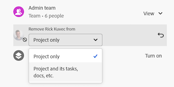

# Rimuovere le autorizzazioni dagli oggetti

<!--Audited: 01/2024-->

È possibile rimuovere le autorizzazioni di altri utenti per gli oggetti a cui si ha accesso Condividi. La rimozione delle autorizzazioni dagli oggetti è identica per tutti gli oggetti condivisibili.

Considerazioni simili a quelle relative alla condivisione degli oggetti vengono applicate per la rimozione delle autorizzazioni dagli oggetti. Per ulteriori informazioni, vedere la sezione [Considerazioni sulla condivisione di oggetti](../../workfront-basics/grant-and-request-access-to-objects/sharing-permissions-on-objects-overview.md#consider) nell&#39;articolo [Panoramica sulle autorizzazioni di condivisione per gli oggetti](../../workfront-basics/grant-and-request-access-to-objects/sharing-permissions-on-objects-overview.md)

## Requisiti di accesso

+++ Espandi per visualizzare i requisiti di accesso per la funzionalità descritta in questo articolo. 

<table style="table-layout:auto"> 
 <col> 
 <col> 
 <tbody> 
  <tr> 
   <td role="rowheader">Pacchetto Adobe Workfront</td> 
   <td> 
Qualsiasi 
 </td> 
  </tr> 
  <tr> 
   <td role="rowheader">Licenza Adobe Workfront</td> 
   <td> 
Collaboratore o versione successiva
 
   
Richiedi o superiore

   
<strong>Nota</strong>: alcuni oggetti richiedono un accesso superiore rispetto alla richiesta.

   </td> 
  </tr> 
  <tr> 
   <td role="rowheader">Configurazioni del livello di accesso</td> 
   <td> 
Accesso di visualizzazione o superiore agli oggetti da condividere
 </td> 
  </tr> 
  <tr> 
   <td role="rowheader">Autorizzazioni oggetto</td> 
   <td> 
Visualizzare le autorizzazioni o versioni successive per gli oggetti da condividere
 
Gestire le autorizzazioni per rimuovere le autorizzazioni ereditate per gli oggetti
  </td> 
  </tr>
 </tbody> 
</table>

Per ulteriori dettagli sulle informazioni contenute in questa tabella, vedere [Requisiti di accesso nella documentazione di Workfront](/help/quicksilver/administration-and-setup/add-users/access-levels-and-object-permissions/access-level-requirements-in-documentation.md).

+++

## Rimuovere le entità dall&#39;elenco di condivisione di un oggetto {#remove-entities-from-the-sharing-list-of-an-object}

È possibile rimuovere entità (utenti, mansioni, team, gruppi, aziende) dall&#39;elenco di condivisione di un oggetto. In questo modo vengono rimosse le relative autorizzazioni per l’oggetto.

1. Passare all&#39;oggetto da cui si desidera rimuovere le autorizzazioni.

   Per informazioni sugli oggetti che possono essere condivisi, vedere [Panoramica sulle autorizzazioni di condivisione per gli oggetti](../../workfront-basics/grant-and-request-access-to-objects/sharing-permissions-on-objects-overview.md).

1. (Condizionale) Per programmi, portfolio e documenti, effettua le seguenti operazioni:

   1. Fai clic sull&#39;icona **Altro** accanto al nome dell&#39;oggetto, quindi fai clic su **Condivisione** o **Condivisione.**

      

   1. Fai clic su **x** accanto al nome di un utente, team, gruppo, società e mansione per rimuoverli nella casella di accesso agli oggetti.

      

   1. Nel menu a discesa **[Nome utente] l&#39;accesso a Workfront verrà rimosso da questo**, selezionare se si desidera che l&#39;accesso venga rimosso solo dall&#39;oggetto selezionato o da tutti gli oggetti secondari ad esso associati.

1. (Condizionale) Per progetti, attività e problemi, effettua le seguenti operazioni:

   1. Fai clic su **Condividi** a destra del nome dell&#39;oggetto.

      
   1. Individuare l&#39;utente, la mansione, il team, il gruppo o l&#39;azienda che si desidera rimuovere dall&#39;oggetto.
   1. Fare clic su **Rimuovi**.
Nel menu a discesa **Rimuovi &lt; Nome utente > da**, selezionare se si desidera che il relativo accesso venga rimosso solo dall&#39;oggetto selezionato o da tutti gli oggetti secondari ad esso associati.

      

   Esistono i seguenti scenari:

   * Se rimuovi l’entità solo dall’oggetto, tale entità perde le relative autorizzazioni sull’oggetto e le autorizzazioni ereditate sugli oggetti secondari. Se in precedenza erano state concesse autorizzazioni per gli elementi figlio singolarmente, quando si seleziona questa opzione manterranno le stesse autorizzazioni per tutti gli oggetti figlio associati.
   * Se si rimuove l&#39;entità dall&#39;oggetto e da tutti gli oggetti figlio, tale entità perde le relative autorizzazioni per l&#39;oggetto e per tutti gli oggetti figlio, anche quando in precedenza era stata concessa loro un&#39;autorizzazione individuale per ciascun oggetto figlio.

1. Fai clic su **Salva**.

<!--
## Remove permissions from several objects in bulk

You can remove entities (users, job roles, teams, groups, companies) from several objects at a time when you bulk select them in a list.

>[!NOTE]
>
>You cannot view what access entities have for all the objects selected when you select them in bulk. You must know which entity you want to remove from the sharing of the objects selected before removing their permissions.

1. Go to the list of objects that you want to share.

   For information about which objects can be shared, see [Overview of sharing permissions on objects](../../workfront-basics/grant-and-request-access-to-objects/sharing-permissions-on-objects-overview.md).

1. Select several objects in the list, then click the **Share** icon at the top of the list. 
1. Type the name of the user, role, team, group, or company for which you want to remove the access in the **Edit `<Object Name>` access to** field. 
1. From the access drop-down menu, select **No Access**.

   

1. In the `<User Name>`'s Workfront access will be removed from this drop-down menu, select whether you want their access to be removed just from the objects that you have selected, or from all other children objects associated with it.  
   The following scenarios exist:

   * If you remove the entity only from the object, that entity loses their permissions on the object, and their inherited permissions to the children objects. If they were previously granted permissions to the children items individually, they retain the same permissions on all children objects associated with it when you select this option.  
   * If you remove the entity from the object and all the children objects, that entity loses their permissions to the object as well as all children objects, even when they were previously given individual permission on each child object.

   **Example:** Select whether to remove permissions to just the tasks you selected in a list, or to the issues and documents attached to the tasks as well.

   

1. (Optional) To change permissions in bulk for several objects, select another level of sharing for the selected entity.

   For example, if they have Manage permissions, select Contribute or View instead. 

1. Click **Save**.

-->

## Rimuovi autorizzazioni ereditate

Le autorizzazioni ereditate possono essere rimosse dagli oggetti consentendo ai proprietari di identificare in modo specifico chi avrà accesso agli oggetti figlio indipendentemente dall&#39;accesso di un utente a un oggetto padre.

>[!IMPORTANT]
>
>Solo gli utenti con l&#39;autorizzazione Gestione possono rimuovere le autorizzazioni ereditate.

Per rimuovere le autorizzazioni ereditate:

1. Passare a un oggetto per il quale si dispone delle autorizzazioni di gestione. Ad esempio, passare a un&#39;attività.
1. Passare alla casella di accesso agli oggetti come descritto nella sezione [Rimuovere le entità dall&#39;elenco di condivisione di un oggetto](#remove-entities-from-the-sharing-list-of-an-object) in questo articolo.
1. Seleziona **Disattiva** accanto a **Autorizzazione ereditata** da disabilitare.

   In questo modo, per impostazione predefinita, nessuno a cui sono state concesse le autorizzazioni per l&#39;oggetto padre, ad esempio il progetto, dispone delle autorizzazioni per questa attività. Per concedere le autorizzazioni per l&#39;attività, è necessario elencare singole entità nell&#39;elenco di condivisione dell&#39;attività.

   >[!TIP]
   >
   >Non è possibile rimuovere singole entità dall&#39;elenco Autorizzazioni ereditate. È possibile disabilitare le autorizzazioni ereditate solo per tutte le entità elencate.

1. Fai clic su **Salva**.

## Rendere privato un oggetto

Se un oggetto è stato condiviso a livello di sistema o se è stato condiviso con utenti esterni rendendolo pubblico, è possibile renderlo nuovamente privato rimuovendo le autorizzazioni pubbliche o a livello di sistema.

Per ulteriori informazioni su come rendere un oggetto disponibile a livello di sistema o pubblicamente, vedere [Condividere un oggetto](../../workfront-basics/grant-and-request-access-to-objects/share-an-object.md).

Per rendere privato un oggetto:

1. Passare all&#39;oggetto che si desidera rendere privato.\
   Ad esempio, passa a un rapporto.
1. Fai clic su **Azioni report**, quindi su **Condivisione**.

   

1. Fai clic sull&#39;icona a forma di ingranaggio, quindi deseleziona **Rendi pubblico per gli utenti esterni**.
1. Nel menu a discesa **Chi ha accesso**, fai clic su **Solo gli invitati possono accedere** per interrompere la condivisione con tutti gli utenti di Workfront.
1. Fai clic su **Salva**.
