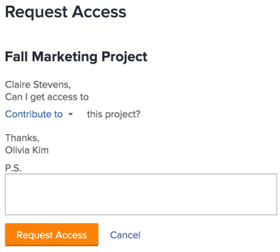
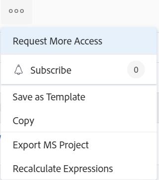

# Richiedere l’accesso agli oggetti

La visibilità degli oggetti in Adobe Workfront dipende dall’accesso a tale tipo di oggetto e dalle autorizzazioni concesse a un singolo oggetto.

>[!NOTE]
>
>Questo articolo descrive come richiedere le autorizzazioni per tutti gli oggetti eccetto per i piani nel planner scenario di Adobe Workfront. Per informazioni sulla richiesta di accesso ai piani, vedi [Richiedere l&#39;accesso a un piano nel Planner scenario](../../scenario-planner/request-access-to-plan.md). Questo richiede una licenza aggiuntiva.

L’amministratore Workfront configura l’accesso a un tipo di oggetto nel livello di accesso. Per ulteriori informazioni, consulta [Funzionamento congiunto dei livelli di accesso e delle autorizzazioni](../../administration-and-setup/add-users/access-levels-and-object-permissions/how-access-levels-permissions-work-together.md).

Se hai bisogno di autorizzazioni per oggetti specifici all’interno di Workfront, puoi richiedere l’accesso a tali oggetti. Invece di inviare un messaggio e-mail all’amministratore Workfront o al proprietario dell’oggetto per spiegare le tue esigenze, puoi richiedere un accesso (o autorizzazioni) aggiuntivo all’interno di Workfront.

È possibile richiedere l’accesso iniziale agli oggetti se qualcuno condivide con te un collegamento all’oggetto oppure se è possibile richiedere l’accesso aggiuntivo agli oggetti da almeno visualizzare.

Ad esempio, potresti disporre delle autorizzazioni Visualizza per un progetto, ma devi aggiungere delle attività a tale progetto. In questo caso, potete richiedere le autorizzazioni di Contribute al progetto.

## Requisiti di accesso

<!--drafted for P&P:

<table style="table-layout:auto"> 
 <col> 
 <col> 
 <tbody> 
  <tr> 
   <td role="rowheader">Adobe Workfront plan*</td> 
   <td> 
Any 
 </td> 
  </tr> 
  <tr> 
   <td role="rowheader">Adobe Workfront license*</td> 
   <td> 
Current license: Standard
 
   Or
   
Legacy license: Work or higher
 
   </td> 
  </tr> 
  <tr> 
   <td role="rowheader">Access level configurations*</td> 
   <td> 
View access or higher to the objects you request permissions to
 
<b>NOTE</b> 
   
   If you still don't have access, ask your Workfront administrator if they set additional restrictions in your access level. For information on how a Workfront administrator can modify your access level, see <a href="../../administration-and-setup/add-users/configure-and-grant-access/create-modify-access-levels.md" class="MCXref xref">Create or modify custom access levels</a>.
 </td> 
  </tr> 
 </tbody> 
</table>

-->

Per condividere gli oggetti è necessario disporre dei seguenti elementi:

<table style="table-layout:auto"> 
 <col> 
 <col> 
 <tbody> 
  <tr> 
   <td role="rowheader">piano Adobe Workfront*</td> 
   <td> 
Qualsiasi 
 </td> 
  </tr> 
  <tr> 
   <td role="rowheader">Licenza Adobe Workfront*</td> 
   <td> 
Lavoro o superiore
 </td> 
  </tr> 
  <tr> 
   <td role="rowheader">Configurazioni a livello di accesso*</td> 
   <td> 
Visualizzare l'accesso o una parte superiore agli oggetti a cui si richiedono le autorizzazioni
 
<b>NOTA</b>

Se non disponi ancora dell’accesso, chiedi all’amministratore Workfront se ha impostato ulteriori restrizioni nel livello di accesso. Per informazioni su come un amministratore Workfront può modificare il livello di accesso, consulta <a href="../../administration-and-setup/add-users/configure-and-grant-access/create-modify-access-levels.md" class="MCXref xref">Creare o modificare livelli di accesso personalizzati</a>.
 </td>
</tr> 
 </tbody> 
</table>

&#42;Per informazioni sul piano, il tipo di licenza o l&#39;accesso, contattare l&#39;amministratore Workfront.

## Comprendere le regole di condivisione standard

Le seguenti regole di condivisione standard hanno effetto automaticamente, in quanto sono impostate come opzioni predefinite nel sistema Workfront. 

* Gli utenti assegnati a un&#39;attività o a un problema dispongono dell&#39;accesso a Contribute. 
* I responsabili di progetti, Portfoli e programmi possono gestire l’accesso agli oggetti di loro proprietà.
* Gli utenti inclusi in una conversazione dispongono dell’accesso Visualizza sull’oggetto in cui avviene la conversazione.
* Gli utenti assegnati come approvatori dispongono dell&#39;accesso Visualizza sull&#39;oggetto in attesa di approvazione.
* Quando si condivide un dashboard, tutti i report nel dashboard vengono condivisi con lo stesso accesso agli stessi utenti. 
* I proprietari degli oggetti non sono in grado di estendere l&#39;accesso a un oggetto oltre l&#39;accesso a tale oggetto, come definito dall&#39;amministratore.

## Richiesta di accesso

È possibile richiedere l’accesso iniziale agli oggetti a cui attualmente non si dispone dell’accesso, oppure l’accesso agli oggetti a cui si dispone solo di un accesso limitato.

* [Richiedi accesso iniziale](#request-initial-access)
* [Richiedi accesso aggiuntivo](#request-additional-access)

### Richiedi accesso iniziale  {#request-initial-access}

Se non si dispone già dell&#39;accesso a un oggetto e si passa a tale oggetto da un collegamento, viene visualizzata una schermata che informa che non si dispone dell&#39;accesso per visualizzare le informazioni.  

Per richiedere l&#39;accesso iniziale a un oggetto:

1. Fai clic su **Richiesta di accesso**.\
   La **Richiesta di accesso** viene visualizzata la finestra di dialogo.

1. (Condizionale) Se più utenti dispongono dell&#39;accesso appropriato per concedere l&#39;accesso aggiuntivo, accanto al nome dell&#39;utente viene visualizzata una freccia a discesa. 
1. Seleziona dall’elenco a discesa l’utente che desideri ricevere la tua richiesta di accesso.\
   Nell’elenco a discesa vengono visualizzati solo 10 utenti. L&#39;elenco è ordinato alfabeticamente.\
   Per ulteriori informazioni sull&#39;ordine degli utenti elencati in questo menu a discesa, vedi  [Gerarchia dei menu a discesa &quot;Richiedi accesso&quot; e &quot;Richiedi più accesso&quot;](#hierarchy-of-the-request-access-and-request-more-access-drop-down-menus).

1. Dall’elenco a discesa, seleziona il tipo di accesso che stai richiedendo.
1. (Facoltativo) In **P.S.** specifica una nota all’utente sul motivo per cui è necessario un accesso aggiuntivo.

   

Se non si dispone dei diritti di livello di accesso a un oggetto e si tenta di accedervi da un collegamento, viene visualizzata una schermata che informa di contattare l&#39;amministratore Workfront. 

Ad esempio, se non hai accesso al portfolio, ma ti è stato dato un collegamento a un portfolio, viene visualizzato il seguente messaggio:\

### Richiedi accesso aggiuntivo {#request-additional-access}

Per richiedere l’accesso aggiuntivo a un oggetto a cui hai già accesso limitato:

1. Passa all’oggetto per il quale desideri richiedere l’accesso aggiuntivo.

1. Fai clic sul pulsante **Altro** in linea con il nome del progetto, quindi fai clic su **Richiedi più accesso**.\
   

1. (Condizionale) Se più utenti dispongono dell&#39;accesso appropriato per concedere l&#39;accesso aggiuntivo, accanto al nome dell&#39;utente viene visualizzata una freccia a discesa.
1. Seleziona dall’elenco a discesa l’utente che desideri ricevere la tua richiesta di accesso.\
   Nell’elenco a discesa vengono visualizzati solo 10 utenti. L&#39;elenco è ordinato alfabeticamente.\
   Per ulteriori informazioni sull&#39;ordine degli utenti elencati in questo menu a discesa, vedi  [Gerarchia dei menu a discesa &quot;Richiedi accesso&quot; e &quot;Richiedi più accesso&quot;](#hierarchy-of-the-request-access-and-request-more-access-drop-down-menus).

1. Dall’elenco a discesa , seleziona il livello di accesso richiesto.
1. (Facoltativo) In **P.S.** specifica una nota relativa al motivo per cui è necessario un accesso aggiuntivo.
1. Fai clic su **Richiesta di accesso**.\
   

## Gerarchia dei menu a discesa &quot;Richiedi accesso&quot; e &quot;Richiedi più accesso&quot; {#hierarchy-of-the-request-access-and-request-more-access-drop-down-menus}

* [Comprendere la gerarchia degli utenti elencati nei menu a discesa Richiedi accesso e richiedi altro accesso](#understand-the-hierarchy-of-users-listed-in-the-request-access-and-request-more-access-drop-down-menus)
* [Comprendere il proprietario di un oggetto](#understand-the-owner-of-an-object)

### Comprendere la gerarchia degli utenti elencati nei menu a discesa Richiedi accesso e richiedi altro accesso {#understand-the-hierarchy-of-users-listed-in-the-request-access-and-request-more-access-drop-down-menus}

Quando si compilano gli elenchi &quot;Richiedi accesso&quot; o &quot;Richiedi più accesso&quot; sugli oggetti, Workfront seleziona un elenco di fino a dieci utenti che svolgono vari ruoli nella condivisione dell’oggetto come descritto di seguito. Questi utenti possono concedere l’accesso all’oggetto all’utente che lo richiede.\
L’elenco risultante viene quindi ordinato in base al nome in ordine alfabetico crescente.\
Workfront visualizza fino a 10 utenti negli elenchi &quot;Request Access&quot; (Accesso richiesta) e &quot;Request More Access&quot; (Accesso richiesta di più accesso). 

L’ordine degli utenti nei menu a discesa &quot;Richiedi accesso&quot; o &quot;Richiedi più accesso&quot; è dettato dalle seguenti regole: 

* Il primo utente dell’elenco è l’oggetto &quot;proprietario&quot;, come descritto in [Comprendere il proprietario di un oggetto](#understand-the-owner-of-an-object). 
* L’elenco viene quindi compilato con gli utenti con i quali l’oggetto viene condiviso singolarmente. Sono elencate in ordine alfabetico.
* Quindi l’elenco è ulteriormente popolato da utenti che ottengono l’accesso richiesto tramite la condivisione con i loro team, gruppi o aziende. Sono elencate in ordine alfabetico.
* Se l’elenco è vuoto, gli amministratori di Workfront vengono aggiunti in modo che ci sia sempre qualcuno da cui richiedere l’accesso. Sono elencate in ordine alfabetico. 
* Per condividere l’oggetto, ciascuno degli utenti dell’elenco deve disporre dell’accesso richiesto all’oggetto e dell’accesso necessari. 

### Comprendere il proprietario di un oggetto {#understand-the-owner-of-an-object}

Il proprietario di un oggetto è definito come segue:

<table style="table-layout:auto"> 
 <col> 
 <col> 
 <thead> 
  <tr> 
   <th><strong>Oggetto</strong> </th> 
   <th><strong>Definizione del proprietario dell'oggetto</strong> </th> 
  </tr> 
 </thead> 
 <tbody> 
  <tr> 
   <td>Progetti</td> 
   <td>Il proprietario è il proprietario del progetto oppure, se manca o se non dispone dell’accesso necessario, il proprietario del portfolio principale. 
Potrebbero non essere la stessa persona del creatore del progetto. 
</td> 
  </tr> 
  <tr> 
   <td>Attività</td> 
   <td>Il proprietario è l'assegnatario principale o, se manca o se non dispone dell'accesso necessario, il proprietario del progetto su cui risiede l'attività, come definito sopra. 
Potrebbero non essere la stessa persona del creatore di attività. 
</td> 
  </tr> 
  <tr> 
   <td>Problemi</td> 
   <td> 
Il proprietario è il contatto principale del problema o, se manca o se non dispone dell'accesso necessario, il proprietario del progetto su cui risiede il problema, come definito sopra. 
 
Potrebbero non essere la stessa persona che ha creato il problema. 
 </td> 
  </tr> 
  <tr> 
   <td>Portfolio</td> 
   <td>Il proprietario è il proprietario del Portfolio. 
Potrebbero non essere la stessa persona del creatore del portfolio. 
</td> 
  </tr> 
  <tr> 
   <td>Documenti</td> 
   <td>Il proprietario è il proprietario del documento (l'utente che ha caricato il documento) oppure, se il documento è mancante o se non dispone dell'accesso necessario, il proprietario dell'oggetto su cui risiede il documento.</td> 
  </tr> 
  <tr> 
   <td>Report e dashboard</td> 
   <td>Il proprietario è il creatore o il report o il dashboard. </td> 
  </tr> 
  <tr> 
   <td>Calendari</td> 
   <td>Il proprietario è il creatore del calendario. Per impostazione predefinita, a tutti gli utenti è assegnato un calendario. Sono considerati il proprietario di quel calendario. </td> 
  </tr> 
  <tr> 
   <td>Filtri, visualizzazioni e raggruppamenti</td> 
   <td>Il proprietario di un filtro, una visualizzazione o un raggruppamento è l’autore. </td> 
  </tr> 
  <tr data-mc-conditions="QuicksilverOrClassic.Quicksilver"> 
   <td>Piani </td> 
   <td> 
Il proprietario è il creatore del piano. 
 
Questo richiede una licenza aggiuntiva. 
 
Per informazioni su Workfront Scenario Planner, vedi <a href="../../scenario-planner/scenario-planner-overview.md" class="MCXref xref">Panoramica di Scenario Planner</a>.
 </td> 
  </tr> 
  <tr data-mc-conditions="QuicksilverOrClassic.Quicksilver"> 
   <td>Obiettivi</td> 
   <td> 
Il proprietario è l'utente designato come proprietario. Potrebbero non essere la stessa persona del creatore di obiettivi. 
 
Questo richiede una licenza aggiuntiva. 
 
Per informazioni sugli obiettivi di Workfront, vedi <a href="../../workfront-goals/goal-management/wf-goals-overview.md" class="MCXref xref">Panoramica sugli obiettivi di Adobe Workfront</a>. 
 </td> 
  </tr> 
 </tbody> 
</table>

 
