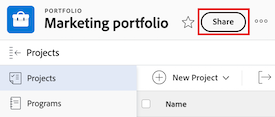
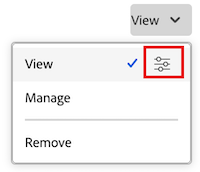
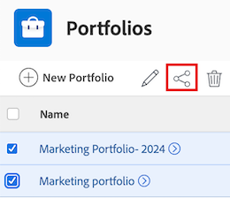

# Condividere un portfolio

Il tuo amministratore Adobe Workfront può concederti l’accesso per visualizzare o modificare i portfolio durante l’assegnazione del livello di accesso. Per poter accedere alla modifica di un portfolio è necessario disporre di una licenza Pianificazione. Per ulteriori informazioni, vedere [Concedere l&#39;accesso ai portafogli](../../administration-and-setup/add-users/configure-and-grant-access/grant-access-portfolios.md).

Oltre al livello di accesso che ti è stato concesso, puoi anche ricevere le autorizzazioni per visualizzare o gestire portfolio specifici da parte di utenti che possono condividerli con te. Per ulteriori informazioni sui livelli di accesso e sulle autorizzazioni, vedere [Funzionamento dei livelli di accesso e delle autorizzazioni](../../administration-and-setup/add-users/access-levels-and-object-permissions/how-access-levels-permissions-work-together.md).

Le autorizzazioni sono specifiche per un elemento in Workfront e definiscono quali azioni gli utenti possono intraprendere su tale elemento.

## Requisiti di accesso

+++ Espandi per visualizzare i requisiti di accesso per la funzionalità descritta in questo articolo. 

<table style="table-layout:auto"> 
 <col> 
 <col> 
 <tbody> 
  <tr> 
   <td role="rowheader">Pacchetto Adobe Workfront</td> 
   <td> 
Qualsiasi
 </td> 
  </tr> 
  <tr> 
   <td role="rowheader">Licenza Adobe Workfront</td> 
   <td> 
Standard
 
   
Work o successiva
 
   </td> 
  </tr> 
  <tr> 
   <td role="rowheader">Configurazioni del livello di accesso</td> 
   <td> 
Accesso di visualizzazione o superiore agli oggetti da condividere
 </td> 
  </tr> 
  <tr> 
   <td role="rowheader">Autorizzazioni oggetto</td> 
   <td> 
Visualizzare le autorizzazioni o versioni successive per gli oggetti da condividere
</td> 
  </tr> 
 </tbody> 
</table>

Per ulteriori dettagli sulle informazioni contenute in questa tabella, vedere [Requisiti di accesso nella documentazione di Workfront](/help/quicksilver/administration-and-setup/add-users/access-levels-and-object-permissions/access-level-requirements-in-documentation.md).

+++

## Considerazioni sulla condivisione dei portfolio

Oltre alle considerazioni riportate di seguito, vedere anche [Panoramica sulle autorizzazioni di condivisione per gli oggetti](../../workfront-basics/grant-and-request-access-to-objects/sharing-permissions-on-objects-overview.md).

>[!NOTE]
>
>Un amministratore di Workfront può aggiungere o rimuovere autorizzazioni per qualsiasi elemento del sistema, per tutti gli utenti, senza esserne il proprietario.

* Per impostazione predefinita, il creatore di un portfolio dispone delle autorizzazioni di gestione.
* Puoi condividere un portfolio singolarmente oppure più portfolio contemporaneamente. Condividere un portfolio è identico a condividere altri oggetti in Workfront. Per informazioni, vedere [Condividere un oggetto](../../workfront-basics/grant-and-request-access-to-objects/share-an-object.md).

* Puoi concedere le autorizzazioni Visualizza o Gestisci solo ai portfolio.

* Quando condividi un portfolio, gli utenti ereditano le stesse autorizzazioni per tutti gli oggetti secondari associati al portfolio per impostazione predefinita.

Per ulteriori informazioni sulla gerarchia degli oggetti in Workfront, vedere [Informazioni sugli oggetti in Adobe Workfront](../../workfront-basics/navigate-workfront/workfront-navigation/understand-objects.md).

* Puoi rimuovere le autorizzazioni ereditate da Portfolio. Per ulteriori informazioni sulla rimozione delle autorizzazioni dagli oggetti, vedere [Rimuovere le autorizzazioni dagli oggetti](../../workfront-basics/grant-and-request-access-to-objects/remove-permissions-from-objects.md).

## Condividere un portfolio

{{step1-to-portfolios}}

1. Nella pagina **Portfolio**, seleziona il portfolio che desideri condividere. Viene visualizzata la pagina portfolio.

1. A destra del nome del portfolio, fai clic su **Condividi**. Viene visualizzata la finestra di dialogo **Condividi [Nome Portfolio]**.

   

1. Nel campo **Concedi l&#39;accesso al portfolio**, inizia a digitare il nome dell&#39;utente, del team, della mansione, del gruppo o della società con cui vuoi condividere il portfolio, quindi fai clic sul nome quando viene visualizzato nell&#39;elenco a discesa.

   >[!TIP]
   >
   >Puoi condividere un portfolio solo con utenti attivi, team, ruoli o aziende.

1. (Facoltativo) Seleziona l&#39;elenco a discesa **Chi ha accesso** e il livello di accesso del portfolio:

   * **Solo gli utenti invitati possono accedere a:** Solo gli utenti invitati al portfolio possono accedervi (impostazione predefinita).
   * **Tutti gli utenti del sistema possono visualizzare**: tutti gli utenti del sistema possono visualizzare il portfolio senza un invito.

1. Fai clic sull’elenco a discesa a destra del nome dell’utente e seleziona il relativo livello di autorizzazione per questo portfolio:

   * **Visualizza**: l&#39;utente può esaminare e condividere il portfolio.
   * **Gestisci**: l&#39;utente ha accesso completo al portfolio senza diritti amministrativi, che sono concessi al livello di accesso (include anche tutte le autorizzazioni di visualizzazione).

1. (Facoltativo) Fai clic sull’icona delle opzioni avanzate accanto al livello di autorizzazione concesso per configurare autorizzazioni specifiche sul portfolio.

   

1. (Facoltativo) Per condividere rapidamente il portfolio utilizzando un collegamento, fare clic su **Copia collegamento** e quindi inoltrarlo al destinatario.

1. Fai clic su **Salva**.

## Condividere portfolio in blocco

{{step1-to-portfolios}}

1. Nella pagina **Portfolio**, seleziona la casella a sinistra di ogni portfolio che desideri condividere, quindi fai clic sull&#39;icona **Condividi**  nella parte superiore della pagina. Viene visualizzata la finestra modale di condivisione.

   

1. Nel campo **Concedi accesso portfolio a**, inizia a digitare il nome dell&#39;utente, del team, della mansione, del gruppo o della società con cui desideri condividere i portfolio, quindi fai clic sul nome quando viene visualizzato nell&#39;elenco a discesa.

   >[!TIP]
   >
   >Puoi condividere i portfolio solo con utenti attivi, team, ruoli o aziende.

1. (Facoltativo) Seleziona l&#39;elenco a discesa **Chi ha accesso** e il livello di accesso dei portfolio:

   * **Solo gli utenti invitati possono accedere a:** Solo gli utenti invitati ai portfolio possono accedervi (impostazione predefinita).
   * **Tutti gli utenti del sistema possono visualizzare**: tutti gli utenti del sistema possono visualizzare i portfolio senza un invito.

1. Fai clic sull’elenco a discesa a destra del nome dell’utente e seleziona il relativo livello di autorizzazione per i portfolio:

   * **Visualizza**: l&#39;utente può esaminare e condividere i portfolio.
   * **Gestisci**: l&#39;utente dispone dell&#39;accesso completo ai portfolio senza diritti amministrativi, concessi al livello di accesso (include anche tutte le autorizzazioni di visualizzazione).

1. (Facoltativo) Fai clic sull’icona delle opzioni avanzate accanto al livello di autorizzazione concesso per configurare autorizzazioni specifiche sui portfolio.

   

1. Fai clic su **Salva**.

## Autorizzazioni Portfolio

Nella tabella seguente vengono visualizzate le autorizzazioni che è possibile concedere agli utenti quando si consente loro di visualizzare o gestire un Portfolio:

| **Azioni** | **Gestisci** | **Visualizza** |
|---|---|---|
| Modifica dettagli Portfolio | ✓ |   |
| Visualizza un Portfolio | ✓ | ✓ |
| Eliminare un Portfolio | ✓ |   |
| Allegare un modulo personalizzato | ✓ |   |
| Modificare un campo personalizzato | ✓ |   |
| Aggiungere o rimuovere un programma&#42; | ✓ |   |
| Aggiungere o rimuovere un progetto&#42; | ✓ |   |
| Approvare un progetto | ✓ |   |
| Ottimizzazione Portfolio&#42; | ✓ |   |
| Aggiungi cartella documenti&#42; | ✓ | ✓ |
| Aggiungi un documento | ✓ | ✓ |
| Aggiornamenti/commenti | ✓ | ✓ |
| Condividi | ✓ | ✓ |
| Condividi a livello di sistema |   | ✓ |

*Queste autorizzazioni sono controllate dal livello di accesso e dalle autorizzazioni per altri oggetti, come progetti, programmi, documenti.
