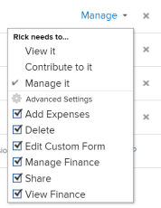

# Condividere un progetto in Adobe Workfront

<!-- Audited: 1/2024 -->

Il tuo amministratore Adobe Workfront può concederti l’accesso per visualizzare o modificare progetti durante l’assegnazione del livello di accesso. Per ulteriori informazioni, consulta [Concedere l’accesso ai progetti](../../administration-and-setup/add-users/configure-and-grant-access/grant-access-projects.md).

Oltre al livello di accesso concesso agli utenti, è possibile concedere loro le autorizzazioni per visualizzare, contribuire o gestire progetti specifici a cui si ha accesso per la condivisione.

Le autorizzazioni sono specifiche per un elemento in Workfront e definiscono quali azioni è possibile eseguire su tale elemento.

## Considerazioni sulla condivisione di progetti

Oltre alle considerazioni riportate di seguito, vedere anche [Panoramica delle autorizzazioni di condivisione sugli oggetti](../../workfront-basics/grant-and-request-access-to-objects/sharing-permissions-on-objects-overview.md).

* Per impostazione predefinita, il creatore di un progetto dispone delle autorizzazioni per gestire il progetto ed è anche designato come proprietario del progetto. Se il progetto è assegnato a un altro proprietario, anche tale utente dispone delle autorizzazioni necessarie per gestire il progetto. Quando il creatore del progetto (o il proprietario) condivide il progetto con altri utenti, concede a questi ultimi determinate autorizzazioni per controllare ciò che possono fare mentre lavorano sul progetto.

  Tuttavia, se un proprietario del progetto non dispone di una licenza Planner, non ha accesso completo alla gestione del progetto. Solo un utente con una licenza Pianificazione può disporre delle autorizzazioni per gestire un progetto. Per ulteriori informazioni, consulta [Funzionamento congiunto dei livelli di accesso e delle autorizzazioni](../../administration-and-setup/add-users/access-levels-and-object-permissions/how-access-levels-permissions-work-together.md).

* Puoi condividere i progetti singolarmente, oppure puoi condividerne più di uno alla volta. La condivisione di progetti è identica alla condivisione di altri oggetti. Per ulteriori informazioni sulla condivisione di elementi in Workfront, vedi [Condividere un oggetto](../../workfront-basics/grant-and-request-access-to-objects/share-an-object.md).
* Puoi concedere le seguenti autorizzazioni a un progetto:

   * Visualizza
   * Gestisci
   * Contribuisci

       

* Quando si condivide un progetto, tutte le attività, i problemi e i documenti ereditano le stesse autorizzazioni, se non diversamente specificato.

  Per informazioni sulla gestione dell’accesso alle attività e ai problemi del progetto in base alle autorizzazioni di un utente, consulta  sezione nell’articolo [Modifica progetti](../../manage-work/projects/manage-projects/edit-projects.md).

  L&#39;amministratore di Workfront può specificare se i documenti devono ereditare le autorizzazioni da oggetti di livello superiore nel livello di accesso dell&#39;utente. Per ulteriori informazioni sulla limitazione delle autorizzazioni ereditate sui documenti, vedere [Creare o modificare livelli di accesso personalizzati](../../administration-and-setup/add-users/configure-and-grant-access/create-modify-access-levels.md).

* È possibile rimuovere le autorizzazioni ereditate da un progetto in modo che gli oggetti figlio non le ereditino. Per ulteriori informazioni sulla rimozione delle autorizzazioni ereditate dagli oggetti, vedere [Rimuovere le autorizzazioni dagli oggetti](../../workfront-basics/grant-and-request-access-to-objects/remove-permissions-from-objects.md).

## Modi per condividere un progetto {#ways-to-share-a-project}

Puoi condividere un progetto nei seguenti modi:

* Manualmente, effettuando una delle seguenti operazioni:

   * Aggiunta di utenti al team del progetto. Quando aggiungi utenti al team di progetto, questi ottengono automaticamente le autorizzazioni di visualizzazione per il progetto.\
     Per ulteriori informazioni sull&#39;aggiunta di utenti a un team di progetto, vedere la sezione &quot;Aggiunta di utenti a un team di progetto&quot; in [Panoramica del team del progetto](../../manage-work/projects/planning-a-project/project-team-overview.md).
   * Condivisione individuale o in blocco dei progetti quando si utilizza **Condivisione** opzione.

     La condivisione di un progetto è simile alla condivisione di tutti gli altri oggetti in Adobe Workfront.

     Per informazioni sulla condivisione di oggetti in Workfront, consulta [Condividere un oggetto](../../workfront-basics/grant-and-request-access-to-objects/share-an-object.md).

* Automaticamente, effettuando una delle seguenti operazioni:

   * Posizionare un progetto in un **Portfolio** o **Programma** che è già condiviso con altri. Gli utenti ottengono le stesse autorizzazioni al progetto di cui dispongono per il portfolio o il programma.\
     Per informazioni sull’aggiunta di un progetto a un **Portfolio**, vedi [Aggiungere progetti a un portfolio](../../manage-work/portfolios/create-and-manage-portfolios/add-projects-to-portfolios.md).\
     Per informazioni sull’aggiunta di un progetto a un **Programma**, vedi [Aggiungere un progetto a un programma](../../manage-work/portfolios/create-and-manage-programs/add-project-to-program.md).

     Per informazioni sulla visualizzazione delle autorizzazioni ereditate su un oggetto, vedi [Visualizzare le autorizzazioni ereditate sugli oggetti](../../workfront-basics/grant-and-request-access-to-objects/view-inherited-permissions-on-objects.md).

   * Aggiungere entità alla condivisione di progetti in un modello utilizzato per creare il progetto. Per informazioni sulla condivisione di progetti da modelli, consulta [Condividere un modello](../../workfront-basics/grant-and-request-access-to-objects/share-a-template.md).
   * Definire il modello di accesso al progetto.

     Per definire il modello di accesso al progetto, vedi [Condividere un oggetto](../../workfront-basics/grant-and-request-access-to-objects/share-an-object.md).

     >[!TIP]
     >
     >Quando si allega o si salva un modello, è possibile cancellare le regole di condivisione dei progetti dei modelli.

   * Modificare un progetto e definire **Quando a un utente viene dato l’accesso a questo progetto** impostazione. Per ulteriori informazioni, consulta [Modifica progetti](../../manage-work/projects/manage-projects/edit-projects.md).

<!--

(NOTE: drafted because I created new article and linked it above) 

To view what users have inherited the access on the project from a portfolio or a program, do the following:

<ol style="list-style-type: lower-alpha;">
<li value="1">Go to a project whose sharing permissions you want to view. </li>
<li value="2"> Click the <strong>More</strong> menu , then click <strong>Sharing</strong>. </li>
<li value="3"> 
Expand the <strong>Inherited Permissions</strong> list. 
 
This list displays the names of users that have access to either the portfolio or the program that the project belongs to and also have permissions to the project. 
  </li>
</ol>

-->

<!--
<ol data-mc-conditions="QuicksilverOrClassic.Draft mode">
<li value="1">Go to a project whose sharing permissions you want for all projects you create from scratch. (NOTE: drafted because linked above)&nbsp;</li>
<li value="2"> Click the More menu, then click <strong>Sharing</strong>. </li>
<li value="3"> 
In the Project Access box that displays, near the upper-right corner, click the gear icon , then click <strong>Set as my project access template</strong>.
 
The entities that are granted permissions on the selected project have the same permissions for all the projects you create from scratch in the future.
 
 The project access template overrides the sharing defaults granted to you by the Workfront administrator in your Access Level. For more information about specifying sharing defaults for projects in the Access Level, see <a href="../../administration-and-setup/add-users/configure-and-grant-access/grant-access-projects.md" class="MCXref xref">Grant access to projects</a>.
 </li>
<li value="4">Click <strong>Save</strong>.</li>
</ol>
-->

## Limitazioni per i diversi tipi di licenza

* Gli utenti con una licenza Worker non dispongono delle autorizzazioni necessarie per gestire i progetti. Per i lavoratori, l&#39;autorizzazione di condivisione più elevata è Contribute.
* Gli utenti con una licenza Request possono visualizzare le informazioni sul progetto, ma hanno accesso limitato al progetto.
* Un&#39;eccezione alla modifica dello stato di un progetto si verifica quando un utente con autorizzazioni Visualizza o Contribuisci è incluso anche in un processo di approvazione. Possono approvare il progetto, che modifica lo stato del progetto, ma lo stato è quello predefinito per l’approvazione o per il rifiuto.
* Per poter copiare un progetto, un utente deve anche avere accesso alla creazione di progetti nel proprio Livello di Accesso.

<!--

<h2>Configure default permissions for a project</h2>

(NOTE: drafted because I added one more way to automatically share the project above in the bullet list and linked it to Edit Projects) 

As a project owner, you can configure the default permissions for View, Manage, and Contribute access that are used when sharing&nbsp;the project with others. When users share a project, the default permissions are used. Users can then adjust the default permissions when sharing the project, as described in <a title="Project Permissions" href="#ways-to-share-a-project" class="MCXref xref">Ways to share a project</a>. 

To configure the default permissions that are included with each access level:

<ol>
<li value="1">Go to the project where you want to set the default permissions.</li>
<li value="2"> 
Click the More menu , then click <strong>Edit</strong>. 
 
 
 </li>
<li value="3">Click <strong>Access</strong> in the list on the left.</li>
<li value="4"> 
In the <strong>When someone is given access to this PROJECT</strong> section, select permissions that you want to be available when users are given access to the project via sharing.
 
Ensure that any permissions that you want to include in the selected access level are selected and deselect any permissions that you do not want to include in the selected permissions level.
 
To view which permissions are available for each level, see&nbsp;<a title="Project Permissions" href="#Understanding_Project_Permissions" class="MCXref xref">Share a project in Adobe Workfront</a>.
 <note type="note">
The
<strong>Delete</strong> access in the
<strong>Manage</strong> permission level determines whether users can&nbsp;delete the project itself. Users with
<strong>Manage</strong> access to the project can delete tasks and issues within the project regardless of whether this option is selected, if they have
<strong>Manage</strong> permissions to the tasks and issues.&nbsp;
</note> </li>
<li value="5">Click <strong>Save Changes</strong>.</li>
</ol>

-->

## Opzioni di autorizzazione del progetto

Nella tabella seguente sono elencate le autorizzazioni che gli utenti possono concedere quando condividono un progetto. Per ulteriori informazioni sugli utenti dell’accesso ottenuti in base alla propria licenza, consulta [Concedere l’accesso ai progetti](../../administration-and-setup/add-users/configure-and-grant-access/grant-access-projects.md).

<table border="1" cellspacing="15" cellpadding="1"> 
 <col> 
 <col> 
 <col> 
 <col> 
 <thead> 
  <tr> 
   <th> 
<strong>Azioni</strong> 
 </th> 
   <th> 
<strong>Gestisci</strong> 
 </th> 
   <th> 
<strong>Contribuisci</strong> 
 </th> 
   <th> 
<strong>Visualizza</strong> 
 </th> 
  </tr> 
 </thead> 
 <tbody> 
  <tr> 
   <td> 
Aggiungi modulo personalizzato
 </td> 
   <td> 
✓
 </td> 
   <td> 
 
 </td> 
   <td> 
 
 </td> 
  </tr> 
  <tr> 
   <td> 
Aggiorna campi personalizzati
 </td> 
   <td> 
✓
 </td> 
   <td> 
✓
 </td> 
   <td> 
 
 </td> 
  </tr> 
  <tr> 
   <td> 
Aggiungere Un Processo Di Approvazione
 </td> 
   <td> 
✓
 </td> 
   <td> 
 
 </td> 
   <td> 
 
 </td> 
  </tr> 
  <tr> 
   <td> 
Approvare un progetto
 </td> 
   <td> 
✓
 </td> 
   <td> 
✓
 </td> 
   <td> 
✓
 </td> 
  </tr> 
  <tr> 
   <td> 
Approva ore
 </td> 
   <td> 
✓
 </td> 
   <td> 
✓ 
 </td> 
   <td> 
 
 </td> 
  </tr> 
  <tr> 
   <td> 
Crea Un Progetto
 </td> 
   <td> 
✓
 </td> 
   <td> 
 
 </td> 
   <td> 
 
 </td> 
  </tr> 
  <tr> 
   <td> 
Aggiungi documenti
 </td> 
   <td> 
✓
 </td> 
   <td> 
✓
 </td> 
   <td> 
✓
 </td> 
  </tr> 
  <tr> 
   <td> 
Aggiungi problemi
 </td> 
   <td> 
✓
 </td> 
   <td> 
✓
 </td> 
   <td> 
✓
 </td> 
  </tr> 
  <tr> 
   <td> 
Aggiungi attività
 </td> 
   <td> 
✓
 </td> 
   <td> 
✓
 </td> 
   <td> 
 
 </td> 
  </tr> 
  <tr> 
   <td> 
Copia Progetto
 </td> 
   <td> 
 
 </td> 
   <td> 
✓
 </td> 
   <td> 
 
 </td> 
  </tr> 
  <tr> 
   <td> 
Cancella Progetto
 </td> 
   <td> 
✓
 </td> 
   <td> 
 
 </td> 
   <td> 
 
 </td> 
  </tr> 
  <tr> 
   <td> 
Modifica date pianificate
 </td> 
   <td> 
✓
 </td> 
   <td> 
 
 </td> 
   <td> 
 
 </td> 
  </tr> 
  <tr> 
   <td> 
Condividi progetto
 </td> 
   <td> 
✓
 </td> 
   <td> 
✓
 </td> 
   <td> 
✓
 </td> 
  </tr> 
  <tr> 
   <td> 
Condividi a livello di sistema
 </td> 
   <td> 
 
 </td> 
   <td> 
 
 </td> 
   <td> 
✓
 </td> 
  </tr> 
  <tr> 
   <td> 
Visualizza Progetto
 </td> 
   <td> 
✓
 </td> 
   <td> 
✓
 </td> 
   <td> 
✓
 </td> 
  </tr> 
  <tr> 
   <td> 
Aggiornamenti/commenti
 </td> 
   <td> 
✓
 </td> 
   <td> 
✓
 </td> 
   <td> 
✓
 </td> 
  </tr> 
  <tr> 
   <td> 
Modifica stato
 </td> 
   <td> 
✓
 </td> 
   <td> 
 
 </td> 
   <td> 
 
 </td> 
  </tr> 
  <tr> 
   <td> 
Registra ore
 </td> 
   <td> 
✓
 </td> 
   <td> 
✓
 </td> 
   <td> 
 
 </td> 
  </tr> 
  <tr> 
   <td> 
Modifica assegnazioni
 </td> 
   <td> 
✓
 </td> 
   <td> 
✓
 </td> 
   <td> 
 
 </td> 
  </tr> 
  <tr> 
   <td> 
Gestisci Base Line
 </td> 
   <td> 
✓
 </td> 
   <td> 
 
 </td> 
   <td> 
 
 </td> 
  </tr> 
  <tr> 
   <td> 
Gestione dei rischi*
 </td> 
   <td> 
✓
 </td> 
   <td> 
 
 </td> 
   <td> 
 
 </td> 
  </tr> 
  <tr> 
   <td> 
Gestisci dati finanziari*
 </td> 
   <td> 
✓
 </td> 
   <td> 
 
 </td> 
   <td> 
 
 </td> 
  </tr> 
  <tr> 
   <td> 
Aggiungi/Modifica spese*
 </td> 
   <td> 
✓
 </td> 
   <td> 
✓
 </td> 
   <td> 
 
 </td> 
  </tr> 
  <tr> 
   <td> 
Finanza*
 </td> 
   <td> 
✓
 </td> 
   <td> 
✓
 </td> 
   <td> 
✓
 </td> 
  </tr> 
  <tr> 
   <td> 
Allega Modello
 </td> 
   <td> 
✓
 </td> 
   <td> 
 
 </td> 
   <td> 
 
 </td> 
  </tr> 
  <tr> 
   <td> 
Salva come modello
 </td> 
   <td> 
✓
 </td> 
   <td> 
✓
 </td> 
   <td> 
✓
 </td> 
  </tr> 
  <tr> 
   <td> 
Aggiungi/Modifica Business Case
 </td> 
   <td> 
✓
 </td> 
   <td> 
 
 </td> 
   <td> 
 
 </td> 
  </tr> 
  <tr> 
   <td> 
Modifica dettagli progetto
 </td> 
   <td> 
✓
 </td> 
   <td> 
 
 </td> 
   <td> 
 
 </td> 
  </tr> 
  <tr> 
   <td> 
Modifica assegnazione personale
 </td> 
   <td> 
✓
 </td> 
   <td> 
 
 </td> 
   <td> 
 
 </td> 
  </tr> 
  <tr> 
   <td> 
Esporta in MS Project
 </td> 
   <td> 
✓
 </td> 
   <td> 
✓
 </td> 
   <td> 
✓
 </td> 
  </tr> 
  <tr> 
   <td> 
Ricalcola finanza/sequenza temporale*
 </td> 
   <td> 
✓
 </td> 
   <td> 
 
 </td> 
   <td> 
 
 </td> 
  </tr> 
  <tr> 
   <td> 
Imposta proprietà coda
 </td> 
   <td> 
✓
 </td> 
   <td> 
 
 </td> 
   <td> 
  
 </td> 
  </tr> 
  <tr> 
   <td> 
Modificare un progetto in blocco in un elenco
 </td> 
   <td> 
✓
 </td> 
   <td> </td> 
   <td> </td> 
  </tr> 
 </tbody> 
</table>

&#42;Gli utenti che non hanno accesso ai dati finanziari non possono gestire i rischi e i finanziamenti per i progetti, anche se hanno accesso in modifica ai progetti. Per informazioni sull&#39;accesso ai dati finanziari, vedere [Concedere l’accesso ai dati finanziari](../../administration-and-setup/add-users/configure-and-grant-access/grant-access-financial.md).
